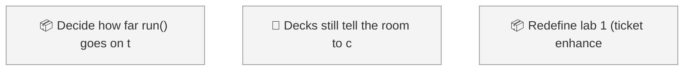
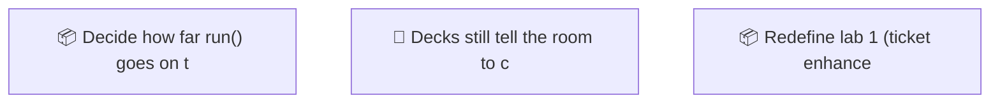

<!-- GENERATED by worklog roadmap-render. DO NOT EDIT. -->

> This file is generated from `.work/todo.jsonl`. Edits will be overwritten.
> To change the roadmap, change the work items: `worklog add|update|close`.

# Roadmap

_0 epic(s) in flight, 3 open item(s), 0 blocked, 0 unclassified._

## Now

_Nothing here._

## Next

### (no epic)

| # | Item | Type | Priority | Status | Blocked by |
|---|---|---|---|---|---|
| [2](https://github.com/RichardHightower/reliable-agentic-lab/issues/2) | Decide how far run() goes on the eight runtime ports | story | P1 | todo | — |
| [3](https://github.com/RichardHightower/reliable-agentic-lab/issues/3) | Decks still tell the room to check out done-m<n> | task | P2 | todo | — |
| 01M10ZJA | Redefine lab 1 (ticket enhancer) as a Claude Code plugin | task | P2 | todo | — |

## Later

_Nothing here._

## Visual roadmap

### Dependency graph

### Hierarchy

