<!-- GENERATED by worklog roadmap-render. DO NOT EDIT. -->

> This file is generated from `.work/todo.jsonl`. Edits will be overwritten.
> To change the roadmap, change the work items: `worklog add|update|close`.

# Roadmap

_1 epic(s) in flight, 10 open item(s), 0 blocked, 1 unclassified._

## Now

_Nothing here._

## Next

### Make every lab and solution folder standalone  ·  P1  ·  0 of 7 done  ·  ops 6 / triage 1
Labs and solutions must not share Python modules or a base Taskfile. Each lab/solution folder runs on its own, start to finish, even if that means duplicate files across folders. solutions/sol1_enhancer (the Claude Code plugin) is the reference pattern: own Taskfile with no includes, no imports from the repo-root loops/ or solutions/ packages. Repeat that pattern for every remaining lab and solution folder, phase by phase, one module at a time.

| # | Item | Type | Priority | Status | Blocked by |
|---|---|---|---|---|---|
| 01M10ZZQ | Stop the generator from touching lab 1 / solution 1 | task | P1 | todo | — |
| 01M11001 | Phase 1: make solution 1's tool/runtime variants standalone | story | P1 | todo | — |
| 01M10ZZS | Delete the done-m1..done-m4 fall-behind branches | task | P2 | todo | — |
| 01M11003 | Phase 2: make module 2 (implementer) standalone | story | P2 | todo | — |
| 01M11005 | Phase 3: make module 3 (research) standalone | story | P2 | todo | — |
| 01M11007 | Phase 4: make module 4 (fixer) standalone | story | P2 | todo | — |

### (no epic)

| # | Item | Type | Priority | Status | Blocked by |
|---|---|---|---|---|---|
| [2](https://github.com/RichardHightower/reliable-agentic-lab/issues/2) | Decide how far run() goes on the eight runtime ports | story | P1 | todo | — |
| [3](https://github.com/RichardHightower/reliable-agentic-lab/issues/3) | Decks still tell the room to check out done-m<n> | task | P2 | todo | — |
| 01M10ZJA | Redefine lab 1 (ticket enhancer) as a Claude Code plugin | task | P2 | todo | — |

## Later

### Make every lab and solution folder standalone  ·  P1  ·  0 of 7 done  ·  ops 6 / triage 1
Labs and solutions must not share Python modules or a base Taskfile. Each lab/solution folder runs on its own, start to finish, even if that means duplicate files across folders. solutions/sol1_enhancer (the Claude Code plugin) is the reference pattern: own Taskfile with no includes, no imports from the repo-root loops/ or solutions/ packages. Repeat that pattern for every remaining lab and solution folder, phase by phase, one module at a time.

| # | Item | Type | Priority | Status | Blocked by |
|---|---|---|---|---|---|
| 01M1100C | Decide standalone treatment for labs/takehome | task | P3 | todo | — |

## Needs classification

- 01M1100C Decide standalone treatment for labs/takehome (task)

## Visual roadmap

### Dependency graph

```mermaid
graph TD
    01M10N7X4TCZSZ6RCQ8348G3MG["📦 Decide how far run() goes on t"]
    01M10N87FRARZQJET5ZF6N9WY1["🐛 Decks still tell the room to c"]
    01M10ZJAFA531AZT95CD4N95XJ["📦 Redefine lab 1 (ticket enhance"]
    01M10ZZFT4DW7V58K7DCNKJRR3["🔧 Make every lab and solution fo"]
    01M10ZZQBG9C72NX5P6F00WRNJ["🔧 Stop the generator from touchi"]
    01M10ZZSS13KQF69WPE7A5N24X["🔧 Delete the done-m1..done-m4 fa"]
    01M110015D4FB9BYPNVK7BEJR1["🔧 Phase 1 make solution 1's tool"]
    01M11003RBSRAW0MYDE34AVZGV["🔧 Phase 2 make module 2 (impleme"]
    01M11005SEGJQEYP984QBYVE3C["🔧 Phase 3 make module 3 (researc"]
    01M110078YFGKGG0E528GE9J95["🔧 Phase 4 make module 4 (fixer)"]
    01M1100CMG7X5QW4K85N6Y77ZK["❓ Decide standalone treatment fo"]
    01M10ZZFT4DW7V58K7DCNKJRR3 --> 01M10ZZQBG9C72NX5P6F00WRNJ
    01M10ZZFT4DW7V58K7DCNKJRR3 --> 01M10ZZSS13KQF69WPE7A5N24X
    01M10ZZFT4DW7V58K7DCNKJRR3 --> 01M110015D4FB9BYPNVK7BEJR1
    01M10ZZFT4DW7V58K7DCNKJRR3 --> 01M11003RBSRAW0MYDE34AVZGV
    01M10ZZFT4DW7V58K7DCNKJRR3 --> 01M11005SEGJQEYP984QBYVE3C
    01M10ZZFT4DW7V58K7DCNKJRR3 --> 01M110078YFGKGG0E528GE9J95
    01M10ZZFT4DW7V58K7DCNKJRR3 --> 01M1100CMG7X5QW4K85N6Y77ZK
    classDef todo fill:#f4f4f4,stroke:#999999
    class 01M10N7X4TCZSZ6RCQ8348G3MG,01M10N87FRARZQJET5ZF6N9WY1,01M10ZJAFA531AZT95CD4N95XJ,01M10ZZFT4DW7V58K7DCNKJRR3,01M10ZZQBG9C72NX5P6F00WRNJ,01M10ZZSS13KQF69WPE7A5N24X,01M110015D4FB9BYPNVK7BEJR1,01M11003RBSRAW0MYDE34AVZGV,01M11005SEGJQEYP984QBYVE3C,01M110078YFGKGG0E528GE9J95,01M1100CMG7X5QW4K85N6Y77ZK todo
```

### Hierarchy

```mermaid
graph TD
    01M10N7X4TCZSZ6RCQ8348G3MG["📦 Decide how far run() goes on t"]
    01M10N87FRARZQJET5ZF6N9WY1["🐛 Decks still tell the room to c"]
    01M10ZJAFA531AZT95CD4N95XJ["📦 Redefine lab 1 (ticket enhance"]
    01M10ZZFT4DW7V58K7DCNKJRR3["🔧 Make every lab and solution fo"]
    01M10ZZQBG9C72NX5P6F00WRNJ["🔧 Stop the generator from touchi"]
    01M10ZZSS13KQF69WPE7A5N24X["🔧 Delete the done-m1..done-m4 fa"]
    01M110015D4FB9BYPNVK7BEJR1["🔧 Phase 1 make solution 1's tool"]
    01M11003RBSRAW0MYDE34AVZGV["🔧 Phase 2 make module 2 (impleme"]
    01M11005SEGJQEYP984QBYVE3C["🔧 Phase 3 make module 3 (researc"]
    01M110078YFGKGG0E528GE9J95["🔧 Phase 4 make module 4 (fixer)"]
    01M1100CMG7X5QW4K85N6Y77ZK["❓ Decide standalone treatment fo"]
    01M10ZZFT4DW7V58K7DCNKJRR3 --> 01M10ZZQBG9C72NX5P6F00WRNJ
    01M10ZZFT4DW7V58K7DCNKJRR3 --> 01M10ZZSS13KQF69WPE7A5N24X
    01M10ZZFT4DW7V58K7DCNKJRR3 --> 01M110015D4FB9BYPNVK7BEJR1
    01M10ZZFT4DW7V58K7DCNKJRR3 --> 01M11003RBSRAW0MYDE34AVZGV
    01M10ZZFT4DW7V58K7DCNKJRR3 --> 01M11005SEGJQEYP984QBYVE3C
    01M10ZZFT4DW7V58K7DCNKJRR3 --> 01M110078YFGKGG0E528GE9J95
    01M10ZZFT4DW7V58K7DCNKJRR3 --> 01M1100CMG7X5QW4K85N6Y77ZK
```

