<!-- GENERATED by worklog roadmap-render. DO NOT EDIT. -->

> This file is generated from `.work/todo.jsonl`. Edits will be overwritten.
> To change the roadmap, change the work items: `worklog add|update|close`.

# Roadmap

_1 epic(s) in flight, 10 open item(s), 0 blocked, 0 unclassified._

## Now

_Nothing here._

## Next

### Port the lab 1 ticket enhancer to Codex CLI  ·  P1  ·  0 of 7 done
solutions/sol1_enhancer_codex holds an old Python port that no longer matches the lab. Replace it with a Codex-native equivalent of the sol1_enhancer loop: an enhancer-loop orchestrator skill under .agents/skills, plus judge and doer roles that each run as their own read-only codex exec process. Codex has no per-agent tool list, so isolation is a process sandbox. solutions/sol1_enhancer is out of scope and stays the Claude Code answer.

| # | Item | Type | Priority | Status | Blocked by |
|---|---|---|---|---|---|
| [82](https://github.com/RichardHightower/reliable-agentic-lab/issues/82) | Probe the three Codex sandbox assumptions | task | P2 | todo | — |
| [83](https://github.com/RichardHightower/reliable-agentic-lab/issues/83) | Replace the old Python port with a Codex skill tree | task | P2 | todo | — |
| [84](https://github.com/RichardHightower/reliable-agentic-lab/issues/84) | Port the orchestrator SKILL.md step for step | task | P2 | todo | — |
| [85](https://github.com/RichardHightower/reliable-agentic-lab/issues/85) | Write SPEC.md, HOW_TO_RUN.md, and IMPLEMENTATION_NOTES.md | task | P2 | todo | — |
| [86](https://github.com/RichardHightower/reliable-agentic-lab/issues/86) | Give a simulated comment a stable id | task | P2 | todo | — |
| [87](https://github.com/RichardHightower/reliable-agentic-lab/issues/87) | Verify the loop end to end and update the pointers | task | P2 | todo | — |
| [88](https://github.com/RichardHightower/reliable-agentic-lab/issues/88) | Write the Codex Taskfile and the runnable scripts | task | P2 | todo | — |

### (no epic)

| # | Item | Type | Priority | Status | Blocked by |
|---|---|---|---|---|---|
| [91](https://github.com/RichardHightower/reliable-agentic-lab/issues/91) | sol1_enhancer writes no state file when it finds an existing issue, so LGTM is never read | task | P1 | todo | — |
| [89](https://github.com/RichardHightower/reliable-agentic-lab/issues/89) | sol1_enhancer never persists last_comment_id, so one comment retriggers forever | task | P2 | todo | — |
| [90](https://github.com/RichardHightower/reliable-agentic-lab/issues/90) | sol1_enhancer ticket discovery picks up a leftover candidate file as a real ticket | task | P2 | todo | — |

## Later

_Nothing here._

## Visual roadmap

### Dependency graph

```mermaid
graph TD
    01M1217WSS22TWYCM42N3N6E9W["📦 Port the lab 1 ticket enhancer"]
    01M1217WT9586S4PHZFXV2RZQQ["📦 Probe the three Codex sandbox"]
    01M1217WT9NYGSJ2B43G3YE7FW["📦 Replace the old Python port wi"]
    01M1217WT9X3FMDT5YYM9D0E4B["📦 Port the orchestrator SKILL.md"]
    01M1217WTA3WFB7X29CF69BMJ5["📦 Write SPEC.md HOW_TO_RUN.md an"]
    01M1217WTAEM5W96N68WVN3CVS["📦 Give a simulated comment a sta"]
    01M1217WTAK4MAAXX3P7279H54["📦 Verify the loop end to end and"]
    01M1217WTAPT5AVHK27NAJJPMY["📦 Write the Codex Taskfile and t"]
    01M1218DG6NDRH9ZEZJKZGN1ZE["🐛 sol1_enhancer never persists l"]
    01M1218M5NYXMND79G5E0H4WBK["🐛 sol1_enhancer ticket discovery"]
    01M124T0411AFGE306A00T17X3["🐛 sol1_enhancer writes no state"]
    01M1217WSS22TWYCM42N3N6E9W --> 01M1217WT9586S4PHZFXV2RZQQ
    01M1217WSS22TWYCM42N3N6E9W --> 01M1217WT9NYGSJ2B43G3YE7FW
    01M1217WSS22TWYCM42N3N6E9W --> 01M1217WT9X3FMDT5YYM9D0E4B
    01M1217WSS22TWYCM42N3N6E9W --> 01M1217WTA3WFB7X29CF69BMJ5
    01M1217WSS22TWYCM42N3N6E9W --> 01M1217WTAEM5W96N68WVN3CVS
    01M1217WSS22TWYCM42N3N6E9W --> 01M1217WTAK4MAAXX3P7279H54
    01M1217WSS22TWYCM42N3N6E9W --> 01M1217WTAPT5AVHK27NAJJPMY
    classDef todo fill:#f4f4f4,stroke:#999999
    class 01M1217WSS22TWYCM42N3N6E9W,01M1217WT9586S4PHZFXV2RZQQ,01M1217WT9NYGSJ2B43G3YE7FW,01M1217WT9X3FMDT5YYM9D0E4B,01M1217WTA3WFB7X29CF69BMJ5,01M1217WTAEM5W96N68WVN3CVS,01M1217WTAK4MAAXX3P7279H54,01M1217WTAPT5AVHK27NAJJPMY,01M1218DG6NDRH9ZEZJKZGN1ZE,01M1218M5NYXMND79G5E0H4WBK,01M124T0411AFGE306A00T17X3 todo
```

### Hierarchy

```mermaid
graph TD
    01M1217WSS22TWYCM42N3N6E9W["📦 Port the lab 1 ticket enhancer"]
    01M1217WT9586S4PHZFXV2RZQQ["📦 Probe the three Codex sandbox"]
    01M1217WT9NYGSJ2B43G3YE7FW["📦 Replace the old Python port wi"]
    01M1217WT9X3FMDT5YYM9D0E4B["📦 Port the orchestrator SKILL.md"]
    01M1217WTA3WFB7X29CF69BMJ5["📦 Write SPEC.md HOW_TO_RUN.md an"]
    01M1217WTAEM5W96N68WVN3CVS["📦 Give a simulated comment a sta"]
    01M1217WTAK4MAAXX3P7279H54["📦 Verify the loop end to end and"]
    01M1217WTAPT5AVHK27NAJJPMY["📦 Write the Codex Taskfile and t"]
    01M1218DG6NDRH9ZEZJKZGN1ZE["🐛 sol1_enhancer never persists l"]
    01M1218M5NYXMND79G5E0H4WBK["🐛 sol1_enhancer ticket discovery"]
    01M124T0411AFGE306A00T17X3["🐛 sol1_enhancer writes no state"]
    01M1217WSS22TWYCM42N3N6E9W --> 01M1217WT9586S4PHZFXV2RZQQ
    01M1217WSS22TWYCM42N3N6E9W --> 01M1217WT9NYGSJ2B43G3YE7FW
    01M1217WSS22TWYCM42N3N6E9W --> 01M1217WT9X3FMDT5YYM9D0E4B
    01M1217WSS22TWYCM42N3N6E9W --> 01M1217WTA3WFB7X29CF69BMJ5
    01M1217WSS22TWYCM42N3N6E9W --> 01M1217WTAEM5W96N68WVN3CVS
    01M1217WSS22TWYCM42N3N6E9W --> 01M1217WTAK4MAAXX3P7279H54
    01M1217WSS22TWYCM42N3N6E9W --> 01M1217WTAPT5AVHK27NAJJPMY
```

