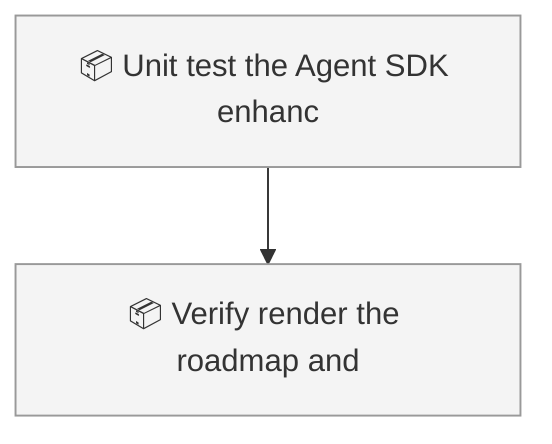
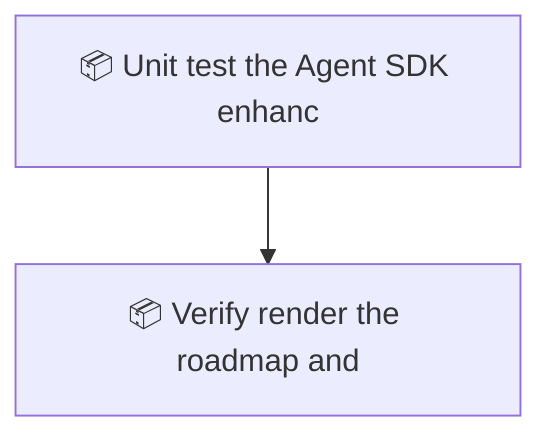

<!-- GENERATED by worklog roadmap-render. DO NOT EDIT. -->

> This file is generated from `.work/todo.jsonl`. Edits will be overwritten.
> To change the roadmap, change the work items: `worklog add|update|close`.

# Roadmap

_1 epic(s) in flight, 1 open item(s), 0 blocked, 0 unclassified._

## Now

_Nothing here._

## Next

### Unit test the Agent SDK enhancer port  ·  P1  ·  12 of 13 done  ·  feature 11 / bug 1 / ops 1

| # | Item | Type | Priority | Status | Blocked by |
|---|---|---|---|---|---|
| [52](https://github.com/RichardHightower/reliable-agentic-lab/issues/52) | Verify, render the roadmap, and open the pull request | task | P2 | todo | — |

## Later

_Nothing here._

## Visual roadmap

### Dependency graph

### Hierarchy

