<!-- GENERATED by worklog roadmap-render. DO NOT EDIT. -->

> This file is generated from `.work/todo.jsonl`. Edits will be overwritten.
> To change the roadmap, change the work items: `worklog add|update|close`.

# Roadmap

_1 epic(s) in flight, 10 open item(s), 0 blocked, 0 unclassified._

## Now

_Nothing here._

## Next

### Ship the ticket enhancer as a Grok Build project plugin  ·  P1  ·  0 of 10 done
solutions/sol1_enhancer_grok_build/ still holds the old generated Python answer, not a Grok Build artifact. Replace it with a project plugin named ticket-enhancer that runs the same loop as the Claude Code answer, so lab 1 attendees build a Grok plugin instead of copying a .claude/ tree.

| # | Item | Type | Priority | Status | Blocked by |
|---|---|---|---|---|---|
| [34](https://github.com/RichardHightower/reliable-agentic-lab/issues/34) | Probe the real subagent spawn tool name | task | P1 | todo | — |
| [35](https://github.com/RichardHightower/reliable-agentic-lab/issues/35) | Prove `.grok/plugins/` discovery before writing the loop | task | P1 | todo | — |
| [38](https://github.com/RichardHightower/reliable-agentic-lab/issues/38) | Fix the two Claude SKILL bugs in the port | task | P1 | todo | — |
| [40](https://github.com/RichardHightower/reliable-agentic-lab/issues/40) | Verify with two simulated polls on T001 | task | P1 | todo | — |
| [42](https://github.com/RichardHightower/reliable-agentic-lab/issues/42) | Port the two agents and the orchestrator skill | task | P1 | todo | — |
| [36](https://github.com/RichardHightower/reliable-agentic-lab/issues/36) | Add the debug hooks, and drop them if the schema refuses | task | P2 | todo | — |
| [37](https://github.com/RichardHightower/reliable-agentic-lab/issues/37) | Write SPEC, HOW_TO_RUN, AGENTS, README, and IMPLEMENTATION_NOTES | task | P2 | todo | — |
| [39](https://github.com/RichardHightower/reliable-agentic-lab/issues/39) | Write the Taskfile with a pinned dir and a trust target | task | P2 | todo | — |
| [41](https://github.com/RichardHightower/reliable-agentic-lab/issues/41) | Copy the gate scripts, bin scripts, and config example | task | P2 | todo | — |
| [43](https://github.com/RichardHightower/reliable-agentic-lab/issues/43) | Delete the stale Python answer | task | P2 | todo | — |

## Later

_Nothing here._

## Visual roadmap

### Dependency graph

```mermaid
graph TD
    01M121J9XMX7V6QA3NWTNQSA3C["📦 Ship the ticket enhancer as a"]
    01M121J9Y5A87WHGYDEDR6VXPE["📦 Probe the real subagent spawn"]
    01M121J9Y5KMJJKXZ2JR9ESRZ3["📦 Prove .grok/plugins/ discovery"]
    01M121J9Y61HRS27S0WCWCA8PE["📦 Add the debug hooks and drop t"]
    01M121J9Y61NF9FPH3V467FC78["📦 Write SPEC HOW_TO_RUN AGENTS R"]
    01M121J9Y64S2BPQKED7BW6NB9["📦 Fix the two Claude SKILL bugs"]
    01M121J9Y650XXJWZZ1PSF19C2["📦 Write the Taskfile with a pinn"]
    01M121J9Y68196Y3XH6SX1Q6BP["📦 Verify with two simulated poll"]
    01M121J9Y68EZJ6C630Y0KZ4SR["📦 Copy the gate scripts bin scri"]
    01M121J9Y6HFQWKMY5S359NT9H["📦 Port the two agents and the or"]
    01M121J9Y6M68WZ33M3Z8E2QRF["📦 Delete the stale Python answer"]
    01M121J9XMX7V6QA3NWTNQSA3C --> 01M121J9Y5A87WHGYDEDR6VXPE
    01M121J9XMX7V6QA3NWTNQSA3C --> 01M121J9Y5KMJJKXZ2JR9ESRZ3
    01M121J9XMX7V6QA3NWTNQSA3C --> 01M121J9Y61HRS27S0WCWCA8PE
    01M121J9XMX7V6QA3NWTNQSA3C --> 01M121J9Y61NF9FPH3V467FC78
    01M121J9XMX7V6QA3NWTNQSA3C --> 01M121J9Y64S2BPQKED7BW6NB9
    01M121J9XMX7V6QA3NWTNQSA3C --> 01M121J9Y650XXJWZZ1PSF19C2
    01M121J9XMX7V6QA3NWTNQSA3C --> 01M121J9Y68196Y3XH6SX1Q6BP
    01M121J9XMX7V6QA3NWTNQSA3C --> 01M121J9Y68EZJ6C630Y0KZ4SR
    01M121J9XMX7V6QA3NWTNQSA3C --> 01M121J9Y6HFQWKMY5S359NT9H
    01M121J9XMX7V6QA3NWTNQSA3C --> 01M121J9Y6M68WZ33M3Z8E2QRF
    classDef todo fill:#f4f4f4,stroke:#999999
    class 01M121J9XMX7V6QA3NWTNQSA3C,01M121J9Y5A87WHGYDEDR6VXPE,01M121J9Y5KMJJKXZ2JR9ESRZ3,01M121J9Y61HRS27S0WCWCA8PE,01M121J9Y61NF9FPH3V467FC78,01M121J9Y64S2BPQKED7BW6NB9,01M121J9Y650XXJWZZ1PSF19C2,01M121J9Y68196Y3XH6SX1Q6BP,01M121J9Y68EZJ6C630Y0KZ4SR,01M121J9Y6HFQWKMY5S359NT9H,01M121J9Y6M68WZ33M3Z8E2QRF todo
```

### Hierarchy

```mermaid
graph TD
    01M121J9XMX7V6QA3NWTNQSA3C["📦 Ship the ticket enhancer as a"]
    01M121J9Y5A87WHGYDEDR6VXPE["📦 Probe the real subagent spawn"]
    01M121J9Y5KMJJKXZ2JR9ESRZ3["📦 Prove .grok/plugins/ discovery"]
    01M121J9Y61HRS27S0WCWCA8PE["📦 Add the debug hooks and drop t"]
    01M121J9Y61NF9FPH3V467FC78["📦 Write SPEC HOW_TO_RUN AGENTS R"]
    01M121J9Y64S2BPQKED7BW6NB9["📦 Fix the two Claude SKILL bugs"]
    01M121J9Y650XXJWZZ1PSF19C2["📦 Write the Taskfile with a pinn"]
    01M121J9Y68196Y3XH6SX1Q6BP["📦 Verify with two simulated poll"]
    01M121J9Y68EZJ6C630Y0KZ4SR["📦 Copy the gate scripts bin scri"]
    01M121J9Y6HFQWKMY5S359NT9H["📦 Port the two agents and the or"]
    01M121J9Y6M68WZ33M3Z8E2QRF["📦 Delete the stale Python answer"]
    01M121J9XMX7V6QA3NWTNQSA3C --> 01M121J9Y5A87WHGYDEDR6VXPE
    01M121J9XMX7V6QA3NWTNQSA3C --> 01M121J9Y5KMJJKXZ2JR9ESRZ3
    01M121J9XMX7V6QA3NWTNQSA3C --> 01M121J9Y61HRS27S0WCWCA8PE
    01M121J9XMX7V6QA3NWTNQSA3C --> 01M121J9Y61NF9FPH3V467FC78
    01M121J9XMX7V6QA3NWTNQSA3C --> 01M121J9Y64S2BPQKED7BW6NB9
    01M121J9XMX7V6QA3NWTNQSA3C --> 01M121J9Y650XXJWZZ1PSF19C2
    01M121J9XMX7V6QA3NWTNQSA3C --> 01M121J9Y68196Y3XH6SX1Q6BP
    01M121J9XMX7V6QA3NWTNQSA3C --> 01M121J9Y68EZJ6C630Y0KZ4SR
    01M121J9XMX7V6QA3NWTNQSA3C --> 01M121J9Y6HFQWKMY5S359NT9H
    01M121J9XMX7V6QA3NWTNQSA3C --> 01M121J9Y6M68WZ33M3Z8E2QRF
```

