<!-- GENERATED by worklog roadmap-render. DO NOT EDIT. -->

> This file is generated from `.work/todo.jsonl`. Edits will be overwritten.
> To change the roadmap, change the work items: `worklog add|update|close`.

# Roadmap

_1 epic(s) in flight, 17 open item(s), 0 blocked, 1 unclassified._

## Now

_Nothing here._

## Next

### Make every lab and solution folder standalone  ·  P1  ·  2 of 7 done  ·  ops 6 / triage 1
Labs and solutions must not share Python modules or a base Taskfile. Each lab/solution folder runs on its own, start to finish, even if that means duplicate files across folders. solutions/sol1_enhancer (the Claude Code plugin) is the reference pattern: own Taskfile with no includes, no imports from the repo-root loops/ or solutions/ packages. Repeat that pattern for every remaining lab and solution folder, phase by phase, one module at a time.

| # | Item | Type | Priority | Status | Blocked by |
|---|---|---|---|---|---|
| [11](https://github.com/RichardHightower/reliable-agentic-lab/issues/11) | Phase 1: make solution 1's tool/runtime variants standalone | story | P1 | todo | — |
| [12](https://github.com/RichardHightower/reliable-agentic-lab/issues/12) | Phase 2: make module 2 (implementer) standalone | story | P2 | todo | — |
| [13](https://github.com/RichardHightower/reliable-agentic-lab/issues/13) | Phase 3: make module 3 (research) standalone | story | P2 | todo | — |
| [14](https://github.com/RichardHightower/reliable-agentic-lab/issues/14) | Phase 4: make module 4 (fixer) standalone | story | P2 | todo | — |

### (no epic)

| # | Item | Type | Priority | Status | Blocked by |
|---|---|---|---|---|---|
| [2](https://github.com/RichardHightower/reliable-agentic-lab/issues/2) | Decide how far run() goes on the eight runtime ports | story | P1 | todo | — |
| [20](https://github.com/RichardHightower/reliable-agentic-lab/issues/20) | Exit conditions are still skill text, not enforced in code | task | P1 | todo | — |
| [3](https://github.com/RichardHightower/reliable-agentic-lab/issues/3) | Decks still tell the room to check out done-m<n> | task | P2 | todo | — |
| [21](https://github.com/RichardHightower/reliable-agentic-lab/issues/21) | Smooth Saturday friction on lab 1 / solution 1 | story | P2 | todo | — |
| [22](https://github.com/RichardHightower/reliable-agentic-lab/issues/22) | 25-minute estimate does not match the real setup path | task | P2 | todo | — |
| [23](https://github.com/RichardHightower/reliable-agentic-lab/issues/23) | task run has no runner for Codex or Grok Build | task | P2 | todo | — |
| [24](https://github.com/RichardHightower/reliable-agentic-lab/issues/24) | Clarify that work/northwind-field-crm lives outside the standalone folder | task | P2 | todo | — |
| [25](https://github.com/RichardHightower/reliable-agentic-lab/issues/25) | Solution settings.json is missing the lab's tighter test-file deny rule | task | P2 | todo | — |
| [28](https://github.com/RichardHightower/reliable-agentic-lab/issues/28) | Fix root docs still describing the old lab 1 Python exercise | task | P2 | todo | — |

## Later

### Make every lab and solution folder standalone  ·  P1  ·  2 of 7 done  ·  ops 6 / triage 1
Labs and solutions must not share Python modules or a base Taskfile. Each lab/solution folder runs on its own, start to finish, even if that means duplicate files across folders. solutions/sol1_enhancer (the Claude Code plugin) is the reference pattern: own Taskfile with no includes, no imports from the repo-root loops/ or solutions/ packages. Repeat that pattern for every remaining lab and solution folder, phase by phase, one module at a time.

| # | Item | Type | Priority | Status | Blocked by |
|---|---|---|---|---|---|
| [15](https://github.com/RichardHightower/reliable-agentic-lab/issues/15) | Decide standalone treatment for labs/takehome | task | P3 | todo | — |

### (no epic)

| # | Item | Type | Priority | Status | Blocked by |
|---|---|---|---|---|---|
| [26](https://github.com/RichardHightower/reliable-agentic-lab/issues/26) | README does not warn that poll-forever never stops on ready | subtask | P3 | todo | — |
| [27](https://github.com/RichardHightower/reliable-agentic-lab/issues/27) | OpenCode prompt file exists but is not one of the three supported tools | subtask | P3 | todo | — |
| [29](https://github.com/RichardHightower/reliable-agentic-lab/issues/29) | Confirm and document that attendees can clone the CRM demo repo | task | P3 | todo | — |

## Needs classification

- [15](https://github.com/RichardHightower/reliable-agentic-lab/issues/15) Decide standalone treatment for labs/takehome (task)

## Milestones

### feature/sol1-enhancer

| # | Item | Type | Priority | Status | Blocked by |
|---|---|---|---|---|---|
| [21](https://github.com/RichardHightower/reliable-agentic-lab/issues/21) | Smooth Saturday friction on lab 1 / solution 1 | story | P2 | todo | — |
| [28](https://github.com/RichardHightower/reliable-agentic-lab/issues/28) | Fix root docs still describing the old lab 1 Python exercise | task | P2 | todo | — |
| [29](https://github.com/RichardHightower/reliable-agentic-lab/issues/29) | Confirm and document that attendees can clone the CRM demo repo | task | P3 | todo | — |

## Visual roadmap

### Dependency graph

```mermaid
graph TD
    01M10N7X4TCZSZ6RCQ8348G3MG["📦 Decide how far run() goes on t"]
    01M10N87FRARZQJET5ZF6N9WY1["🐛 Decks still tell the room to c"]
    01M10ZZFT4DW7V58K7DCNKJRR3["🔧 Make every lab and solution fo"]
    01M110015D4FB9BYPNVK7BEJR1["🔧 Phase 1 make solution 1's tool"]
    01M11003RBSRAW0MYDE34AVZGV["🔧 Phase 2 make module 2 (impleme"]
    01M11005SEGJQEYP984QBYVE3C["🔧 Phase 3 make module 3 (researc"]
    01M110078YFGKGG0E528GE9J95["🔧 Phase 4 make module 4 (fixer)"]
    01M1100CMG7X5QW4K85N6Y77ZK["❓ Decide standalone treatment fo"]
    01M1105KRRQA38C24ZBY2TWYYF["🐛 Exit conditions are still skil"]
    01M1105RMXE5789V5Q5BTT3B7W["🐛 Smooth Saturday friction on la"]
    01M1105YDVP2XKP68AH1NG90A6["🐛 25-minute estimate does not ma"]
    01M11060MVN4J62ZTZ6RSBF1H9["🐛 task run has no runner for Cod"]
    01M11063779CNZPSE3VR1EASHR["🐛 Clarify that work/northwind-fi"]
    01M11064YH3N8BD8H4NA3QEQEP["🐛 Solution settings.json is miss"]
    01M1106A4Q5BTRYFNGSSKXY2E2["🐛 README does not warn that poll"]
    01M1106BVHE4EEVQBQ94QX7ZR8["🐛 OpenCode prompt file exists bu"]
    01M111BCJVP1DRQRN66PPSN1QH["🐛 Fix root docs still describing"]
    01M111BFNFMVM3Q7XQFRVDQX69["🔧 Confirm and document that atte"]
    01M10ZZFT4DW7V58K7DCNKJRR3 --> 01M110015D4FB9BYPNVK7BEJR1
    01M10ZZFT4DW7V58K7DCNKJRR3 --> 01M11003RBSRAW0MYDE34AVZGV
    01M10ZZFT4DW7V58K7DCNKJRR3 --> 01M11005SEGJQEYP984QBYVE3C
    01M10ZZFT4DW7V58K7DCNKJRR3 --> 01M110078YFGKGG0E528GE9J95
    01M10ZZFT4DW7V58K7DCNKJRR3 --> 01M1100CMG7X5QW4K85N6Y77ZK
    01M1105RMXE5789V5Q5BTT3B7W --> 01M1105YDVP2XKP68AH1NG90A6
    01M1105RMXE5789V5Q5BTT3B7W --> 01M11060MVN4J62ZTZ6RSBF1H9
    01M1105RMXE5789V5Q5BTT3B7W --> 01M11063779CNZPSE3VR1EASHR
    01M1105RMXE5789V5Q5BTT3B7W --> 01M11064YH3N8BD8H4NA3QEQEP
    01M1105RMXE5789V5Q5BTT3B7W --> 01M1106A4Q5BTRYFNGSSKXY2E2
    01M1105RMXE5789V5Q5BTT3B7W --> 01M1106BVHE4EEVQBQ94QX7ZR8
    classDef todo fill:#f4f4f4,stroke:#999999
    class 01M10N7X4TCZSZ6RCQ8348G3MG,01M10N87FRARZQJET5ZF6N9WY1,01M10ZZFT4DW7V58K7DCNKJRR3,01M110015D4FB9BYPNVK7BEJR1,01M11003RBSRAW0MYDE34AVZGV,01M11005SEGJQEYP984QBYVE3C,01M110078YFGKGG0E528GE9J95,01M1100CMG7X5QW4K85N6Y77ZK,01M1105KRRQA38C24ZBY2TWYYF,01M1105RMXE5789V5Q5BTT3B7W,01M1105YDVP2XKP68AH1NG90A6,01M11060MVN4J62ZTZ6RSBF1H9,01M11063779CNZPSE3VR1EASHR,01M11064YH3N8BD8H4NA3QEQEP,01M1106A4Q5BTRYFNGSSKXY2E2,01M1106BVHE4EEVQBQ94QX7ZR8,01M111BCJVP1DRQRN66PPSN1QH,01M111BFNFMVM3Q7XQFRVDQX69 todo
```

### Hierarchy

```mermaid
graph TD
    01M10N7X4TCZSZ6RCQ8348G3MG["📦 Decide how far run() goes on t"]
    01M10N87FRARZQJET5ZF6N9WY1["🐛 Decks still tell the room to c"]
    01M10ZZFT4DW7V58K7DCNKJRR3["🔧 Make every lab and solution fo"]
    01M110015D4FB9BYPNVK7BEJR1["🔧 Phase 1 make solution 1's tool"]
    01M11003RBSRAW0MYDE34AVZGV["🔧 Phase 2 make module 2 (impleme"]
    01M11005SEGJQEYP984QBYVE3C["🔧 Phase 3 make module 3 (researc"]
    01M110078YFGKGG0E528GE9J95["🔧 Phase 4 make module 4 (fixer)"]
    01M1100CMG7X5QW4K85N6Y77ZK["❓ Decide standalone treatment fo"]
    01M1105KRRQA38C24ZBY2TWYYF["🐛 Exit conditions are still skil"]
    01M1105RMXE5789V5Q5BTT3B7W["🐛 Smooth Saturday friction on la"]
    01M1105YDVP2XKP68AH1NG90A6["🐛 25-minute estimate does not ma"]
    01M11060MVN4J62ZTZ6RSBF1H9["🐛 task run has no runner for Cod"]
    01M11063779CNZPSE3VR1EASHR["🐛 Clarify that work/northwind-fi"]
    01M11064YH3N8BD8H4NA3QEQEP["🐛 Solution settings.json is miss"]
    01M1106A4Q5BTRYFNGSSKXY2E2["🐛 README does not warn that poll"]
    01M1106BVHE4EEVQBQ94QX7ZR8["🐛 OpenCode prompt file exists bu"]
    01M111BCJVP1DRQRN66PPSN1QH["🐛 Fix root docs still describing"]
    01M111BFNFMVM3Q7XQFRVDQX69["🔧 Confirm and document that atte"]
    01M10ZZFT4DW7V58K7DCNKJRR3 --> 01M110015D4FB9BYPNVK7BEJR1
    01M10ZZFT4DW7V58K7DCNKJRR3 --> 01M11003RBSRAW0MYDE34AVZGV
    01M10ZZFT4DW7V58K7DCNKJRR3 --> 01M11005SEGJQEYP984QBYVE3C
    01M10ZZFT4DW7V58K7DCNKJRR3 --> 01M110078YFGKGG0E528GE9J95
    01M10ZZFT4DW7V58K7DCNKJRR3 --> 01M1100CMG7X5QW4K85N6Y77ZK
    01M1105RMXE5789V5Q5BTT3B7W --> 01M1105YDVP2XKP68AH1NG90A6
    01M1105RMXE5789V5Q5BTT3B7W --> 01M11060MVN4J62ZTZ6RSBF1H9
    01M1105RMXE5789V5Q5BTT3B7W --> 01M11063779CNZPSE3VR1EASHR
    01M1105RMXE5789V5Q5BTT3B7W --> 01M11064YH3N8BD8H4NA3QEQEP
    01M1105RMXE5789V5Q5BTT3B7W --> 01M1106A4Q5BTRYFNGSSKXY2E2
    01M1105RMXE5789V5Q5BTT3B7W --> 01M1106BVHE4EEVQBQ94QX7ZR8
```

