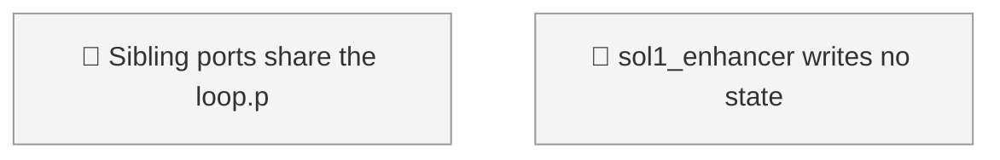
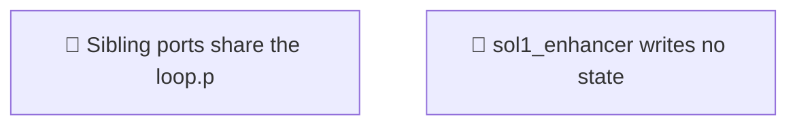

<!-- GENERATED by worklog roadmap-render. DO NOT EDIT. -->

> This file is generated from `.work/todo.jsonl`. Edits will be overwritten.
> To change the roadmap, change the work items: `worklog add|update|close`.

# Roadmap

_0 epic(s) in flight, 2 open item(s), 0 blocked, 0 unclassified._

## Now

_Nothing here._

## Next

### (no epic)

| # | Item | Type | Priority | Status | Blocked by |
|---|---|---|---|---|---|
| [91](https://github.com/RichardHightower/reliable-agentic-lab/issues/91) | sol1_enhancer writes no state file when it finds an existing issue, so LGTM is never read | task | P1 | todo | — |
| [67](https://github.com/RichardHightower/reliable-agentic-lab/issues/67) | Sibling ports share the loop.py --table-only Contract() bug | task | P2 | todo | — |

## Later

_Nothing here._

## Visual roadmap

### Dependency graph

### Hierarchy

