<!-- GENERATED by worklog roadmap-render. DO NOT EDIT. -->

> This file is generated from `.work/todo.jsonl`. Edits will be overwritten.
> To change the roadmap, change the work items: `worklog add|update|close`.

# Roadmap

_1 epic(s) in flight, 32 open item(s), 1 blocked, 0 unclassified._

## Now

_Nothing here._

## Next

### sol2: make the implementer loop match the Module 2 slides  ·  P1  ·  0 of 29 done  ·  feature 23 / ops 6
Parent of the next Sol 2 pass. #287 / #288 made both ports real eight-step drivers. This epic makes the classroom demo match FEATURE-MAP Module 2 and the Lab 2 speaker notes. The five primitives: trigger, scope, verify, state on disk, three exits. Sol2 has four of five. State on disk is last-implementer.json plus a receipt, not a resume spine. The push gate is receipt.check with no hook. The judge is asked about this diff and is not given one. Copy both ports. No loops/ package. Saturday labs/lab2_implementer untouched. Do not mix sol3 #385/#386. Do not implement the loop in the filing PR.

| # | Item | Type | Priority | Status | Blocked by |
|---|---|---|---|---|---|
| [416](https://github.com/RichardHightower/reliable-agentic-lab/issues/416) | sol2 0/9: publish Sol-2-Implementer-Review on the wiki | story | P1 | todo | — |
| [426](https://github.com/RichardHightower/reliable-agentic-lab/issues/426) | sol2 0/9: publish the review page and link it from Home, Lab-2, and Sidebar | task | P1 | todo | — |
| [417](https://github.com/RichardHightower/reliable-agentic-lab/issues/417) | sol2 1/9: receipt.check tests in both ports, then wire or strike the push gate | story | P1 | todo | — |
| [427](https://github.com/RichardHightower/reliable-agentic-lab/issues/427) | sol2 1/9: tests for receipt.check in both ports | task | P1 | todo | — |
| [428](https://github.com/RichardHightower/reliable-agentic-lab/issues/428) | sol2 1/9: wire the push gate, or strike the slides | task | P1 | todo | — |
| [418](https://github.com/RichardHightower/reliable-agentic-lab/issues/418) | sol2 2/9: the judge sees the diff, and offline can say not done | story | P1 | todo | — |
| [429](https://github.com/RichardHightower/reliable-agentic-lab/issues/429) | sol2 2/9: put the diff and the plan summary in the judge prompt | task | P1 | todo | — |
| [430](https://github.com/RichardHightower/reliable-agentic-lab/issues/430) | sol2 2/9: a fixture judge can say no | task | P1 | todo | — |
| [419](https://github.com/RichardHightower/reliable-agentic-lab/issues/419) | sol2 3/9: run the loop in an isolated git worktree | story | P1 | todo | — |
| [431](https://github.com/RichardHightower/reliable-agentic-lab/issues/431) | sol2 3/9: isolated git worktree as the repo the loop mutates | task | P1 | todo | — |
| [420](https://github.com/RichardHightower/reliable-agentic-lab/issues/420) | sol2 4/9: durable state, resume, and CI exit codes | story | P1 | todo | — |
| [432](https://github.com/RichardHightower/reliable-agentic-lab/issues/432) | sol2 4/9: write .harness/state.json next to the receipt | task | P1 | todo | — |
| [433](https://github.com/RichardHightower/reliable-agentic-lab/issues/433) | sol2 4/9: --resume continues from state | task | P1 | todo | — |
| [434](https://github.com/RichardHightower/reliable-agentic-lab/issues/434) | sol2 4/9: process exits 0 pass, 2 escalate, 1 crash | task | P1 | todo | — |
| [421](https://github.com/RichardHightower/reliable-agentic-lab/issues/421) | sol2 5/9: the test implementer reads the plan and may retry | story | P1 | todo | — |
| [435](https://github.com/RichardHightower/reliable-agentic-lab/issues/435) | sol2 5/9: test-implementer prompt includes the plan | task | P1 | todo | — |
| [436](https://github.com/RichardHightower/reliable-agentic-lab/issues/436) | sol2 5/9: test phase may retry inside the budget | task | P1 | todo | — |
| [422](https://github.com/RichardHightower/reliable-agentic-lab/issues/422) | sol2 6/9: planner-as-subagent behind a flag, schema unchanged | story | P1 | todo | — |
| [437](https://github.com/RichardHightower/reliable-agentic-lab/issues/437) | sol2 6/9: --planner derived|sdk|deep, default derived | task | P1 | todo | — |
| [423](https://github.com/RichardHightower/reliable-agentic-lab/issues/423) | sol2 7/9: Deep Agents SPEC and live fence probe, copied not imported | story | P1 | todo | — |
| [438](https://github.com/RichardHightower/reliable-agentic-lab/issues/438) | sol2 7/9: DA SPEC names the fence at SDK depth | task | P1 | todo | — |
| [439](https://github.com/RichardHightower/reliable-agentic-lab/issues/439) | sol2 7/9: Layer-3 fence probe that fails if the mock is lying | task | P1 | todo | — |
| [424](https://github.com/RichardHightower/reliable-agentic-lab/issues/424) | sol2 8/9: no live backend holds Bash | story | P1 | todo | — |
| [440](https://github.com/RichardHightower/reliable-agentic-lab/issues/440) | sol2 8/9: copy SDK OVERRIDES into DA roleplan.py | task | P1 | todo | — |
| [441](https://github.com/RichardHightower/reliable-agentic-lab/issues/441) | sol2 8/9: fence or drop CliBackend for the implementer ports | task | P1 | todo | — |
| [425](https://github.com/RichardHightower/reliable-agentic-lab/issues/425) | sol2 9/9: docs, traces, and parity tests | story | P1 | todo | [417](https://github.com/RichardHightower/reliable-agentic-lab/issues/417), [418](https://github.com/RichardHightower/reliable-agentic-lab/issues/418), [419](https://github.com/RichardHightower/reliable-agentic-lab/issues/419), [420](https://github.com/RichardHightower/reliable-agentic-lab/issues/420), [421](https://github.com/RichardHightower/reliable-agentic-lab/issues/421), [422](https://github.com/RichardHightower/reliable-agentic-lab/issues/422), [423](https://github.com/RichardHightower/reliable-agentic-lab/issues/423), [424](https://github.com/RichardHightower/reliable-agentic-lab/issues/424) |
| [442](https://github.com/RichardHightower/reliable-agentic-lab/issues/442) | sol2 9/9: docs match the code that shipped | task | P1 | todo | — |
| [443](https://github.com/RichardHightower/reliable-agentic-lab/issues/443) | sol2 9/9: parity tests across both ports | task | P1 | todo | — |
| [444](https://github.com/RichardHightower/reliable-agentic-lab/issues/444) | sol2 9/9: optional live T001 traces | task | P1 | todo | — |

### (no epic)

| # | Item | Type | Priority | Status | Blocked by |
|---|---|---|---|---|---|
| 01M12SG1 | Build the GitHub poll for the Deep Agents enhancer port | story | P1 | todo | — |
| 01M12SG9 | Agent SDK enhancer answers its own comment on every poll | task | P1 | todo | — |

## Later

### (no epic)

| # | Item | Type | Priority | Status | Blocked by |
|---|---|---|---|---|---|
| 01M12T09 | Two enhancer robustness gaps that must be decided for both runtime ports at once | task | P3 | todo | — |

## Visual roadmap

### Dependency graph

```mermaid
graph TD
    01M12SG1CQ9J0PZW9KW4E01PYP["📦 Build the GitHub poll for the"]
    01M12SG9VN7PCKTF5Q5MHRZNC6["🐛 Agent SDK enhancer answers its"]
    01M12T09RFH8TP0RAWN4QN23YM["🐛 Two enhancer robustness gaps t"]
    01M1YFSXNQT62BHNCCBB8BR31Q["📦 sol2 make the implementer loop"]
    01M1YFSXSDVWB1Q5493C4XHGAR["🔧 sol2 0/9 publish Sol-2-Impleme"]
    01M1YFSXV7348Z9081YRJ7TC25["🔧 sol2 0/9 publish the review pa"]
    01M1YFSXWZWC7BXY3WEBA9RMMP["📦 sol2 1/9 receipt.check tests i"]
    01M1YFSXYQSRMK3SKQN14VY8S0["📦 sol2 1/9 tests for receipt.che"]
    01M1YFSY0EQE2G1DBF0JEF60GV["📦 sol2 1/9 wire the push gate or"]
    01M1YFSY26BCQQVYVE55J9XMNM["📦 sol2 2/9 the judge sees the di"]
    01M1YFSY3YH0VY1TDR3F6T4WM0["📦 sol2 2/9 put the diff and the"]
    01M1YFSY5PVYN2Q2JXSHYCSTVD["📦 sol2 2/9 a fixture judge can s"]
    01M1YFSY7D3MQMWY0KMSZQ0GDK["📦 sol2 3/9 run the loop in an is"]
    01M1YFSY94DFBEDKZXGEA73641["📦 sol2 3/9 isolated git worktree"]
    01M1YFSYAW8RZDAT6GZDSA6271["📦 sol2 4/9 durable state resume"]
    01M1YFSYCK35QH81CWM0KQD9N5["📦 sol2 4/9 write .harness/state."]
    01M1YFSYEB1VS21EJ55Z2NVN4Q["📦 sol2 4/9 --resume continues fr"]
    01M1YFSYG2B8NA4BJTWPAW8EH6["📦 sol2 4/9 process exits 0 pass"]
    01M1YFSYHSWNW9HG42PFCWM70T["📦 sol2 5/9 the test implementer"]
    01M1YFSYKHQMNKF76HHPAKHWNX["📦 sol2 5/9 test-implementer prom"]
    01M1YFSYN9A8MRDKAVRGHBR62R["📦 sol2 5/9 test phase may retry"]
    01M1YFSYQ0CC6WNK4V72W2YDRR["📦 sol2 6/9 planner-as-subagent b"]
    01M1YFSYRQYVDGNB8R8RGN8TS4["📦 sol2 6/9 --planner derivedsdkd"]
    01M1YFSYTEEWXP9GH83WCYZBKX["📦 sol2 7/9 Deep Agents SPEC and"]
    01M1YFSYW6TKEED3G7CCC9K50X["🔧 sol2 7/9 DA SPEC names the fen"]
    01M1YFSYXXYQE3RM1ZDMQ9M8PC["📦 sol2 7/9 Layer-3 fence probe t"]
    01M1YFSYZM1RYCHDYH6EC58JE5["📦 sol2 8/9 no live backend holds"]
    01M1YFSZ1D2W0Y3F3PKMYMP9F7["📦 sol2 8/9 copy SDK OVERRIDES in"]
    01M1YFSZ36HB2A8R0V18TGW80H["📦 sol2 8/9 fence or drop CliBack"]
    01M1YFSZ4YV0HP9XMBRJ2BZ1J2["🔧 sol2 9/9 docs traces and parit"]
    01M1YFSZ6PM4X8EK126XN9Q0BD["🔧 sol2 9/9 docs match the code t"]
    01M1YFSZ8DJW7ZCCG0ZDM67C12["📦 sol2 9/9 parity tests across b"]
    01M1YFSZA5PRM4CS0HVZGEPCYD["🔧 sol2 9/9 optional live T001 tr"]
    01M1YFSXNQT62BHNCCBB8BR31Q --> 01M1YFSXSDVWB1Q5493C4XHGAR
    01M1YFSXSDVWB1Q5493C4XHGAR --> 01M1YFSXV7348Z9081YRJ7TC25
    01M1YFSXNQT62BHNCCBB8BR31Q --> 01M1YFSXWZWC7BXY3WEBA9RMMP
    01M1YFSXWZWC7BXY3WEBA9RMMP --> 01M1YFSXYQSRMK3SKQN14VY8S0
    01M1YFSXWZWC7BXY3WEBA9RMMP --> 01M1YFSY0EQE2G1DBF0JEF60GV
    01M1YFSXNQT62BHNCCBB8BR31Q --> 01M1YFSY26BCQQVYVE55J9XMNM
    01M1YFSY26BCQQVYVE55J9XMNM --> 01M1YFSY3YH0VY1TDR3F6T4WM0
    01M1YFSY26BCQQVYVE55J9XMNM --> 01M1YFSY5PVYN2Q2JXSHYCSTVD
    01M1YFSXNQT62BHNCCBB8BR31Q --> 01M1YFSY7D3MQMWY0KMSZQ0GDK
    01M1YFSY7D3MQMWY0KMSZQ0GDK --> 01M1YFSY94DFBEDKZXGEA73641
    01M1YFSXNQT62BHNCCBB8BR31Q --> 01M1YFSYAW8RZDAT6GZDSA6271
    01M1YFSYAW8RZDAT6GZDSA6271 --> 01M1YFSYCK35QH81CWM0KQD9N5
    01M1YFSYAW8RZDAT6GZDSA6271 --> 01M1YFSYEB1VS21EJ55Z2NVN4Q
    01M1YFSYAW8RZDAT6GZDSA6271 --> 01M1YFSYG2B8NA4BJTWPAW8EH6
    01M1YFSXNQT62BHNCCBB8BR31Q --> 01M1YFSYHSWNW9HG42PFCWM70T
    01M1YFSYHSWNW9HG42PFCWM70T --> 01M1YFSYKHQMNKF76HHPAKHWNX
    01M1YFSYHSWNW9HG42PFCWM70T --> 01M1YFSYN9A8MRDKAVRGHBR62R
    01M1YFSXNQT62BHNCCBB8BR31Q --> 01M1YFSYQ0CC6WNK4V72W2YDRR
    01M1YFSYQ0CC6WNK4V72W2YDRR --> 01M1YFSYRQYVDGNB8R8RGN8TS4
    01M1YFSXNQT62BHNCCBB8BR31Q --> 01M1YFSYTEEWXP9GH83WCYZBKX
    01M1YFSYTEEWXP9GH83WCYZBKX --> 01M1YFSYW6TKEED3G7CCC9K50X
    01M1YFSYTEEWXP9GH83WCYZBKX --> 01M1YFSYXXYQE3RM1ZDMQ9M8PC
    01M1YFSXNQT62BHNCCBB8BR31Q --> 01M1YFSYZM1RYCHDYH6EC58JE5
    01M1YFSYZM1RYCHDYH6EC58JE5 --> 01M1YFSZ1D2W0Y3F3PKMYMP9F7
    01M1YFSYZM1RYCHDYH6EC58JE5 --> 01M1YFSZ36HB2A8R0V18TGW80H
    01M1YFSXNQT62BHNCCBB8BR31Q --> 01M1YFSZ4YV0HP9XMBRJ2BZ1J2
    01M1YFSZ4YV0HP9XMBRJ2BZ1J2 --> 01M1YFSZ6PM4X8EK126XN9Q0BD
    01M1YFSZ4YV0HP9XMBRJ2BZ1J2 --> 01M1YFSZ8DJW7ZCCG0ZDM67C12
    01M1YFSZ4YV0HP9XMBRJ2BZ1J2 --> 01M1YFSZA5PRM4CS0HVZGEPCYD
    01M1YFSXWZWC7BXY3WEBA9RMMP -.-> 01M1YFSZ4YV0HP9XMBRJ2BZ1J2
    01M1YFSY26BCQQVYVE55J9XMNM -.-> 01M1YFSZ4YV0HP9XMBRJ2BZ1J2
    01M1YFSY7D3MQMWY0KMSZQ0GDK -.-> 01M1YFSZ4YV0HP9XMBRJ2BZ1J2
    01M1YFSYAW8RZDAT6GZDSA6271 -.-> 01M1YFSZ4YV0HP9XMBRJ2BZ1J2
    01M1YFSYHSWNW9HG42PFCWM70T -.-> 01M1YFSZ4YV0HP9XMBRJ2BZ1J2
    01M1YFSYQ0CC6WNK4V72W2YDRR -.-> 01M1YFSZ4YV0HP9XMBRJ2BZ1J2
    01M1YFSYTEEWXP9GH83WCYZBKX -.-> 01M1YFSZ4YV0HP9XMBRJ2BZ1J2
    01M1YFSYZM1RYCHDYH6EC58JE5 -.-> 01M1YFSZ4YV0HP9XMBRJ2BZ1J2
    classDef todo fill:#f4f4f4,stroke:#999999
    class 01M12SG1CQ9J0PZW9KW4E01PYP,01M12SG9VN7PCKTF5Q5MHRZNC6,01M12T09RFH8TP0RAWN4QN23YM,01M1YFSXNQT62BHNCCBB8BR31Q,01M1YFSXSDVWB1Q5493C4XHGAR,01M1YFSXV7348Z9081YRJ7TC25,01M1YFSXWZWC7BXY3WEBA9RMMP,01M1YFSXYQSRMK3SKQN14VY8S0,01M1YFSY0EQE2G1DBF0JEF60GV,01M1YFSY26BCQQVYVE55J9XMNM,01M1YFSY3YH0VY1TDR3F6T4WM0,01M1YFSY5PVYN2Q2JXSHYCSTVD,01M1YFSY7D3MQMWY0KMSZQ0GDK,01M1YFSY94DFBEDKZXGEA73641,01M1YFSYAW8RZDAT6GZDSA6271,01M1YFSYCK35QH81CWM0KQD9N5,01M1YFSYEB1VS21EJ55Z2NVN4Q,01M1YFSYG2B8NA4BJTWPAW8EH6,01M1YFSYHSWNW9HG42PFCWM70T,01M1YFSYKHQMNKF76HHPAKHWNX,01M1YFSYN9A8MRDKAVRGHBR62R,01M1YFSYQ0CC6WNK4V72W2YDRR,01M1YFSYRQYVDGNB8R8RGN8TS4,01M1YFSYTEEWXP9GH83WCYZBKX,01M1YFSYW6TKEED3G7CCC9K50X,01M1YFSYXXYQE3RM1ZDMQ9M8PC,01M1YFSYZM1RYCHDYH6EC58JE5,01M1YFSZ1D2W0Y3F3PKMYMP9F7,01M1YFSZ36HB2A8R0V18TGW80H,01M1YFSZ4YV0HP9XMBRJ2BZ1J2,01M1YFSZ6PM4X8EK126XN9Q0BD,01M1YFSZ8DJW7ZCCG0ZDM67C12,01M1YFSZA5PRM4CS0HVZGEPCYD todo
```

### Hierarchy

```mermaid
graph TD
    01M12SG1CQ9J0PZW9KW4E01PYP["📦 Build the GitHub poll for the"]
    01M12SG9VN7PCKTF5Q5MHRZNC6["🐛 Agent SDK enhancer answers its"]
    01M12T09RFH8TP0RAWN4QN23YM["🐛 Two enhancer robustness gaps t"]
    01M1YFSXNQT62BHNCCBB8BR31Q["📦 sol2 make the implementer loop"]
    01M1YFSXSDVWB1Q5493C4XHGAR["🔧 sol2 0/9 publish Sol-2-Impleme"]
    01M1YFSXV7348Z9081YRJ7TC25["🔧 sol2 0/9 publish the review pa"]
    01M1YFSXWZWC7BXY3WEBA9RMMP["📦 sol2 1/9 receipt.check tests i"]
    01M1YFSXYQSRMK3SKQN14VY8S0["📦 sol2 1/9 tests for receipt.che"]
    01M1YFSY0EQE2G1DBF0JEF60GV["📦 sol2 1/9 wire the push gate or"]
    01M1YFSY26BCQQVYVE55J9XMNM["📦 sol2 2/9 the judge sees the di"]
    01M1YFSY3YH0VY1TDR3F6T4WM0["📦 sol2 2/9 put the diff and the"]
    01M1YFSY5PVYN2Q2JXSHYCSTVD["📦 sol2 2/9 a fixture judge can s"]
    01M1YFSY7D3MQMWY0KMSZQ0GDK["📦 sol2 3/9 run the loop in an is"]
    01M1YFSY94DFBEDKZXGEA73641["📦 sol2 3/9 isolated git worktree"]
    01M1YFSYAW8RZDAT6GZDSA6271["📦 sol2 4/9 durable state resume"]
    01M1YFSYCK35QH81CWM0KQD9N5["📦 sol2 4/9 write .harness/state."]
    01M1YFSYEB1VS21EJ55Z2NVN4Q["📦 sol2 4/9 --resume continues fr"]
    01M1YFSYG2B8NA4BJTWPAW8EH6["📦 sol2 4/9 process exits 0 pass"]
    01M1YFSYHSWNW9HG42PFCWM70T["📦 sol2 5/9 the test implementer"]
    01M1YFSYKHQMNKF76HHPAKHWNX["📦 sol2 5/9 test-implementer prom"]
    01M1YFSYN9A8MRDKAVRGHBR62R["📦 sol2 5/9 test phase may retry"]
    01M1YFSYQ0CC6WNK4V72W2YDRR["📦 sol2 6/9 planner-as-subagent b"]
    01M1YFSYRQYVDGNB8R8RGN8TS4["📦 sol2 6/9 --planner derivedsdkd"]
    01M1YFSYTEEWXP9GH83WCYZBKX["📦 sol2 7/9 Deep Agents SPEC and"]
    01M1YFSYW6TKEED3G7CCC9K50X["🔧 sol2 7/9 DA SPEC names the fen"]
    01M1YFSYXXYQE3RM1ZDMQ9M8PC["📦 sol2 7/9 Layer-3 fence probe t"]
    01M1YFSYZM1RYCHDYH6EC58JE5["📦 sol2 8/9 no live backend holds"]
    01M1YFSZ1D2W0Y3F3PKMYMP9F7["📦 sol2 8/9 copy SDK OVERRIDES in"]
    01M1YFSZ36HB2A8R0V18TGW80H["📦 sol2 8/9 fence or drop CliBack"]
    01M1YFSZ4YV0HP9XMBRJ2BZ1J2["🔧 sol2 9/9 docs traces and parit"]
    01M1YFSZ6PM4X8EK126XN9Q0BD["🔧 sol2 9/9 docs match the code t"]
    01M1YFSZ8DJW7ZCCG0ZDM67C12["📦 sol2 9/9 parity tests across b"]
    01M1YFSZA5PRM4CS0HVZGEPCYD["🔧 sol2 9/9 optional live T001 tr"]
    01M1YFSXNQT62BHNCCBB8BR31Q --> 01M1YFSXSDVWB1Q5493C4XHGAR
    01M1YFSXSDVWB1Q5493C4XHGAR --> 01M1YFSXV7348Z9081YRJ7TC25
    01M1YFSXNQT62BHNCCBB8BR31Q --> 01M1YFSXWZWC7BXY3WEBA9RMMP
    01M1YFSXWZWC7BXY3WEBA9RMMP --> 01M1YFSXYQSRMK3SKQN14VY8S0
    01M1YFSXWZWC7BXY3WEBA9RMMP --> 01M1YFSY0EQE2G1DBF0JEF60GV
    01M1YFSXNQT62BHNCCBB8BR31Q --> 01M1YFSY26BCQQVYVE55J9XMNM
    01M1YFSY26BCQQVYVE55J9XMNM --> 01M1YFSY3YH0VY1TDR3F6T4WM0
    01M1YFSY26BCQQVYVE55J9XMNM --> 01M1YFSY5PVYN2Q2JXSHYCSTVD
    01M1YFSXNQT62BHNCCBB8BR31Q --> 01M1YFSY7D3MQMWY0KMSZQ0GDK
    01M1YFSY7D3MQMWY0KMSZQ0GDK --> 01M1YFSY94DFBEDKZXGEA73641
    01M1YFSXNQT62BHNCCBB8BR31Q --> 01M1YFSYAW8RZDAT6GZDSA6271
    01M1YFSYAW8RZDAT6GZDSA6271 --> 01M1YFSYCK35QH81CWM0KQD9N5
    01M1YFSYAW8RZDAT6GZDSA6271 --> 01M1YFSYEB1VS21EJ55Z2NVN4Q
    01M1YFSYAW8RZDAT6GZDSA6271 --> 01M1YFSYG2B8NA4BJTWPAW8EH6
    01M1YFSXNQT62BHNCCBB8BR31Q --> 01M1YFSYHSWNW9HG42PFCWM70T
    01M1YFSYHSWNW9HG42PFCWM70T --> 01M1YFSYKHQMNKF76HHPAKHWNX
    01M1YFSYHSWNW9HG42PFCWM70T --> 01M1YFSYN9A8MRDKAVRGHBR62R
    01M1YFSXNQT62BHNCCBB8BR31Q --> 01M1YFSYQ0CC6WNK4V72W2YDRR
    01M1YFSYQ0CC6WNK4V72W2YDRR --> 01M1YFSYRQYVDGNB8R8RGN8TS4
    01M1YFSXNQT62BHNCCBB8BR31Q --> 01M1YFSYTEEWXP9GH83WCYZBKX
    01M1YFSYTEEWXP9GH83WCYZBKX --> 01M1YFSYW6TKEED3G7CCC9K50X
    01M1YFSYTEEWXP9GH83WCYZBKX --> 01M1YFSYXXYQE3RM1ZDMQ9M8PC
    01M1YFSXNQT62BHNCCBB8BR31Q --> 01M1YFSYZM1RYCHDYH6EC58JE5
    01M1YFSYZM1RYCHDYH6EC58JE5 --> 01M1YFSZ1D2W0Y3F3PKMYMP9F7
    01M1YFSYZM1RYCHDYH6EC58JE5 --> 01M1YFSZ36HB2A8R0V18TGW80H
    01M1YFSXNQT62BHNCCBB8BR31Q --> 01M1YFSZ4YV0HP9XMBRJ2BZ1J2
    01M1YFSZ4YV0HP9XMBRJ2BZ1J2 --> 01M1YFSZ6PM4X8EK126XN9Q0BD
    01M1YFSZ4YV0HP9XMBRJ2BZ1J2 --> 01M1YFSZ8DJW7ZCCG0ZDM67C12
    01M1YFSZ4YV0HP9XMBRJ2BZ1J2 --> 01M1YFSZA5PRM4CS0HVZGEPCYD
```

