<!-- GENERATED by worklog roadmap-render. DO NOT EDIT. -->

> This file is generated from `.work/todo.jsonl`. Edits will be overwritten.
> To change the roadmap, change the work items: `worklog add|update|close`.

# Roadmap

_1 epic(s) in flight, 25 open item(s), 0 blocked, 0 unclassified._

## Now

_Nothing here._

## Next

### sol3: adopt a house style the ports can enforce  ·  P1  ·  0 of 22 done  ·  feature 20 / ops 2
House style the two sol3 ports can enforce. STE-adapted English, glossary, non-marketing CTA. Tickets cite the wiki. Do not implement in the filing PR.

| # | Item | Type | Priority | Status | Blocked by |
|---|---|---|---|---|---|
| [446](https://github.com/RichardHightower/reliable-agentic-lab/issues/446) | sol3 0/8: publish Sol-3-White-Paper-Style and the plan | story | P1 | todo | — |
| [447](https://github.com/RichardHightower/reliable-agentic-lab/issues/447) | sol3 1/8: STE-100 briefing subset in checks.py | story | P1 | todo | — |
| [448](https://github.com/RichardHightower/reliable-agentic-lab/issues/448) | sol3 2/8: first-use definition plus assemble-owned glossary | story | P1 | todo | — |
| [449](https://github.com/RichardHightower/reliable-agentic-lab/issues/449) | sol3 3/8: last body section is a non-marketing CTA | story | P1 | todo | — |
| [450](https://github.com/RichardHightower/reliable-agentic-lab/issues/450) | sol3 4/8: person and marketing-verb belt, DA catches up with SDK | story | P1 | todo | — |
| [451](https://github.com/RichardHightower/reliable-agentic-lab/issues/451) | sol3 5/8: headings are answers; figures captioned; skips named | story | P1 | todo | — |
| [452](https://github.com/RichardHightower/reliable-agentic-lab/issues/452) | sol3 6/8: the paper does not narrate the harness | story | P1 | todo | — |
| [453](https://github.com/RichardHightower/reliable-agentic-lab/issues/453) | sol3 7/8: writer and reviewer skills cite the style page | story | P1 | todo | — |
| [454](https://github.com/RichardHightower/reliable-agentic-lab/issues/454) | sol3 8/8: SPECs and wiki Sol-3-White-Paper-Loop cite the style | story | P1 | todo | — |
| [455](https://github.com/RichardHightower/reliable-agentic-lab/issues/455) | sol3 1/8: contractions and Latin abbrevs fail in both ports | task | P1 | todo | — |
| [456](https://github.com/RichardHightower/reliable-agentic-lab/issues/456) | sol3 1/8: noun cluster <= 3; keep no-em-dash; do not ban may/might | task | P1 | todo | — |
| [457](https://github.com/RichardHightower/reliable-agentic-lab/issues/457) | sol3 2/8: assemble writes Glossary before References | task | P1 | todo | — |
| [458](https://github.com/RichardHightower/reliable-agentic-lab/issues/458) | sol3 2/8: glossary_complete and glossary_exact rows | task | P1 | todo | — |
| [459](https://github.com/RichardHightower/reliable-agentic-lab/issues/459) | sol3 3/8: outline requires a Next step section | task | P1 | todo | — |
| [460](https://github.com/RichardHightower/reliable-agentic-lab/issues/460) | sol3 3/8: CTA ban-list on the last prose section | task | P1 | todo | — |
| [461](https://github.com/RichardHightower/reliable-agentic-lab/issues/461) | sol3 4/8: you/your and we-will rows on both ports | task | P1 | todo | — |
| [462](https://github.com/RichardHightower/reliable-agentic-lab/issues/462) | sol3 4/8: marketing-verb row on both ports | task | P1 | todo | — |
| [463](https://github.com/RichardHightower/reliable-agentic-lab/issues/463) | sol3 5/8: question_heading row; coverage scores answers | task | P1 | todo | — |
| [464](https://github.com/RichardHightower/reliable-agentic-lab/issues/464) | sol3 5/8: Figure N caption + in-text mention; skipped figures named | task | P1 | todo | — |
| [465](https://github.com/RichardHightower/reliable-agentic-lab/issues/465) | sol3 6/8: policy_leak row; writer message has no allowlist host | task | P1 | todo | — |
| [466](https://github.com/RichardHightower/reliable-agentic-lab/issues/466) | sol3 7/8: writer and reviewer cards point at the wiki style page | task | P1 | todo | — |
| [467](https://github.com/RichardHightower/reliable-agentic-lab/issues/467) | sol3 8/8: SPECs, HOW_TO_RUN, FEATURE-MAP, Sol-3-White-Paper-Loop link the style | task | P1 | todo | — |

### (no epic)

| # | Item | Type | Priority | Status | Blocked by |
|---|---|---|---|---|---|
| 01M12SG1 | Build the GitHub poll for the Deep Agents enhancer port | story | P1 | todo | — |
| 01M12SG9 | Agent SDK enhancer answers its own comment on every poll | task | P1 | todo | — |

## Later

### (no epic)

| # | Item | Type | Priority | Status | Blocked by |
|---|---|---|---|---|---|
| 01M12T09 | Two enhancer robustness gaps that must be decided for both runtime ports at once | task | P3 | todo | — |

## Visual roadmap

### Dependency graph

```mermaid
graph TD
    01M12SG1CQ9J0PZW9KW4E01PYP["📦 Build the GitHub poll for the"]
    01M12SG9VN7PCKTF5Q5MHRZNC6["🐛 Agent SDK enhancer answers its"]
    01M12T09RFH8TP0RAWN4QN23YM["🐛 Two enhancer robustness gaps t"]
    01M1Z062K46NGTMSJ82GSCKPA0["📦 sol3 adopt a house style the p"]
    01M1Z062Q7JXM2KMD9HSZH33V0["📦 sol3 0/8 publish Sol-3-White-P"]
    01M1Z062V2WHRP1TYQW4D0QS1Y["📦 sol3 1/8 STE-100 briefing subs"]
    01M1Z062YWYB5DFKA3WBV6HZ1K["📦 sol3 2/8 first-use definition"]
    01M1Z0632RR428KHSKB5VKRR0T["📦 sol3 3/8 last body section is"]
    01M1Z0636TV2JG1SBAS9XTD071["📦 sol3 4/8 person and marketing-"]
    01M1Z063B571BXHRGBHGR10054["📦 sol3 5/8 headings are answers"]
    01M1Z063EWK35JA22C622VA38T["📦 sol3 6/8 the paper does not na"]
    01M1Z063JNDXW6QG8BRKANQZ3A["📦 sol3 7/8 writer and reviewer s"]
    01M1Z063PGRSS2Z54002WKWCYT["📦 sol3 8/8 SPECs and wiki Sol-3-"]
    01M1Z06T42QJPERBFWDDKR3YHA["📦 sol3 1/8 contractions and Lati"]
    01M1Z06T7WKMJF0WAW24TT91WE["📦 sol3 1/8 noun cluster = 3 keep"]
    01M1Z06TBH9DM5C6D82EMKMN44["📦 sol3 2/8 assemble writes Gloss"]
    01M1Z06TF9BB4PWD1K3NQ6BXFP["📦 sol3 2/8 glossary_complete and"]
    01M1Z06TK1RQN6WV9G7AW5Y6CF["📦 sol3 3/8 outline requires a Ne"]
    01M1Z06TQ7XQRQE7QDPPJJYVXH["📦 sol3 3/8 CTA ban-list on the l"]
    01M1Z06TTXQ0QT4WMHVTCWYWWQ["📦 sol3 4/8 you/your and we-will"]
    01M1Z06TYMXA7BBVQCC65EF787["📦 sol3 4/8 marketing-verb row on"]
    01M1Z06V2CRXE7JWR2P4QNMTY8["📦 sol3 5/8 question_heading row"]
    01M1Z06V62483TSSCC2551X54V["📦 sol3 5/8 Figure N caption + in"]
    01M1Z06V9TJ1HZ8SBR3SQD6JYP["📦 sol3 6/8 policy_leak row write"]
    01M1Z06VDJVRX57HPRKNH2JT1M["🔧 sol3 7/8 writer and reviewer c"]
    01M1Z06VHBT90KJGREDBTPCPCB["🔧 sol3 8/8 SPECs HOW_TO_RUN FEAT"]
    01M1Z062K46NGTMSJ82GSCKPA0 --> 01M1Z062Q7JXM2KMD9HSZH33V0
    01M1Z062K46NGTMSJ82GSCKPA0 --> 01M1Z062V2WHRP1TYQW4D0QS1Y
    01M1Z062K46NGTMSJ82GSCKPA0 --> 01M1Z062YWYB5DFKA3WBV6HZ1K
    01M1Z062K46NGTMSJ82GSCKPA0 --> 01M1Z0632RR428KHSKB5VKRR0T
    01M1Z062K46NGTMSJ82GSCKPA0 --> 01M1Z0636TV2JG1SBAS9XTD071
    01M1Z062K46NGTMSJ82GSCKPA0 --> 01M1Z063B571BXHRGBHGR10054
    01M1Z062K46NGTMSJ82GSCKPA0 --> 01M1Z063EWK35JA22C622VA38T
    01M1Z062K46NGTMSJ82GSCKPA0 --> 01M1Z063JNDXW6QG8BRKANQZ3A
    01M1Z062K46NGTMSJ82GSCKPA0 --> 01M1Z063PGRSS2Z54002WKWCYT
    01M1Z062V2WHRP1TYQW4D0QS1Y --> 01M1Z06T42QJPERBFWDDKR3YHA
    01M1Z062V2WHRP1TYQW4D0QS1Y --> 01M1Z06T7WKMJF0WAW24TT91WE
    01M1Z062YWYB5DFKA3WBV6HZ1K --> 01M1Z06TBH9DM5C6D82EMKMN44
    01M1Z062YWYB5DFKA3WBV6HZ1K --> 01M1Z06TF9BB4PWD1K3NQ6BXFP
    01M1Z0632RR428KHSKB5VKRR0T --> 01M1Z06TK1RQN6WV9G7AW5Y6CF
    01M1Z0632RR428KHSKB5VKRR0T --> 01M1Z06TQ7XQRQE7QDPPJJYVXH
    01M1Z0636TV2JG1SBAS9XTD071 --> 01M1Z06TTXQ0QT4WMHVTCWYWWQ
    01M1Z0636TV2JG1SBAS9XTD071 --> 01M1Z06TYMXA7BBVQCC65EF787
    01M1Z063B571BXHRGBHGR10054 --> 01M1Z06V2CRXE7JWR2P4QNMTY8
    01M1Z063B571BXHRGBHGR10054 --> 01M1Z06V62483TSSCC2551X54V
    01M1Z063EWK35JA22C622VA38T --> 01M1Z06V9TJ1HZ8SBR3SQD6JYP
    01M1Z063JNDXW6QG8BRKANQZ3A --> 01M1Z06VDJVRX57HPRKNH2JT1M
    01M1Z063PGRSS2Z54002WKWCYT --> 01M1Z06VHBT90KJGREDBTPCPCB
    classDef todo fill:#f4f4f4,stroke:#999999
    class 01M12SG1CQ9J0PZW9KW4E01PYP,01M12SG9VN7PCKTF5Q5MHRZNC6,01M12T09RFH8TP0RAWN4QN23YM,01M1Z062K46NGTMSJ82GSCKPA0,01M1Z062Q7JXM2KMD9HSZH33V0,01M1Z062V2WHRP1TYQW4D0QS1Y,01M1Z062YWYB5DFKA3WBV6HZ1K,01M1Z0632RR428KHSKB5VKRR0T,01M1Z0636TV2JG1SBAS9XTD071,01M1Z063B571BXHRGBHGR10054,01M1Z063EWK35JA22C622VA38T,01M1Z063JNDXW6QG8BRKANQZ3A,01M1Z063PGRSS2Z54002WKWCYT,01M1Z06T42QJPERBFWDDKR3YHA,01M1Z06T7WKMJF0WAW24TT91WE,01M1Z06TBH9DM5C6D82EMKMN44,01M1Z06TF9BB4PWD1K3NQ6BXFP,01M1Z06TK1RQN6WV9G7AW5Y6CF,01M1Z06TQ7XQRQE7QDPPJJYVXH,01M1Z06TTXQ0QT4WMHVTCWYWWQ,01M1Z06TYMXA7BBVQCC65EF787,01M1Z06V2CRXE7JWR2P4QNMTY8,01M1Z06V62483TSSCC2551X54V,01M1Z06V9TJ1HZ8SBR3SQD6JYP,01M1Z06VDJVRX57HPRKNH2JT1M,01M1Z06VHBT90KJGREDBTPCPCB todo
```

### Hierarchy

```mermaid
graph TD
    01M12SG1CQ9J0PZW9KW4E01PYP["📦 Build the GitHub poll for the"]
    01M12SG9VN7PCKTF5Q5MHRZNC6["🐛 Agent SDK enhancer answers its"]
    01M12T09RFH8TP0RAWN4QN23YM["🐛 Two enhancer robustness gaps t"]
    01M1Z062K46NGTMSJ82GSCKPA0["📦 sol3 adopt a house style the p"]
    01M1Z062Q7JXM2KMD9HSZH33V0["📦 sol3 0/8 publish Sol-3-White-P"]
    01M1Z062V2WHRP1TYQW4D0QS1Y["📦 sol3 1/8 STE-100 briefing subs"]
    01M1Z062YWYB5DFKA3WBV6HZ1K["📦 sol3 2/8 first-use definition"]
    01M1Z0632RR428KHSKB5VKRR0T["📦 sol3 3/8 last body section is"]
    01M1Z0636TV2JG1SBAS9XTD071["📦 sol3 4/8 person and marketing-"]
    01M1Z063B571BXHRGBHGR10054["📦 sol3 5/8 headings are answers"]
    01M1Z063EWK35JA22C622VA38T["📦 sol3 6/8 the paper does not na"]
    01M1Z063JNDXW6QG8BRKANQZ3A["📦 sol3 7/8 writer and reviewer s"]
    01M1Z063PGRSS2Z54002WKWCYT["📦 sol3 8/8 SPECs and wiki Sol-3-"]
    01M1Z06T42QJPERBFWDDKR3YHA["📦 sol3 1/8 contractions and Lati"]
    01M1Z06T7WKMJF0WAW24TT91WE["📦 sol3 1/8 noun cluster = 3 keep"]
    01M1Z06TBH9DM5C6D82EMKMN44["📦 sol3 2/8 assemble writes Gloss"]
    01M1Z06TF9BB4PWD1K3NQ6BXFP["📦 sol3 2/8 glossary_complete and"]
    01M1Z06TK1RQN6WV9G7AW5Y6CF["📦 sol3 3/8 outline requires a Ne"]
    01M1Z06TQ7XQRQE7QDPPJJYVXH["📦 sol3 3/8 CTA ban-list on the l"]
    01M1Z06TTXQ0QT4WMHVTCWYWWQ["📦 sol3 4/8 you/your and we-will"]
    01M1Z06TYMXA7BBVQCC65EF787["📦 sol3 4/8 marketing-verb row on"]
    01M1Z06V2CRXE7JWR2P4QNMTY8["📦 sol3 5/8 question_heading row"]
    01M1Z06V62483TSSCC2551X54V["📦 sol3 5/8 Figure N caption + in"]
    01M1Z06V9TJ1HZ8SBR3SQD6JYP["📦 sol3 6/8 policy_leak row write"]
    01M1Z06VDJVRX57HPRKNH2JT1M["🔧 sol3 7/8 writer and reviewer c"]
    01M1Z06VHBT90KJGREDBTPCPCB["🔧 sol3 8/8 SPECs HOW_TO_RUN FEAT"]
    01M1Z062K46NGTMSJ82GSCKPA0 --> 01M1Z062Q7JXM2KMD9HSZH33V0
    01M1Z062K46NGTMSJ82GSCKPA0 --> 01M1Z062V2WHRP1TYQW4D0QS1Y
    01M1Z062K46NGTMSJ82GSCKPA0 --> 01M1Z062YWYB5DFKA3WBV6HZ1K
    01M1Z062K46NGTMSJ82GSCKPA0 --> 01M1Z0632RR428KHSKB5VKRR0T
    01M1Z062K46NGTMSJ82GSCKPA0 --> 01M1Z0636TV2JG1SBAS9XTD071
    01M1Z062K46NGTMSJ82GSCKPA0 --> 01M1Z063B571BXHRGBHGR10054
    01M1Z062K46NGTMSJ82GSCKPA0 --> 01M1Z063EWK35JA22C622VA38T
    01M1Z062K46NGTMSJ82GSCKPA0 --> 01M1Z063JNDXW6QG8BRKANQZ3A
    01M1Z062K46NGTMSJ82GSCKPA0 --> 01M1Z063PGRSS2Z54002WKWCYT
    01M1Z062V2WHRP1TYQW4D0QS1Y --> 01M1Z06T42QJPERBFWDDKR3YHA
    01M1Z062V2WHRP1TYQW4D0QS1Y --> 01M1Z06T7WKMJF0WAW24TT91WE
    01M1Z062YWYB5DFKA3WBV6HZ1K --> 01M1Z06TBH9DM5C6D82EMKMN44
    01M1Z062YWYB5DFKA3WBV6HZ1K --> 01M1Z06TF9BB4PWD1K3NQ6BXFP
    01M1Z0632RR428KHSKB5VKRR0T --> 01M1Z06TK1RQN6WV9G7AW5Y6CF
    01M1Z0632RR428KHSKB5VKRR0T --> 01M1Z06TQ7XQRQE7QDPPJJYVXH
    01M1Z0636TV2JG1SBAS9XTD071 --> 01M1Z06TTXQ0QT4WMHVTCWYWWQ
    01M1Z0636TV2JG1SBAS9XTD071 --> 01M1Z06TYMXA7BBVQCC65EF787
    01M1Z063B571BXHRGBHGR10054 --> 01M1Z06V2CRXE7JWR2P4QNMTY8
    01M1Z063B571BXHRGBHGR10054 --> 01M1Z06V62483TSSCC2551X54V
    01M1Z063EWK35JA22C622VA38T --> 01M1Z06V9TJ1HZ8SBR3SQD6JYP
    01M1Z063JNDXW6QG8BRKANQZ3A --> 01M1Z06VDJVRX57HPRKNH2JT1M
    01M1Z063PGRSS2Z54002WKWCYT --> 01M1Z06VHBT90KJGREDBTPCPCB
```

