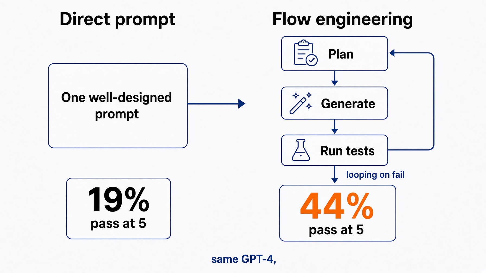
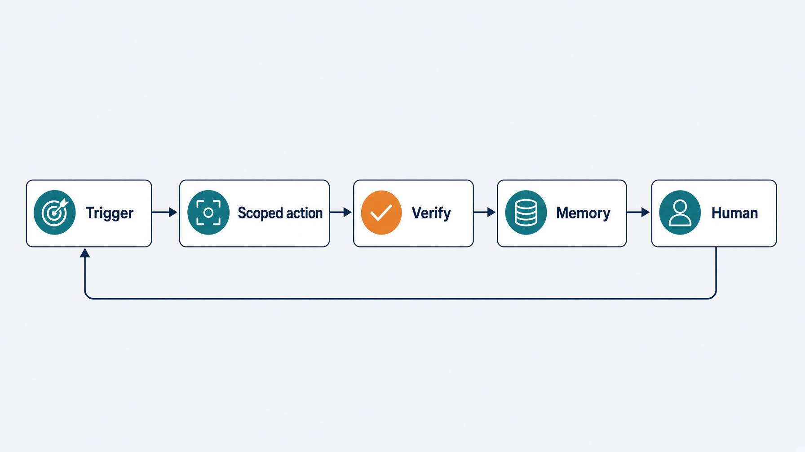
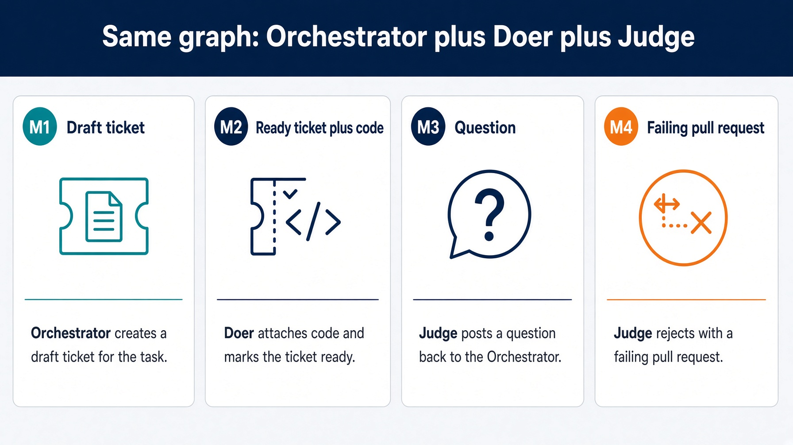
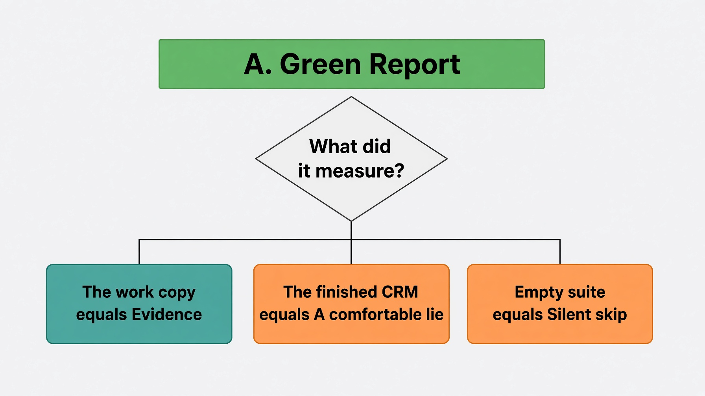

<!-- _class: lead -->

# Speaker notes

## Engineering Reliable Agentic AI Systems

Saturday 29 August 2026. Packt. Four hours.

Projected decks stay sparse. These pages carry the why.

Open 10:00. Close 13:50. Teaching block ends 14:00 Central.

Labs: `lab1_enhancer` · `lab2_implementer` · `lab3_research` · `lab4_fixer`


---

# How to use this packet

Print it or keep it on a second screen. Do not project it.

Each page is one beat. The room sees the matching session deck.

| Box | Meaning |
|---|---|
| **Say** | Words out loud. Do not paraphrase into a prompt lecture. |
| **Why** | The research or the incident that makes the line stick. |
| **Lab** | Folder, file, command, stall, fall-behind. |
| **Ask** | One question. Hands, then move. |

Fall-behind rule, said at 10:10 and again at every lab card: nobody is graded. Watch Rick finish. Save the attempt first. There is no drop-in `harness.py` or `loop.py` for labs 2 to 4. Lab 1 still has `solutions/sol1_enhancer/.claude/`.

Saturday stays Claude Code in the room. Codex, Grok Build, and OpenCode have the same prompt shape. Deep Agents and the Agent SDK are takehome: issues 118, 119, 120.

Do not reteach 20 August. Point back, then type.

---

# Clock. 240 minutes. Do not invent a fifth block.

Teaching block is 10:00 to 14:00 Central. Eventbrite lists 15:00. The extra hour is buffer, not a fifth module.

| Block | Start | Minutes | Folder |
|---|---|---|---|
| Open | 10:00 | 10 | session 1, slides 01 to 08 |
| Module 1 talk + lab + bridge | 10:10 | 45 | `labs/lab1_enhancer` |
| Break | 10:55 | 15 | |
| Module 2. Never cut. | 11:10 | 55 | `labs/lab2_implementer` |
| Break | 12:05 | 15 | |
| Module 3 | 12:20 | 40 | `labs/lab3_research` |
| Break | 13:00 | 15 | |
| Module 4 | 13:15 | 35 | `labs/lab4_fixer` |
| Close | 13:50 | 10 | session 4, last slides |

10 + 45 + 15 + 55 + 15 + 40 + 15 + 35 + 10 = 240.

If a lab runs long, cut talk. Do not cut Module 2. Do not skip the close.

Session 3 title cards that still say 12:35 are stale. Say 12:20. Session 4 title cards that still say 13:45 are stale. Say 13:15.

---

# Four artifacts. Promise exactly these.

| Module | In | Out | They keep |
|---|---|---|---|
| 1 | Vague ticket | Ready contract | A working autonomous loop |
| 2 | Ready ticket | Green rubric | A reusable evaluation harness |
| 3 | Question | Cited brief | A research assistant that cites |
| 4 | Failing branch | Green branch or an explanation | A production architecture |

One graph, four objects. Orchestrator, doer, judge, every hour. Only the object changes.

Work from the lab folder, not the repo root. Each lab has its own `.claude/`.

```bash
cd labs/lab1_enhancer   # then lab2_implementer, lab3_research, lab4_fixer
```

The engine never imports the CRM. That is what makes it point at their repo on Monday.

Takehome is not Saturday:

- Issue 118. Deep Agents implementer.
- Issue 119. Deep Agents research.
- Issue 120. Agent SDK unattended fixer.

---

# What Loop Engineering is

<div class="say">

**Say.** You are here to engineer a loop, not to collect prompts. The unit of work is a controlled loop, not a single generation.

</div>

ReAct is the inner cycle: perceive, reason, act, observe. The product you ship is the outer control system around that cycle. That outer control system is Loop Engineering.

Three workshop words. They are not the same thing.

| Phrase | Means | Do not mix with |
|---|---|---|
| Loop Engineering | Outer control around ReAct. Trigger, scope, verify, state on disk, three exits. | A better prompt |
| Graph Engineering | Intent as `steps.jsonl`. Each criterion maps to a test step and a code step. | "Same graph, four objects" |
| The role graph | Orchestrator, doer, judge. Sessions 1, 3, and 4 reuse this picture. | LangGraph the runtime |
| Harness Engineering | Graders, write scope, receipt, stop. OpenAI, February 2026. Module 2. | The trigger |

Maker and Checker are doctrine, not job titles. Never let the AI verify its own done. On Saturday, maker is the doer and checker is the judge. Keep both vocabularies.

---

# Open. 10:00. Ten minutes.

Say the time out loud. 10:00 Central, 11:00 Eastern.

You are here to engineer a loop, not to collect prompts.

<div class="ask">

**Ask.** Who has a prompt that worked brilliantly once and never again?

Hands go up. Thank them. Move. Do not collect stories.

</div>

<div class="say">

**Say.** A loop is a state machine. Trigger. Action inside a scope. Observation. A decision the model does not get to make for itself.

Read the last sentence twice. The model does not enforce its own transition, and that is the whole workshop.

</div>

Four collapses a prompt-only agent hits under volume: false completeness, runaway iteration, context rot, stagnation. Each one is a missing check, not a model failure.

Point at the two-repo picture. `task setup` clones the CRM. They do not build it.

**Clock.** Slide s1-14 at 10 minutes. Then Module 1.

---

# AlphaCodium. One number they can quote.



<div class="say">

**Say.** 19 percent to 44 percent pass@5. Same model. Different flow.

Do not oversell replication. This is flow, not magic.

</div>

<div class="why">

**Why.** Ridnik, Kredo, Friedman. Code Generation with AlphaCodium: From Prompt Engineering to Flow Engineering. arXiv:2401.08500. 2024.

The paper's move is the workshop's move. Tests first. Iterate against a check the model does not own. A single prompt is the 19. A flow with generate, run, repair is the 44.

</div>

Use this when someone asks "does any of this actually move the number." One slide. Then the five-part loop.

---

# Five parts. Point at Verify.



Trigger. Action inside a scope. Verify. Memory outside the chat. Human oversight.

<div class="say">

**Say.** An agent can argue past an instruction, and cannot argue past a tool it was never given.

The judge reports. It does not fix.

Today LGTM. In Module 2 a pull request. Never merge.

</div>

Three exits. `pass`, `retry`, `escalate`. The forgotten exit is stable failure: the same gaps twice, and the loop stops rather than spend the budget.

<div class="why">

**Why.** Liu et al. Lost in the Middle. arXiv:2307.03172. More than 30 percent accuracy drop when the fact sits in the middle of a long context.

Big output goes to a file. A short summary comes back. That is why the researcher is a subagent in Module 3, and why `summarize_failure` exists in Module 4.

</div>

---

# Four objects. The map for the whole day.



Spend the full two minutes. They will see this graph four times.

| Hour | Object | Trigger |
|---|---|---|
| M1 | Ticket | A draft on disk |
| M2 | Ready ticket | Spec that can fail a test |
| M3 | Question | One search tool |
| M4 | Failing pull request | `workflow_dispatch`, cron, or a red suite |

Same orchestrator. Same doer. Same judge. Swap the object.

This picture is the role graph. Graph Engineering is the Module 2 plan file, not this picture, and not LangGraph.

<div class="say">

**Say.** Merge, money, and production deploy stay human. Missing tool, not a polite request.

</div>

**Clock.** You should be near the lab card. Slide s1-35 at 25 minutes of Module 1. Slide s1-39 at 50 minutes of the open-plus-module block.

---

# Lab 1. Ticket enhancer. `labs/lab1_enhancer`

25 minutes of typing inside the 45. Artifact: a Claude Code plugin that grooms draft tickets.

<div class="lab">

**Lab.** Work from this folder.

```bash
cd labs/lab1_enhancer
cp config.json.example config.json   # their GitHub username
task clone
```

Four prompts, pasted one at a time into interactive `claude`: judge, doer, field check, orchestrator skill. A fifth prompt diffs against the answer.

```bash
task create-test-tickets && task run --
task poll-forever --    # Ctrl-C when done. Stand-in for a scheduler.
```

`task poll-forever` never stops on its own. That is by design.

</div>

Walk the room. Do not reteach the architecture. Point at the trace.

<div class="say">

**Say.** The interesting run is the one that stops.

If they only remember one line from the lab, this is it.

</div>

Fall-behind: copy `solutions/sol1_enhancer/.claude/` into their tree. This is the only lab with a drop-in.

---

# Break. 10:55. Fifteen minutes.

Module 2 is the one that does not get cut.

Say that before they stand up. If Open plus Module 1 ran long, the 15 minute break still happens. Steal from talk later, not from this break, and not from Module 2.

What they should have in the tree when they come back:

- A fork of the CRM under `work/`
- A plugin that can poll a draft ticket
- A trace that shows `pass`, `retry`, or `escalate`

What they do not need yet: a harness, a receipt, MCP, unattended state.

<div class="say">

**Say, as they sit down at 11:10.** This is the hour that makes the other three worth having. 55 minutes. Never cut.

</div>

---

# Module 2. 11:10. The loop you just built will lie to you.

Three ways it lies. Edit forever. Declare victory on red. Stuff the window.

A harness stops that, not a better prompt.



<div class="say">

**Say.** A true story from this repo. Seven tests, green on every run, testing the wrong tree.

The conftest put the finished answer on `sys.path` ahead of the work copy. The fail-then-pass demo had never once worked, and nothing reported an error.

A check that reports success while measuring the wrong thing is worse than no check.

</div>

That bug class is the whole hour. Callback when you hit the receipt.

Maker means doer. Checker means judge. Say the mapping once on s2-08. Then drop the old words.

---

# Two doers. Red gate. Ten-row rubric.

The code implementer cannot weaken a test, not because it was told not to, but because it holds no write path to one.

`test_implementer` writes `tests/**`. `code_implementer` writes `app/**` and is denied `tests/**`. Judge writes nothing. Orchestrator writes nothing. Planner writes `steps.jsonl`.

A rule in a prompt is a suggestion an agent can reason around. A missing method is not.

<div class="say">

**Say.** A test that passes before any code exists proves nothing, and it is the most comfortable kind of nothing because it is green.

If an acceptance criterion cannot fail a test, it is a wish.

"The tests passed" is one row of ten.

</div>

Python holds the loop, so the model never counts its own retries. `create_deep_agent` does not count retries. Do not demo Deep Agents live unless the room is ahead. Takehome is issue 118.

**Clock.** s2-18 at 15 minutes. s2-32 at 25 minutes. s2-43 at 50 minutes.

---

# Lab 2. Fill `harness.py`. `labs/lab2_implementer`

25 minutes. Leave the lab slide up. Call time at 15 and at 5 remaining.

<div class="lab">

**Lab.**

```bash
cd labs/lab2_implementer
# pick one tool, paste its prompt
claude -p "$(cat prompts/claude-code.md)"
```

Three functions. Nothing else. `red_gate`, `score_attempt`, `run_loop`.

Saturday fills `harness.py`. `task loop:implementer` is gone with `loops/`. Demo the eight-step loop from the Deep Agents port:

```bash
cd ../../solutions/sol2_implementer_deep_agents
python3 harness.py --repo ../../work/northwind-field-crm --ticket T001 --doer reference
python3 harness.py --repo ../../work/northwind-field-crm --ticket T001 --doer none
```

`--doer none` is the red gate doing its job. Tell them that before they run it. If this run were green, the harness would be lying.

</div>

Common stall is `score_attempt`. People try to compute rows. The answer is one line: `return rubric.score(contract=contract, **evidence)`. Absent kwargs become failing rows on purpose.

Do not edit a `loops/` package. There is none. Fill only `harness.py`.

Fall-behind: there is no drop-in `harness.py`. Watch Rick finish. Save the attempt first. See `labs/lab2_implementer/FALL-BEHIND.md`.

They will hit the push gate. Read the refusal out loud. It is the lesson.

---

# The receipt. Three claims or nothing.

Green. This tree. Newer than the last edit. All three, or it proves nothing.

Python writes it. The model does not. `.harness/receipt.json`. `scripts/receipt.py`.

<div class="say">

**Say.** A zero exit code with no test report is the silent-skip bug wearing a green shirt.

Callback to the conftest story.

</div>

`tree_hash` is content, not `git status`. Staged, unstaged, and untracked all count.

Defense at two layers. In-process scope catches the loop's own doer. The agent is a subprocess, so it walks straight past that one. `write_scope` reads the diff and catches it.

`gates.decide`: `signature` is what failed, not how it was worded. Two equal signatures mean the last attempt changed nothing.

<div class="why">

**Why, your own data.** 41 articles. The deterministic detector separates good from bad at a threshold of 70. The model quality judge saturates near 0.97 and flags 41 of 41. A judge that approves everything is not a judge.

</div>

Break at 12:05. Fifteen minutes. Next module points the same graph at a question.

---

# Module 3. 12:20. Same graph, new object.

Say 12:20 Central, not 12:35.

This hour is not a tour of nine frameworks. Artifact: one working research assistant that cites what it retrieved.

Talk is 10 minutes. Lab is 25. Retries and budgets are 5.


<div class="say">

**Say.** Point back at Module 1's three boxes. Nothing about them changes.

The only new thing is a tool that reaches outside the machine. That is why this module is 40 minutes.

Researcher: search tools only. Isolated context. Writer: `briefs/` only. Judge: `check_brief` in Python. Citations are arithmetic.

LangChain Deep Agents ships this as the default example. Saturday lab stays two functions in `loop.py`. Takehome is issue 119.

</div>

Raw search never returns to the orchestrator. A summary does. Lost in the Middle, again.

---

# MCP. Least privilege. Tool output is untrusted.

Expand Model Context Protocol once, then say MCP.

`context7` needs no key. Perplexity is optional. Fixture when the room has no wifi. `.mcp.json` ships with the repo. Approve `context7` at minimum. Do not tour servers.

Allowed: search, and write into this loop's own output folder. Denied: merge, deploy, ticket state, anything in production.

Narrow schema. `add_review_comment(issue_id, body)` is a tool. An HTTP client holding your credentials is a liability.

<div class="why">

**Why. ToolPrivBench.** Yang et al. 2026. arXiv:2606.20023. Agents reach for the bigger tool. Prompt-based controls gave only limited mitigation. Transient failures made escalation more likely, not less.

You do not fix this with a stronger sentence. You fix it by not shipping the sledgehammer.

**Why. AgentDojo.** Tool output is untrusted input. Your search results are a document the internet wrote, not a system prompt.

Authorization lives at the tool boundary, not in a sentence in the system prompt. A prompt is not a control. A pinned manifest is.

</div>

Three backends: Perplexity, WebSearch, fixture. The loop calls one function and never learns which backend answered. Saturday path is `--backend fixture`.

**Clock.** s3-18 at 10 minutes.

---

# Lab 3. Fill `loop.py`. `labs/lab3_research`

25 minutes. Two functions: `plan_questions` and `check_brief`. The backend does not appear in `loop.py`. That is the point of a tool boundary.

<div class="lab">

**Lab.**

```bash
cd labs/lab3_research
claude -p "$(cat prompts/claude-code.md)"
```

`task loop:research` is gone with `loops/`. Saturday fills `loop.py`. Demo after class:

```bash
cd ../../solutions/sol3_research_deep_agents
python3 loop.py --question "sqlalchemy nullable datetime column" --backend fixture
```

The question is boring on purpose. It matches the fixture.

`plan_questions` is a template. Three sub-questions you can tell were answered or not. The common stall is over-designing this function. Three strings is enough.

`check_brief` is arithmetic. People reach for a model. The filled answer is `return brief.check(body, sources)`.

</div>

Four rows: `has_sources`, `grounded`, `cited`, `style`. No model call. A confident sentence nobody can trace is the failure that matters.

House style forbids em dashes. A model will argue. Python will not. `strip_em_dashes` in the lab's `brief.py`.

Fall-behind: watch Rick finish. See `labs/lab3_research/FALL-BEHIND.md`. Copy the answer. They continue Module 4 with a working artifact.

Call time at 15 and at 5 remaining. **Clock.** s3-32 at 35 minutes.

---

# Budgets. A research loop has no green bar.

Last five minutes of Module 3. A code loop stops when the tests go green. A research loop has no equivalent, because the search space has no end.

"Keep searching until confident" is not a stop condition.

<div class="say">

**Say.** Soft target warns. Hard cap raises. A budget that only warns is a budget that gets ignored at three in the morning.

`BudgetExceeded` is a `RuntimeError`. Live loop: `max_usd=0.20`, `max_calls=8`, `soft_usd=0.10`. Perplexity costs 0.006 per call. Fixture costs nothing, which is why Saturday still teaches the cap.

The ninth search does not run. That is the point.

</div>

Four stops: call budget 8, dollar budget, stable failure, no-source escalates. The last one is the honest one. It never ships an uncited brief.

<div class="why">

**Why. MAST modes, used here as cost.** 15.7 percent one step repeated. 12.4 percent not knowing it was already done. Cemri et al. arXiv:2503.13657.

A retry usually replays the whole context, so a 20 percent per-step failure rate can roughly double the bill, not add a fifth to it.

Cost is an architecture problem, not a pricing problem. Do not shop for a cheaper model first.

</div>

Break at 13:00. Fifteen minutes. Next: nobody at the keyboard.

---

# Module 4. 13:15. What changes when you walk away.

Say 13:15 Central, not 13:45. Energy is lowest. Keep moving.

Build 12. Type 18. Land 5. Close 10.

The graph is not what changes. Trigger, durable state, exit codes, and observability are.

<div class="say">

**Say.** If you cannot read the last score, you cannot debug at 2 a.m.

</div>

`.harness/state.json` survives the process. A chat transcript does not. Five fields: runs, last_gate, last_reason, last_run_at, loop.

Exit codes CI can read. 0 pass. 2 escalate. 1 crash. Escalate is not a crash, it is a decision.

```
return {gates.PASS: 0, gates.ESCALATE: 2}.get(state["last_gate"], 1)
```

Unattended means `query()`, not `ClaudeSDKClient`. Nobody is chatting. Saturday lab stays two functions in `loop.py`. Agent SDK port is takehome, issue 120.

`permission_mode: acceptEdits` because nobody is there to click Allow. PreToolUse deny `tests/**`. Merge is never a tool.

**Clock.** s4-18 at 12 minutes. Then the lab.

---

# MAST. Most agent failures are not model failures.

1,642 traces. 7 frameworks. 14 modes clustered into 3 categories.

| Category | Share | This workshop |
|---|---|---|
| System design issues | 41.8% | Graph, scope, budget, trigger, state |
| Inter-agent misalignment | 36.9% | Handoff. Orchestrator sees summaries, not dumps |
| Task verification | 21.3% | Judge, pytest, receipt |

Cemri et al. arXiv:2503.13657. NeurIPS 2025. Use these three category names. Do not invent other percentages.

<div class="say">

**Say.** Every one of those three is something you build, not something you buy. That justifies the whole day retroactively.

</div>

This hour is all three, with nobody watching.

A trace that only appears when the run succeeds is the trace you cannot use, because the run you need to read is the one that failed. `solutions/observability.py` always writes the local file, even on an exception. Langfuse is optional. A missing key must never change what the loop does.

Local and remote gates agree. Same receipt rule in the hook and in the workflow, or the remote one is theater.

---

# Lab 4. Broken PR fixer. `labs/lab4_fixer`

18 minutes, not 25. Call time at 10 and at 5 remaining.

Two functions: `summarize_failure` and `repair_until_green`.

<div class="say">

**Say.** Giving up is allowed. Giving up silently is the bug.

Stash Module 2 first, out loud, before anyone types. `git checkout broken-pr` refuses rather than deleting their work. That refusal is on brand, but it costs 30 seconds if you let them find it.

</div>

<div class="lab">

**Lab.**

```bash
cd labs/lab4_fixer
git -C ../../work/northwind-field-crm stash --include-untracked
claude -p "$(cat prompts/claude-code.md)"
```

`task loop:fixer` is gone with `loops/`. Saturday fills `loop.py`. Demo the live fixer:

```bash
cd ../../solutions/sol4_fixer_agent_sdk
python3 loop.py --repo ../../work/northwind-field-crm --branch broken-pr --doer reference
```

`--branch broken-pr` is what makes this real. Point it at a green branch and it reports a pass and proves nothing. Same shape as the red gate.

</div>

`summarize_failure` names the failing tests and the first real error line. Sending the whole log puts the failure in the middle. Lost in the Middle, third time.

Four stop paths: suite green, suite never ran, same ids twice, budget spent. A suite that never ran is not a suite that failed.

Fall-behind: no drop-in `loop.py`. Watch Rick. `labs/lab4_fixer/FALL-BEHIND.md`.

---

# Why the receipt exists. Then close.

A model that may both act and verify can produce plausible false evidence. Invented test passes. File edits that never happened. Fabricated API responses.

That is a wrong judgment about the state of its own output, and a self-check cannot catch it by construction.

Python writes the receipt. Green, this tree, newer than the last edit.

**Clock.** s4-32 at 30 minutes. Then five minutes of naming, not building.

Swap the object. Keep the graph. Daily triage, pull request babysitter, CI sweeper, ticket groomer, ready-ticket implementer, research brief, nightly eval. Name them. Do not build them. Extra credit is `labs/extra-credit/`. Not on the Saturday clock.

The slow failure: passes every demo, earns trust, degrades over months. A 2 percent weekly drop is invisible in a week and catastrophic over a quarter. Weekly evaluation, not quarterly.

# Close. 13:50. Ten minutes.

Four artifacts, check them off out loud. All four run from a clean clone with one `task setup`.

---

# Monday. Five steps. The order is the advice.

1. One backlog object. Not five.
2. One ticket whose criteria a test can fail.
3. `Taskfile.yml` that emits `junit.xml`.
4. Split the doer before you add a single tool.
5. Arm the push gate on day one, while the loop is still small.

Step 5 is the one people skip.

<div class="ask">

**Ask, if the room is quiet.** Which object will you point this at on Monday?

Do not start building a seventh loop.

</div>

Takehome, after class, not now:

| Issue | Port | Note |
|---|---|---|
| 118 | Deep Agents implementer | Python still owns the gate |
| 119 | Deep Agents research | LangChain's own quickstart is a research agent |
| 120 | Agent SDK fixer | `query()`. Merge is never a tool. Needs a model key |

The five-hour labs need no model key. Issue 120 does.

---

# Fall-behind cheat sheet

Nobody is graded. Save the attempt first.

| Lab | Folder | File they fill | Rescue |
|---|---|---|---|
| 1 | `labs/lab1_enhancer` | `.claude/` plugin | Copy `solutions/sol1_enhancer/.claude/` |
| 2 | `labs/lab2_implementer` | `harness.py` | Watch Rick. No drop-in. `FALL-BEHIND.md` |
| 3 | `labs/lab3_research` | `loop.py` | Watch Rick. `FALL-BEHIND.md` |
| 4 | `labs/lab4_fixer` | `loop.py` | Stash first. Watch Rick. `FALL-BEHIND.md` |

Work from the lab folder.

```bash
cd labs/labN_...
claude -p "$(cat prompts/claude-code.md)"
```

Do not edit `loops/` during a lab.

If Open plus Module 1 is late, steal from later talk. Never from Module 2. Never from the close.

Done branches and every `solutions/sol<n>_*` folder are green. Copy from one any time after class.

---

# Six lines to keep. Then stop.

1. A loop is a state machine. The model does not enforce its own transition.
2. Scope is a missing method, not a sentence in a prompt.
3. Three exits. `pass`, `retry`, `escalate`. Stable failure is the honest one.
4. "The tests passed" is one row of ten.
5. Tool output is untrusted input. Authorization lives at the boundary.
6. Green, this tree, newer than the last edit. Or the receipt proves nothing.

Plus the line from Module 4: if you cannot read the last score, you cannot debug at 2 a.m.

<div class="say">

**Say once. Do not undercut it with a joke.**

The loop is the product. The prompt is not.

</div>

---

# Bibliography. Skip in the room unless asked.

Ridnik, Kredo, Friedman. Code Generation with AlphaCodium: From Prompt Engineering to Flow Engineering. arXiv:2401.08500. 2024. 19% to 44% pass@5, same model, different flow.

Liu, et al. Lost in the Middle: How Language Models Use Long Contexts. arXiv:2307.03172. 2023. More than 30% accuracy drop when the fact sits in the middle.

Cemri, et al. Why Do Multi-Agent LLM Systems Fail? MAST. arXiv:2503.13657. NeurIPS 2025. 1,642 traces. 41.8% system design, 36.9% inter-agent, 21.3% verification. Modes: 15.7% step repetition, 12.4% unaware-of-done.

Yang, et al. ToolPrivBench. arXiv:2606.20023. 2026. OpenReview AXH6buTOVx. Agents reach for the bigger tool. Prompt-based controls: limited mitigation.

AgentDojo. Tool output as an injection surface. Authorization at the boundary, not in the prompt.

Debenedetti, et al. CaMeL. Capability-based isolation for tool use. Name it if someone asks how to go further than a deny list.

House rule for this packet and for Saturday briefs: no em dashes. Python strips them. A model will argue. The linter will not.
