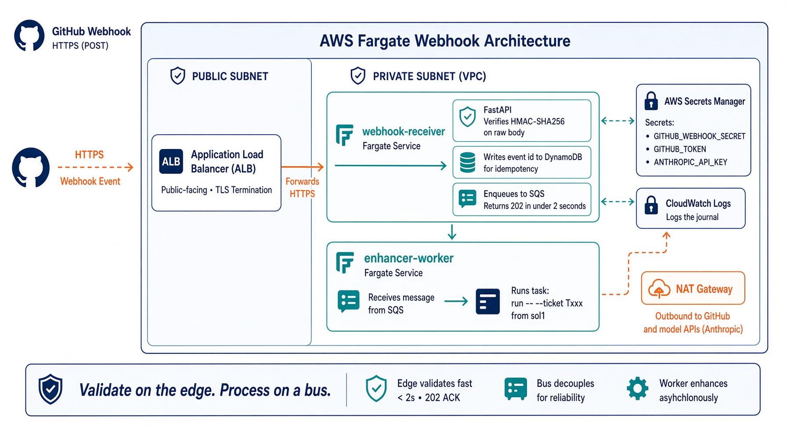

# Deploy on AWS Fargate

<!-- _class: lead -->

Production pattern. **Not a shipped lab.** There is no `ext_fargate` folder.

Reuses extra credit 1: verify HMAC, reply 202, then run `sol1_enhancer`.

The new knob is a queue. GitHub's 10-second budget cannot wait for Claude.


---

# What you will build (architecture, not a drop-in)

| Piece | Job |
|---|---|
| ALB | public HTTPS, GitHub only |
| Fargate service `webhook-receiver` | verify, dedup, enqueue, 202 |
| SQS | at-least-once buffer |
| Fargate service `enhancer-worker` | `task run -- --ticket Txxx` |
| Secrets Manager | webhook secret, `GITHUB_TOKEN`, model keys |
| DynamoDB | delivery-id idempotency |
| CloudWatch | journal you can read at 2 a.m. |

Same exits as Lab 1. The trigger moved again.


---

# Why Fargate, not Lambda

A poll can run 15 minutes (`AGENT_TIMEOUT=900`). Lambda's practical ceiling is a poor fit once the model is in the loop.

Fargate task CPU and memory are sized for the **worker**, not the receiver. The receiver should be tiny. The worker should be the size of Claude plus git.

GitHub webhooks: return 2xx fast. Process on a bus. (2026 webhook practice.)


---

# Learning objectives

- Split receive from work
- Verify HMAC on the raw ALB body
- Persist `X-GitHub-Delivery` before enqueue
- Keep the receiver on a private subnet behind ALB
- Inject secrets. Never bake tokens in the image
- Map this pattern back to `s_ext_1_webhook.webhook.py`


---

# Starting architecture




---

# Same rule as extra credit


On Fargate the teal box becomes "verify + SQS". The navy `task run` box becomes the worker service.


---

# Assumption. Say it out loud.

This deck is a production mapping of extra credit 1. The repo does **not** ship Terraform.

If you implement it, keep:

- `verify_signature` byte-for-byte from `webhook.py`
- `202` before work
- marker skip
- `AGENT_MAX_ATTEMPTS`
- subprocess, not import
- no merge tool


---

# Network. Private tasks. Public ALB.

```
Internet
   │
   ▼
ALB  (public subnets, TLS cert from ACM)
   │  target group: webhook-receiver:8000
   ▼
Fargate webhook-receiver   (private subnets)
   │  SendMessage
   ▼
SQS  enhancer-jobs
   │
   ▼
Fargate enhancer-worker    (private subnets, NAT for gh + Anthropic)
```

Assign public IPs only if you skip NAT. Do not. The worker holds a token.


---

# Receiver. Keep extra credit 1's contract.

```python
body = await request.body()
verify_signature(body, x_hub_signature_256)   # 401 / 503
if already_seen(x_github_delivery):           # DynamoDB Put with cond
    return JSONResponse({"status": "duplicate"}, 200)
sqs.send_message(QueueUrl=..., MessageBody=body.decode(),
                 MessageAttributes={"event": x_github_event})
return JSONResponse({"status": "accepted"}, 202)
```

Target p95 under 2 seconds. Alert if it creeps toward GitHub's 10-second budget.


---

# Idempotency. Delivery id is the key.

GitHub retries. SQS is at-least-once. Two belts:

1. DynamoDB item `delivery_id` with a condition `attribute_not_exists`
2. Worker lock per ticket (the extra-credit `LOCK_DIR` idea, now a DynamoDB lock or SQS message group id)

FIFO SQS with `MessageGroupId = issue_number` serializes one ticket. Standard SQS plus a lock is the other shape. Pick one.


---

# Worker. Same subprocess as the Droplet.

```python
# enhancer-worker: long-running consumer
ticket = ticket_id_from_issue(payload)
run_sol1(ticket)   # call_sol1.py, AGENT_BACKEND, timeout 900
```

Image contains `task`, the lab checkout, and the chosen backend CLI. Task definition `ulimits` and ephemeral storage must fit a git clone of the CRM.

Scale the worker on SQS depth, not on ALB request count.


---

# Secrets. Three, maybe four.

| Secret | Who reads it |
|---|---|
| `GITHUB_WEBHOOK_SECRET` | receiver only |
| `GITHUB_TOKEN` | worker (labels, comments, issue body) |
| `ANTHROPIC_API_KEY` | worker, when backend is claude / agent-sdk / deep-agents |
| `OPENAI_API_KEY` / `XAI_API_KEY` | worker, matching `AGENT_BACKEND` |

Task definition: `secrets` from Secrets Manager. Rotate the webhook secret on a 90-day calendar. Accept both during the window.


---

# IAM. Two roles, not one.

Receiver task role: `sqs:SendMessage`, `dynamodb:PutItem`, `secretsmanager:GetSecretValue` for the webhook secret only.

Worker task role: `sqs:ReceiveMessage/DeleteMessage`, `dynamodb:Get/Put` for locks, `secretsmanager` for token and model keys. No `sqs:SendMessage` on this queue.

Execution role: pull from ECR, write CloudWatch. That is not the task role.


---

# Health, timeouts, drain

ALB health check: `GET /health` on the receiver. Same payload as extra credit 1.

Receiver `stopTimeout` short. Worker `stopTimeout` long enough to finish one poll or nack the SQS message.

`proxy_read_timeout` on the Droplet was 120s. Here the ALB idle timeout can stay at 60s because work is not on that socket.


---

# Backend choices on Fargate

| Backend | On Fargate? |
|---|---|
| `agent-sdk` / `deep-agents` | best fit. Python in the image, key in Secrets Manager |
| `claude` CLI | works if you install it at build. Headless `-p` |
| `opencode` | works if the image has it |
| `codex` | possible. Watch the sandbox flags from `bin/role.sh` |
| `grok` | poor fit. Trust prompt, local shims. Keep on a Droplet |


---

# Observability. The 2 a.m. test.

Ship `last-webhook.json` fields to CloudWatch as structured logs: delivery, issue, ticket, backend, returncode.

Alarm on:

- receiver 4xx rate (bad signatures)
- receiver p95 latency
- SQS age of oldest message
- worker non-zero returncode
- `gave-up` comments

If you cannot read the last score, you cannot debug unattended.


---

# Security extras GitHub already gives you

Allow the ALB security group from GitHub webhook IP ranges, or put a WAF with a GitHub Hookshot user-agent plus HMAC (HMAC is the real gate). IP allowlists drift. HMAC does not.

Reject bodies over 1 MB, same as the nginx `client_max_body_size`.

Never log the raw secret or the `Authorization` header.


---

# Walkthrough. Twelve steps.

1. ECR repo, image from extra credit 1 plus `call_sol1.py`
2. VPC: 2 public, 2 private, NAT
3. ACM cert on the hostname GitHub will call
4. ALB + target group + HTTPS listener
5. SQS queue (FIFO if you want per-issue serialization)
6. DynamoDB table `deliveries` (pk: delivery_id)
7. Secrets Manager entries
8. Receiver service, desired count 2
9. Worker service, desired count 1, scale on queue depth
10. Point the CRM fork webhook at `https://agents.example.com/github-webhook`
11. Open `[T900] ...`. Watch 202, then a worker log, then a marked comment
12. Comment `LGTM` on a green rubric. Next message should set `ready`


---

# Troubleshooting

| Symptom | Cause | Fix |
|---|---|---|
| GitHub delivery timeout | work on the request thread | enqueue, then 202 |
| 401 from ALB | body decoded then re-encoded | HMAC the raw bytes ALB gave you |
| Duplicate polls | no delivery-id table | DynamoDB condition put |
| Worker cannot `gh` | no NAT, or token missing | private subnet plus NAT. Secret on the worker |
| Scale to zero, cold 15s | receiver scaled to 0 | keep desired count >= 1, or accept the miss |


---

# Recap

**What changed.** The doorbell is an ALB. The waiting room is SQS. The loop is still `sol1_*`.

**What did not change.** HMAC. 202. Marker. Three exits. No merge.

**Takeaways**

1. Validate on the edge. Process on a bus.
2. Size the worker for the model, the receiver for HMAC.
3. Two IAM roles.
4. Grok still belongs on a Droplet.
5. If you cannot read the last score, you cannot debug at 2 a.m.

Closing line. Fargate is a bigger doorbell. It is still not the loop.
