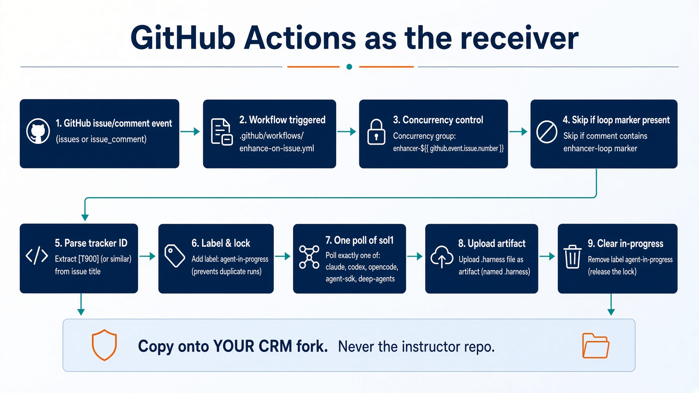
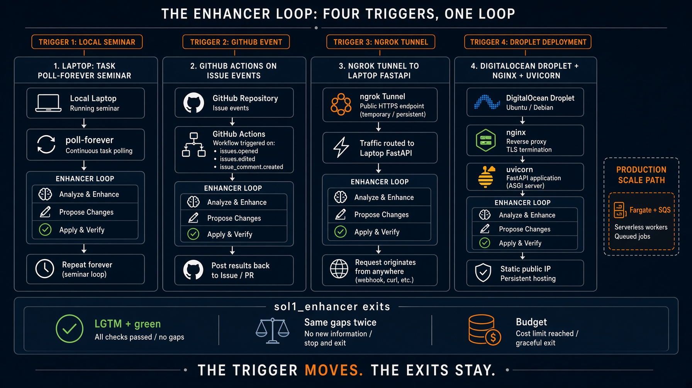

# Deploy on GitHub Actions

<!-- _class: lead -->

Ticket change events. One poll. Then exit.

Copy-me workflow: `labs/lab1_enhancer/workflows/enhance-on-issue.yml`

Notes: `labs/lab1_enhancer/GITHUB-ACTIONS.md`

Not Saturday. Copy onto **your CRM fork**. Never the instructor repo.


---

# What you will deploy

A workflow that GitHub already knows how to start.

```
on:
  issues:
    types: [opened, edited, labeled]
  issue_comment:
    types: [created]
  workflow_dispatch:
```

That is "the ticket changed": a new issue, an edited body, a label, or a human comment. `LGTM` arrives as `issue_comment`.


---

# Why Actions instead of polling

`task poll-forever` dies when the laptop sleeps.

GitHub already emitted the event. Hosting a receiver is optional.

The trigger starts one poll. The enhancer exits. The workflow does not grade the ticket, merge, or deploy.


---

# Learning objectives

- Copy the YAML onto the CRM fork
- Parse `[T900]` from the issue title
- Skip `<!-- enhancer-loop -->`
- Serialize with `concurrency.group` per issue
- Swap `ENHANCER_BACKEND` without rewriting jobs
- Know which backends do **not** belong on hosted runners


---

# Starting architecture




---

# Four triggers. Same exits.



Actions is column two. The loop is still `sol1_*`.


---

# Copy onto YOUR fork

```bash
mkdir -p .github/workflows
cp path/to/reliable-agentic-lab/labs/lab1_enhancer/workflows/enhance-on-issue.yml \
  .github/workflows/enhance-on-issue.yml
```

Do not enable this on the shared instructor repo. It comments on issues and can spend model tokens.


---

# Permissions. Least you need.

```yaml
permissions:
  issues: write
  contents: read
  actions: read
```

Grant `contents: write` only if a later job will push. The enhancer edits issue bodies and labels, not app code.

A workflow that merges has left the lab.


---

# Concurrency per issue

```yaml
concurrency:
  group: enhancer-${{ github.event.issue.number || github.event.inputs.ticket }}
  cancel-in-progress: false
```

Two events on the same ticket must not chew it twice. Do not cancel in progress. A mid-poll kill leaves labels and a half-written candidate.


---

# Skip the loop's own comments

```yaml
if: >
  github.event_name == 'workflow_dispatch' ||
  github.event_name == 'issues' ||
  (github.event_name == 'issue_comment' &&
   !contains(github.event.comment.body, '<!-- enhancer-loop -->'))
```

Filter on the marker, never the author. The job runs as `github-actions[bot]`. A human `LGTM` must still count.


---

# Ticket id from the title

```bash
id="$(printf '%s
' "$TITLE" | grep -oE '\[T[0-9]+\]' | head -1 | tr -d '[]')"
if [ -z "$id" ]; then
  id="T${NUMBER}"
fi
```

Seed titles look like `[T900] Search crashes on an empty query`. If the title has no id, `T{issue_number}` matches HOW_TO_RUN for issues opened in the UI.


---

# Backend matrix

| `ENHANCER_BACKEND` | Folder | How the job starts it |
|---|---|---|
| `claude` (default) | `sol1_enhancer` | `task run -- --ticket "$TICKET"` |
| `codex` | `sol1_enhancer_codex` | same |
| `opencode` | `sol1_enhancer_opencode` | same |
| `agent-sdk` | `sol1_enhancer_agent_sdk` | `python3 loop.py --once ...` |
| `deep-agents` | `sol1_enhancer_deep_agents` | `python3 loop.py --once ...` |

Set repository variable `ENHANCER_BACKEND`. Secret `ANTHROPIC_API_KEY` for SDK and Deep Agents.


---

# What does not belong on hosted runners

**Grok Build.** Trust prompt. Local plugin shims. `task trust` is a laptop step.

Keep Grok on a Droplet (`ext_5`) or a laptop (`ext_2`).

Codex needs `codex` on the runner. If the image does not have it, use Agent SDK or Claude Code.


---

# In-progress and the second belt

```bash
gh issue edit "$NUMBER" --add-label agent-in-progress
# ... one poll ...
gh issue edit "$NUMBER" --remove-label agent-in-progress   # if: always()
```

Stop at `AGENT_MAX_ATTEMPTS` (default 3) by counting `agent-attempts-*` labels. The loop already has a round budget. This is a second belt, at the trigger.


---

# Two checkouts

```yaml
- uses: actions/checkout@v4          # the CRM fork, $GITHUB_WORKSPACE
- uses: actions/checkout@v4
  with:
    repository: ${{ vars.ENHANCER_REPO || github.repository }}
    path: .enhancer
```

`--repo "$GITHUB_WORKSPACE"` points the enhancer at the CRM files. The enhancer code lives in `.enhancer`.


---

# Run one poll

```bash
case "$ENHANCER_BACKEND" in
  claude)    cd solutions/sol1_enhancer && task run -- --ticket "$TICKET" --repo "$TARGET" ;;
  agent-sdk) cd solutions/sol1_enhancer_agent_sdk && python3 loop.py --once --repo "$TARGET" --ticket "$TICKET" ;;
  deep-agents) cd solutions/sol1_enhancer_deep_agents && python3 loop.py --once --repo "$TARGET" --ticket "$TICKET" ;;
esac
```

Upload `.harness/last-enhancer-*.json` as an artifact. That is how you read the last score at 2 a.m.


---

# What does not change

Three exits, no fourth: `LGTM` plus a green rubric, same gaps twice, budget spent.

Labels `enhanced`, `ready`, `needs-human`. Judge still has no write tool. `check_fields.py` still computes ready.


---

# Verify

1. Push the workflow to **your** fork
2. Open `[T900] Search crashes on an empty query`
3. Actions tab shows `enhance`. Issue gets `enhanced` or a marked comment
4. Comment `LGTM` as yourself. Next event sets `ready` only if the rubric is already green
5. A second event with no new human comment must be a no-op. If it posts again, the marker filter is missing


---

# Troubleshooting

| Symptom | Cause | Fix |
|---|---|---|
| Never fires | workflow on the instructor repo | copy YAML to your fork |
| Loops | marker filter missing | skip `<!-- enhancer-loop -->` |
| 404 on issues | token cannot write issues | `issues: write`, or a PAT for a private CRM |
| Grok skill not found | hosted runner | use `claude` / `agent-sdk` / `deep-agents` |
| No artifact | harness path wrong | upload `**/.harness/last-enhancer-*.json` |


---

# When Actions is the wrong tool

Laptop demo: extra credit 2, ngrok.

Permanent cheap box: extra credit 5, Droplet.

Long-running model calls, private VPC, or you already live on AWS: Fargate. Next deck.

If you stall, return to `task run --` from `labs/lab1_enhancer`. That is the Saturday path.


---

# Recap

**Takeaways**

1. Copy onto the CRM fork.
2. Trigger starts. Loop stops.
3. Marker, not author.
4. Concurrency per issue. Never cancel mid-poll.
5. Grok stays off hosted runners.

Closing line. The workflow is a doorbell. It is not the loop.
