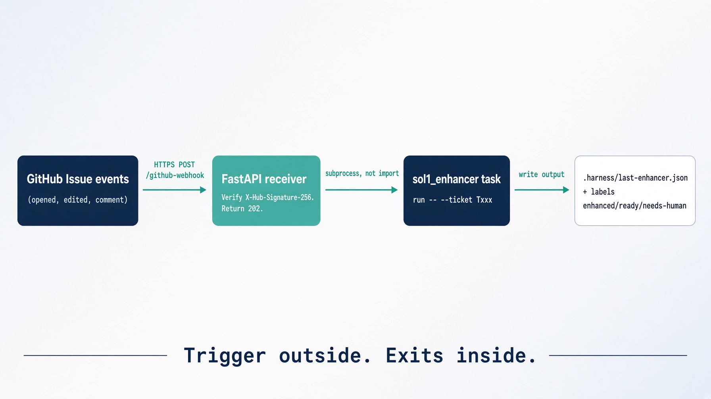

# Extra credit 1. The webhook receiver

<!-- _class: lead -->

Not Saturday. Do not skip Module 2 for this.

New trigger. Same exits. Same harness. The graph does not change.

One FastAPI server GitHub can POST to. Extra credit 2 and 5 both need it.

Filled answer: `solutions/extra_credit/s_ext_1_webhook/`


---

# What you will build

A receiver that **starts** one poll. It does not grade the ticket.

| Route | Job |
|---|---|
| `GET /health` | backend name and sol1 path |
| `POST /github-webhook` | verify HMAC, reply 202, spawn `task run` |

It shells out to `solutions/sol1_enhancer`. It does **not** import it.

Stub: `labs/extra-credit/ext_1_webhook/webhook_server.py`


---

# Why this exists

`task poll-forever` is a seminar lie. Close the laptop and polling stops.

Production is an event. GitHub already knows when a ticket changed.

The trigger moves out of the loop. The exits stay in it. A webhook starts the run. It never decides when to stop.


---

# Learning objectives

- Serve `POST /github-webhook` and `GET /health`
- Verify `X-Hub-Signature-256` on the **raw** body
- Reply 202 before Claude starts
- Lock one issue at a time
- Map `[T001]` in the title to `--ticket T001`
- Skip comments that contain `<!-- enhancer-loop -->`
- Journal every delivery to `work/last-webhook.json`


---

# Starting architecture




---

# The rule on one slide


Same `sol1_enhancer` exits under every trigger:

1. `LGTM` plus a green rubric
2. Same missing fields twice
3. Round budget spent


---

# Prerequisites

```bash
cd /path/to/reliable-agentic-lab
python -m uvicorn solutions.extra_credit.s_ext_1_webhook.webhook:app \
  --host 127.0.0.1 --port 8000
curl -s localhost:8000/health
```

Need: FastAPI, uvicorn, `task` on PATH, a filled `solutions/sol1_enhancer`.

The lab stub re-exports that module so extra credit 2 and 5 can keep pointing at `labs/extra-credit/ext_1_webhook/webhook_server.py`.


---

# Step 1. Two routes. Secret first.

Missing secret is 503, not 401. An empty secret is not "unsigned is fine".

```python
def secret() -> str:
    return (os.environ.get("GITHUB_WEBHOOK_SECRET") or "").strip()

@app.get("/health")
def health() -> dict:
    return {"ok": True, "backend": backend_name(), "sol1": str(call_sol1.sol1_dir())}
```


---

# Step 2. HMAC on the raw body

```python
def verify_signature(body: bytes, header: str | None) -> None:
    value = secret()
    if not value:
        raise HTTPException(status_code=503, detail="GITHUB_WEBHOOK_SECRET is not set")
    if not header:
        raise HTTPException(status_code=401, detail="missing X-Hub-Signature-256")
    digest = hmac.new(value.encode("utf-8"), body, hashlib.sha256).hexdigest()
    expected = "sha256=" + digest
    if not hmac.compare_digest(expected, header.strip()):
        raise HTTPException(status_code=401, detail="bad signature")
```

Never verify against re-serialized JSON. Byte order changes. HMAC then fails for real GitHub too.


---

# Step 3. 202, then work in the background

GitHub waits about 10 seconds. Claude takes minutes.

```python
body = await request.body()
verify_signature(body, x_hub_signature_256)
payload = json.loads(body.decode("utf-8") or "{}")
write_journal({..., "status": "accepted"})
background.add_task(handle_delivery, event, payload)
return JSONResponse(preview, status_code=202)
```

A crash in the worker is journaled. It must not become a 500 back to GitHub. GitHub would retry and you would pay twice.


---

# Step 4. Route. Only groom is wired

```python
if event == "issues" and action == "opened":
    return "groom"
if event == "issue_comment" and action == "created":
    if "<!-- enhancer-loop -->" in body:
        return None
    return "groom"
if event == "issues" and action == "labeled" and name == "ready":
    return "fulfill"   # not wired. journal says so.
if event == "check_suite" and conclusion == "failure":
    return "fix"       # not wired. Saturday Lab 4.
```

Fulfill and fix stay Saturday labs. Extra credit 1 only starts the enhancer.


---

# Step 5. One lock. Attempt budget. In-progress.

```python
if not acquire_issue(number):
    return {"status": "busy"}
if attempts >= max_attempts():
    client.comment(number, f"Giving up after {attempts} attempts ...")
    return {"status": "gave-up"}
client.add_label(number, "agent-in-progress")
try:
    result = call_sol1.run_sol1(ticket_id)
finally:
    client.remove_label(number, "agent-in-progress")
```

`AGENT_MAX_ATTEMPTS` default 3. Second belt. The loop already has a round budget.


---

# Step 6. Ticket id. Do not invent one.

```python
TICKET_IN_TITLE = re.compile(r"\[(T\d+)\]", re.IGNORECASE)
TICKET_IN_BODY  = re.compile(r"(?:^|\n)\s*id:\s*(T\d+)\b", re.IGNORECASE)
```

Title `[T001] ...` is enough. Frontmatter `id: T001` also works. No id: comment and stop.


---

# Step 7. Shell out. Never import.

```python
BACKEND_FOLDERS = {
    "claude": "sol1_enhancer",
    "grok": "sol1_enhancer_grok_build",
    "opencode": "sol1_enhancer_opencode",
    "codex": "sol1_enhancer_codex",
    "agent-sdk": "sol1_enhancer_agent_sdk",
    "deep-agents": "sol1_enhancer_deep_agents",
}
cmd = ["task", "run", "--", "--ticket", ticket_id]
subprocess.run(cmd, cwd=str(sol1_dir()), timeout=AGENT_TIMEOUT)
```

`AGENT_BACKEND` picks the folder. Default `claude`. Timeout default 900s.


---

# Commands and expected result

```bash
export GITHUB_WEBHOOK_SECRET=pick-a-long-random-string
python -m uvicorn solutions.extra_credit.s_ext_1_webhook.webhook:app --port 8000
curl -s localhost:8000/health
python -m pytest solutions/extra_credit/s_ext_1_webhook/tests -q
```

Health: `{"ok": true, "backend": "claude", "sol1": ".../sol1_enhancer"}`.

Tests use `fake_github.py`. No token. The sol1 handoff is monkeypatched.


---

# Troubleshooting

| Symptom | Cause | Fix |
|---|---|---|
| 503 | secret empty | export `GITHUB_WEBHOOK_SECRET` |
| 401 | secret mismatch, or verified parsed JSON | same string as GitHub. HMAC raw bytes. |
| 202, no Claude | `task` not on PATH | install Task, check journal `stderr` |
| Gave-up comment | `AGENT_MAX_ATTEMPTS` hit | lower it while testing, or reset labels |
| Loop replies forever | marker filter missing | skip `<!-- enhancer-loop -->` |


---

# Validation checklist

- [ ] `/health` names the sol1 folder
- [ ] Unsigned POST is 401
- [ ] Missing secret is 503
- [ ] Signed `issues`/`opened` is 202
- [ ] Journal has `status: accepted` then a later `ok` / `sol1-failed`
- [ ] `call_sol1` never `import`s the enhancer package
- [ ] Fulfill and fix routes journal `not-wired`


---

# Recap

**What we built.** FastAPI that verifies, locks, journals, and starts one poll.

**Takeaways**

1. Trigger outside. Exits inside.
2. HMAC on the raw body. `compare_digest`.
3. 202 before the model starts.
4. Marker, not author, when reading comments.
5. Next: tunnel it with ngrok, or put it on a Droplet.
