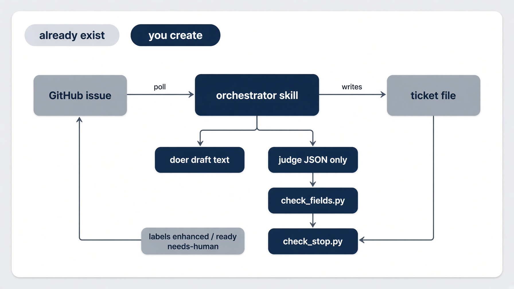
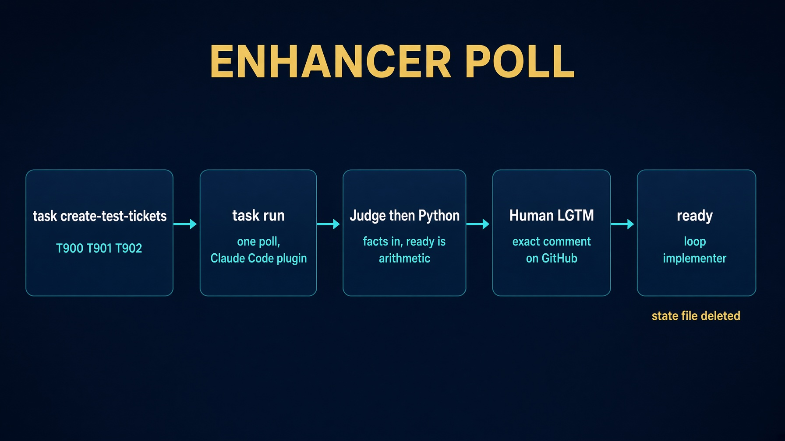
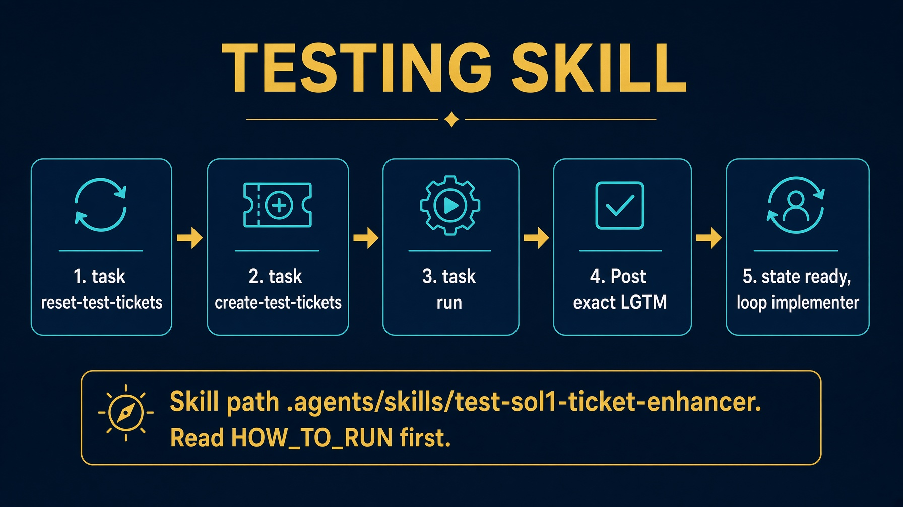

# Lab 1. Ticket enhancer

Saturday walkthrough. Claude Code plugin.

A vague GitHub issue in. A ready contract out.

**25 minutes of typing.** Fork setup is already done.

Work from `labs/lab1_enhancer`. Not the repo root.


---

# What you will build

A Claude Code plugin that grooms every open draft ticket in **your** fork, one poll at a time.

| Piece | Path you create |
|---|---|
| Judge agent | `.claude/agents/enhancer-judge.md` |
| Doer agent | `.claude/agents/enhancer-doer.md` |
| Field check | `.claude/skills/enhancer-loop/scripts/check_fields.py` |
| Stop check | `.claude/skills/enhancer-loop/scripts/check_stop.py` |
| Orchestrator skill | `.claude/skills/enhancer-loop/SKILL.md` |

Already in the folder: `Taskfile.yml`, `bin/*.sh`, `config.json.example`, `.claude/settings.json`, four prompt files.

The finished answer is `solutions/sol1_enhancer/`. Read `HOW_TO_RUN.md` there after this lab.


---

# Starting architecture

Components that already exist **(gray)**. Components you create **(navy)**.



Trigger lives **outside**: `task run`, `task poll-forever`, `/enhancer-loop`, or Actions. The skill runs **one step and exits**.


---

# Why this lab exists

A prompt that grooms a ticket once is a demo. A loop that polls GitHub, drafts, judges, and stops is a product.

- Nobody sits in chat driving it.
- The judge cannot edit the ticket it grades.
- Ready is arithmetic, not a model claim.
- `task poll-forever` is a seminar lie. Production is an event.

**Final outcome.** T900, T901, T902 exist as GitHub issues. One `task run` grooms the stubs. A human `LGTM` on a green rubric sets `ready` and `loop: implementer`.


---

# Prerequisites

| Need | Check |
|---|---|
| GitHub account and `gh` | `gh auth status` |
| Claude Code | `claude --version` |
| Fork of northwind-field-crm, in **your** account | never `SpillwaveSolutions` |
| `task` | `task --version` |
| Working directory | `cd labs/lab1_enhancer` |

```bash
cp config.json.example config.json
# fill fork_owner with your GitHub username
task clone
```

`task clone` writes `../../work/northwind-field-crm`. Paths are built from `TASKFILE_DIR`, so it does not matter where you invoked `task`.


---

# Step 1. Start Claude in this folder

```bash
cd labs/lab1_enhancer
claude
```

Paste **one prompt at a time** from `prompts/claude-code.md`.

`.claude/settings.json` already denies writes to `loops/`, `scripts/`, and `work/**/tests/**`.

There is no `loops/` package. Duplicate code on purpose.


---

# Step 2. Judge. No write tool

Create `.claude/agents/enhancer-judge.md`.

```yaml
name: enhancer-judge
tools: Read, Grep, Glob
```

Entire final message is one JSON object:

```json
{"kind": "bug", "present_fields": ["title", "steps"]}
```

The judge reports `present_fields`. It does **not** compute `missing_fields`. That is Python.


---

# Step 3. Doer. Text only

Create `.claude/agents/enhancer-doer.md`. Same tools. No write.

The orchestrator writes `tickets/<id>.enhancer-candidate.md` from the doer's text. The doer does not write that file.

Investigate `app/` in the target. Use the latest human GitHub comment as the strongest signal.


---

# Step 4. Two Python checks

```bash
python3 .claude/skills/enhancer-loop/scripts/check_fields.py --demo
python3 .claude/skills/enhancer-loop/scripts/check_stop.py --demo
```

Expected: `all demo assertions passed`.

`check_fields.py` computes ready. `check_stop.py` stops on a repeated signature or a spent budget of 3. A model can talk itself past a stop in a prompt. Python will not.


---

# Step 5. Orchestrator skill. Eight rules

`/enhancer-loop --repo <path>`

- A missing comment does not stop you.
- The `enhanced` label is not the work.
- Seed stubs are never ready.
- An issue opened in the GitHub UI is a ticket.
- `ready` comes from `check_fields.py` plus exact `LGTM`.
- `task run` never opens an issue. That is `task create-test-tickets`.
- Comments from the loop carry `<!-- enhancer-loop -->`. Filter the marker, not the author.
- On keep, update the **issue body** to match the ticket, not only the comment.


---

# The poll, in one picture



First poll always runs one round. A ticket with never any comment has nothing for a human to react to yet.


---

# Run one poll

```bash
task create-test-tickets && task run --
```

| Id | Kind | Title |
|---|---|---|
| T900 | bug | Search crashes on an empty query |
| T901 | ui | Add a notes field to the customer page |
| T902 | feature | Export tasks to CSV |

`task run` is `claude -p "/enhancer-loop --repo {{.TARGET}}"`.


---

# After poll 1. Then LGTM

Ticket files have real fields. Label `enhanced`. A marked comment. State files under `.harness/`.

Comment `LGTM` on GitHub as yourself, on a ticket `check_fields.py` already calls ready.

Next `task run`:

- label `ready`
- frontmatter `state: ready` and `loop: implementer`
- state file deleted

That is the handoff into Lab 2.

```bash
task poll-forever --
```

Seminar stand-in. `Ctrl-C` when you are done. Set `poll_interval: "30s"` in `config.json` while testing.


---

# If it looks hung

`claude -p` prints nothing until the run finishes.

```bash
# config.json: "debug": true
touch debug.log && tail -f debug.log
```

Hooks write one line per tool call. `debug.log` is gitignored. Leave `debug` false for a normal run.


---

# Retest from scratch

Closing an issue by hand is not a reset. It is the thing that breaks the next poll.

```bash
task reset-test-tickets
task create-test-tickets
task run --
```

That retires GitHub titles to `[retired-Txxx-...]`, drops `github_issue`, deletes enhancer state, and reseeds T900, T901, T902.

To replay one ticket: keep the issue number, restore draft frontmatter, delete `.harness/last-enhancer-T901.json`, `gh issue reopen`.


---

# Testing skill. After class



`.agents/skills/test-sol1-ticket-enhancer/`

The skill reviews live GitHub issues, posts exact `LGTM`, and checks `state: ready` plus `loop: implementer`. Read that folder's `HOW_TO_RUN.md` first.


---

# Fall behind

Lab 1 is the only lab with a drop-in.

```bash
cp -R ../../solutions/sol1_enhancer/.claude .claude
```

See `FALL-BEHIND.md`. After class, the finished plugin also has `HOW_TO_RUN.md` and `DESIGN_DOC.md` in `solutions/sol1_enhancer/`.


---

# Recap

Trigger outside. Exits inside. Judge has no write tool. Ready is arithmetic.

`task poll-forever` is a seminar stand-in. Actions is the deploy.

**Closing line.** The loop is the product. The prompt is not.
