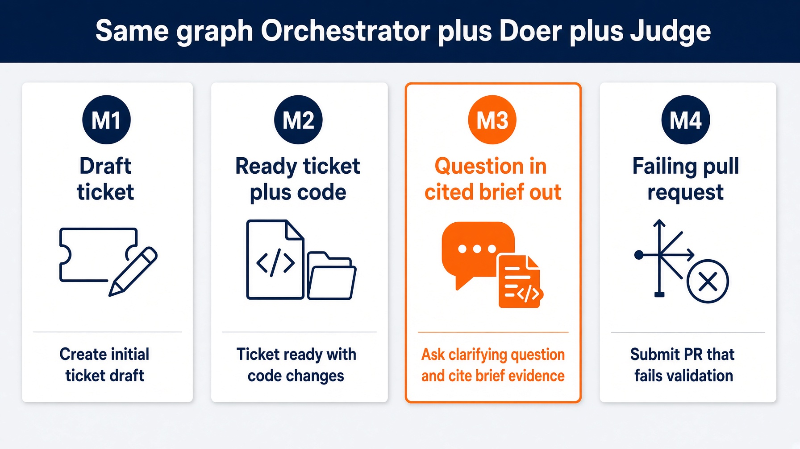

# Lab 3. Research assistant over MCP

A question in. A cited brief out. Same graph, different object.

**25 minutes.** Fill `loop.py`. Two functions. Nothing else.

Work from `labs/lab3_research`.




---

# Why this lab exists

A code loop stops when tests go green. A research loop has no equivalent. "Keep searching until confident" is not a stop condition.

Tool output is untrusted input. Your search results are a document the internet wrote, not a system prompt.

**Artifact.** A working research assistant that cites what it retrieved. Saturday path uses the fixture backend. No signup form.


---

# Learning objectives

- Implement `plan_questions` as three checkable sub-questions
- Implement `check_brief` as `return brief.check(body, sources)` with no model
- Configure a tool boundary: search in, merge denied
- Validate four arithmetic rows: `has_sources`, `grounded`, `cited`, `style`
- Troubleshoot the stall of reaching for a model judge


---

# Starting architecture

Already in the folder: `brief.py` (the judge), prompts, settings.

You fill: `plan_questions` and `check_brief` in `loop.py`.

```
orchestrator  owns budget + exits. Writes nothing. Sees summaries.
     +-- researcher   search tools only. Isolated context. No write.
     +-- writer       brief.md + work/research/** only.
     +-- judge        brief.check. Citations are arithmetic.
```

Allowed: search, write this loop's own output folder.
Denied: merge, deploy, ticket state, CRM edits.


---

# Prerequisites

```bash
cd labs/lab3_research
claude -p "$(cat prompts/claude-code.md)"
```

Worth reading before you type: `brief.py`, `MCP.md`.

`.mcp.json` at the repo root ships `context7`. Perplexity is optional. Fixture when the room has no wifi.


---

# The stub

```python
def plan_questions(question: str) -> list[str]:
    raise NotImplementedError("fill me in")

def check_brief(body: str, sources: list[str]) -> brief.BriefScore:
    raise NotImplementedError("fill me in")
```

`brief.check` is already shipped. Do not reimplement grounding.


---

# `plan_questions`. Three strings is enough

A plan step you cannot check is a wish. The common stall is over-designing this function.

```python
def plan_questions(question: str) -> list[str]:
    return [
        question,
        f"{question} common mistake",
        f"{question} how to verify",
    ]
```

That is the body in `solutions/sol3_research_deep_agents/researcher.py`. Swapping in a model planner is the stretch. Downstream checks do not change.


---

# `check_brief`. Arithmetic. No model

```python
def check_brief(body: str, sources: list[str]) -> brief.BriefScore:
    return brief.check(body, sources)
```

| Row | Pass when |
|---|---|
| `has_sources` | `bool(sources)` |
| `grounded` | every `[n]` is in `1..len(sources)` |
| `cited` | every claim paragraph has a `[n]` |
| `style` | zero em dashes outside code spans |

A confident sentence nobody can trace is the failure that matters. House style forbids em dashes. A model will argue. Python will not.


---

# Commands. README drift

README still prints `task loop:research`. That task is gone with `loops/`.

Saturday self-check:

```bash
task test    # import loop; print('ok')
```

The runnable filled loop:

```bash
cd ../../solutions/sol3_research_deep_agents
python3 loop.py --question "sqlalchemy nullable datetime column" --backend fixture
```

The question is boring on purpose. It matches `fixtures/research.json`.


---

# Expected fixture result

```
PASS  has_sources    3 sources retrieved
PASS  grounded       every citation resolves
PASS  cited          every paragraph cites a source
PASS  style          0 em dashes

backend: fixture   budget: $0.00 / $0.20 (soft $0.10), 3/8 calls
gate:    pass
reason:  the rubric is green
```

Empty findings → no body claims → `has_sources` fails → escalate. It never ships an uncited brief.


---

# Budget. Soft warns. Hard raises

Live loop: `max_usd=0.20`, `max_calls=8`, `soft_usd=0.10`. Perplexity costs 0.006 per call. Fixture costs nothing, which is why Saturday still teaches the cap.

The ninth search does not run. `BudgetExceeded` is a `RuntimeError`, not a nudge.

Four stops: call budget, dollar budget, stable failure, no-source escalates.


---

# Troubleshooting

| Symptom | Likely cause | Resolution |
|---|---|---|
| Reaching for a model in `check_brief` | stall | `return brief.check(body, sources)` |
| Over-designed planner | stall | three strings |
| `task loop:research` missing | engine deleted | run `sol3_research_deep_agents/loop.py` |
| Uncited brief shipped | skipped `has_sources` | empty findings must escalate |
| Em dashes in the brief | model argued | `brief.strip_em_dashes` |


---

# Recap

Same graph as Module 1. New object: a question. New wall: one search tool.

Cost is an architecture problem, not a pricing problem. Do not shop for a cheaper model first.
