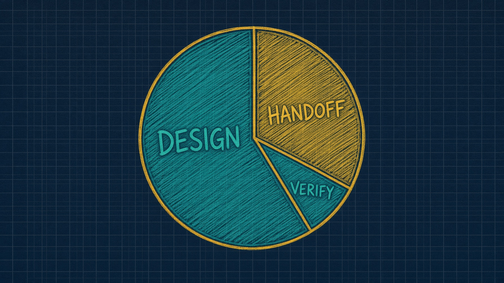

# Lab 4. Broken PR fixer, unattended

A failing branch in. A green one out, or an honest explanation of why not.

**18 minutes, not 25.** Energy is lowest. Keep moving.

Work from `labs/lab4_fixer`.




---

# Why this lab exists

Nobody is watching. Exits matter more than successes.

Giving up is allowed. Giving up silently is the bug.

A model that may both act and verify can invent its own evidence. That is why the receipt exists.

**Artifact.** A production architecture you can hand to your team.


---

# Learning objectives

- Implement `summarize_failure` so the error is not lost in the middle of a log
- Implement `repair_until_green` with four stop paths
- Stash Module 2 work **before** `broken-pr` checkout
- Validate `--doer none` leaves "A human should take this one"
- Troubleshoot a loop that wants to delete an earlier lab's work


---

# Starting architecture

Already here: `contract.py` (344 lines, the repo contract). You fill two functions in `loop.py`.

```
Trigger  →  fixer.run
              judge: contract.run("test") → junit
              code_implementer: app/**, denied tests/**
              optional research once (2 calls, $0.05)
         →  .harness/last-fixer.json
         →  Human merge. Loop never gets a merge tool.
```

Cast is three roles, not five. No planner. The work is defined by what is red.


---

# Stash first. Say it out loud

```bash
git -C ../../work/northwind-field-crm stash --include-untracked
```

`checkout()` on a dirty tree refuses rather than deleting Lab 2 work:

```
cannot switch to broken-pr: northwind-field-crm still holds the work from an earlier lab.
  keep it:     git -C ... stash --include-untracked
  discard it:  git -C ... checkout -- . && git -C ... clean -fd
```

That refusal is on brand. It costs 30 seconds if you let them find it.


---

# The stub

```python
def summarize_failure(run_result: RunResult) -> str:
    raise NotImplementedError("fill me in")

def repair_until_green(contract: Contract, budget: int = 3) -> dict:
    raise NotImplementedError("fill me in")
```

CRM branches: `main` ~75% coverage (below floor). `known-good` due dates green. `broken-pr` dropped the null guard, one test red.


---

# `summarize_failure`

Sending the whole log puts the failure in the middle. Lost in the Middle, third time today.

```python
def summarize_failure(run_result) -> str:
    failed = sorted(run_result.junit.failed_ids)
    lines = [f"{len(failed)} failing: {', '.join(failed[:5])}"] if failed else ["the suite is red"]
    error = ERROR_IN_OUTPUT.search(run_result.output or "")
    if error:
        lines.append(error.group(0).strip()[:200])
    return "\n".join(lines)
```

That is `fixer.failure_summary` in `solutions/sol4_fixer_agent_sdk/fixer.py`.


---

# `repair_until_green`. Four stop paths

1. Suite green → pass
2. Suite never ran → escalate on round 1. A suite that never ran is not a suite that failed.
3. Same failing ids twice → escalate, leave a comment
4. Budget spent → escalate, "A human should take this one"

Scope violations escalate even if the suite is green. Reaching green by editing the failing test is not a fix.


---

# Commands. README drift

README still prints `task loop:fixer`. Gone with `loops/`.

Saturday: `task test` imports `loop`.

Runnable filled loop:

```bash
cd ../../solutions/sol4_fixer_agent_sdk
python3 loop.py --repo ../../work/northwind-field-crm --branch broken-pr --doer reference
python3 loop.py --repo ../../work/northwind-field-crm --branch broken-pr --doer none
```

`--branch broken-pr` is what makes this real. Point it at a green branch and it reports a pass and proves nothing. Same shape as the red gate.


---

# Expected `--doer none`

```
attempt 1: 1 failing -> retry
  1 failing: tests.test_overdue::test_overdue_ignores_tasks_with_no_due_date
attempt 2: 1 failing -> escalate

gate: escalate
reason: the same rows failed twice

The fixer gave up.
A human should take this one.
```

`--doer reference` against `broken-pr`: `gate: pass`, files copied from `known-good` inside `app/**` only.


---

# MAST, in one slide

Most agent failures are not model failures. 1,642 traces. Cemri et al. arXiv:2503.13657.

| Category | Share | This hour |
|---|---|---|
| System design | 41.8% | graph, scope, budget, trigger |
| Inter-agent | 36.9% | summaries, not dumps |
| Verification | 21.3% | pytest, receipt |

Every one of those three is something you build, not something you buy.


---

# Troubleshooting

| Symptom | Likely cause | Resolution |
|---|---|---|
| `checkout broken-pr` refuses | Lab 2 files still dirty | stash, out loud, before anyone types |
| `--doer none` is green | loop is lying | same ids twice must escalate |
| Edited `tests/**` | scope not enforced | deny list on the code implementer |
| `task loop:fixer` missing | engine deleted | `sol4_fixer_agent_sdk/loop.py` |
| Silent give-up | missing comment | "A human should take this one." |


---

# Recap

**What we built.** Two functions that make an unattended fixer honest.

**Takeaways**

1. Stash first. A loop that deletes earlier work is the behaviour this workshop exists to prevent.
2. Giving up is allowed. Giving up silently is the bug.
3. Merge is never a tool.
4. If you cannot read the last score, you cannot debug at 2 a.m.

The loop is the product. The prompt is not.
