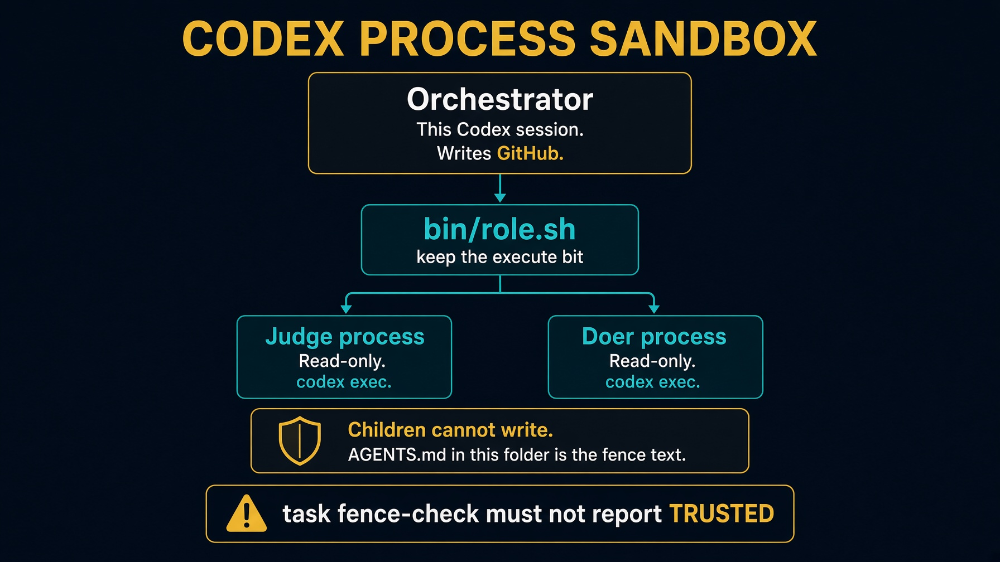

# sol1_enhancer_codex

Take-home. Isolation is a process sandbox, not a per-agent tool list.

`bin/role.sh` starts the judge and the doer as their own read-only `codex exec` processes. Do not lose the execute bit.

Read `HOW_TO_RUN.md`, `SPEC.md`, and `IMPLEMENTATION_NOTES.md`.


---

# Setup

```bash
cd solutions/sol1_enhancer_codex
cp config.json.example config.json
task clone
task fence-check
```

`task fence-check` must **not** report `TRUSTED`. If it does, the sandbox is not real. See `IMPLEMENTATION_NOTES.md`.


---

# Checks with no live poll

```bash
task test
task checks
python3 .agents/skills/enhancer-loop/scripts/check_fields.py --demo
python3 .agents/skills/enhancer-loop/scripts/check_stop.py --demo
```


---

# One poll. Budget five minutes

```bash
task create-test-tickets
timeout 420 task run --
task poll-forever --
```

One poll starts three model processes: judge, doer, judge again. A full round that promotes a candidate runs about four minutes.

A run that produces no output for minutes is usually a hang. `IMPLEMENTATION_NOTES.md` lists the two that look identical from outside.


---

# Architecture



Orchestrator writes GitHub. Children are read-only. `task fence-check` must not report TRUSTED.


---

# Testing skill

`.agents/skills/test-sol1-ticket-enhancer/`

Same reset, seed, poll, `LGTM` ritual. Point `SOLUTION` at this folder. Read `HOW_TO_RUN.md` first.


---

# Troubleshooting

| Symptom | Fix |
|---|---|
| `TRUSTED` | sandbox is not a fence. `IMPLEMENTATION_NOTES.md` |
| role.sh not found | restore the execute bit |
| Hang, no output | `timeout 420`. Then the notes. |
| Closed issue | `task reset-test-tickets` |


---

# Recap

Process sandbox. Children cannot write. Orchestrator alone talks to GitHub.

Expect five minutes, not one.
