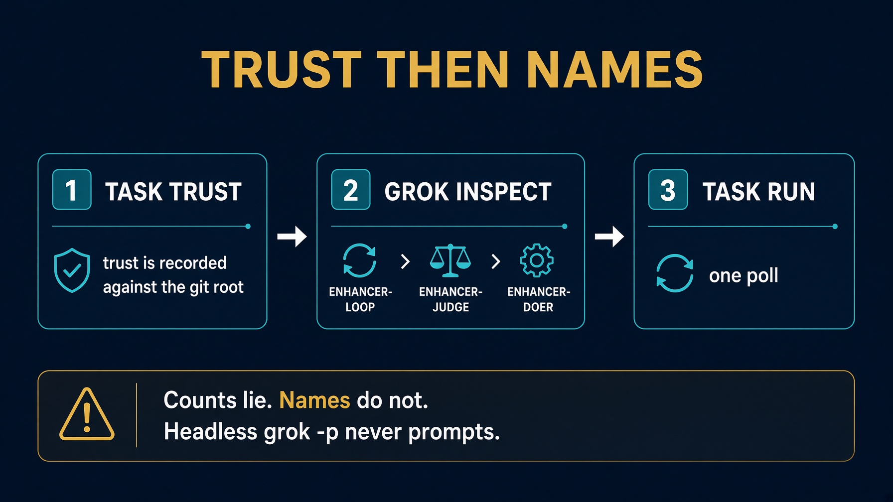

# sol1_enhancer_grok_build

Take-home. Grok only loads a project plugin from a trusted checkout.

Trust is recorded against the git root, so trusting the lab repo covers this folder.

Read `HOW_TO_RUN.md` and `IMPLEMENTATION_NOTES.md`.


---

# Step zero. Trust

```bash
cd solutions/sol1_enhancer_grok_build
task trust
```

If you see `ticket-enhancer (project, disabled)`, run `grok` here once with no arguments, accept trust, quit, then `task trust` again.

Headless `grok -p` never prompts. Until trust exists, `task run` finds no skill.


---

# Names, not counts

```bash
grok inspect | grep -E "enhancer-loop|enhancer-judge|enhancer-doer"
```

All three must be listed. The three symlinks under `.grok/skills/` and `.grok/agents/` are what make the loop runnable.

The Plugins line counts directories. `1 agents` can show even when two agent files are loaded. Never read the counts as proof.


---

# Setup and one poll

```bash
cp config.json.example config.json
task clone
task create-test-tickets
task test
task checks
task run --
task poll-forever --
```


---

# Architecture



Project plugin `ticket-enhancer` plus registration shims. Counts lie. Names do not.


---

# Testing skill

`.agents/skills/test-sol1-ticket-enhancer/`

Point it at this folder after trust is granted.


---

# Troubleshooting

| Symptom | Fix |
|---|---|
| Skill missing | trust the checkout, then the three names |
| `task run` does nothing | headless never prompts. Trust first. |
| Symlinks gone after copy | `cp -R` the `.grok` tree. See FALL-BEHIND. |


---

# Recap

Trust first. Then the three names. Then one poll.

Counts lie. Names do not.
