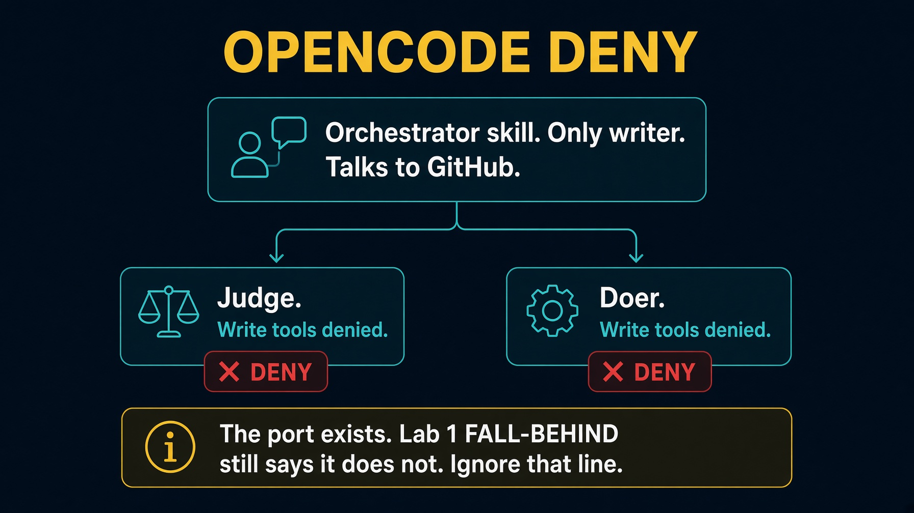

# sol1_enhancer_opencode

Take-home. Permission deny on subagents. This port exists. Lab 1 `FALL-BEHIND.md` still says it does not. Ignore that line.

Read `HOW_TO_RUN.md`, `SPEC.md`, and `IMPLEMENTATION_NOTES.md`.


---

# Setup

```bash
cd solutions/sol1_enhancer_opencode
cp config.json.example config.json
task clone
task create-test-tickets
```

You need `opencode`, `gh`, `jq`, `task`, `python3`. There is no `task test` in this folder. The checks live on the Python scripts.


---

# Checks

```bash
python3 .opencode/skills/enhancer-loop/scripts/check_fields.py --demo
python3 .opencode/skills/enhancer-loop/scripts/check_stop.py --demo
```


---

# One poll

```bash
timeout 360 task run --
task poll-forever --
```

Same poll as Saturday: every open draft, `enhanced` on first rewrite, `LGTM` then `ready`.


---

# Architecture



OpenCode denies write tools on the judge and the doer. Orchestrator is the only writer.


---

# Testing skill

`.agents/skills/test-sol1-ticket-enhancer/`

Point `SOLUTION` at this folder. Read `HOW_TO_RUN.md` first. Skip `task test` here. Run the demo scripts, then the live poll.


---

# Troubleshooting

| Symptom | Fix |
|---|---|
| FALL-BEHIND says no answer | stale. This folder is the answer. |
| Judge can write | permission deny in OpenCode config |
| Closed issue | `task reset-test-tickets` |


---

# Recap

The port exists. Deny write on the children. Orchestrator writes GitHub.
