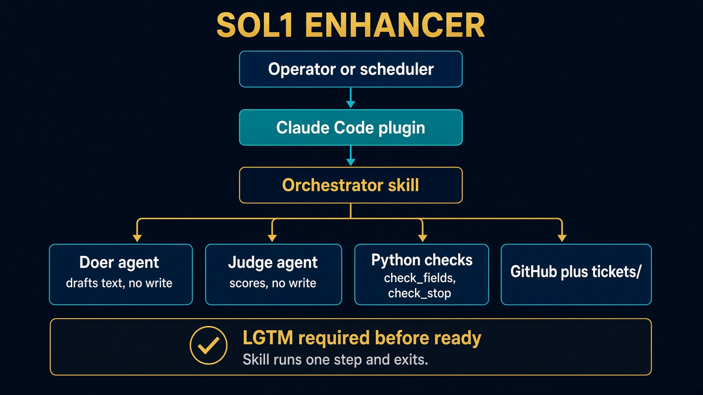

# sol1_enhancer. Claude Code answer

The Saturday plugin, finished. Work from this folder. It is standalone.

Read `HOW_TO_RUN.md` and `DESIGN_DOC.md` before you change a poll.

Saturday Lab 1 fills `.claude/` in `labs/lab1_enhancer`. This folder is that answer.


---

# What this folder does

One poll. Every open draft in your fork. Judge reports facts. Python computes ready. Orchestrator alone writes GitHub.

```bash
cd solutions/sol1_enhancer
cp config.json.example config.json
task clone
task create-test-tickets
task run --
```

`task run` never opens issues. That is `task create-test-tickets`.


---

# Architecture



Doer and judge cannot write the real issue. `LGTM` is required before `ready`.


---

# Setup, once

```bash
cp config.json.example config.json   # fork_owner
task clone                           # ../../work/northwind-field-crm
task create-test-tickets             # T900 bug, T901 ui, T902 feature, plus T001
```

Paths are built from `TASKFILE_DIR`. You can invoke `task` from anywhere.


---

# One poll. Then LGTM

```bash
task run --
```

First poll always runs one round. Comments do not start a round. Human comments exact `LGTM` on a green rubric. Next poll sets `state: ready` and `loop: implementer`.

```bash
task poll-forever --
```

Seminar stand-in. `Ctrl-C` when you are done. Production is Actions. See `GITHUB-ACTIONS.md`.


---

# If it looks hung

`claude -p` prints nothing until the run finishes.

```json
"debug": true
```

```bash
touch debug.log && tail -f debug.log
```

Hooks write one line per tool call. Leave debug false for a normal run.


---

# Retest from scratch

Closing an issue by hand is not a reset.

```bash
task reset-test-tickets
task create-test-tickets
task run --
```

To replay one ticket: keep the issue number, restore draft frontmatter, delete `.harness/last-enhancer-T901.json`, `gh issue reopen`.


---

# Testing skill


`.agents/skills/test-sol1-ticket-enhancer/`

Works on every `solutions/sol1_*` folder. Read that folder's `HOW_TO_RUN.md` first.


---

# Troubleshooting

| Symptom | Fix |
|---|---|
| Skill not found | `cd solutions/sol1_enhancer` |
| `enhanced` label, body unchanged | rewrite the ticket, then label |
| `issue N is closed` | `task reset-test-tickets`, not a hand close |
| no GitHub issue | `task create-test-tickets` |
| already ready / implementer | reset that ticket if you meant to rerun |


---

# Recap

Trigger outside. Exits inside. Judge has no write. Ready is arithmetic.

The loop is the product. The prompt is not.
