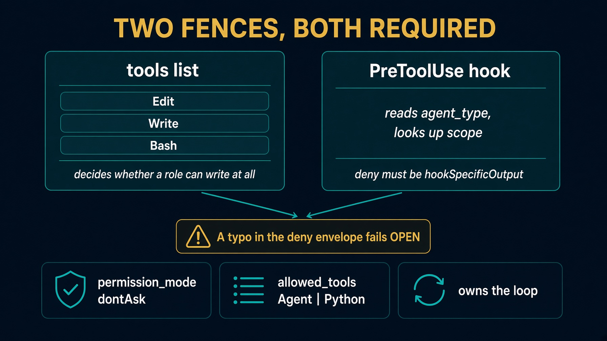

# sol2_implementer_agent_sdk

Take-home **configuration port**. It does not run the eight-step loop.

This is the role graph. The live harness is `sol2_implementer_deep_agents`.

`task run` prints `ClaudeAgentOptions`. It does not implement T001.

Read `HOW_TO_RUN.md`, `DESIGN_DOC.md`, `TEST_PLAN.md`, and `E2E_PLAN.md`.


---

# Cast, not the driver


`task run` prints `ClaudeAgentOptions`. It does not implement T001.


---

# What it proves

The role table survived the runtime swap.

```
role                writes  scope
orchestrator        no      nothing
planner             yes     steps.jsonl
test_implementer    yes     tests/**
code_implementer    yes     app/**, src/**   denied tests/**
judge               no      nothing
```

Missing on purpose: `implementer.py`, `gates.py`, `rubric.py`, `doers.py`.

Do not copy this folder into `labs/lab2_implementer/harness.py`. Saturday wants `red_gate` / `score_attempt` / `run_loop`.


---

# Setup. Folder-local venv

```bash
cd solutions/sol2_implementer_agent_sdk
echo 'ANTHROPIC_API_KEY=sk-ant-...' >> ../../.env
task setup          # .venv + claude-agent-sdk. PEP 668.
task clone          # only if you want live options against a real repo
```

Do not `pip install` into Homebrew Python.


---

# Scripts with no model

```bash
task table          # judge writes must print no
task test           # pytest. No key, no SDK, no clone.
```

If judge prints `yes`, stop. The port is wrong.


---

# Architecture



`task run --` prints options with `dontAsk` and one PreToolUse hook. No call to `implementer.run`.


---

# Scope. Two places, both required

`tools=[...]` decides whether a role can write at all.

One `PreToolUse` hook reads `agent_type` and looks up that role's scope.

A write with no agent is denied. The parent has no business writing anything.

Deny envelope:

```
hookSpecificOutput.hookEventName = PreToolUse
hookSpecificOutput.permissionDecision = deny
```

A typo fails **open**. The field is `maxTurns`, camelCase.


---

# `task run` is configuration

```bash
task run --
```

Needs `task setup`. Prints options. Stops.

That is not a ticket run. A test that expects `task run -- --ticket T001` to implement a ticket is testing a product this folder refused to be.


---

# Live T001. Glue, not a second loop

`e2e_t001.py` hands `AgentSdkBackend` to the Deep Agents driver.

Both folders ship `adapter.py` and `roles.py`. Putting both on `sys.path` shadows one of them. The glue loads each folder in an isolated import scope.

Do not invent a shared `loops/` package. Do not copy `implementer.py` into this folder.

Read `E2E_PLAN.md` before spending a token.


---

# Testing skill

`.agents/skills/test-ticket-implementer/`

Track A is `sol2_implementer_deep_agents`. Track B is this backend plugged into that driver.

Run `task test` here first. Do not spend a token to diagnose a failing offline suite.


---

# Plugin files vs Python

```
plugin/agents/...
plugin/skills/...
```

The plugin is the readable specification. Python owns the options. When an agent markdown file and the role table disagree, `options_for` raises.


---

# Troubleshooting

| Symptom | Fix |
|---|---|
| Thought this ran T001 | config port. Use Deep Agents `task run` |
| Judge writes `yes` | strip Write from judge tools |
| Fail-open writes | full `hookSpecificOutput` deny |
| `externally-managed-environment` | `task setup`, not system pip |
| Copied into lab2 stub | Saturday wants three functions |


---

# Recap

Config port, not a filled loop. Same table, different enforcement knob.

The eight steps live in `sol2_implementer_deep_agents`. This folder proves the table survived.

`task setup`, `task table`, `task test`, `task run`. Read `HOW_TO_RUN.md`.
