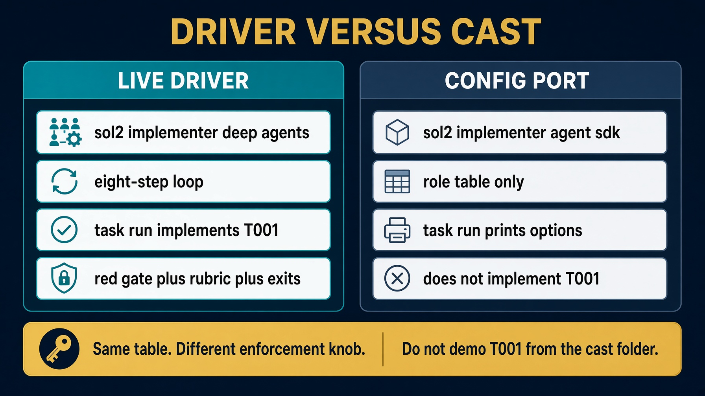
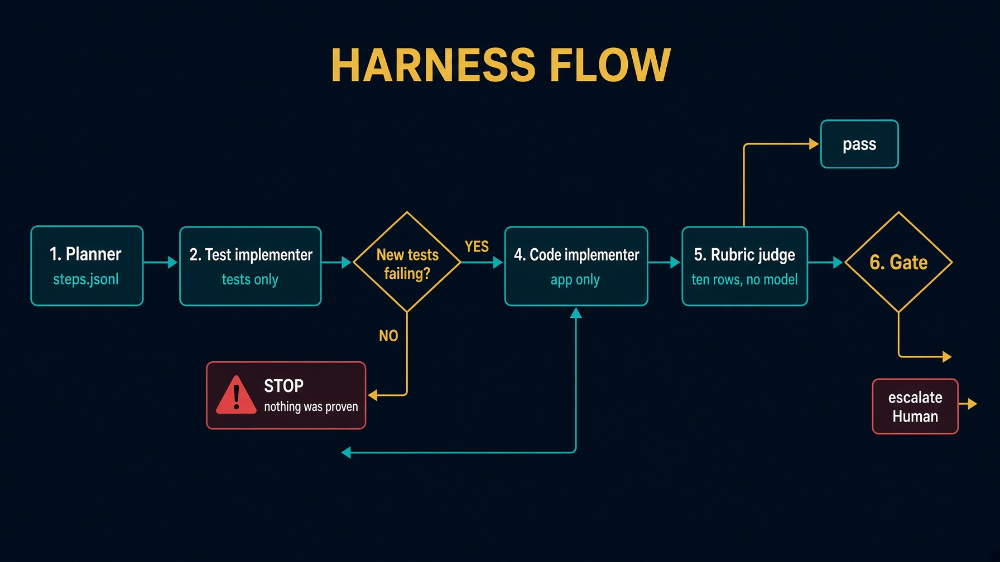

# sol2_implementer_deep_agents

The Lab 2 take-home driver. A ready ticket in. A green rubric out.

Python holds Pass, Retry, and Escalate. Deep Agents is the maker. The red gate is `junit.xml`.

Saturday fills three stubs in `labs/lab2_implementer`. Demo T001 from here.

Read `HOW_TO_RUN.md` and `DESIGN_DOC.md`. Skills are mounted, not pasted.


---

# Driver, not a cast



Demo T001 from this folder. The Agent SDK twin prints options. It does not implement the ticket.


---

# What this folder is

| File | Role |
|---|---|
| `harness.py` | CLI, `red_gate`, `run_loop` |
| `implementer.py` | eight-step loop |
| `doers.py` | `none` / `reference` / `cli` / Deep Agents |
| `rubric.py` / `gates.py` / `contract.py` | copies, not a library |
| `roles.py` | `create_deep_agent` |
| `skills/` | mounted per writing role |

`task loop:implementer` is gone from the root Taskfile. Run `task run` here.


---

# Setup. Two venvs on purpose

```bash
cd solutions/sol2_implementer_deep_agents
cp config.json.example config.json
echo 'ANTHROPIC_API_KEY=sk-ant-...' >> ../../.env
task test-setup     # .venv + pytest. Enough for none and reference.
task clone
```

`--doer deep` needs one more step:

```bash
task setup          # same .venv, plus deepagents>=0.7
```

Do not activate the venv. Task uses it.


---

# Scripts with no model

```bash
task table          # judge writes must print no
task test
task e2e            # offline loop against a disposable fixture
```

If judge prints `yes`, stop. None of these need a key, Deep Agents, or the public CRM.


---

# Architecture



Python runs the suite through `Contract`. No role holds a shell. See `docs/diagrams/architecture.svg`.


---

# Eight steps in `implementer.run`

1. Read the ticket. Refuse if it is still a draft.
2. `plan_for`: one test step and one code step per criterion. Derived, not generated. Graph Engineering.
3. `test_implementer` writes under `tests/**`.
4. Red gate. Empty new-ids → escalate. Stop. Do not write app code.
5. `code_implementer` writes `app/**` until green. Denied `tests/**`.
6. Ten-row rubric. No model.
7. `judge_done=None`. A green rubric is enough on this path. Session 2 still teaches a model judge.
8. `gates.decide`. Trace to `.harness/last-implementer.json`.

`create_deep_agent` does not count retries.


---

# Red gate

```python
def _new_test_ids(before: set[str], after_failed: set[str]) -> set[str]:
    return {test_id for test_id in after_failed if test_id not in before}
```

A test that already existed and still fails is not proof of a new contract.

`--doer none` hits this every time. If that run were green, the harness would be lying.


---

# Three doers

| Spec | Needs | Behavior |
|---|---|---|
| `none` | nothing | writes nothing. Honesty check. |
| `reference` | clone | copies `known-good` inside WriteScope |
| `deep` | `task setup` + key | Deep Agents makers |

```bash
task run -- --ticket T001 --doer none
task run -- --ticket T001 --doer reference
task run -- --ticket T001 --doer deep
```

`task run` is `harness.py --repo <target>`. Extra flags after `--` go to `harness.py`.


---

# Expected results

`--doer none`:

```
gate: escalate
reason: red gate: no new test was observed failing.
```

`--doer reference`: copies `known-good` into `tests/**` then `app/**`, each phase bound by that role's WriteScope. Ten PASS rows. `gate: pass`.


---

# Skills, not a stuffed prompt

Each writing role mounts `/skills/<role>/`. Deep Agents loads the body when the role is invoked.

`/memory/` routes at `memory/`, not this folder.

Do not paste `SKILL.md` into a subagent prompt. Do not shadow `read_file` with a custom tool.


---

# Testing skill

`.agents/skills/test-ticket-implementer/`

Works on every `solutions/sol2_implementer_*` folder. Track A is this driver. Track B plugs another runtime into it.

Read `HOW_TO_RUN.md` first. Run `task test` and `task e2e` before any live spend.

The product is `.harness/last-implementer.json`, not a process exit code.


---

# Troubleshooting

| Symptom | Fix |
|---|---|
| `task loop:implementer` missing | `task run` in this folder |
| `--doer none` is green | empty new-ids must escalate |
| Wrote `tests/**` as coder | scoped write tool, sentence refusal |
| `--doer deep` refuses | `task setup` first |
| `from loops` in a file | `test_standalone.py` fails the build |
| Skill not loading | do not shadow `read_file` |


---

# Recap

Python owns the red gate and the three exits. Deep Agents writes tests, then code.

Same table as Saturday. Enforcement is a missing tool, plus a path check, plus Python on the outside.

If a port imports `loops`, the design leaked.
