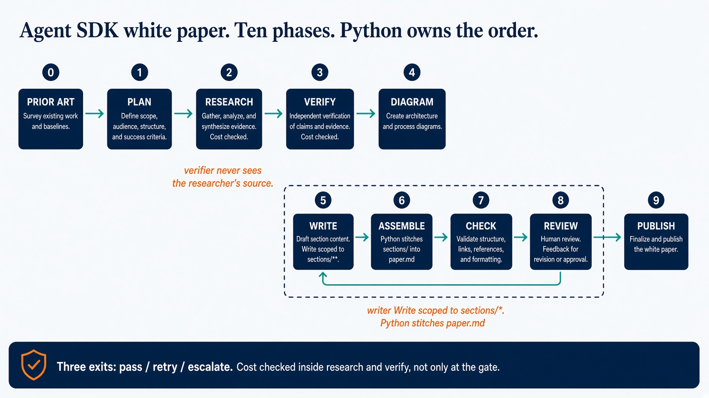

# sol3_research_agent_sdk. White paper

A topic in. An evidence-backed technical white paper out.

Claude Agent SDK. Seven roles. Python owns the phases.

This is not the old config-only port. Saturday Lab 3 still fills two functions. This folder writes `paper.md`.

Read `HOW_TO_RUN.md` and `DESIGN_DOC.md`.


---

# Setup. Folder-local venv

```bash
cd solutions/sol3_research_agent_sdk
echo 'ANTHROPIC_API_KEY=sk-ant-...' >> ../../.env
task setup
```

`.venv` plus the Agent SDK. Also pins `imagen-diagrams` v0.2.0 and `image-gen` v2.1.0 in `.cache/`.

Do not install into Homebrew Python. Do not discover user or parent-project skills. The allowlist is those two plugins only.


---

# Scripts with no model

```bash
task table          # one writer. Everyone else prints no
task checks
task test
task demo           # recorded fixture. No key, no network.
```

If judge, researcher, or verifier prints `yes`, stop.


---

# Starting architecture



See also `docs/diagrams/architecture.svg`.


---

# The cast. Seven roles, one writer.

```
orchestrator   Task                 writes nothing
planner        Read, Glob, Grep     returns plan JSON. Python writes plan.json
researcher     Read + search MCP    writes nothing
verifier       Read + search MCP    writes nothing. Never sees the source.
diagrammer     Read, Glob, Grep     returns diagram source. Python renders.
writer         Read + Write         sections/** only. Cannot reach paper.md
judge          Read, Glob, Grep     writes nothing
```


---

# Two places enforce scope. You need both.

`tools=[...]` decides whether a role can write at all.

One `PreToolUse` hook decides which paths. It reads `agent_type`.

A write with no `agent_type` is denied. So is a write from anyone but the writer. So is a write to `paper.md` or `claims.json`.

sol1 registered one hook per writing role. Several hooks on `Write` all run. An empty dict means no opinion. The first role that shrugs lets another role's write through.


---

# `allowed_tools` is not the parent's list

It is a session-wide permission allowlist. It gates subagents too.

First live run: `allowed_tools=["Agent"]` with `dontAsk`. Every search came back denied.

The researcher did **not** answer from memory. It reported `NO RESEARCH WAS PERFORMED` and returned an empty claim list. The run escalated.

`options_for` now allows the union of what the cast holds. `Bash` is denied at the top.


---

# MCP is declared in Python

Context7 is always configured. Perplexity is included only when `PERPLEXITY_API_KEY` is set.

`.mcp.json` holds a key, so it is gitignored. A fresh clone has no such file. Declare servers in Python or a missing file silently cannot search.

This port has no OpenAI or Bing fallback. A missing root `.mcp.json` must not change the tool boundary.


---

# Ten phases. Python owns the order.

```
0 prior_art   skip if missing              -> prior-art.md
1 plan        sections and questions       -> plan.json
2 research    claims from primary sources  -> sources.json, claims.json
3 verify      independent second look      -> verdicts.json
4 diagram     source in, Python renders    -> diagrams.json
5 write       one section at a time        -> sections/*.md
6 assemble    stitch + references          -> paper.md
7 check       seven deterministic rows     -> check.json
8 review      judge on what a script cannot -> review.json
9 publish     secret gist, on request      -> gist.json
```

Phases 0 to 4 run once. 5 to 8 are the retry cycle.


---

# Cost is checked inside the phases

`--max-usd` default 5.00. Checked inside research, inside verification, and at the gate.

Checking only at the gate is a bug this port had. A twenty-four question research phase can spend the whole budget several times over before the gate ever sees it.

Running out mid-verification leaves remaining claims `unverified`. Marking them verified because the money ran out is the lie.


---

# The check that matters most: `sourced`

A web search cannot refute a citation that was never published. Asking a model whether a reference is real gets you a confident yes.

The only thing that catches a fabricated arXiv id or DOI is looking for it in the text that was actually retrieved. `checks.ungrounded_identifiers`.


---

# White-paper acceptance runs

```bash
task e2e-fixture
LIVE_E2E_MAX_USD=10 task e2e-live
REPORT_DIR=work/e2e-loop-engineering-live task pdf
REPORT_DIR=work/e2e-loop-engineering-live task publish-report
```

Fixture uses recorded research plus real `imagen-diagrams` figures. Live needs both keys and never publishes a gist by itself.

PDF uses Arctic Fox. `publish-report` is a secret gist. The URL is the credential.

`task clean` deletes `work/`. The `.cache/` plugins stay.


---

# Testing skill

`.agents/skills/e2e-test-research-report/`

Default folder is this one.

```bash
task setup && task test && task checks
LIVE_E2E_MAX_USD=10 task e2e-live
```

Use the fixture lane when credentials are absent. Do not describe a fixture lane as live.


---

# Troubleshooting

| Symptom | Fix |
|---|---|
| Subagent tools denied | union of the cast, plus hook |
| Silent empty research | `mcp_servers()` in Python |
| Fabricated sections | empty claims must escalate |
| Bill before a gate | check cost inside research and verify |
| Writer rewrote `paper.md` | deny anyone but writer, deny that path |
| SVG in the paper | renderer must exit 2, not substitute |


---

# Recap

A topic in. A paper plus a knowledge bundle out.

1. Trigger and runtime change. Exits do not.
2. `allowed_tools` gates the children.
3. MCP in Python, or a fresh clone silently cannot search.
4. Three budgets, and cost inside the phases.
5. `sourced` catches a citation a model will bless.

The grounding contract has to hold while the wiring is wrong.
