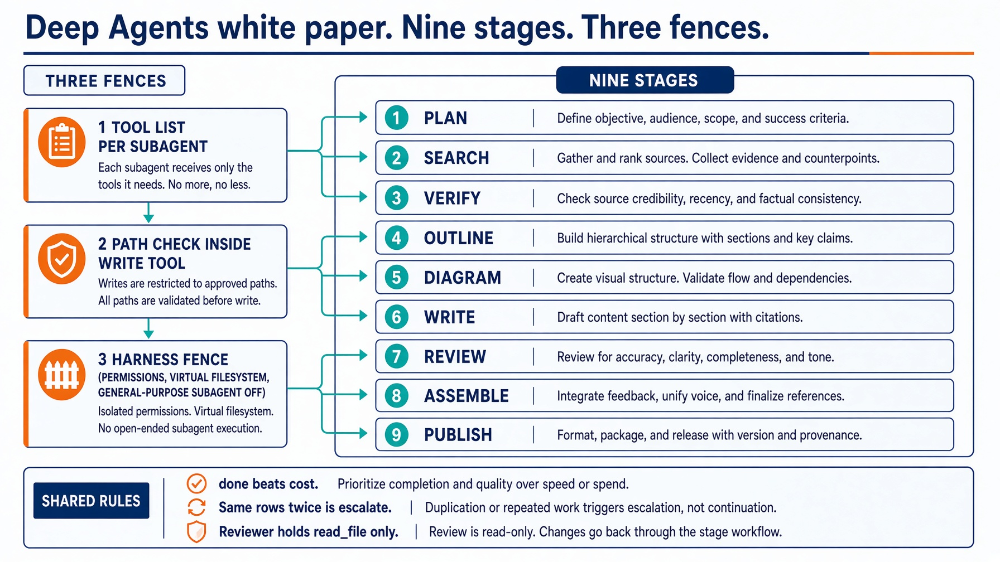
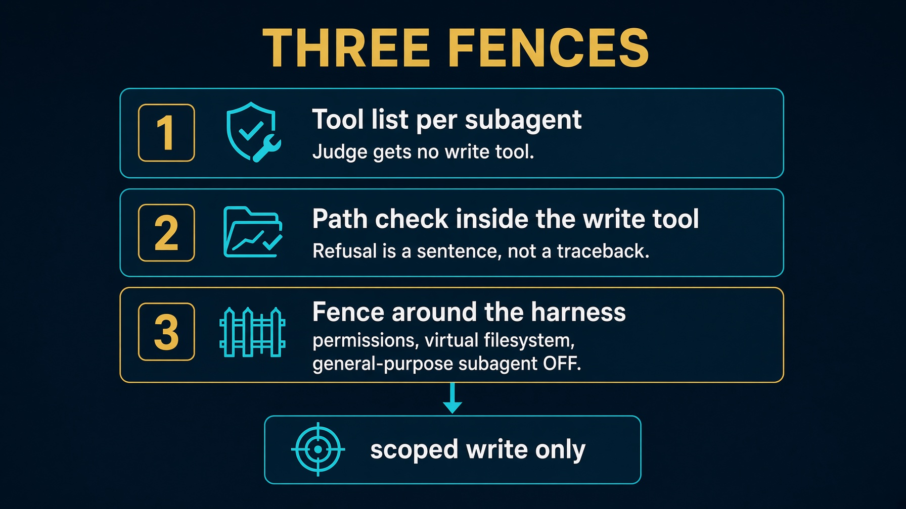

# sol3_research_deep_agents. White paper

A question in, a cited brief out. A topic in, an evidence-backed white paper out.

LangChain Deep Agents. Two entry points. One role table.

This folder has no `HOW_TO_RUN.md`. Read `SPEC.md`, `DESIGN_DOC.md`, and `Taskfile.yml`.

Saturday Lab 3 still fills two functions. This folder writes `whitepaper.md`.


---

# Two entry points. Same folder.

```bash
task brief -- --question "sqlalchemy nullable datetime column" --backend fixture
task paper          # nine stages, fixture research
task live           # backend auto. Needs task setup.
```

The brief is the small version of the paper. Both plan questions, search through one tool boundary, and refuse to ship anything uncited.


---

# Setup

```bash
cd solutions/sol3_research_deep_agents
echo 'ANTHROPIC_API_KEY=sk-ant-...' >> ../../.env
task setup
```

`.venv` plus Deep Agents. Also clones `imagen-diagrams` v0.2.0 and `image-gen` v2.1.0 into `.cache/`.

`task test`, `task table`, `task checks`, and `task brief` need none of that.


---

# Scripts with no model

```bash
task table          # paper cast. Reviewer writes must print no
task checks         # evidence, paper_check, diagrams, publish, mcp_tools
task test
```

If the reviewer prints `yes`, stop.


---

# Starting architecture



See also `docs/diagrams/architecture.svg`.


---

# The paper cast

```
role           writes  scope
orchestrator   no      nothing
planner        yes     plan.json
researcher     no      nothing
verifier       yes     evidence/**     denied: paper/**
diagrammer     yes     diagrams/*.mmd, *.puml
writer         yes     brief.md, paper/**, work/research/**
reviewer       no      nothing
```

A role that would hold the same tools as its neighbour is not a role. It is a prompt, and it belongs in a skill.


---

# Three fences. People skip the third.



Do not shadow `read_file`. That is how `/skills/` goes silent.


---

# Nine stages. Two of them are Python.

| # | Stage | Model? | Gate |
|---|---|---|---|
| 1 | plan | yes | 3 to 8 questions, each with a check |
| 2 | search | yes | every claim names a source that resolves |
| 3 | verify | yes | every important claim has a decided truth state |
| 4 | outline | yes | every body section names claim ids that exist |
| 5 | diagram | yes | at most 12 nodes, every figure has alt text |
| 6 | write | yes | a section cites only the numbers its claims support |
| 7 | review | yes | every rubric row passes |
| 8 | assemble | **no** | every hard gate in `paper_check` |
| 9 | publish | **no** | the gates passed. Opt-in only |


---

# Three exits. Done first.

Checked before every stage:

| Exit | When |
|---|---|
| `done` | stage 8 finished and every hard gate is green |
| `cost` | the money budget is spent |
| `max turns` | a stage exhausted its retries |

Done beats a spent budget. A run that finished and then noticed it was over its cap did finish.

Cost is checked before every model call, not between stages. A spent budget is never a retry.


---

# Saturday brief is still here

```python
def plan_questions(question: str) -> list[str]:
    return [question, f"{question} common mistake", f"{question} how to verify"]

def check_brief(body, sources):
    return brief.check(body, sources)
```

Four arithmetic rows: `has_sources`, `grounded`, `cited`, `style`.

```bash
task brief -- --question "sqlalchemy nullable datetime column"
```

That is the Lab 3 answer. The paper is the take-home grown from it.


---

# Figures fail closed

Mermaid and PlantUML are source. They are not publication formats.

`imagen-diagrams` v0.2.0 renders `*_imagen.png` and judges it. `image-gen` v2.1.0 is cover art only.

A missing backend writes `<stem>_imagen.prompt.txt` and exits 2. The paper never substitutes SVG.


---

# Publish. Four load-bearing rules.

1. **One gist per paper, forever.** Id in `gist-ids.tsv`.
2. **Secret, never public.** Unlisted. The URL is the credential.
3. **Figures inline.** A gist is flat.
4. **The gate comes first.** `push` refuses when `gates.json` is red.

```bash
task paper          # never publishes
task publish -- --slug ... --dry-run --out /tmp/staged
```


---

# Testing skill

`.agents/skills/e2e-test-research-report/`

Default lane is the Agent SDK twin. Point it at this folder only when you name it and the tasks exist.

Read `SPEC.md` and `Taskfile.yml` first. `task test` and `task checks` before any live spend.


---

# Troubleshooting

| Symptom | Fix |
|---|---|
| Reviewer writes `yes` | `read_file` only |
| Agent writes anywhere | turn the general-purpose subagent off |
| Traceback retry storm | return a refusal sentence |
| New gist every run | one id per slug in `gist-ids.tsv` |
| Published a red paper | `push` must refuse |
| Saturday brief missing | `--question`, not `--paper` |
| No `HOW_TO_RUN.md` | use `SPEC.md` + `Taskfile.yml` |


---

# Recap

A brief for Saturday. A paper for take-home. Same exits.

1. Two entry points. One table.
2. Three fences. The third is the one people skip.
3. Assemble and publish are Python.
4. Done beats cost.
5. Claims outlive the paper.

A role that holds the same tools as its neighbour is a prompt.
