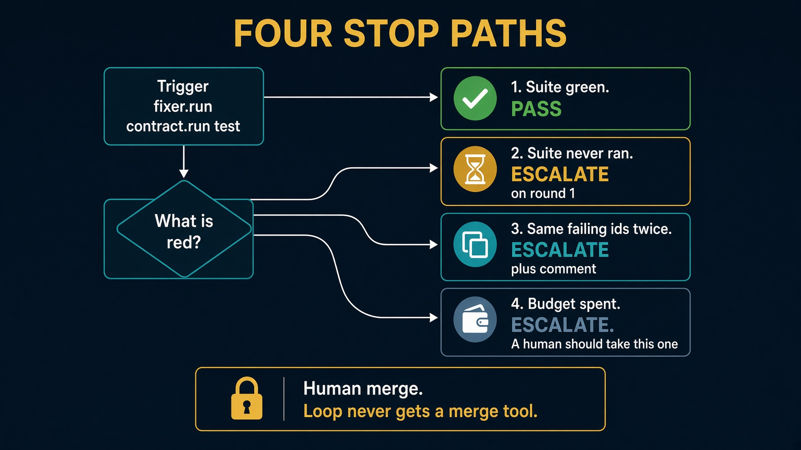
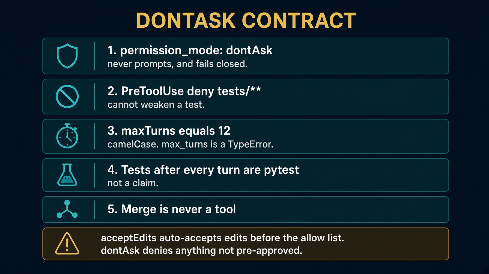

# sol4_fixer_agent_sdk

The working Module 4 loop. A failing branch in. A green one out, or an honest explanation.

`query()`, not `ClaudeSDKClient`. `permission_mode: dontAsk`. Merge is never a tool.

Saturday fills two stubs in `labs/lab4_fixer`. Demo `broken-pr` from here.

Read `HOW_TO_RUN.md`, `DESIGN_DOC.md`, and `E2E_PLAN.md`.


---

# Layout

```
loop.py       summarize_failure + repair_until_green wrappers
fixer.py      the while loop
doers.py      none / reference / cli / SDK backend
gates.py      pass, retry, escalate
roles.py      dontAsk, one PreToolUse hook, deny tests/**
tests/        hook deny/allow, same-signature escalate
```

The Deep Agents twin is the graph, not the repair loop.


---

# Setup. Stash first.

```bash
git -C ../../work/northwind-field-crm stash --include-untracked
cd solutions/sol4_fixer_agent_sdk
echo 'ANTHROPIC_API_KEY=sk-ant-...' >> ../../.env
task setup          # .venv + claude-agent-sdk. PEP 668.
task clone
task reset          # checkout broken-pr. Refuses a dirty clone.
```

Say the stash out loud. That refusal is on brand.


---

# Scripts with no model

```bash
task table          # judge writes must print no
task test
```

If judge prints `yes`, stop. Neither needs a key, the SDK, or a clone.


---

# Architecture



Cast is three roles. No planner. See `docs/diagrams/architecture.svg`.


---

# Five unattended lines



`acceptEdits` auto-accepts edits before the allow list. `dontAsk` denies anything not pre-approved.


---

# Doers

| Spec | Needs | Behavior |
|---|---|---|
| `none` | clone | writes nothing. Loop still reports the truth |
| `reference` | clone | copies `known-good` inside `app/**` |
| `sdk` | `task setup` + key | `AgentSdkBackend` wrapping `query()` |

```bash
task run -- --branch broken-pr --doer none
task run -- --branch broken-pr --doer reference
task run -- --branch broken-pr --doer sdk
```

`--research` defaults to `off`. `--doer sdk` refuses if you skipped `task setup`.


---

# Expected `--doer none`

```
attempt 1: 1 failing -> retry
attempt 2: 1 failing -> escalate
gate: escalate
The fixer gave up.
A human should take this one.
```

`--doer reference` against `broken-pr`: `gate: pass`. Files copied from `known-good` inside `app/**` only.


---

# What Python still owns

`summarize_failure` from junit. Four stop paths:

1. Suite green → pass
2. Suite never ran → escalate on round 1
3. Same failing ids twice → escalate, leave a comment
4. Budget spent → escalate, "A human should take this one"

Scope violations escalate even if the suite is green. Spend comes from `total_cost_usd`, so the money gate can fire.


---

# E2E. Disposable clones

Do not use `work/northwind-field-crm` for a live probe. It may hold Lab 2 work.

`E2E_PLAN.md` clones into `/tmp`, prepares the target venv, then runs `--doer none` and `--doer reference` before `--doer sdk`.

`task setup` here installs the SDK. It does not install the CRM's test dependencies.


---

# Troubleshooting

| Symptom | Fix |
|---|---|
| Dirty tree | stash, out loud |
| Green on `none` | same ids twice must escalate |
| Edited a test | full deny envelope on `tests/**` |
| `acceptEdits` in options | must be `dontAsk` |
| Thought DA repaired it | that twin is graph only |


---

# Recap

Same graph, nobody at the keyboard. Reference doer still bound by WriteScope. Human owns merge.

`dontAsk`. Deny `tests/**`. Leave a comment when you give up.

The loop is the product. The prompt is not.
