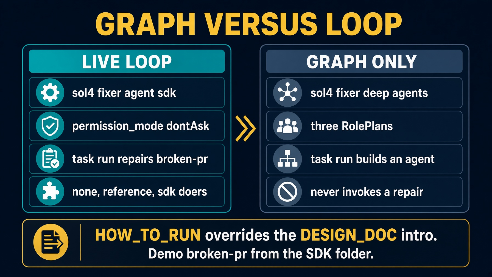

# sol4_fixer_deep_agents

Configuration port. It does **not** run the fixer.

This is the role graph. The live harness is `sol4_fixer_agent_sdk`.

`task run` prints the cast and builds an agent. It never invokes a repair.

Read `HOW_TO_RUN.md` first. It overrides the DESIGN_DOC intro. Then read `E2E_PLAN.md`.


---

# What it proves

```
role                writes  scope
orchestrator        no      nothing
code_implementer    yes     app/**, src/**   denied tests/**
judge               no      nothing
```

Missing on purpose: `fixer.py`, `doers.py`. The tests pin the graph.

Live repair is `sol4_fixer_agent_sdk`. `backend(contract)` exists. `main` never calls it.


---

# Setup

```bash
cd solutions/sol4_fixer_deep_agents
cp config.json.example config.json
echo 'ANTHROPIC_API_KEY=sk-ant-...' >> ../../.env
task setup          # .venv + deepagents>=0.7
task clone
task reset          # checkout broken-pr. Refuses a dirty clone.
```

`task reset` still matters. A dirty clone is Lab 2 work you must not delete.


---

# Scripts with no model

```bash
task table          # judge writes must print no
task test
```

If judge prints `yes`, stop. Neither needs Deep Agents, a key, or a clone.

Missing repo plus `--table-only`: prints declared scopes, exit 0. Without `--table-only`, `ContractError` raises.


---

# Architecture



No while loop. No junit. HOW_TO_RUN overrides the DESIGN_DOC intro.


---

# Three fences. Same as the other DA ports.

1. A tool list per subagent. Judge gets `read_file` only.
2. A path check inside the write tool. Refusal is a sentence.
3. A fence around the harness. Virtual filesystem. General-purpose subagent **off**.

```python
@tool(f"write_{role.name}")
def write(path: str, content: str) -> str:
    try:
        scope.check(path)
    except ScopeViolation:
        return f"REFUSED. {role.name} may write {allowed}. {path} is outside that scope."
```


---

# Skills and memory are mounts

`skills/` and `memory/` are not a fourth fence.

A skill loads its instructions when the role is invoked, rather than sitting in every prompt from the start.

`/memory/` routes at `memory/`, not this folder. Routing it at the solution root would hand the agent this folder's own source.


---

# Why three roles, not five

The work is already defined by what is red. No planner. No test implementer.

The judge reads junit. The coder may write `app/**` and may not write `tests/**`.

`DEFAULT_LOOP` and `LOOP` are both `"fixer"`. A caller still names its loop at every site. A test in the folder pins both.


---

# Commands

```bash
task table
task test
task run --
```

`task run` needs `task setup` and the clone. Extra flags after `--` go to `loop.py`.

This folder will not edit a failing test into passing. It will not paste `SKILL.md` into a subagent prompt.


---

# Troubleshooting

| Symptom | Fix |
|---|---|
| Expected a green branch | config port. Use the Agent SDK folder |
| Judge writes `yes` | tools = `[read_file]` |
| Raises on missing repo | `--table-only` is the self-check |
| Dirty clone on reset | stash Lab 2 work first |
| DESIGN_DOC says it repairs | HOW_TO_RUN is the operator contract |


---

# Recap

Same table, Deep Agents enforcement knob. This is graph without a loop.

Use `sol4_fixer_agent_sdk` when you want a green branch or an honest comment.

`task setup`, `task table`, `task test`, `task run`. Read `HOW_TO_RUN.md`.
