<!--
id: s1-01
layout: title
minutes: 1
beat: talk
-->

# Engineering reliable agentic AI systems

Session 1. System Architecture, the foundation.
Saturday 29 August 2026. 10:00 Central.

---

<!--
id: s1-02
layout: split-right
minutes: 2
beat: talk
image: images/four-artifacts.png
image_prompt: >
  16:9 clean infographic. Four stacked artifacts as physical objects on a bench.
  1 a small running loop as a glowing ring. 2 a harness as a caliper and a
  checklist. 3 a research assistant as a notebook with one tool plug. 4 a factory
  building with a workflow file pinned to the wall. Neutral paper, one green
  accent. No logos. No vendor marks.
-->

# Four artifacts. You leave with all four.

- A running autonomous loop, in the first hour
- A reusable evaluation harness
- One live research assistant over Model Context Protocol (MCP)
- A production architecture you can hand to your team


---

<!--
id: s1-03
layout: split-right
minutes: 2
beat: talk
image: images/prompting-volume.png
image_prompt: >
  16:9 editorial. One engineer at a desk. The monitor fans into a dozen identical
  chat transcripts. Quality visibly degrades as the copies recede. Cool gray.
  One green thread still intact on the nearest copy. No readable text. No logos.
-->

# Prompting dies under volume.

- One clever prompt works once.
- Ten tickets a day, it drifts.
- A hundred, and nobody remembers what good looked like.
- The bottleneck is not the model. It is you, reading every diff.


---

<!--
id: s1-04
layout: figure-bottom
minutes: 2
beat: talk
-->

# A loop is not "call the model until it says done."

A production loop is a state machine. Every iteration:

1. starts from **explicit state**, not from chat history,
2. gets **bounded authority**, not the whole repo,
3. produces **observable evidence**, not a claim,
4. and passes through a transition function **you** enforce, not the model.

Take away any one of the four and you have a generator with a while loop.

---

<!--
id: s1-05
layout: split-left
minutes: 2
beat: talk
image: images/alphacodium-jump.png
image_prompt: >
  16:9. A simple bar chart drawn on graph paper, two bars only. The short bar is
  gray and the tall bar is green, roughly double. A caliper rests beside the tall
  bar. Hand-drawn axis, no numbers rendered as text. No logos.
-->

# The evidence for looping is not vibes.

AlphaCodium, on the CodeContests validation set:

| Approach | pass@5 |
|---|---|
| One well-designed direct prompt | 19% |
| Plan, generate against tests, iterate | 44% |

Same model. The flow did that, not the prompt.
<br/><small>Ridnik et al., arXiv:2401.08500</small>


---

<!--
id: s1-06
layout: split-right
minutes: 1
beat: talk
image: images/crm-target-repo.png
image_prompt: >
  16:9. Two repository folders side by side on a workbench. The left one is
  labeled ENGINE and holds gears. The right one is labeled TARGET and holds a
  paper task card with an empty due date box. A cable joins them, labeled
  Taskfile. Paper and green ink. No vendor UI. No logos.
-->

# The object is a CRM, and it lives in another repo.

- A small customer relationship management app. Customers. Sales tasks.
- Not a ticketing app. Too meta.
- The engine never imports it. You point the loop at a path.
- First ticket: add a due date. Vague on purpose.


---

<!--
id: s1-07
layout: lab
minutes: 1
beat: talk
-->

# The clock, and permission to fall behind.

- 10 minutes open. 45 this module. Then a break.
- The lab is 25 minutes of typing, not 45.
- Stuck? Stop typing and watch. Copy `solutions/sol1_enhancer/.claude/` in
  and you continue with a working artifact.

Nobody leaves this room behind.

---

<!--
id: s1-08
layout: section
minutes: 0
beat: talk
-->

# Anatomy of an agent loop

Trigger. Action. Verify. Memory. Human oversight.

---

<!--
id: s1-09
layout: figure-top
minutes: 2
beat: talk
-->


Five parts. **Verify** is the one that separates a loop from a script that calls
a model.

---

<!--
id: s1-10
layout: split-right
minutes: 2
beat: talk
image: images/trigger-ticket.png
image_prompt: >
  16:9 close crop of a manila folder tab reading T001. Inside, a short list of
  bullets, two of them blank. A faint draft page underneath is scribbled and
  thin. Paper, brass fastener. No laptop. No logos.
-->

# Trigger

- Something outside the model starts the work.
- Ours today: a draft markdown ticket in the target repo.
- Not a chat. Not "hey, add due dates."
- In production it is a webhook or a schedule, and it fires only when the
  branch head actually moved. A trigger that fires on no change burns budget.


---

<!--
id: s1-11
layout: split-right
minutes: 2
beat: talk
image: images/scope-is-a-type.png
image_prompt: >
  16:9. A desk with a single drawer open, holding exactly one file. Every other
  drawer has no handle at all, so it cannot be opened. A small label reads
  write scope. Graphite and green. No logos.
-->

# Action, inside a scope you declared

- A **doer** writes files. Only inside a declared scope.
- The scope lives in `.loop.yml`, in the target repo.
- It is enforced at the tool boundary, not in the prompt.

An agent can argue its way past an instruction. It cannot argue its way past a
tool it was never given.


---

<!--
id: s1-12
layout: split-left
minutes: 2
beat: talk
image: images/judge-no-hands.png
image_prompt: >
  16:9. A figure at a lectern reading a scorecard aloud. The lectern has no
  keyboard, no pen, no drawer. Behind it, a locked cabinet labeled files.
  Calm workshop poster style. No logos.
-->

# Verify

- A **judge** scores the result. It reports, and that is all it does.
- The judge holds no write path. Not a rule. A missing method.
- Today it answers: is this ticket a contract a test could fail?

If verify is "looks good to me," you do not have a loop. You have a generator.


---

<!--
id: s1-13
layout: split-right
minutes: 2
beat: talk
image: images/context-middle.png
image_prompt: >
  16:9. A long paper scroll pinned at both ends. The text at the top and the
  bottom is crisp. The middle third is faded almost to nothing. A small green
  tag marks the fade. Paper texture. No readable words. No logos.
-->

# Memory, and why the context window is not it

Liu et al. 2024 measured it. Accuracy is highest when the fact sits at the
**start** or the **end** of the context. Move it to the middle and accuracy drops
by more than 30%.

- Reproduced on GPT-4, Claude, MPT-30B, and Cohere Command.
- So state goes on disk: the ticket, the trace, the plan.
- Big output goes to a file. Only a short summary returns to the orchestrator.


---

<!--
id: s1-14
layout: split-right
minutes: 2
beat: talk
image: images/human-merges.png
image_prompt: >
  16:9. A merge box with a human hand resting on the lid. The agent stands aside
  holding a finished document. The hand is the only thing that can open the box.
  Calm. No violence. No logos.
-->

# Human oversight

- The loop proposes. A human accepts.
- Today: the loop rewrites the ticket. You decide it is a contract.
- In Module 2 the loop opens a pull request. It still does not merge.

Oversight is a designed step, not a hope.


---

<!--
id: s1-15
layout: figure-bottom
minutes: 2
beat: talk
-->

# Three parts, and the object is the only variable.



| Module | Object |
|---|---|
| 1 | A draft ticket |
| 2 | A ready ticket, and the code that satisfies it |
| 3 | A question |
| 4 | A failing pull request |

Same graph, four times. Learn it once.

---

<!--
id: s1-16
layout: lab
minutes: 25
beat: lab
-->

# Lab 1. The Ticket Enhancer. 25 minutes.

```bash
cd labs/lab1_enhancer
claude -p "$(cat prompts/claude-code.md)"     # or codex, grok, opencode

task loop:enhancer -- --ticket T001           # it escalates. that is correct.
task loop:enhancer -- --ticket T001 --incorporate
```

Fill `loop.py`. Two functions: `judge_ticket` and `decide_next`.

This lab writes no code, so the push gate stays quiet. You meet it in Module 2.

Falling behind is fine: copy the answer from `solutions/sol1_enhancer/`.

---

<!--
id: s1-17
layout: figure-bottom
minutes: 2
beat: lab
-->

# Read the trace. The interesting run is the one that stops.

```
round 1: feature, not ready
  missing: why it is worth doing
  missing: acceptance criteria a test can fail
round 2: feature, not ready
  missing: why it is worth doing
  missing: acceptance criteria a test can fail

gate: escalate
reason: the same rows failed twice. The loop is not converging.
```

An iteration that burns tokens and reproduces the identical failure is not
progress. Stopping is the feature.

---

<!--
id: s1-18
layout: split-right
minutes: 2
beat: bridge
image: images/oneshot-breaks.png
image_prompt: >
  16:9 triptych. Panel 1, an empty contract form. Panel 2, a loop that never
  stops, drawn as a ring with no exit. Panel 3, a context window stuffed with
  whole files until the seam tears. Same gray-green palette. No logos.
-->

# Where this breaks at scale

- **No contract.** The doer invents the field type, and you find out in review.
- **No stop.** It edits forever, and the bill arrives on Monday.
- **No scope.** It weakens the test instead of fixing the code.
- **Context rot.** The whole repo goes into the window and quality falls.

Each one has a fix. All four fixes are Module 2.


---

<!--
id: s1-19
layout: title
minutes: 1
beat: bridge
-->

# Break. 15 minutes.

Next: the harness. Two doers, a red gate, ten rubric rows, and a gate that
refuses to let you push.

Module 2 is the one that does not get cut.
