<!--
id: s1-01
layout: title
minutes: 1
beat: talk
_class: lead
notes: You are here to engineer a loop, not to collect prompts. Say the time out loud. 10:00 Central, 11:00 Eastern.
-->

<!-- _class: lead -->

<div class="hero">
<div>

# Engineering reliable agentic AI systems

Session 1. System Architecture, the foundation.

Saturday 29 August 2026. 10:00 Central.

Rick Hightower. Spillwave. Packt workshop.

</div>


</div>

---

<!--
id: s1-02
layout: split-right
minutes: 1
beat: talk
notes: Do not collect war stories. One sentence on who you are, then the promise.
-->

# Engineers who already live in the tools.

- Software, AI, platform, DevOps, architects, tech leads.
- You already use Claude Code, Codex, Cursor, Gemini, or similar.
- The failure is not that you cannot prompt. It is that prompting does not scale.
- Instructor: Rick Hightower. Principal architect for agentic AI at Spillwave.

---

<!--
id: s1-03
layout: figure-bottom
minutes: 2
beat: talk
image: images/four-artifacts.jpg
image_prompt: >
  16:9 clean infographic. Four stacked artifacts as physical objects on a bench.
  1 a small running loop as a glowing ring. 2 a harness as a caliper and a
  checklist. 3 a research assistant as a notebook with one tool plug. 4 a factory
  building with a workflow file pinned to the wall. Neutral paper, one green
  accent. No logos. No vendor marks.
notes: Promise exactly four things. All four run from a clean clone with one command.
-->

<!-- _class: diagram -->

# Four artifacts. You leave with all four.

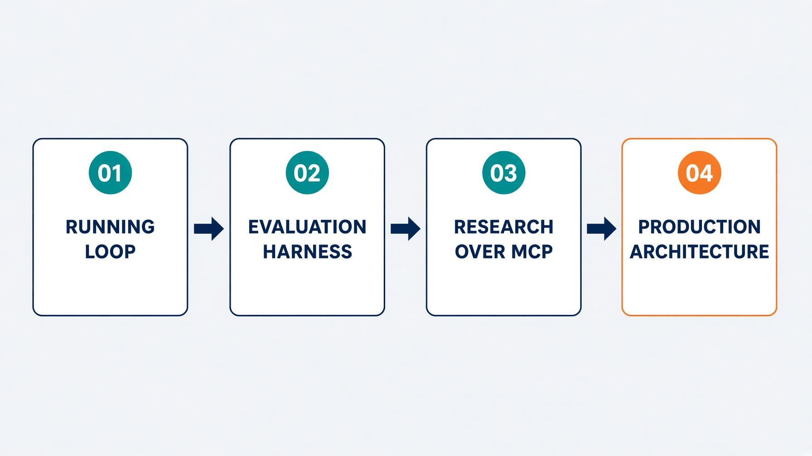

---

<!--
id: s1-04
layout: figure-bottom
minutes: 1
beat: talk
notes: If a lab runs long, cut talk. Do not cut Module 2. Do not reteach 20 August.
-->

# Four hours of teaching. Module 2 does not get cut.

| Block | Start | Minutes |
|---|---|---|
| Open | 10:00 | 10 |
| Module 1 anatomy + lab | 10:10 | 45 |
| Break | 10:55 | 15 |
| Module 2 harness | 11:10 | 55 |
| Break | 12:20 | 15 |
| Module 3 research + MCP | 12:35 | 40 |
| Break | 13:30 | 15 |
| Module 4 production | 13:45 | 35 |
| Close | 14:20 | 10 |

---

<!--
id: s1-05
layout: split-right
minutes: 2
beat: talk
image: images/prompting-volume.jpg
image_prompt: >
  16:9 editorial. One engineer at a desk. The monitor fans into a dozen identical
  chat transcripts. Quality visibly degrades as the copies recede. Cool gray.
  One green thread still intact on the nearest copy. No readable text. No logos.
notes: Ask who has a prompt that worked brilliantly once and never again. Hands go up. Move on.
-->

# Prompting dies under volume.

- One clever prompt works once.
- Ten tickets a day, it drifts.
- A hundred, and nobody remembers what good looked like.
- The bottleneck is not the model. It is you, reading every diff.

---

<!--
id: s1-06
layout: figure-bottom
minutes: 2
beat: talk
notes: This is the definition of the day. Read it slowly.
-->

# The unit of work is a controlled loop, not a single generation.

You write the system that triggers, acts inside a scope, verifies against a contract, remembers on disk, and stops or escalates under explicit exits.

Prompting does not scale under volume. The leverage moves to the design of the loop itself. A generator with a while loop is not this.

---

<!--
id: s1-07
layout: figure-bottom
minutes: 2
beat: talk
notes: Read the four items slowly. Say the last one twice. The model does not enforce its own transition, and that is the whole workshop.
-->

<!-- _class: diagram -->

# A loop is not "call the model until it says done."

A production loop is a state machine. Every iteration:

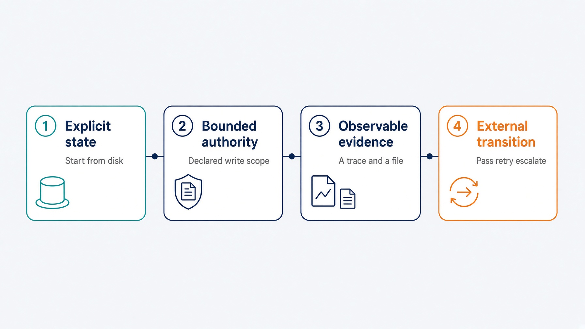

---

<!--
id: s1-08
layout: figure-bottom
minutes: 2
beat: talk
notes: ReAct is the inner cycle. The product you ship is the outer control system around it. Name it: Loop Engineering.
-->

<!-- _class: diagram -->

# The primitive cycle is still ReAct. The product is the outer control system.

That outer control system is Loop Engineering.

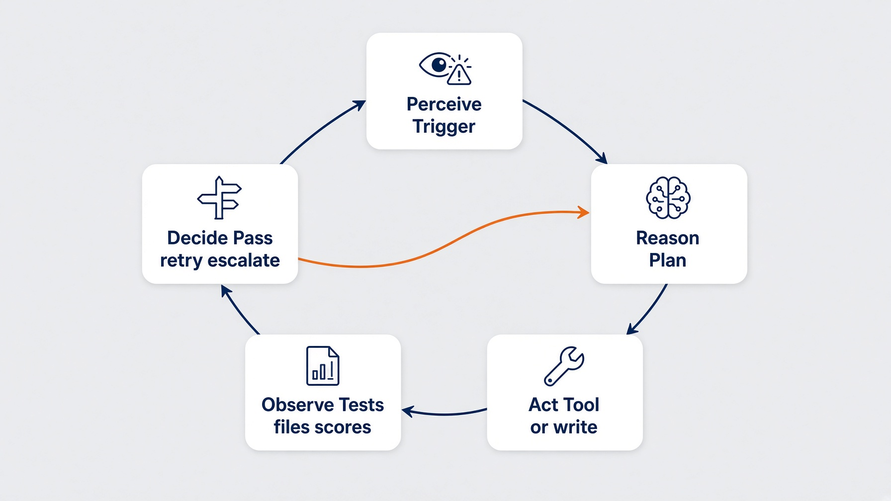

<small>Yao et al., ReAct, arXiv:2210.03629</small>

---

<!--
id: s1-09
layout: figure-bottom
minutes: 2
beat: talk
notes: Give them one number they can quote to their manager. 19 to 44 on pass@5, same model, different flow. Do not oversell replication.
-->

<!-- _class: diagram -->

# The jump is the flow, not the prompt.


AlphaCodium, CodeContests validation set. Same model. The flow did that.

<small>Ridnik, Kredo, Friedman. arXiv:2401.08500</small>

---

<!--
id: s1-10
layout: figure-bottom
minutes: 1
beat: talk
notes: The lesson is not the exact call count. Iteration against tests beat a clever prompt on the same weights.
-->

# Flow engineering is more calls, and still cheaper than you in the loop.

AlphaCodium uses about 15 to 20 LLM calls per solution. A pass@5 submission is roughly 100 calls.

The lesson for this room is not the exact number. It is that iteration against tests beat a clever prompt on the same weights.

---

<!--
id: s1-11
layout: split-left
minutes: 2
beat: talk
image: images/crm-target-repo.jpg
image_prompt: >
  16:9. Two repository folders side by side on a workbench. The left one is
  labeled ENGINE and holds gears. The right one is labeled TARGET and holds a
  paper task card with an empty due date box. A cable joins them, labeled
  Taskfile. Paper and green ink. No vendor UI. No logos.
notes: The engine never imports the CRM. That is what makes it point at their repo on Monday.
-->

# The object is a CRM, and it lives in another repo.

- Northwind Field CRM. Customers. Sales tasks.
- Not a ticketing app. Too meta.
- The engine never imports it. You point the loop at a path.
- First ticket: add a due date. Vague on purpose.

---

<!--
id: s1-12
layout: figure-bottom
minutes: 2
beat: talk
notes: Monday morning they point this at their backlog. The interface is Taskfile.yml plus junit.xml.
-->

<!-- _class: diagram -->

# Monday morning, you point this at your backlog.

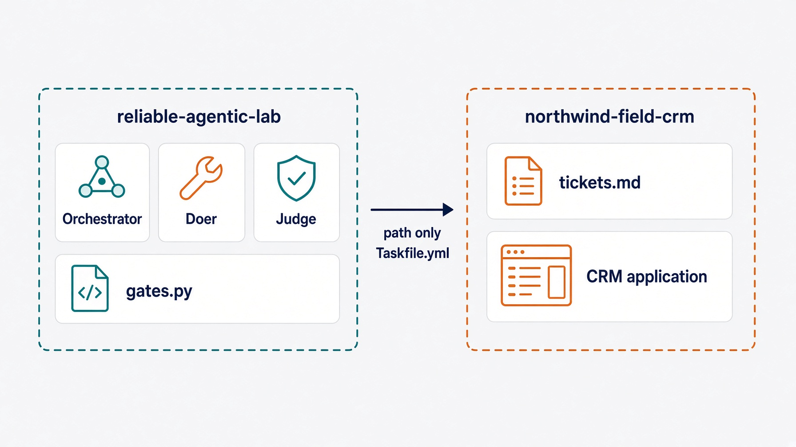

The interface is `Taskfile.yml` plus `junit.xml`. That is the only contract the loops need.

---

<!--
id: s1-13
layout: lab
minutes: 1
beat: talk
notes: Say the fall-behind rule now. Copying solutions/sol1_enhancer/.claude/ puts a working enhancer in their tree. You should be at 10 minutes here.
-->

# The clock, and permission to fall behind.

- 10 minutes open. 45 this module. Then a break.
- The lab is 25 minutes of typing, not 45.
- Stuck? Stop typing and watch.
- Copy `solutions/sol1_enhancer/.claude/` and you continue with a working artifact.

Nobody leaves this room behind.

---

<!--
id: s1-14
layout: section
minutes: 0
beat: talk
_class: lead
notes: Section card. Do not linger.
-->

# Anatomy of an agent loop

Trigger. Action. Verify. Memory. Human oversight.

---

<!--
id: s1-15
layout: figure-top
minutes: 2
beat: talk
notes: Point at Verify. That is the one that separates a loop from a script that calls a model.
-->

<!-- _class: diagram -->

# Five parts. Verify is the one that is not optional.


Five parts. **Verify** is the one that separates a loop from a script that calls a model.

---

<!--
id: s1-16
layout: split-right
minutes: 2
beat: talk
image: images/trigger-ticket.jpg
image_prompt: >
  16:9 close crop of a manila folder tab reading T001. Inside, a short list of
  bullets, two of them blank. A faint draft page underneath is scribbled and
  thin. Paper, brass fastener. No laptop. No logos.
notes: A trigger is not a chat. Ours today is a draft markdown ticket in the target repo.
-->

# Trigger

- Something outside the model starts the work.
- Ours today: a draft markdown ticket in the target repo.
- Not a chat. Not "hey, add due dates."
- In production it is a webhook or a schedule, and it fires only when the branch head actually moved.

---

<!--
id: s1-17
layout: figure-bottom
minutes: 1
beat: talk
notes: A trigger that fires on no change burns budget for no work. Module 4 comes back to it.
-->

<!-- _class: diagram -->

# The shape of a trigger changes. The rule does not.

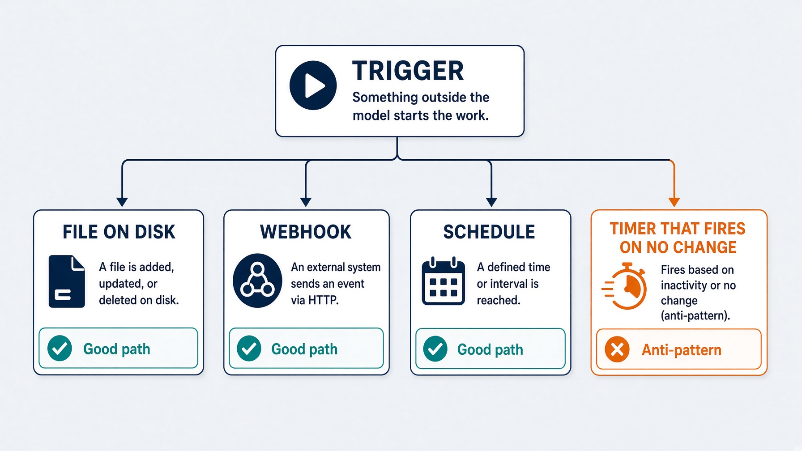

---

<!--
id: s1-18
layout: split-right
minutes: 2
beat: talk
image: images/scope-is-a-type.jpg
image_prompt: >
  16:9. A desk with a single drawer open, holding exactly one file. Every other
  drawer has no handle at all, so it cannot be opened. A small label reads
  write scope. Graphite and green. No logos.
notes: An agent can argue past an instruction, and cannot argue past a tool it was never given.
-->

# Action, inside a scope you declared

- A **doer** writes files. Only inside a declared scope.
- The scope lives in `.loop.yml`, in the target repo.
- It is enforced at the tool boundary, not in the prompt.

An agent can argue its way past an instruction. It cannot argue its way past a tool it was never given.

---

<!--
id: s1-19
layout: figure-bottom
minutes: 2
beat: talk
notes: Deny always beats allow. In Python, Judge has no write method. In the Claude Code lab, neither agent carries a write tool.
-->

<!-- _class: diagram -->

# Write scope is a type, not a polite request.

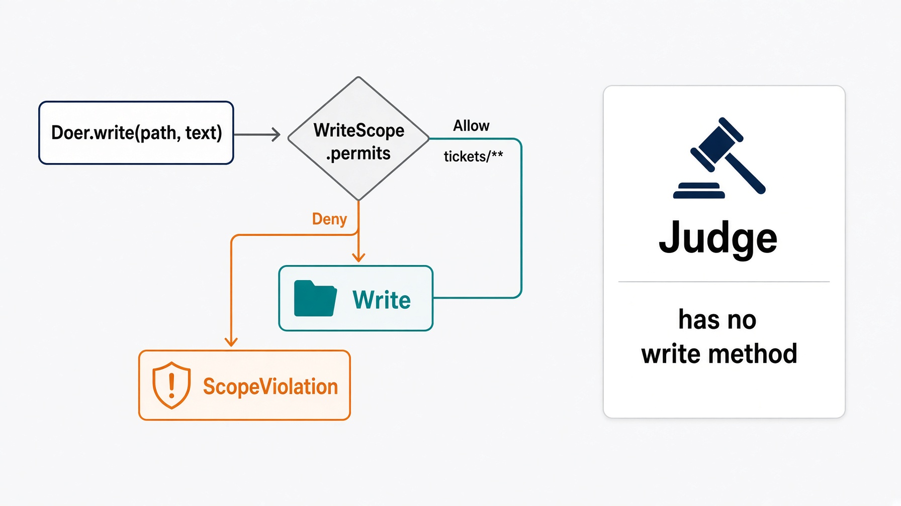

Deny always beats allow. In Python, `Judge` has no `write` method. In the Claude Code lab, `enhancer-judge` and `enhancer-doer` carry no write tool in their agent definitions.

---

<!--
id: s1-20
layout: split-left
minutes: 2
beat: talk
image: images/maker-checker.jpg
image_prompt: >
  16:9. A figure at a lectern reading a scorecard aloud. The lectern has no
  keyboard, no pen, no drawer. Behind it, a locked cabinet labeled files.
  Calm workshop poster style. No logos.
notes: The judge reports. It does not fix. If verify is looks good to me, you have a generator.
-->

# Verify

- A **judge** scores the result. It reports, and that is all it does.
- The judge holds no write path. Not a rule. A missing method.
- Today it answers: is this ticket a contract a test could fail?

If verify is "looks good to me," you do not have a loop. You have a generator.

---

<!--
id: s1-21
layout: figure-bottom
minutes: 2
beat: talk
notes: Same model plus same context plus same reasoning process is not a checker. The split is architectural.
-->

<!-- _class: diagram -->

# Never let the AI verify its own done.

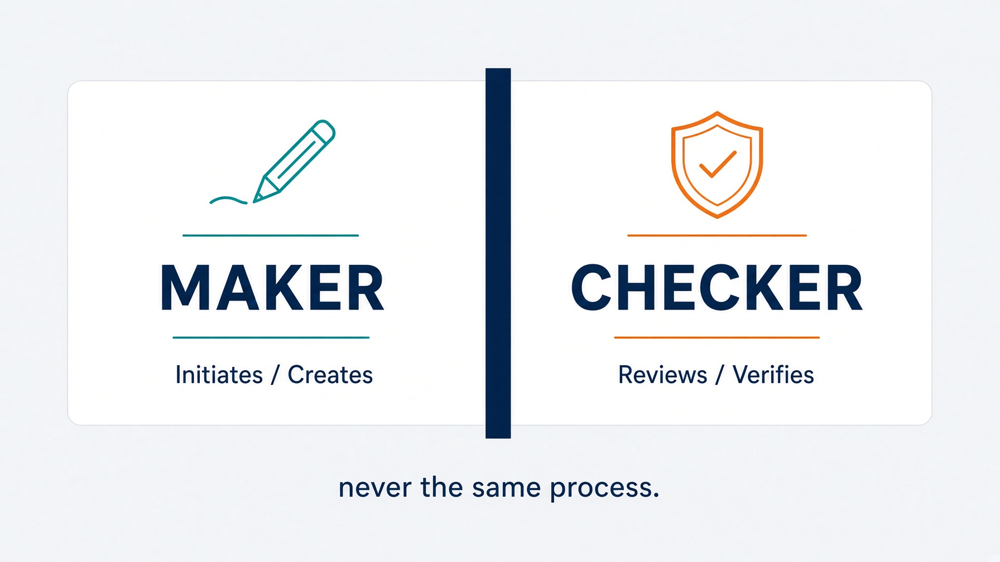

Same model plus same context plus same reasoning process is not a checker. The split is architectural.

---

<!--
id: s1-22
layout: figure-bottom
minutes: 2
beat: talk
notes: Read the docstring out loud. Adding a write method is not a convenience. It is the end of the split.
-->

# Judge has no write method to call.

```python
@dataclass
class Judge(Role):
    """Scores work. Holds no write path.

    There is deliberately no `write` method on this class.
    Adding one is not a convenience. It is the end of the split.
    """

    def read(self, relative: str) -> str:
        return (self.repo / relative).read_text(encoding="utf-8")
```

<small>`labs/lab1_enhancer` · judge has no write tool</small>

---

<!--
id: s1-23
layout: figure-bottom
minutes: 2
beat: talk
notes: pass, retry, escalate. The forgotten exit is stable failure. Python holds the loop.
-->

<!-- _class: diagram -->

# Three exits, and no fourth. Python holds the loop.

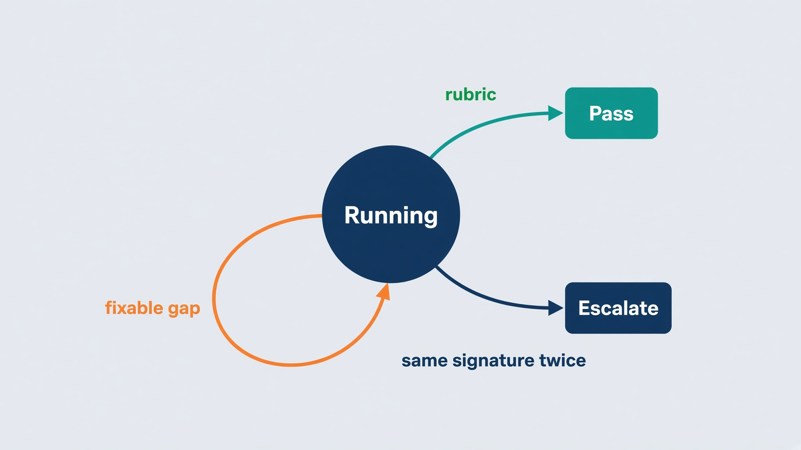

`pass`, `retry`, `escalate`. The one people miss is stable failure.

---

<!--
id: s1-24
layout: figure-bottom
minutes: 2
beat: talk
notes: signature is what failed, not how it was worded. Two equal signatures mean the last attempt changed nothing.
-->

<!-- _class: diagram -->

# The same gaps twice is not progress. Stopping is the feature.

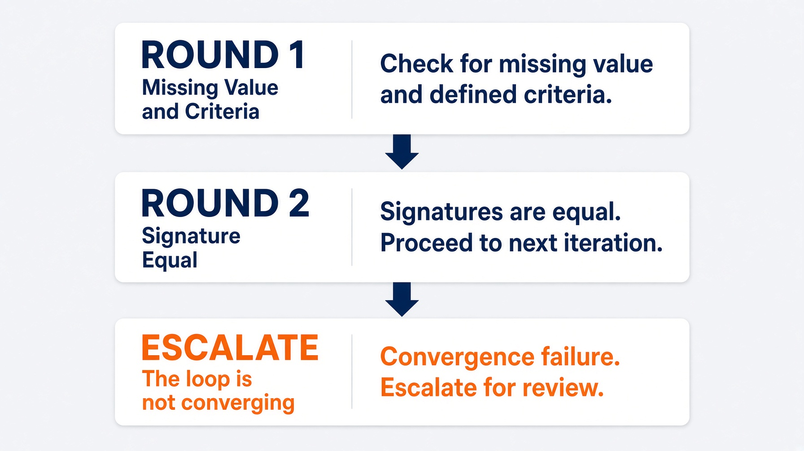

`signature` is what failed, not how it was worded. Two equal signatures mean the last attempt changed nothing.

<small>`labs/lab2_implementer/gates.py` · `decide()`</small>

---

<!--
id: s1-25
layout: split-right
minutes: 2
beat: talk
image: images/context-middle.jpg
image_prompt: >
  16:9. A long paper scroll pinned at both ends. The text at the top and the
  bottom is crisp. The middle third is faded almost to nothing. A small green
  tag marks the fade. Paper texture. No readable words. No logos.
notes: More than 30 percent accuracy drop when the fact sits in the middle. Big output goes to a file. A short summary comes back.
-->

# Memory, and why the context window is not it

Liu et al. 2024 measured it. Accuracy is highest when the fact sits at the **start** or the **end** of the context. Move it to the middle and accuracy drops by more than 30%.

- Reproduced on GPT-4, Claude, MPT-30B, and Cohere Command.
- So state goes on disk: the ticket, the trace, the plan.

<small>Liu et al., TACL 2024. arXiv:2307.03172</small>

---

<!--
id: s1-26
layout: figure-bottom
minutes: 1
beat: talk
notes: That rule is why the planner is its own subagent in Module 2.
-->

<!-- _class: diagram -->

# Big output goes to a file. Only a short summary returns.

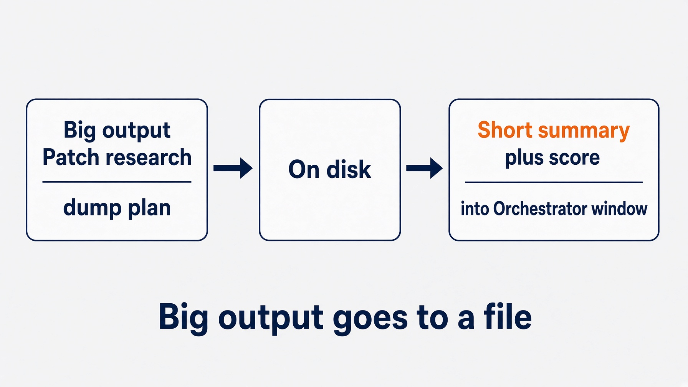

That rule is why the planner is its own subagent in Module 2.

---

<!--
id: s1-27
layout: split-right
minutes: 2
beat: talk
image: images/human-merges.jpg
image_prompt: >
  16:9. A merge box with a human hand resting on the lid. The agent stands aside
  holding a finished document. The hand is the only thing that can open the box.
  Calm. No violence. No logos.
notes: Today LGTM. In Module 2 a pull request. Never merge.
-->

# Human oversight

- The loop proposes. A human accepts.
- Today: the loop rewrites the ticket. You decide it is a contract.
- The only human input on the issue is a comment: `LGTM`.
- In Module 2 the loop opens a pull request. It still does not merge.

Oversight is a designed step, not a hope.

---

<!--
id: s1-28
layout: figure-bottom
minutes: 1
beat: talk
notes: Merge, money, and production deploy stay human. Say that twice.
-->

<!-- _class: diagram -->

# Merge, money, and production deploy stay human.

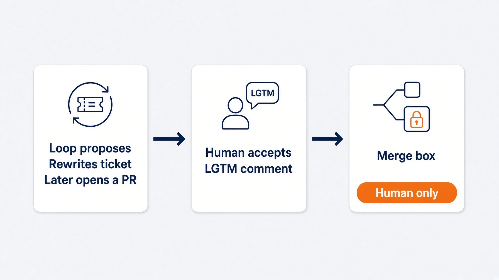

---

<!--
id: s1-29
layout: figure-bottom
minutes: 2
beat: talk
notes: Three parts. Orchestrator owns the budget and writes nothing. Doer writes inside a scope. Judge scores and has no write path.
-->

<!-- _class: diagram -->

# Three parts. The object is the only variable.

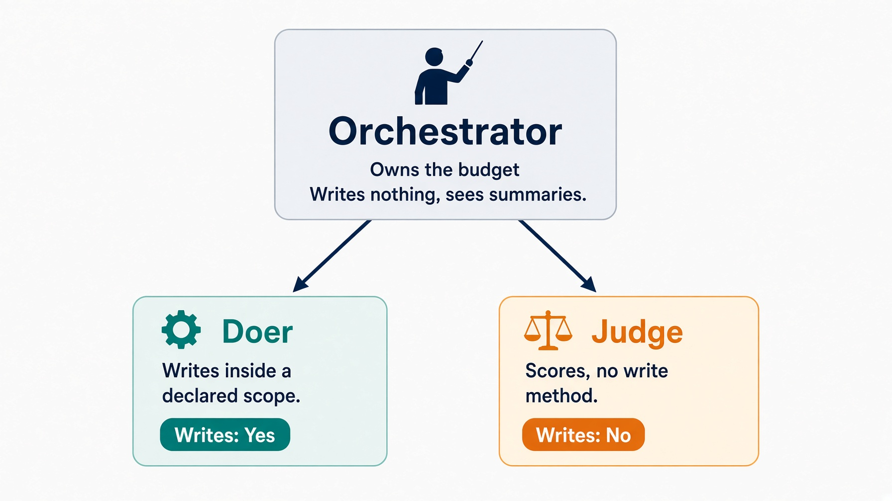

---

<!--
id: s1-30
layout: figure-bottom
minutes: 2
beat: talk
notes: This is the map for the whole day. Spend the full two minutes. Name the collision once: this picture is the role graph. Graph Engineering is the Module 2 plan file. Then drop it.
-->

<!-- _class: diagram -->

# Same graph, four objects. Learn it once.


| Module | Object | Lab |
|---|---|---|
| 1 | A draft ticket | Enhancer |
| 2 | A ready ticket, and the code that satisfies it | Implementer |
| 3 | A question | Research |
| 4 | A failing pull request | Fixer |

This picture is the role graph. Graph Engineering is Module 2: intent becomes `steps.jsonl`. Not LangGraph.

---

<!--
id: s1-31
layout: figure-bottom
minutes: 2
beat: talk
notes: Read .harness/last-enhancer.json in the lab. That is the trace.
-->

<!-- _class: diagram -->

# Context windows reset. Ticket files do not.

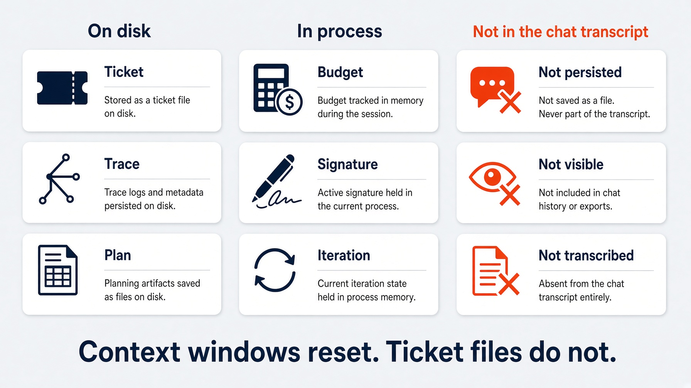

Read `.harness/last-enhancer.json` in the lab. That is the trace.

---

<!--
id: s1-32
layout: figure-bottom
minutes: 2
beat: talk
notes: Walk the sequence once. The orchestrator is the only writer. The agents return text.
-->

<!-- _class: diagram -->

# Ticket enhancer. Vague in, contract out.

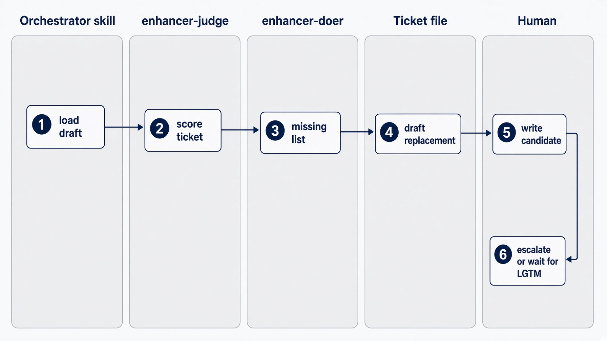

---

<!--
id: s1-33
layout: figure-bottom
minutes: 2
beat: talk
notes: Deterministic where it can be. A criterion that names a section is checkable without a model.
-->

<!-- _class: diagram -->

# A feature ticket is a contract a test can fail.

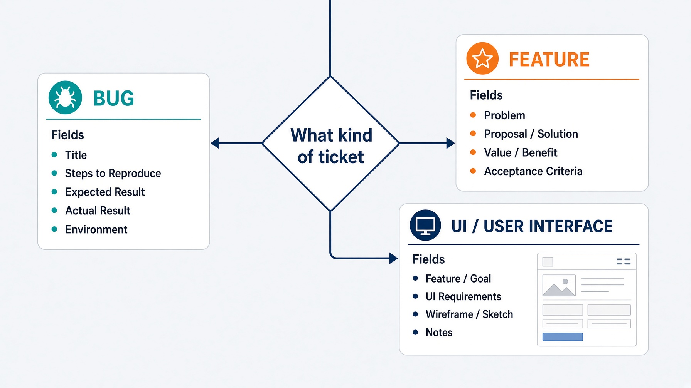

Deterministic where it can be. A criterion that names a section is checkable without a model.

<small>`labs/lab1_enhancer` · required fields by kind</small>

---

<!--
id: s1-34
layout: figure-bottom
minutes: 2
beat: talk
notes: Four collapses. Each one is a missing harness piece, not a model failure.
-->

<!-- _class: diagram -->

# If you take away verify, stop, scope, or disk, the loop collapses.

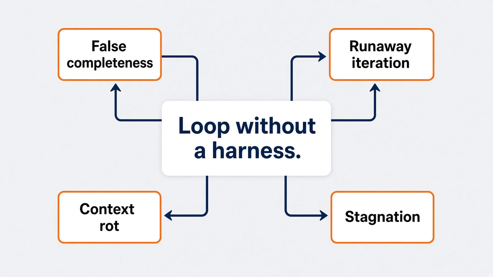

| Failure | Root cause | Symptom |
|---|---|---|
| False completeness | Self-verification | "Done" with placeholders |
| Runaway iteration | Missing hard stop | Token burn |
| Context rot | Unmanaged history | Quality falls after a handful of turns |
| Stagnation | No progress detection | Same two states forever |

---

<!--
id: s1-35
layout: section
minutes: 0
beat: lab
_class: lead
notes: Lab card. 25 minutes. Walk the room. Do not reteach the architecture.
-->

# Lab 1. The Ticket Enhancer

25 minutes. A vague ticket in. A ready contract out.

---

<!--
id: s1-36
layout: figure-bottom
minutes: 2
beat: lab
notes: The orchestrator is the only writer. That is a real limitation of the skill form: nothing enforces the round budget except the skill following its own instructions.
-->

<!-- _class: diagram -->

# A skill that owns the loop. Two agents with no write tools.

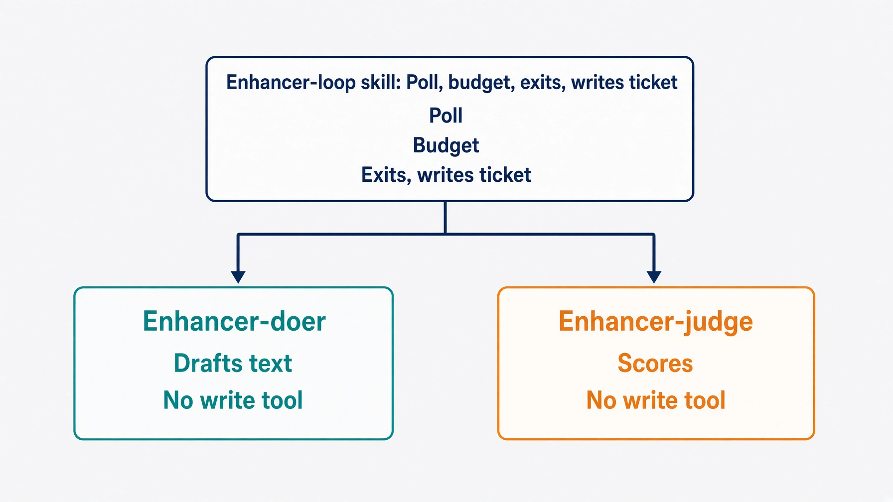

The orchestrator is the only writer. That is a real limitation of the skill form: nothing enforces the round budget except the skill following its own instructions.

---

<!--
id: s1-37
layout: lab
minutes: 20
beat: lab
notes: Walk the room. Do not reteach the architecture. Point at the trace. Falling behind is fine.
-->

# Lab 1. The Ticket Enhancer. 25 minutes.

```bash
cd labs/lab1_enhancer
# Claude Code plugin. Not a Python stub.

task run --
# First poll needs no comment. LGTM is the only human action.
```

Build the plugin from `prompts/claude-code.md`.
Codex, Grok, and OpenCode have native answers.

This lab writes no application code, so the push gate stays quiet.

Falling behind is fine: copy `solutions/sol1_enhancer/.claude/`.

---

<!--
id: s1-38
layout: figure-bottom
minutes: 2
beat: lab
notes: If they only remember one line from the lab, this is it. Stopping is the feature.
-->

# Read the trace. The interesting run is the one that stops.

```
round 1: feature, not ready
  missing: why it is worth doing
  missing: acceptance criteria a test can fail
round 2: feature, not ready
  missing: why it is worth doing
  missing: acceptance criteria a test can fail

gate: escalate
reason: the same rows failed twice. The loop is not converging.
```

An iteration that burns tokens and reproduces the identical failure is not progress. Stopping is the feature.

---

<!--
id: s1-39
layout: section
minutes: 0
beat: bridge
_class: lead
notes: Bridge. Module 1 is a loop that can run once. Module 2 makes it honest.
-->

# Where this breaks at scale

Module 1 is a loop that can run once. Module 2 makes it honest.

---

<!--
id: s1-40
layout: split-right
minutes: 2
beat: bridge
image: images/oneshot-breaks.jpg
image_prompt: >
  16:9 triptych. Panel 1, an empty contract form. Panel 2, a loop that never
  stops, drawn as a ring with no exit. Panel 3, a context window stuffed with
  whole files until the seam tears. Same gray-green palette. No logos.
notes: Each failure has a fix. All four fixes are Module 2.
-->

# Where this breaks at scale

- **No contract.** The doer invents the field type, and you find out in review.
- **No stop.** It edits forever, and the bill arrives on Monday.
- **No scope.** It weakens the test instead of fixing the code.
- **Context rot.** The whole repo goes into the window and quality falls.

Each one has a fix. All four fixes are Module 2.

---

<!--
id: s1-41
layout: figure-bottom
minutes: 1
beat: bridge
notes: Preview only. Do not teach Module 2 here.
-->

<!-- _class: diagram -->

# Module 2 is the one that does not get cut.

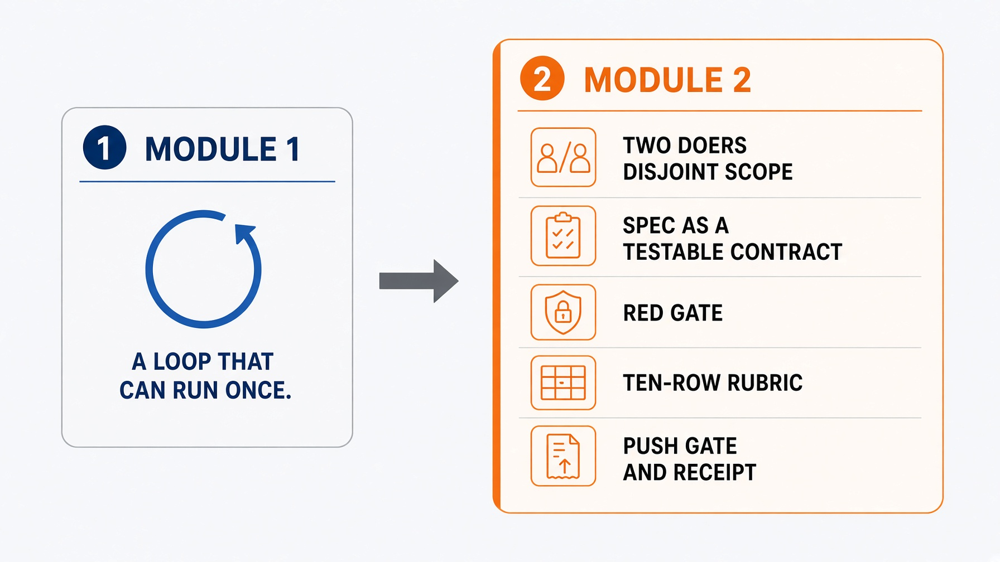

---

<!--
id: s1-42
layout: figure-bottom
minutes: 1
beat: bridge
notes: Six lines. Read them. Do not add a seventh.
-->

# Six lines to keep.

1. A loop is a state machine you enforce.
2. Verify is what separates a loop from a generator.
3. Write scope is a missing method, not a polite request.
4. Three exits. The forgotten one is stable failure.
5. Memory lives on disk. The window is not it.
6. The human still owns irreversible action.

---

<!--
id: s1-43
layout: title
minutes: 1
beat: bridge
_class: lead
notes: Module 2 is the one that does not get cut.
-->

# Break. 15 minutes.

Next: the harness. Two doers, a red gate, ten rubric rows, and a gate that refuses to let you push.

Module 2 is the one that does not get cut.

---

<!--
id: s1-44
layout: figure-bottom
minutes: 0
beat: talk
notes: Bibliography. Skip in the room unless asked.
-->

# Primary references for this session.

- Yao et al. ReAct. arXiv:2210.03629
- Ridnik, Kredo, Friedman. AlphaCodium. arXiv:2401.08500
- Liu et al. Lost in the Middle. TACL 2024. arXiv:2307.03172
- `labs/lab1_enhancer/`, `labs/lab2_implementer/gates.py`
- `labs/lab1_enhancer/ARCHITECTURE.md`
