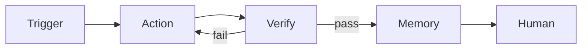
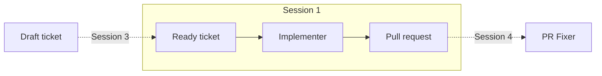
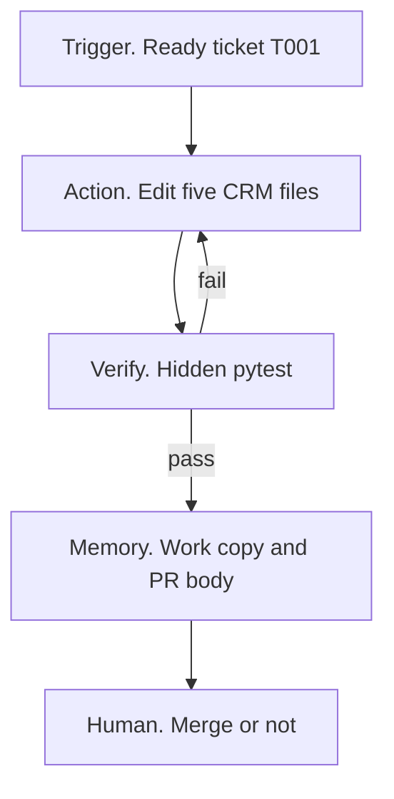
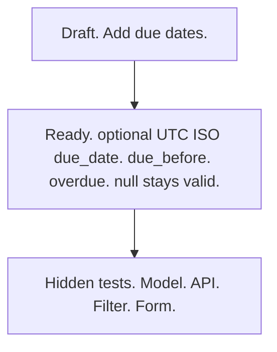
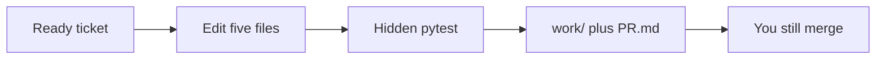

<!--
id: s1-01
layout: title
minutes: 1
beat: talk
-->

# Engineering Reliable Agentic AI Systems

Session 1. System Architecture, the foundation.
Saturday 29 August 2026. 10:00 Central.

---

<!--
id: s1-02
layout: split-right
minutes: 1
beat: talk
image: images/four-artifacts.png
image_prompt: >
  16:9 clean infographic. Four stacked artifacts as physical objects on a bench.
  1 a small running loop as a glowing ring. 2 a harness as a caliper and checklist.
  3 a research assistant as a notebook with one tool plug. 4 a factory building with
  a GitHub-style workflow. Neutral paper, one green accent. No logos. No vendor marks.
-->

# Four artifacts. You leave with all four.

- A running autonomous loop in the first hour
- A reusable evaluation harness
- One live research assistant over Model Context Protocol (MCP)
- A production architecture you can hand to your org


---

<!--
id: s1-03
layout: figure-bottom
minutes: 2
beat: talk
-->

# Loop Engineering is making an agent repeatable.

Prompting dies under volume. By 15:00 you have a loop, a harness, one research assistant, and a deploy.



---

<!--
id: s1-04
layout: split-right
minutes: 1
beat: talk
image: images/prompting-volume.png
image_prompt: >
  16:9 editorial. One engineer at a desk. The monitor fans into a dozen identical
  chat transcripts. Quality visibly degrades as the copies recede. Cool gray.
  One green thread still intact on the nearest copy. No readable text. No logos.
-->

# Prompting dies under volume.

- One clever prompt works once
- Ten tickets a day, it drifts
- A hundred, nobody remembers what good looked like
- The bottleneck is not the model. It is you.


---

<!--
id: s1-05
layout: split-left
minutes: 1
beat: talk
image: images/second-brain-point-back.png
image_prompt: >
  16:9 quiet diagram. A small labeled box "20 August. Repo as second brain."
  An arrow points forward to a larger box "29 August. Grade the loop."
  Paper background. No screenshots of the free-hour deck. No logos.
-->

# We already did architecture. Today we grade.

- 20 August. Repo as second brain. Event log as source of truth.
- We do not rebuild that hour.
- Today we build the missing layer. A loop you can score.


---

<!--
id: s1-06
layout: split-right
minutes: 1
beat: talk
image: images/crm-not-tickets.png
image_prompt: >
  16:9. Two doors. Left door labeled "Ticketing app" is marked wrong, too meta.
  Right door labeled "Small CRM. Customers. Sales tasks." is open, green light.
  Inside: a due date field on a paper task card. No vendor UI. No logos.
-->

# The object is TicketCloser on a CRM.

- Customer relationship management (CRM). Customers. Sales tasks.
- Not a ticketing app. Too meta.
- First ticket: add a due date. Vague on purpose until it is ready.


---

<!--
id: s1-07
layout: figure-bottom
minutes: 2
beat: talk
-->

# Three loops. You do not build all three live.

Today you build the implementer once. The enhancer is Session 3. The fixer is Session 4.



---

<!--
id: s1-08
layout: lab
minutes: 1
beat: talk
-->

# Clock. Fall behind is allowed.

- 10 minutes open. 45 minutes this module. Then a break.
- Stay on the runbook. 25 minutes of typing, not 45.
- Stuck? Stop typing. Watch. Copy `solutions/m1-implementer`. Continue.

---

<!--
id: s1-09
layout: section
minutes: 0
beat: talk
-->

# Anatomy of an agent loop

Triggers. Actions. Verify. Memory. Human oversight.

---

<!--
id: s1-10
layout: figure-top
minutes: 2
beat: talk
-->



Five parts. Verify is the stage that separates self-correction from a script.

---

<!--
id: s1-11
layout: split-right
minutes: 2
beat: talk
image: images/trigger-ticket.png
image_prompt: >
  16:9 close crop of a manila folder tab reading T001 READY. Inside, a short
  list of testable bullets. A faint draft page underneath is scribbled and thin.
  Paper, brass fastener. No laptop. No logos.
-->

# Trigger

- Something outside the model starts the work.
- Ours: a ready markdown ticket on disk.
- Not a chat. Not "hey, add due dates."
- If the trigger is vague, the loop guesses. That is Session 3's problem.


---

<!--
id: s1-12
layout: split-right
minutes: 2
beat: talk
image: images/action-scoped-files.png
image_prompt: >
  16:9. Five file cards only: dates.py, models.py, main.py, task_form.html,
  tasks.html. A red stamp "out of scope" on graders and tickets. Workshop table.
  No IDE screenshot. No logos.
-->

# Action

- Smallest change that can pass the contract.
- Five files. Due date on sales tasks.
- Not a new app. Not a rewrite.


---

<!--
id: s1-13
layout: split-left
minutes: 2
beat: talk
image: images/verify-pytest.png
image_prompt: >
  16:9 terminal-adjacent illustration. A stamp PASS in green and FAIL in red
  over a hidden-tests folder. No actual pytest traceback text. The folder is
  labeled "grader. humans do not edit." Graphite and green.
-->

# Verify

- A check the agent did not write.
- Hidden pytest. Model, API, filters.
- No hardcoded customer names.
- If verify is "looks good to me," you do not have a loop. You have a generator.


---

<!--
id: s1-14
layout: split-right
minutes: 2
beat: talk
image: images/memory-not-chat.png
image_prompt: >
  16:9. A chat bubble fading to gray. In front of it, two solid objects: a
  git work folder and a PR.md page. Caption energy: memory lives here.
  No logos. No Claude UI.
-->

# Memory

- Chat is not memory. It evaporates.
- The work copy is memory. The PR body is memory.
- 20 August already said the repo is the second brain. We use that. We do not reteach it.


---

<!--
id: s1-15
layout: split-right
minutes: 2
beat: talk
image: images/human-merges.png
image_prompt: >
  16:9. A merge box with a human hand on the lid. The agent stands aside
  holding a completed PR. The hand is the only thing that can close the box.
  Calm. No violence. No logos.
-->

# Human oversight

- The loop opens a PR. It does not merge.
- A human still owns production.
- Oversight is a designed step, not a hope.


---

<!--
id: s1-16
layout: figure-bottom
minutes: 2
beat: talk
-->

# The ready contract. This is what we grade.

If a bullet is not testable, the enhancer is not done. You do not implement from the draft.



---

<!--
id: s1-17
layout: lab
minutes: 1
beat: lab
-->

# Lab. 25 minutes. One pass. No harness UI.

```bash
export PYTHONPATH="$PWD/solutions/crm"
pytest solutions/m2-harness/graders -q          # green on known-good
python solutions/m1-implementer/loop.py         # starter copy, patch, PR.md
```

Stuck? Stop. Watch. Copy `solutions/m1-implementer`.

---

<!--
id: s1-18
layout: split-right
minutes: 3
beat: lab
image: images/starter-crm-fail.png
image_prompt: >
  16:9. A simple CRM task list on paper. The due column is a blank hole.
  A red tag "hidden tests: fail." Same table later with dates filled and a
  green tag, shown as a ghost overlay. No browser chrome. No logos.
-->

# What fail then pass looks like

- Starter CRM has customers and tasks. No due date.
- Hidden tests fail. That is the point.
- After the loop: field, form, `due_before`, `overdue`.
- Seed rows stay valid with null.


---

<!--
id: s1-19
layout: figure-bottom
minutes: 2
beat: lab
-->

# You just ran a loop. Name the five parts.

If you cannot point to verify, you built a script that calls a model.



---

<!--
id: s1-20
layout: split-right
minutes: 3
beat: bridge
image: images/oneshot-breaks.png
image_prompt: >
  16:9 triptych. Panel 1 empty contract. Panel 2 a loop that never stops,
  a snake eating itself. Panel 3 a context window stuffed with whole files
  until it tears. Same gray-green palette. No logos. No product UI.
-->

# Where one-shot loops break

- No contract. The agent invents the field type.
- No stop. It keeps editing.
- Context rot. The whole repo goes in the window.
- That is why Session 2 exists.


---

<!--
id: s1-21
layout: title
minutes: 1
beat: bridge
-->

# Break. 15 minutes.

Next: wrap this loop. Maker. Checker. Rubric. Gates. Stop conditions.
Do not cut Session 2.
