<!--
id: s2-01
layout: title
minutes: 1
beat: talk
-->

# Harness Engineering, the validation layer

Session 2. The center of gravity. 55 minutes. This is the one that does not get cut.

---

<!--
id: s2-02
layout: split-right
minutes: 2
beat: talk
image: images/loop-without-harness.png
image_prompt: >
  16:9. The Session 1 five-box loop, now jittering. Verify is a shrug made of
  dust. Extra arrows spawn and never stop. Gray-green. No logos. No readable UI.
-->

# The loop you just built will lie to you.

- It can edit forever.
- It can declare victory on a red test.
- It can stuff the whole repo into the next call.
- A harness is how you stop that. Not a better prompt.


---

<!--
id: s2-03
layout: figure-bottom
minutes: 2
beat: talk
-->

# A true story from this repo.

Seven tests. Green on every run. They had never tested the thing they named.

```python
# tests/conftest.py
CRM_ROOT = Path(__file__).resolve().parents[2] / "crm"
sys.path.insert(0, str(CRM_ROOT))   # wins over the PYTHONPATH the loop sets
```

The loop pointed the tests at the work copy. The conftest pointed them at the
finished answer. Every run was green, against anything.

**A check that reports success while measuring the wrong thing is worse than no check.**

---

<!--
id: s2-04
layout: split-left
minutes: 2
beat: talk
image: images/two-doers.png
image_prompt: >
  16:9. Two desks separated by a low wall. Left desk labeled TEST IMPLEMENTER
  holds a red pen and a stack of test cards. Right desk labeled CODE IMPLEMENTER
  holds a keyboard and source files, and has no reach over the wall. A third
  figure at a lectern labeled JUDGE has no keyboard at all. No logos.
-->

# Two doers. Disjoint scope.

- The test implementer writes `tests/`. Nothing else.
- The code implementer writes `app/`. It is **denied** `tests/`.
- The judge writes nothing at all.

The code implementer cannot weaken a test to reach green. Not because it was
told not to. Because it holds no write path to one.


---

<!--
id: s2-05
layout: figure-bottom
minutes: 1
beat: talk
-->

# Scope is a type, not a sentence.

```python
@dataclass
class Judge(Role):
    """Scores work. Holds no write path.

    There is deliberately no `write` method on this class.
    """
```

A rule in a prompt is a suggestion an agent can reason its way around.
A missing method is not.

---

<!--
id: s2-06
layout: figure-top
minutes: 2
beat: talk
-->



The orchestrator owns the budget and sees summaries, never the diff.

Python holds the loop, so the model never counts its own retries.

---

<!--
id: s2-07
layout: section
minutes: 0
beat: talk
-->

# Spec-driven development

Intent becomes a contract the machine can check.

---

<!--
id: s2-08
layout: split-right
minutes: 2
beat: talk
image: images/ready-ticket-rubric.png
image_prompt: >
  16:9. Left, a ticket with bullet criteria. Right, the same bullets as a
  checklist with empty pass boxes, each wired to a named test. Paper and green
  ink. No logos.
-->

# If a criterion cannot fail a test, it is a wish.

```markdown
- (AC-4) `GET /api/tasks?due_before=<date>` returns only
  tasks due before that date, and never tasks with no due date.
```

Seven criteria. Each one names a condition a test can be red about.
"Should be intuitive" names nothing.


---

<!--
id: s2-09
layout: figure-bottom
minutes: 2
beat: talk
-->

# The plan is a file, and it is checkable.

```json
{"id":"S1T","ticket":"T001","role":"test_implementer",
 "action":"Write a test that fails until due_date accepts null",
 "validation":"a test covering AC-1 exists and fails before any code",
 "criterion":"AC-1","status":"todo","evidence":null}
```

`steps.jsonl`. Every step carries a **validation statement**.

The plan is rejected when a step has none, when a criterion maps to no step, or
when a step is marked done without naming the test that proves it.

---

<!--
id: s2-10
layout: split-left
minutes: 2
beat: talk
image: images/red-gate.png
image_prompt: >
  16:9. A traffic gate across a road. The barrier is down. A sign reads
  NO RED, NO ENTRY. Behind the gate, a test result card showing four failures in
  red, being checked by a guard. Workshop poster style. No logos.
-->

# The red gate. Tests first, and prove it.

1. The test implementer writes the tests.
2. The orchestrator reads `junit.xml`.
3. **If the new tests are not failing, stop.**

A test that passes before any code exists proves nothing. It is the most
comfortable kind of nothing, because it is green.


---

<!--
id: s2-11
layout: figure-bottom
minutes: 2
beat: talk
-->

# The rubric. Ten rows. No model call.

```
PASS  tests_ran          25 tests
PASS  tests_passed       all green
PASS  red_first          6 tests were red first
PASS  coverage_floor     80.42% against a floor of 78.0%
PASS  criteria_covered   all covered
PASS  steps_done         14 steps: done 14
PASS  ui_has_e2e         2 interface files changed, e2e green
PASS  format_clean       clean
PASS  lint_clean         clean
PASS  write_scope        every write was inside its role's scope
```

"The tests passed" is **one row of ten**.

---

<!--
id: s2-12
layout: split-right
minutes: 2
beat: talk
image: images/two-judges.png
image_prompt: >
  16:9. Left, a mechanical scale with exact weights, labeled DETERMINISTIC.
  Right, a person reading a document with a thoughtful expression, labeled
  MODEL. Between them a divider showing which questions go which way. No logos.
-->

# Two judges, and only one of them guesses.

| Question | Who answers |
|---|---|
| Did the tests run and pass? | Arithmetic |
| Does coverage meet the floor? | Arithmetic |
| Did anyone write outside scope? | Arithmetic |
| **Is the ticket actually done?** | A model |

Use a model only where you must.


---

<!--
id: s2-13
layout: figure-bottom
minutes: 2
beat: talk
-->

# Why a model judge cannot be the gate.

Measured across 41 published articles in a production pipeline:

| Judge | Behavior |
|---|---|
| Deterministic tell-detector | Gates at 70. Separates good from bad. |
| LLM quality judge | Saturates near 0.97. Flags **41 of 41**, regardless. |

A judge that approves everything is not a judge. It is a rubber stamp with a
temperature setting.

---

<!--
id: s2-14
layout: figure-bottom
minutes: 1
beat: talk
-->

# So make the model's verdict a schema.

```python
if verdict.done and verdict.blocking_issues:
    return synthetic_fail("says done while listing blocking issues")
```

- A pass carrying a critical issue is not a decision. Reject it.
- Output that will not parse is a **FAIL**, never a pass.
- Absent evidence is never clean.

---

<!--
id: s2-15
layout: split-left
minutes: 2
beat: talk
image: images/push-gate.png
image_prompt: >
  16:9. A terminal window mid-command, with a red BLOCKED banner across it. A
  physical turnstile in front of the screen. A small green paper receipt on the
  desk beside it, unstamped. No logos, no readable brand names.
-->

# The gate that makes it real.

```
BLOCKED by pre-tool hook: git push
Last run: FAILED (1 tests).
  first failure: tests.test_due_date::test_model_has_optional_due_date
Run `task test` first.
```

No push and no pull request until the suite runs green locally.

Your agent will hit this today.


---

<!--
id: s2-16
layout: figure-bottom
minutes: 1
beat: talk
-->

# A receipt proves three things, or it proves nothing.

```json
{"green": true,
 "tree_hash": "3da2f2dc9611...",
 "written_at": 1787720405.98,
 "report_usable": true}
```

1. The suite passed.
2. It ran against **this** tree, not an older one.
3. It ran **after** the newest source edit.

A zero exit code with no test report is not green. It is the silent-skip bug
wearing a green shirt.

---

<!--
id: s2-17
layout: figure-bottom
minutes: 1
beat: talk
-->

# One gate is never enough.

The write scope lives in the loop. Your agent is a **subprocess**.

```
in-process scope   stops the loop's own doer
rubric write_scope reads the diff, catches the subprocess
```

An agent that edits a test to reach green defeats the first and not the second.
Defense at one layer is a demo. Defense at two is a harness.

---

<!--
id: s2-18
layout: lab
minutes: 25
beat: lab
-->

# Lab. 25 minutes.

```bash
cd labs/lab2_implementer
claude -p "$(cat prompts/claude-code.md)"

task loop:implementer -- --ticket T001 --doer reference   # ten rows
task loop:implementer -- --ticket T001 --doer none        # red gate refuses
```

Fill `harness.py`. Three functions. Nothing else.

Falling behind is fine: copy `harness.py` from `solutions/sol2_implementer/`
and keep going.

---

<!--
id: s2-19
layout: figure-bottom
minutes: 1
beat: lab
-->

# Reading the output. Knowing when to stop.

```
FAIL  coverage_floor     71.4% against a floor of 78.0%
gate: escalate
reason: the same rows failed twice: coverage_floor. Not converging.
```

- `pass` and you are done.
- `retry` and the doer gets one more scoped attempt.
- `escalate` and a human takes it.

**The same rows twice means stop.** Another round changes nothing, and a budget
spent watching identical failures buys a surprise bill.

---

<!--
id: s2-20
layout: figure-bottom
minutes: 1
beat: lab
-->

# On the final attempt, narrow the ask.

```
FINAL ATTEMPT. Fix only what blocks: tests_passed.
Do not refactor. Do not address anything else.
```

A doer that spends its last turn on a naming nit leaves the blocking row unfixed.

---

<!--
id: s2-21
layout: figure-bottom
minutes: 1
beat: lab
-->

# What you keep.

A harness that fails, iterates, and passes on its own, and refuses to ship when
it should not.


---

<!--
id: s2-22
layout: title
minutes: 0
beat: bridge
-->

# Break.

Next: the same graph, pointed at a question instead of a ticket.
