<!--
id: s2-01
layout: title
minutes: 1
beat: talk
_class: lead
notes: This is the hour that makes the other three worth having. Say the time. 11:10 Central. 55 minutes. This module never gets cut.
-->

# Harness Engineering, the validation layer

Session 2. The center of gravity. 55 minutes.

Saturday 29 August 2026. 11:10 Central.

Rick Hightower. Spillwave. Packt workshop.

---

<!--
id: s2-02
layout: figure-bottom
minutes: 1
beat: talk
notes: Point at 55. If a lab runs long, cut talk. Do not cut this module. Artifact they keep: a reusable evaluation harness.
-->

# 55 minutes. This is the one that does not get cut.

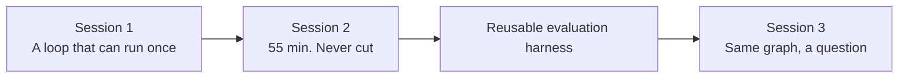
```mermaid
flowchart LR
  M1["Session 1\nA loop that can run once"] --> M2["Session 2\n55 min. Never cut"]
  M2 --> H["Reusable evaluation harness"]
  H --> M3["Session 3\nSame graph, a question"]
```

| Block | Minutes | What they keep |
|---|---|---|
| Why loops fail without a harness | 0 to 15 | Maker and Checker as types |
| Spec-driven development | 15 to 25 | Intent as a testable contract |
| Lab. Fill `harness.py` | 25 to 50 | Three functions that hold the loop |
| Reading output. When to stop | 50 to 55 | Three exits, a receipt, a gate |

---

<!--
id: s2-03
layout: split-right
minutes: 1
beat: talk
image: images/loop-without-harness.jpg
image_prompt: >
  16:9. The Session 1 five-box loop, now jittering. Verify is a shrug made of
  dust. Extra arrows spawn and never stop. Gray-green. No logos. No readable UI.
notes: Three ways it lies. Edit forever, declare victory on red, stuff the window. Last line is the thesis.
-->

# The loop you just built will lie to you.

- It can edit forever.
- It can declare victory on a red test.
- It can stuff the whole repo into the next call.
- A harness is how you stop that. Not a better prompt.

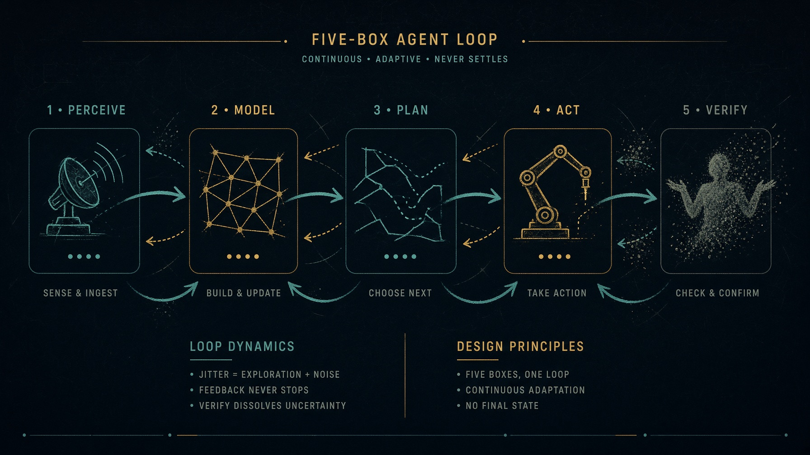

---

<!--
id: s2-04
layout: figure-bottom
minutes: 1
beat: talk
notes: Four collapses from Session 1, now named as harness gaps. Each one is a missing check, not a model failure.
-->

# Four ways a loop lies. Each is a missing harness piece.

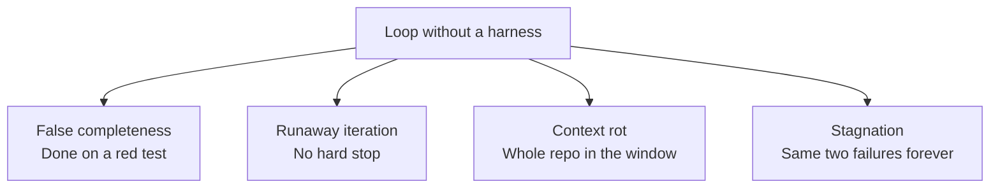
```mermaid
flowchart TB
  L["Loop without a harness"] --> F1["False completeness\nDone on a red test"]
  L --> F2["Runaway iteration\nNo hard stop"]
  L --> F3["Context rot\nWhole repo in the window"]
  L --> F4["Stagnation\nSame two failures forever"]
```

| Failure | Missing piece | What this hour adds |
|---|---|---|
| False completeness | Independent verify | Ten-row rubric, red gate |
| Runaway iteration | External transition | `gates.decide()` |
| Context rot | Memory on disk | Planner subagent, summaries |
| Stagnation | Progress detection | Same signature twice |

---

<!--
id: s2-05
layout: figure-bottom
minutes: 1
beat: talk
notes: Liu et al. from Session 1. The planner is its own subagent so the plan never sits in the orchestrator window. Big output goes to a file.
-->

# Context is not memory. The window is a scratch pad.

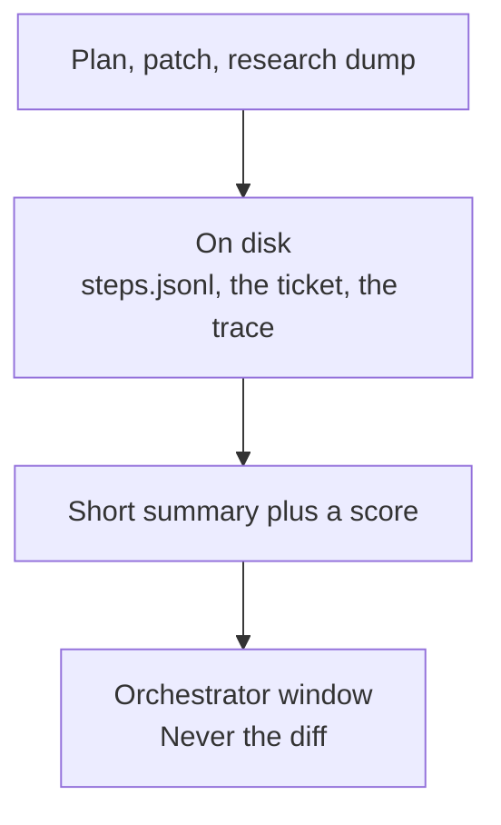
```mermaid
flowchart TB
  Big["Plan, patch, research dump"] --> File["On disk\nsteps.jsonl, the ticket, the trace"]
  File --> Sum["Short summary plus a score"]
  Sum --> Orch["Orchestrator window\nNever the diff"]
```

The orchestrator sees summaries. Never the whole plan. Never the patch.

That is why the planner runs as its own subagent. It writes `steps.jsonl` and returns a count.

<small>Liu et al., Lost in the Middle. TACL 2024. arXiv:2307.03172</small>

---

<!--
id: s2-06
layout: figure-bottom
minutes: 2
beat: talk
notes: Tell it as a story. Seven tests, green on every run, testing the wrong tree. Land the closing line hard.
-->

# A true story from this repo.

Seven tests. Green on every run. They had never tested the thing they named.

```python
# tests/conftest.py
CRM_ROOT = Path(__file__).resolve().parents[2] / "crm"
sys.path.insert(0, str(CRM_ROOT))   # wins over the PYTHONPATH the loop sets
```

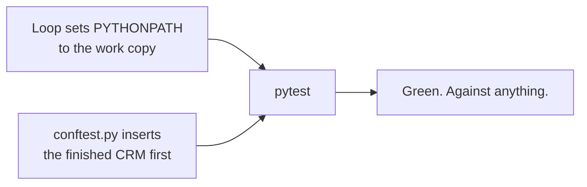
```mermaid
flowchart LR
  Loop["Loop sets PYTHONPATH\nto the work copy"] --> Tests["pytest"]
  Conf["conftest.py inserts\nthe finished CRM first"] --> Tests
  Tests --> Green["Green. Against anything."]
```

The loop pointed the tests at the work copy. The conftest pointed them at the finished answer.

---

<!--
id: s2-07
layout: figure-bottom
minutes: 1
beat: talk
notes: This is the bug class the whole hour is about. A silent skip wearing a green shirt. Callback when you hit the receipt.
-->

# A check that measures the wrong thing is worse than no check.

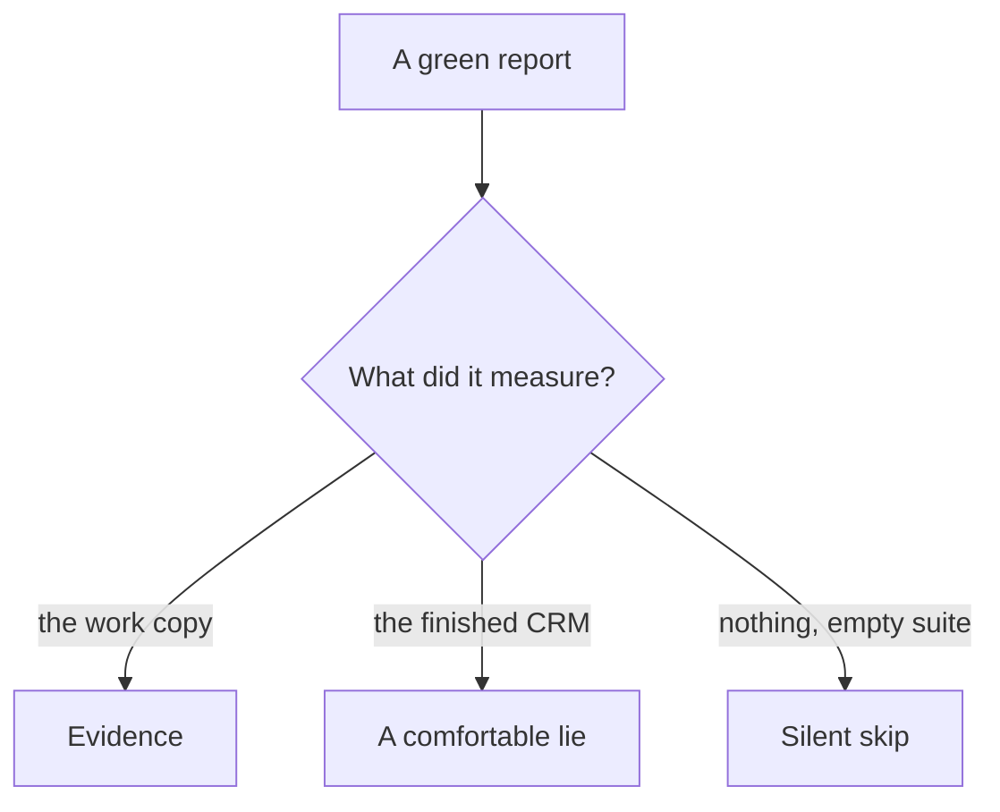
```mermaid
flowchart TB
  C["A green report"] --> Q{"What did it measure?"}
  Q -->|"the work copy"| Real["Evidence"]
  Q -->|"the finished CRM"| Lie["A comfortable lie"]
  Q -->|"nothing, empty suite"| Skip["Silent skip"]
```

The fail-then-pass demo had never once worked. Nothing reported an error.

Absent evidence is never clean. That rule shows up in the rubric, the receipt, and the final judge.

---

<!--
id: s2-08
layout: section
minutes: 0
beat: talk
_class: lead
notes: Section card. Say the mapping once. Maker means doer. Checker means judge. Then drop the old words.
-->

# Maker and Checker

Two doers. Disjoint scope. A judge with no hands.

---

<!--
id: s2-09
layout: split-left
minutes: 2
beat: talk
image: images/two-doers.jpg
image_prompt: >
  16:9. Two desks separated by a low wall. Left desk labeled TEST IMPLEMENTER
  holds a red pen and a stack of test cards. Right desk labeled CODE IMPLEMENTER
  holds a keyboard and source files, and has no reach over the wall. A third
  figure at a lectern labeled JUDGE has no keyboard at all. No logos.
notes: Say the mapping once, here: maker means doer, checker means judge. Then drop the old words. The last sentence is the one they quote.
-->

# Two doers. Disjoint scope.

- The test implementer writes `tests/**`. Nothing else.
- The code implementer writes `app/**`. It is **denied** `tests/**`.
- The judge writes nothing at all.

The code implementer cannot weaken a test to reach green. Not because it was told not to. Because it holds no write path to one.

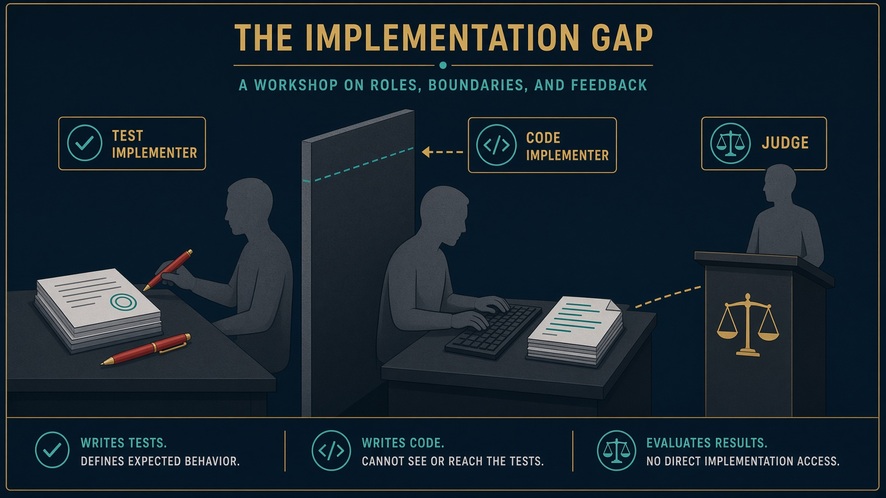

---

<!--
id: s2-10
layout: figure-bottom
minutes: 1
beat: talk
notes: Five roles. Orchestrator writes nothing. Planner writes steps.jsonl. Two doers. Judge reads. Same graph as Session 1, two more parts.
-->

# Five roles. Write scope is the point.

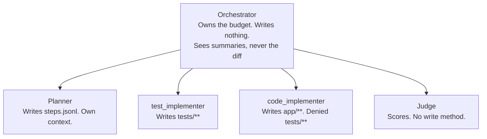
```mermaid
flowchart TB
  O["Orchestrator\nOwns the budget. Writes nothing.\nSees summaries, never the diff"]
  O --> P["Planner\nWrites steps.jsonl. Own context."]
  O --> T["test_implementer\nWrites tests/**"]
  O --> C["code_implementer\nWrites app/**. Denied tests/**"]
  O --> J["Judge\nScores. No write method."]
```

<small>`loops/roles.py` · `build()`</small>

---

<!--
id: s2-11
layout: figure-bottom
minutes: 1
beat: talk
notes: Show the class. There is no write method. A rule in a prompt is a suggestion. A missing method is not. One minute, then move.
-->

# Scope is a type, not a sentence.

```python
@dataclass
class Judge(Role):
    """Scores work. Holds no write path.

    There is deliberately no `write` method on this class.
    Adding one is not a convenience. It is the end of the split.
    """

    def read(self, relative: str) -> str:
        return (self.repo / relative).read_text(encoding="utf-8")
```

A rule in a prompt is a suggestion an agent can reason its way around. A missing method is not.

<small>`loops/roles.py` · `test_a_judge_has_no_write_method`</small>

---

<!--
id: s2-12
layout: figure-bottom
minutes: 1
beat: talk
notes: Deny always beats allow. The code implementer has app/** allowed and tests/** denied. An empty allow list permits nothing.
-->

# Deny always beats allow.

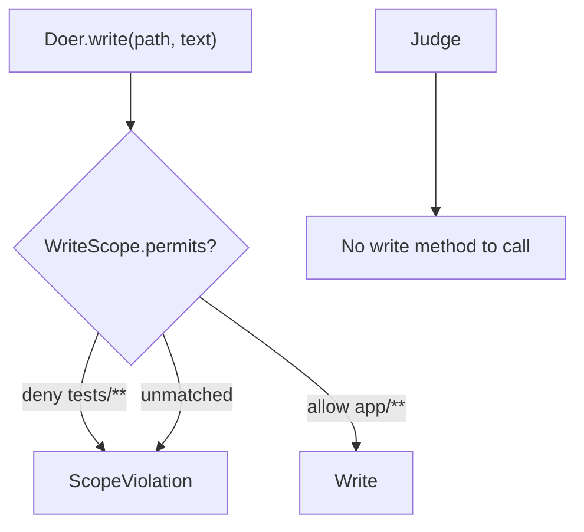
```mermaid
flowchart TB
  W["Doer.write(path, text)"] --> C{"WriteScope.permits?"}
  C -->|"deny tests/**"| X["ScopeViolation"]
  C -->|"allow app/**"| OK["Write"]
  C -->|"unmatched"| X
  J["Judge"] --> N["No write method to call"]
```

```python
code_implementer:
  write_allow: ["app/**", "src/**"]
  write_deny:  ["tests/**"]
```

<small>`loops/roles.py` · `WriteScope.permits` · `.loop.yml` in the target</small>

---

<!--
id: s2-13
layout: figure-top
minutes: 2
beat: talk
notes: Walk the diagram once, top to bottom. Stop on the diamond. If the new tests are not failing, the loop stops there. Python holds the loop, so the model never counts its own retries. You should be near 12 minutes.
-->

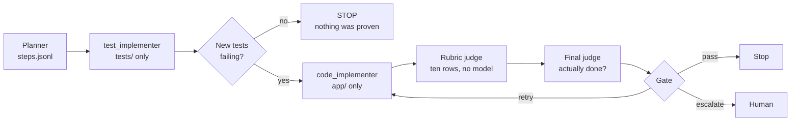
```mermaid
flowchart LR
  P["Planner\nsteps.jsonl"] --> T["test_implementer\ntests/ only"]
  T --> R{"New tests\nfailing?"}
  R -->|no| S["STOP\nnothing was proven"]
  R -->|yes| C["code_implementer\napp/ only"]
  C --> J["Rubric judge\nten rows, no model"]
  J --> F["Final judge\nactually done?"]
  F --> G{"Gate"}
  G -->|pass| D["Stop"]
  G -->|retry| C
  G -->|escalate| H["Human"]
```

# The orchestrator owns the budget and sees summaries, never the diff.

Python holds the loop. The model never counts its own retries.

---

<!--
id: s2-14
layout: figure-bottom
minutes: 1
beat: talk
notes: Four planes. One graph. The model proposes. The harness decides. That is the whole module.
-->

# Four planes. One graph.

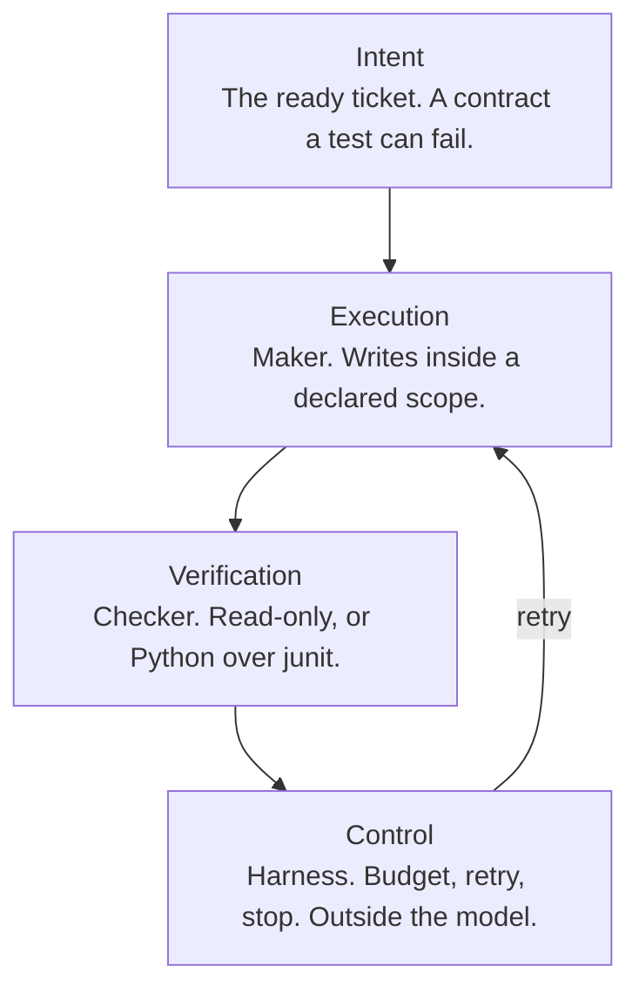
```mermaid
flowchart TB
  I["Intent\nThe ready ticket. A contract a test can fail."]
  E["Execution\nMaker. Writes inside a declared scope."]
  V["Verification\nChecker. Read-only, or Python over junit."]
  C["Control\nHarness. Budget, retry, stop. Outside the model."]
  I --> E --> V --> C
  C -->|retry| E
```

| Plane | Who | Job |
|---|---|---|
| Intent | The ready ticket | A contract a test can fail |
| Execution | Maker | Writes inside a declared scope |
| Verification | Checker | Read-only, or Python over junit |
| Control | Harness | Budget, retry, stop. Outside the model |

---

<!--
id: s2-15
layout: figure-bottom
minutes: 1
beat: talk
notes: Hallucination containment is architectural. The model may claim done. The harness will not take its word.
-->

# Hallucination containment is a missing method, not a better prompt.

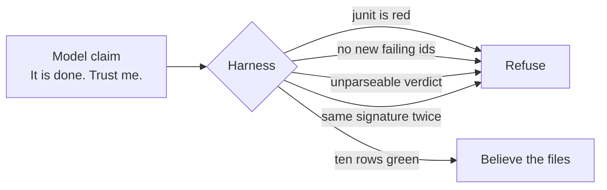
```mermaid
flowchart LR
  Claim["Model claim\nIt is done. Trust me."] --> Gate{"Harness"}
  Gate -->|"junit is red"| No["Refuse"]
  Gate -->|"no new failing ids"| No
  Gate -->|"unparseable verdict"| No
  Gate -->|"same signature twice"| No
  Gate -->|"ten rows green"| Yes["Believe the files"]
```

The model proposes. The harness decides. Claims are not evidence. Files are.

---

<!--
id: s2-16
layout: figure-bottom
minutes: 1
beat: talk
notes: Deep Agents is a harness, not a chat wrapper. Subagent tools list REPLACES the parent. Judge gets read_file only. Do not demo create_deep_agent live unless the room is ahead. Saturday they fill harness.py.
-->

# This graph in Deep Agents.

`create_deep_agent` is a harness, not a chat wrapper.

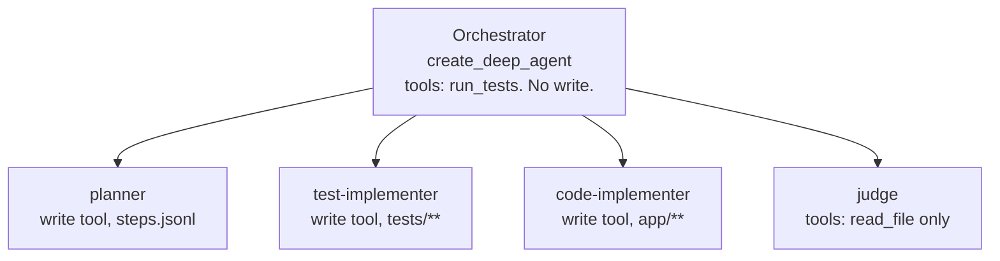
```mermaid
flowchart TB
  O["Orchestrator\ncreate_deep_agent\ntools: run_tests. No write."]
  O --> P["planner\nwrite tool, steps.jsonl"]
  O --> T["test-implementer\nwrite tool, tests/**"]
  O --> C["code-implementer\nwrite tool, app/**"]
  O --> J["judge\ntools: read_file only"]
```

- Each subagent gets its own `tools` list. That list **replaces** the parent.
- The judge's list is `read_file`. No `write_file`.
- Path scope lives inside the write tool. `WriteScope.check` still runs.

<small>`solutions/sol2_implementer_deep_agents/roles.py`</small>

---

<!--
id: s2-17
layout: figure-bottom
minutes: 1
beat: talk
notes: Closing of the first block. create_deep_agent does not count retries. Python still owns the red gate and gates.decide. You should be at 15 minutes here.
-->

# Python owns the gate. `create_deep_agent` does not count retries.

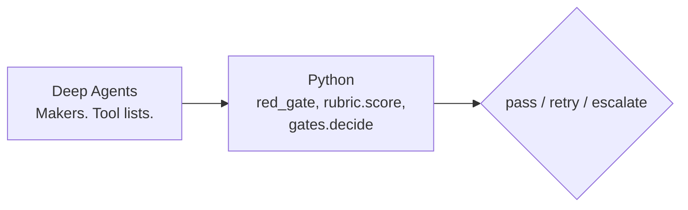
```mermaid
flowchart LR
  DA["Deep Agents\nMakers. Tool lists."] --> Py["Python\nred_gate, rubric.score,\ngates.decide"]
  Py --> X{"pass / retry / escalate"}
```

```python
return create_deep_agent(
    model=model,
    tools=[run_tests_tool(repo)],
    subagents=subagents_for(contract, loop),
)
```

Saturday lab stays Claude Code. Fill `harness.py`.

The Deep Agents port is the takehome. `solutions/sol2_implementer_deep_agents/`. Issue 118.

---

<!--
id: s2-18
layout: section
minutes: 0
beat: talk
_class: lead
notes: A breath. Zero minutes. Clock checkpoint: 15 minutes. Intent becomes a contract the machine can check.
-->

# Spec-driven development

Intent becomes a contract the machine can check.

---

<!--
id: s2-19
layout: split-right
minutes: 1
beat: talk
image: images/ready-ticket-rubric.jpg
image_prompt: >
  16:9. Left, a ticket with bullet criteria. Right, the same bullets as a
  checklist with empty pass boxes, each wired to a named test. Paper and green
  ink. No logos.
notes: Read AC-4 out loud. Notice it names a condition, a boundary, and a negative case. Then say what should be intuitive names. Nothing.
-->

# If an acceptance criterion cannot fail a test, it is a wish.

```markdown
- (AC-4) `GET /api/tasks?due_before=<date>`
  returns only tasks due before that date,
  and never tasks with no due date.
```

Seven acceptance criteria. Each one names a condition a test can be red about.

"Should be intuitive" names nothing.

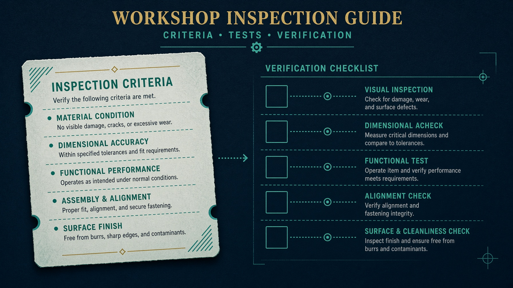

---

<!--
id: s2-20
layout: figure-bottom
minutes: 1
beat: talk
notes: Graph engineering. Intent becomes a graph of steps. Each criterion maps to a test step and a code step. The planner is derived today, a subagent as stretch.
-->

# Graph engineering. Intent becomes a graph of steps.

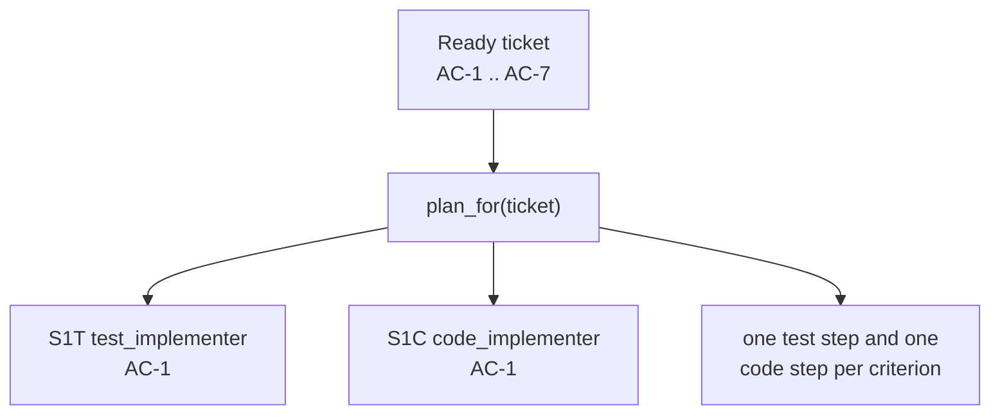
```mermaid
flowchart TB
  T["Ready ticket\nAC-1 .. AC-7"] --> P["plan_for(ticket)"]
  P --> S1["S1T test_implementer\nAC-1"]
  P --> S2["S1C code_implementer\nAC-1"]
  P --> Sn["one test step and one\ncode step per criterion"]
```

`loops/implementer.py` · `plan_for()`. Derived, not generated. Swapping this for a planner subagent is the stretch. The schema it must satisfy is already enforced.

---

<!--
id: s2-21
layout: figure-bottom
minutes: 1
beat: talk
notes: The plan is a file, so the plan is checkable. Read the JSON. Name validation. A step you cannot check is a wish.
-->

# The plan is a file, and it is checkable.

```json
{"id":"S1T","ticket":"T001","role":"test_implementer",
 "action":"Write a test that fails until due_date accepts null",
 "validation":"a test covering AC-1 exists and fails before any code",
 "criterion":"AC-1","status":"todo","evidence":null}
```

`steps.jsonl`. JSON Lines. Every step carries a **validation statement**.

The file is disposable. It belongs to one run against one ticket.

<small>`loops/steps.py`</small>

---

<!--
id: s2-22
layout: figure-bottom
minutes: 1
beat: talk
notes: Name the three rejections. Plus two more the code actually raises: no test step, marking done without evidence. Keep it to the three the outline names, then the evidence rule.
-->

# The plan is rejected when it cannot be checked.

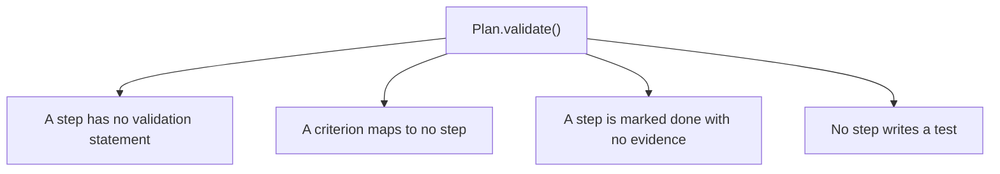
```mermaid
flowchart TB
  V["Plan.validate()"] --> R1["A step has no validation statement"]
  V --> R2["A criterion maps to no step"]
  V --> R3["A step is marked done with no evidence"]
  V --> R4["No step writes a test"]
```

`PlanRejected`. The orchestrator refuses to run it.

Marking a step done without naming the test that proves it is grading the loop on a claim.

<small>`loops/steps.py` · `validate()` · `mark()`</small>

---

<!--
id: s2-23
layout: split-left
minutes: 1
beat: talk
image: images/red-gate.jpg
image_prompt: >
  16:9. A traffic gate across a road. The barrier is down. A sign reads
  NO RED, NO ENTRY. Behind the gate, a test result card showing four failures in
  red, being checked by a guard. Workshop poster style. No logos.
notes: Three steps, and step three is the one that matters. A test that passes before any code exists proves nothing, and it is the most comfortable kind of nothing because it is green.
-->

# The red gate. Tests first, and prove it.

1. The test implementer writes the tests.
2. The orchestrator reads `junit.xml`.
3. **If the new tests are not failing, stop.**

A test that passes before any code exists proves nothing. It is the most comfortable kind of nothing, because it is green.

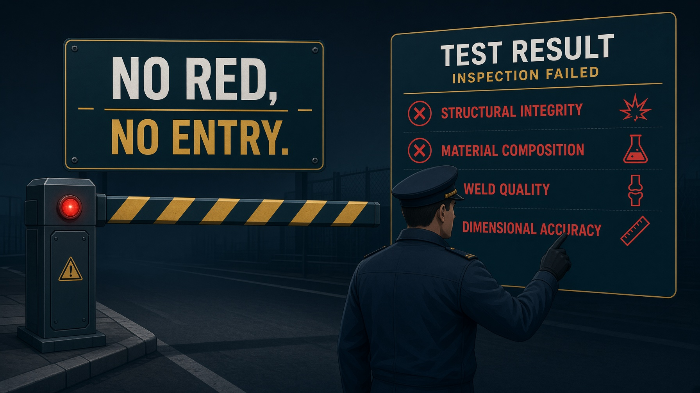

---

<!--
id: s2-24
layout: figure-bottom
minutes: 1
beat: talk
notes: Show the function. New failing ids, not any failing ids. A test that already existed and still fails is not proof of a new contract.
-->

# New failing ids. Not any failing ids.

```python
def _new_test_ids(before: set[str], after_failed: set[str]) -> set[str]:
    """Test ids that are failing now and did not exist before. The red proof."""
    return {test_id for test_id in after_failed if test_id not in before}
```

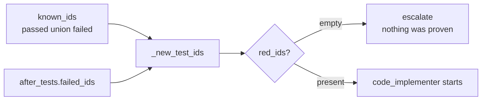
```mermaid
flowchart LR
  B["known_ids\npassed union failed"] --> G["_new_test_ids"]
  A["after_tests.failed_ids"] --> G
  G --> R{"red_ids?"}
  R -->|empty| X["escalate\nnothing was proven"]
  R -->|present| C["code_implementer starts"]
```

<small>`loops/implementer.py` · `_new_test_ids` · `require_red` in `.loop.yml`</small>

---

<!--
id: s2-25
layout: figure-bottom
minutes: 2
beat: talk
notes: Read the ten rows. Do not explain each one. Then say the point on the next slide: the tests passed is one row of ten.
-->

# The rubric. Ten rows. No model call.

```
PASS  tests_ran          25 tests
PASS  tests_passed       all green
PASS  red_first          6 tests were red first
PASS  coverage_floor     80.42% against a floor of 78.0%
PASS  criteria_covered   all covered
PASS  steps_done         14 steps: done 14
PASS  ui_has_e2e         2 interface files changed, end-to-end green
PASS  format_clean       clean
PASS  lint_clean         clean
PASS  write_scope        every write was inside its role's scope
```

Every row is computed from `junit.xml`, `coverage.xml`, exit codes, `steps.jsonl`, and the diff.

<small>`loops/rubric.py` · `score()`</small>

---

<!--
id: s2-26
layout: figure-bottom
minutes: 1
beat: talk
notes: That reframing is what they take back to their team. A judge that checks only tests_passed can be satisfied by one trivial test.
-->

# "The tests passed" is one row of ten.

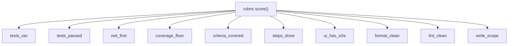
```mermaid
flowchart TB
  S["rubric.score()"] --> R1["tests_ran"]
  S --> R2["tests_passed"]
  S --> R3["red_first"]
  S --> R4["coverage_floor"]
  S --> R5["criteria_covered"]
  S --> R6["steps_done"]
  S --> R7["ui_has_e2e"]
  S --> R8["format_clean"]
  S --> R9["lint_clean"]
  S --> R10["write_scope"]
```

A judge that checks only `tests_passed` can be satisfied by an agent that writes one trivial test and deletes the rest.

Absent evidence is never a pass. Every argument left `None` becomes a failing row.

---

<!--
id: s2-27
layout: split-right
minutes: 1
beat: talk
image: images/two-judges.jpg
image_prompt: >
  16:9. Left, a mechanical scale with exact weights, labeled DETERMINISTIC.
  Right, a person reading a document with a thoughtful expression, labeled
  MODEL. Between them a divider showing which questions go which way. No logos.
notes: Four questions, three answered by arithmetic, one by a model. Use a model only where you must.
-->

# Two judges, and only one of them guesses.

| Question | Who answers |
|---|---|
| Did the tests run and pass? | Arithmetic |
| Does coverage meet the floor? | Arithmetic |
| Did anyone write outside scope? | Arithmetic |
| **Is the ticket actually done?** | A model |

Use a model only where you must.

The implementer's judge is deterministic. The enhancer's judge reads ticket prose and needs a model.

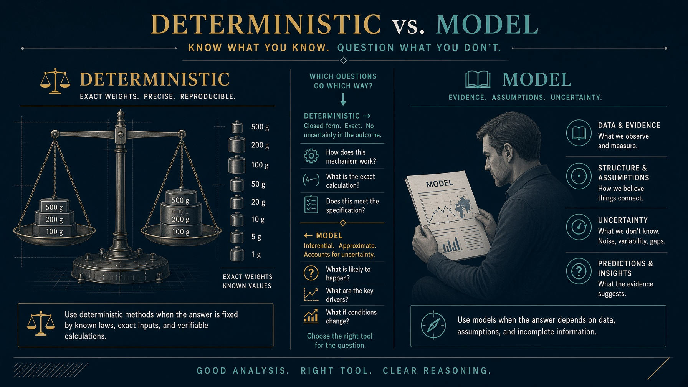

---

<!--
id: s2-28
layout: figure-bottom
minutes: 1
beat: talk
notes: This is your own measured data. Say so. 41 articles. Deterministic detector gates at 70. LLM quality judge saturates near 0.97 and flags 41 of 41. A judge that approves everything is not a judge.
-->

# Why a model judge cannot be the gate.

Measured across 41 published articles in a production pipeline:

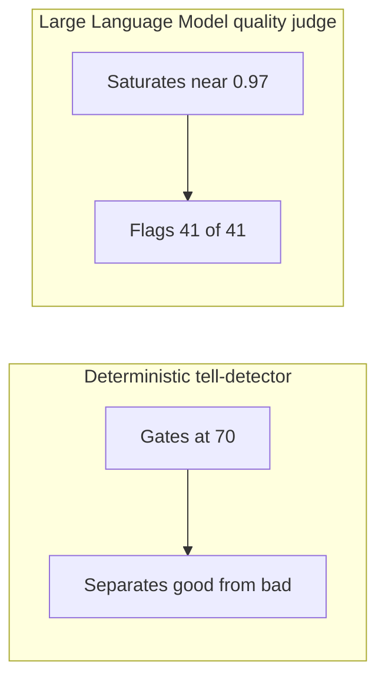
```mermaid
flowchart LR
  subgraph Det["Deterministic tell-detector"]
    D["Gates at 70"] --> Sep["Separates good from bad"]
  end
  subgraph Llm["Large Language Model quality judge"]
    S["Saturates near 0.97"] --> All["Flags 41 of 41"]
  end
```

| Judge | Behavior |
|---|---|
| Deterministic tell-detector | Gates at 70. Separates good from bad. |
| Large Language Model (LLM) quality judge | Saturates near 0.97. Flags **41 of 41**, regardless. |

A judge that approves everything is not a judge. It is a rubber stamp with a temperature setting.

---

<!--
id: s2-29
layout: figure-bottom
minutes: 1
beat: talk
notes: Three rules. A pass carrying a critical issue is not a decision. Output that will not parse is a FAIL, never a pass. Absent evidence is never clean.
-->

# So make the model's verdict a schema.

```python
if verdict.done and verdict.blocking_issues:
    return synthetic_fail("says done while listing blocking issues")
```

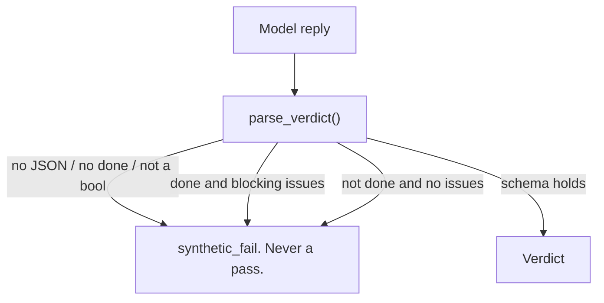
```mermaid
flowchart TB
  Text["Model reply"] --> P["parse_verdict()"]
  P -->|"no JSON / no done / not a bool"| F["synthetic_fail. Never a pass."]
  P -->|"done and blocking issues"| F
  P -->|"not done and no issues"| F
  P -->|"schema holds"| V["Verdict"]
```

- A pass carrying a critical issue is not a decision. Reject it.
- Output that will not parse is a **FAIL**, never a pass.
- Absent evidence is never clean.

<small>`loops/final_judge.py` · `parse_verdict` · `synthetic_fail`</small>

---

<!--
id: s2-30
layout: split-left
minutes: 1
beat: talk
image: images/push-gate.jpg
image_prompt: >
  16:9. A terminal window mid-command, with a red BLOCKED banner across it. A
  physical turnstile in front of the screen. A small green paper receipt on the
  desk beside it, unstamped. No logos, no readable brand names.
notes: Read the refusal text out loud, exactly as printed. Then tell them: your agent will hit this today. Saying it now turns a surprise into a demonstration. You should be at 25 minutes. Lab next.
-->

# The gate that makes it real.

```
BLOCKED by pre-tool hook: git push
Last run: FAILED (1 tests).
  first failure: tests.test_due_date::test_model_has_optional_due_date
Run `task test` first.
```

A Claude Code `PreToolUse` hook refuses `git push` without a green receipt.

No push and no pull request until the suite runs green locally.

Your agent will hit this today.

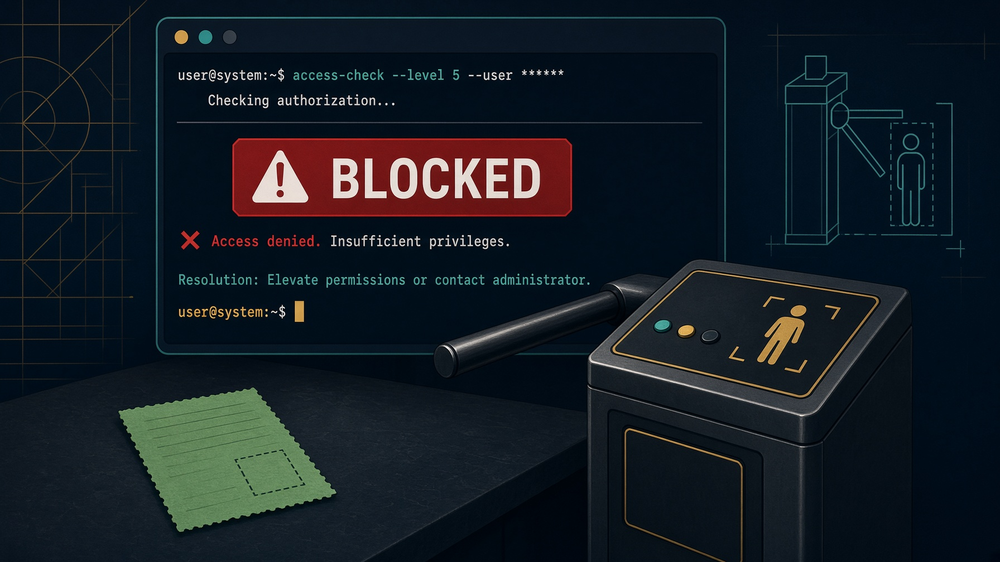

---

<!--
id: s2-31
layout: section
minutes: 0
beat: lab
_class: lead
notes: Lab card. 25 minutes. Walk the room. Do not reteach the architecture. Point at harness.py.
-->

# Lab 2. The Ticket Implementer

25 minutes. A ready ticket in. A green rubric out.

---

<!--
id: s2-32
layout: lab
minutes: 20
beat: lab
notes: Read both commands. The --doer none run is the red gate refusing. Tell them that before they run it. harness.py. Three functions. Nothing else. Call time at 15 and at 5 remaining.
-->

# Lab. 25 minutes. Fill `harness.py`.

```bash
cd labs/lab2_implementer
claude -p "$(cat prompts/claude-code.md)"
```

Fill three functions. Nothing else.

```bash
task loop:implementer -- --ticket T001 --doer reference   # ten rows
task loop:implementer -- --ticket T001 --doer none        # red gate refuses
```

Falling behind is fine: watch Rick finish `harness.py` and keep going.

---

<!--
id: s2-33
layout: figure-bottom
minutes: 1
beat: lab
notes: The order is the whole point. Leave this up while they type. tests first, prove them red, code until green, judge, gate.
-->

# Three functions. The order is the lesson.

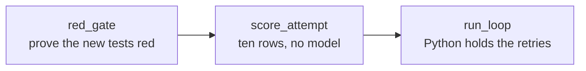
```mermaid
flowchart LR
  R["red_gate\nprove the new tests red"] --> S["score_attempt\nten rows, no model"]
  S --> L["run_loop\nPython holds the retries"]
```

```
tests first  ->  prove them red  ->  code until green  ->  judge  ->  gate
```

`red_gate`. `score_attempt`. `run_loop`. The stub already imports `gates` and `rubric`.

<small>`labs/lab2_implementer/harness.py`</small>

---

<!--
id: s2-34
layout: figure-bottom
minutes: 1
beat: lab
notes: Point at the docstring. An empty result must stop the loop. The solution forwards to implementer._new_test_ids.
-->

# `red_gate(before, after)`. New ids that are failing now.

```python
def red_gate(before: RunResult, after: RunResult) -> set[str]:
    """Return the test ids that are failing now and did not exist before.

    A test that passes before any code is written proves nothing,
    so an empty result must stop the loop rather than let it continue.
    """
    seen = before.junit.passed_ids | before.junit.failed_ids
    return implementer._new_test_ids(seen, after.junit.failed_ids)
```

An empty set is not a small problem. It is the red gate refusing.

---

<!--
id: s2-35
layout: figure-bottom
minutes: 1
beat: lab
notes: Common stall lives here. People try to compute rows instead of forwarding the evidence. The answer is one line. Absent kwargs become failing rows.
-->

# `score_attempt`. Forward the evidence. Do not invent rows.

```python
def score_attempt(contract: Contract, **evidence) -> rubric.Score:
    """Score one attempt against the ten rubric rows.

    Every argument left out becomes a failing row.
    Absent evidence is never a pass.
    """
    return rubric.score(contract=contract, **evidence)
```

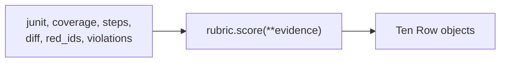
```mermaid
flowchart LR
  E["junit, coverage, steps,\ndiff, red_ids, violations"] --> S["rubric.score(**evidence)"]
  S --> Ten["Ten Row objects"]
```

Do not compute the rows yourself. `loops/rubric.py` already does.

---

<!--
id: s2-36
layout: figure-bottom
minutes: 1
beat: lab
notes: Python holds the loop. run_loop calls implementer.run. The model does not get to count its own retries. budget defaults to 3.
-->

# `run_loop`. Python holds the retries.

```python
def run_loop(contract: Contract, budget: int = 3, ticket_id: str = "T001") -> dict:
    """Run the harness until it passes, stalls, or runs out of budget.

    Hold the loop in Python. The model does not get to count its own retries.
    """
    return implementer.run(
        repo=contract.repo,
        ticket_id=ticket_id,
        budget=budget,
        doer="reference",
    )
```

```mermaid
stateDiagram-v2
  [*] --> Running
  Running --> Pass: rubric green
  Running --> Retry: fixable gap and budget left
  Running --> Escalate: budget spent
  Running --> Escalate: same signature twice
  Retry --> Running
```

<small>`loops/gates.py` · `decide()`</small>

---

<!--
id: s2-37
layout: lab
minutes: 1
beat: lab
notes: Two commands. Reference copies known-good under write scope. None writes nothing, so the red gate must refuse. If reference is green and none is not, the harness is honest.
-->

# Two commands. Honesty is the second one.

```bash
task loop:implementer -- --ticket T001 --doer reference
# copies known-good into tests/** then app/**
# expect ten PASS rows and gate: pass

task loop:implementer -- --ticket T001 --doer none
# writes nothing on purpose
# expect gate: escalate
# reason: red gate: no new test was observed failing
```

The `none` backend is how you prove the loop reports failure honestly, with no model key.

---

<!--
id: s2-38
layout: figure-bottom
minutes: 1
beat: lab
notes: Walk this if they ask why none fails. No test was ever red, so nothing has been proven. Refuse to continue.
-->

# `--doer none` is the red gate doing its job.

```mermaid
sequenceDiagram
  participant O as Orchestrator
  participant N as none backend
  participant J as junit.xml
  participant G as red_gate
  O->>J: baseline
  O->>N: write tests
  N-->>O: wrote nothing
  O->>J: after_tests
  O->>G: _new_test_ids
  G-->>O: empty
  O-->>O: escalate
```

`test_a_doer_that_writes_nothing_is_stopped_by_the_red_gate`.

If this run were green, the harness would be lying.

---

<!--
id: s2-39
layout: lab
minutes: 1
beat: lab
notes: Say the fall-behind rule. There is no drop-in harness.py. Watch Rick finish. Nobody leaves this room behind.
-->

# Falling behind is fine. Watch Rick finish and continue.

```bash
cp harness.py harness.py.my-attempt
```

There is no drop-in `harness.py`. Watch Rick finish and type what he typed.

You continue the next module with a working artifact.

Put the empty stub back later if you want to retry:

```bash
git checkout -- harness.py
```

See `labs/lab2_implementer/FALL-BEHIND.md`.

---

<!--
id: s2-40
layout: figure-bottom
minutes: 1
beat: lab
notes: The common stall is score_attempt. People try to compute rows. Tell them to forward **evidence. If they stall on red_gate, they forgot passed_ids union failed_ids.
-->

# The common stall is `score_attempt`.

```mermaid
flowchart TB
  Stall["Trying to compute ten rows by hand"] --> Fix["return rubric.score(contract=contract, **evidence)"]
  Stall2["red_gate returns after.failed_ids"] --> Fix2["subtract known ids first"]
  Stall3["Editing loops/"] --> Fix3["Fill only harness.py"]
```

If you stall, read `loops/implementer.py`, `loops/rubric.py`, and `loops/gates.py`. They are the answer, not a hint.

Do not edit the target repo's tests to make something pass.

---

<!--
id: s2-41
layout: figure-bottom
minutes: 1
beat: lab
notes: After class. Same eight steps. Python still owns the gate. Do not demo live unless the room is ahead. Issue 118.
-->

# After class. The same eight steps on Deep Agents.

```mermaid
flowchart LR
  Sat["Saturday\nFill harness.py\nClaude Code"] --> Home["Takehome\nsol2_implementer_deep_agents\nIssue 118"]
```

```bash
cd solutions/sol2_implementer_deep_agents
python3 -m pytest tests -q
python3 harness.py --repo ../../work/northwind-field-crm --ticket T001 --doer deep
```

`--doer deep` needs `deepagents` installed. The tests do not.

Python still owns the red gate and `gates.decide`. The model never counts its own retries.

---

<!--
id: s2-42
layout: section
minutes: 0
beat: lab
_class: lead
notes: 50 to 55 slot. Clock checkpoint: 50 minutes. Walk one trace. Name the row that blocked.
-->

# Reading harness output

Knowing when to stop is the feature.

---

<!--
id: s2-43
layout: figure-bottom
minutes: 1
beat: talk
notes: Three claims or nothing. Passed, this tree, after the newest edit. Callback to conftest: a zero exit code with no test report is the silent-skip bug wearing a green shirt.
-->

# A receipt proves three things, or it proves nothing.

```json
{"green": true,
 "tree_hash": "3da2f2dc9611...",
 "written_at": 1787720405.98,
 "report_usable": true}
```

```mermaid
flowchart TB
  R[".harness/receipt.json"] --> A["The suite passed"]
  R --> B["It ran against this tree, not an older one"]
  R --> C["It ran after the newest source edit"]
```

A zero exit code with no test report is not green. It is the silent-skip bug wearing a green shirt.

<small>`scripts/receipt.py`</small>

---

<!--
id: s2-44
layout: figure-bottom
minutes: 1
beat: talk
notes: tree_hash is content, not git status. Staged, unstaged, and untracked all count. written_at must beat newest_source_mtime. Show check() reasons.
-->

# `tree_hash` and `written_at`. Stale is a refusal.

```mermaid
flowchart TB
  C["receipt.check(repo)"] --> N{"receipt exists?"}
  N -->|no| X1["No receipt"]
  N -->|yes| G{"green and report_usable?"}
  G -->|no| X2["Last run FAILED"]
  G -->|yes| H{"tree_hash matches?"}
  H -->|no| X3["The tree changed. Receipt is stale."]
  H -->|yes| T{"newest mtime <= written_at?"}
  T -->|no| X4["A source file is newer. Re-run."]
  T -->|yes| OK["Allow the push"]
```

<small>`scripts/receipt.py` · `check()`</small>

---

<!--
id: s2-45
layout: figure-bottom
minutes: 1
beat: talk
notes: The agent is a subprocess. In-process scope stops the loop's own doer. write_scope reads the diff and catches the subprocess. Defense at one layer is a demo.
-->

# One gate is never enough.

The write scope lives in the loop. Your agent is a **subprocess**.

```mermaid
flowchart LR
  In["in-process scope\nWriteScope.check\nstops the loop's own doer"] --> Out["rubric write_scope\nreads the diff\ncatches the subprocess"]
```

```
in-process scope   stops the loop's own doer
rubric write_scope reads the diff, catches the subprocess
```

An agent that edits a test to reach green defeats the first and not the second.

Defense at one layer is a demo. Defense at two is a harness.

<small>`labs/lab2_implementer/` · write scope in the loop and in the rubric</small>

---

<!--
id: s2-46
layout: figure-bottom
minutes: 1
beat: talk
notes: Walk one trace. .harness/last-implementer.json. Ten rows, the gate, and the reason. The interesting run is the one that stops.
-->

# Read the trace. Name the row that blocked.

```
FAIL  coverage_floor     71.4% against a floor of 78.0%
gate: escalate
reason: the same rows failed twice: coverage_floor. Not converging.
```

```mermaid
flowchart LR
  Trace[".harness/last-implementer.json"] --> Rows["rows per iteration"]
  Trace --> Gate["gate: pass or escalate"]
  Trace --> Why["reason: the row that blocked"]
```

- `pass` and you are done.
- `retry` and the doer gets one more scoped attempt.
- `escalate` and a human takes it.

**The same rows twice means stop.**

---

<!--
id: s2-47
layout: figure-bottom
minutes: 1
beat: talk
notes: signature is what failed, not how it was worded. Two equal signatures mean the last attempt changed nothing. gates.decide has the same signature twice as escalate. Also: green rubric but final judge says not done is escalate.
-->

# `gates.decide()`. Same signature twice is escalate.

```mermaid
stateDiagram-v2
  [*] --> Running
  Running --> Pass: rubric green
  Running --> Retry: new signature and budget left
  Running --> Escalate: same signature twice
  Running --> Escalate: budget spent
  Running --> Escalate: rubric green, judge says not done
  Retry --> Running
```

`signature` is the failed row names, not the wording.

Green rubric plus `judge_done=False` is escalate. The deterministic rows can all pass on work that misses the point.

<small>`loops/gates.py` · `decide()`</small>

---

<!--
id: s2-48
layout: figure-bottom
minutes: 1
beat: talk
notes: One minute. A doer that spends its last turn on a naming nit leaves the blocking row unfixed. retry_instruction narrows on final_attempt.
-->

# On the final attempt, narrow the ask.

```
FINAL ATTEMPT. Fix only what blocks: tests_passed.
Do not refactor. Do not address anything else.
```

```mermaid
flowchart LR
  D["Decision.final_attempt"] --> N["retry_instruction\nnarrow to the blocking rows"]
  D2["ordinary retry"] --> W["These rubric rows failed. Fix them."]
```

A doer that spends its last turn on a naming nit leaves the blocking row unfixed.

<small>`loops/gates.py` · `retry_instruction()`</small>

---

<!--
id: s2-49
layout: figure-bottom
minutes: 1
beat: talk
notes: Name the artifact: a harness that fails, iterates, passes on its own, and refuses to ship when it should not.
-->

# What you keep.

A harness that fails, iterates, and passes on its own, and refuses to ship when it should not.

```mermaid
flowchart LR
  M1["Session 1 loop"] --> M2["Session 2 harness"]
  M2 --> Score["Ten rows and a gate"]
  Score --> PR["A pull request\nor an honest escalation"]
```

The reusable evaluation harness is `harness.py` plus `loops/rubric.py`, `loops/gates.py`, and `scripts/receipt.py`.

---

<!--
id: s2-50
layout: figure-bottom
minutes: 1
beat: talk
notes: Six lines. Read them. Do not add a seventh.
-->

# Six lines to keep.

1. Two doers. Disjoint scope. The judge has no write method.
2. A step without a validation statement is a wish.
3. New tests must be red before code starts.
4. "The tests passed" is one row of ten.
5. Unparseable is FAIL. Same signature twice is stop.
6. A receipt proves three things, or it proves nothing.

---

<!--
id: s2-51
layout: title
minutes: 0
beat: bridge
_class: lead
notes: 15 minutes. Next module points the same graph at a question. MCP. One tool boundary.
-->

# Break. 15 minutes.

Next: the same graph, pointed at a question instead of a ticket.

---

<!--
id: s2-52
layout: figure-bottom
minutes: 0
beat: talk
notes: Bibliography. Skip in the room unless asked.
-->

# Primary references for this session.

- Liu et al. Lost in the Middle. TACL 2024. arXiv:2307.03172
- Yao et al. ReAct. arXiv:2210.03629
- Ridnik, Kredo, Friedman. AlphaCodium. arXiv:2401.08500
- `loops/implementer.py`, `loops/rubric.py`, `loops/gates.py`, `loops/roles.py`, `loops/steps.py`, `loops/final_judge.py`
- `scripts/receipt.py`
- `labs/lab2_implementer/ARCHITECTURE.md`
- `solutions/sol2_implementer_deep_agents/SPEC.md`
