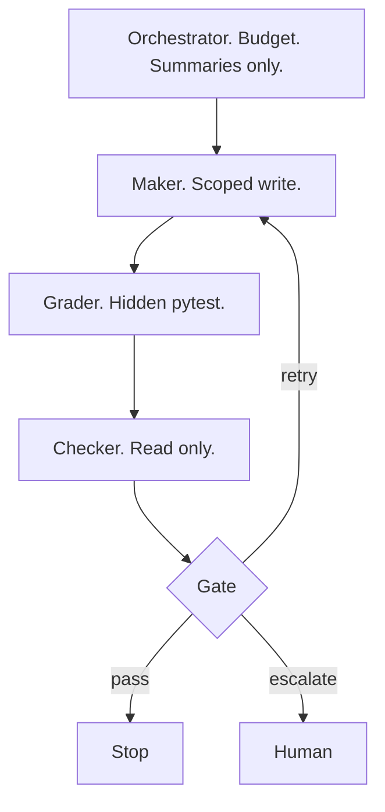
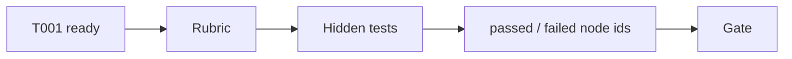
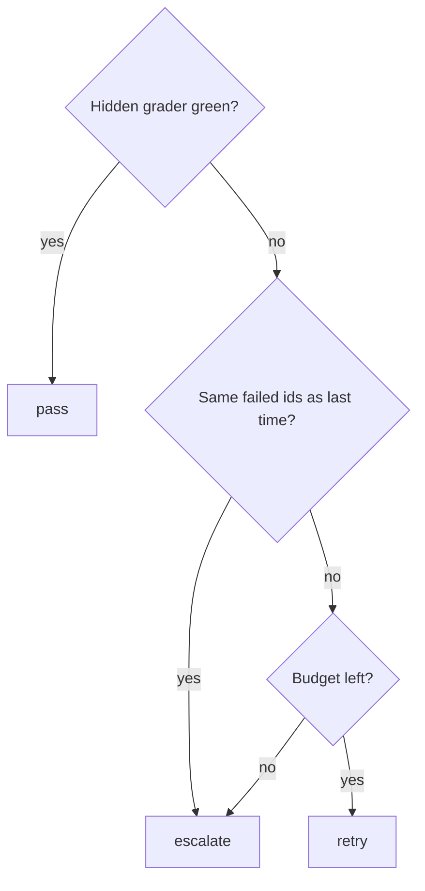
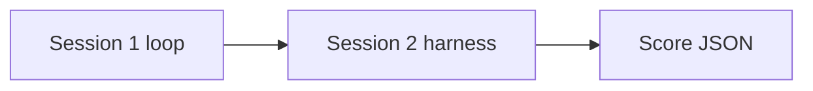

<!--
id: s2-01
layout: title
minutes: 1
beat: talk
-->

# Harness Engineering, the validation layer

Session 2. Center of gravity. 55 minutes. Do not cut this.

---

<!--
id: s2-02
layout: split-right
minutes: 2
beat: talk
image: images/loop-without-harness.png
image_prompt: >
  16:9. The Session 1 five-box loop, now jittering. Verify is a shrug emoji
  made of dust. Extra arrows spawn and never stop. Gray-green. No logos.
-->

# The loop you just built will lie to you.

- It can edit forever.
- It can declare victory on a red test.
- It can stuff the whole repo into the next call.
- A harness is how you stop that. Not a better prompt.


---

<!--
id: s2-03
layout: split-left
minutes: 2
beat: talk
image: images/maker-checker.png
image_prompt: >
  16:9 two desks. Left desk has a keyboard and five file cards, labeled Maker.
  Right desk has a red pen, a test printout, no keyboard, labeled Checker.
  A low wall between them. They cannot reach each other's tools. No logos.
-->

# Maker needs a Checker with fewer tools.

- Maker writes CRM files. That is the only write path.
- Checker reads the diff and the pytest output. No write tools.
- If one agent does both, it grades its own homework.


---

<!--
id: s2-04
layout: figure-bottom
minutes: 3
beat: talk
-->

# Graph nodes. Python holds the loop. The model does not count retries.



---

<!--
id: s2-05
layout: split-right
minutes: 2
beat: talk
image: images/tool-scope.png
image_prompt: >
  16:9 badge board. Maker badges: read CRM, write five files, run grader.
  Checker badges: read diff, read pytest, read ticket. Forbidden strip in red:
  edit graders, change ticket state, merge, deploy. No logos.
-->

# Sub-agent tool scope

- Filesystem and long memory stay out of the orchestrator window.
- Deep Agents or Claude Agent SDK. Same shape. One runtime on Saturday.
- Attendees may still drive Claude Code against the same ticket and grader.


---

<!--
id: s2-06
layout: section
minutes: 0
beat: talk
-->

# Spec-driven development

Intent becomes a contract the agent works against.

---

<!--
id: s2-07
layout: split-right
minutes: 3
beat: talk
image: images/ready-ticket-rubric.png
image_prompt: >
  16:9. Left a ready ticket with success-criteria bullets. Right the same
  bullets turned into a rubric checklist with empty pass boxes. A small
  gear labeled load_ready_ticket. Paper and green ink. No logos.
-->

# The ready ticket is the rubric.

- `## Success criteria` loads as machine-checkable rows.
- If a row cannot fail a test, it is not a criterion. It is a wish.
- You do not grade tone on T001. You grade the field, the API, and the filter.


---

<!--
id: s2-08
layout: figure-top
minutes: 2
beat: talk
-->



Graph engineering here is not a new product. It is edges with types. Ticket to rubric. Rubric to grader. Grader to gate.

---

<!--
id: s2-09
layout: split-right
minutes: 2
beat: talk
image: images/hidden-grader.png
image_prompt: >
  16:9 sealed envelope stamped HIDDEN. Seven test names as thin lines, not
  readable. A CRM silhouette behind it. Caption: the agent does not author
  these. No pytest dump. No logos.
-->

# Grader

- Hidden tests in `solutions/m2-harness/graders`.
- Fail on `starter_crm`. Pass on `solutions/crm`.
- That fail-then-pass is the proof the contract is real.


---

<!--
id: s2-10
layout: figure-bottom
minutes: 3
beat: talk
-->

# Quality gates. Three exits. No fourth.

Pass. Retry. Escalate. Escalate on repeat signature or spent budget.



---

<!--
id: s2-11
layout: split-left
minutes: 2
beat: talk
image: images/stop-conditions.png
image_prompt: >
  16:9 three stop signs in a row, redesigned as workshop cards.
  PASS in green, MAX LOOPS in amber, REPEAT FAILURE in red.
  Small subtitle: the model does not get a vote. No logos.
-->

# Stop conditions are architecture.

- Iteration limit. Default 3.
- Repeat detection. Same failed node ids twice. Stop.
- Pass. Leave it alone.
- "One more try" is how you buy a surprise bill.


---

<!--
id: s2-12
layout: split-right
minutes: 2
beat: talk
image: images/trace-json.png
image_prompt: >
  16:9 a single JSON document as a physical printout with four highlighted
  keys: inputs, tool calls, scores, gate. A small sticky note: Langfuse
  later. Same schema. No cloud dashboard screenshot. No logos.
-->

# Traces. Local JSON is enough to teach.

- Inputs. Outputs. Tool calls. Scores. Gate.
- Langfuse if the cloud is up. File traces if it is not.
- Same schema. Observability is not a fifth module.


---

<!--
id: s2-13
layout: lab
minutes: 1
beat: lab
-->

# Lab. Wrap the implementer. 25 minutes.

```bash
PYTHONPATH=solutions/m2-harness python -m loops.implementer --maker none
PYTHONPATH=solutions/m2-harness pytest solutions/m2-harness/tests -q
```

Known-good CRM is already green. Maker `none` should pass on iteration 1.
Then break it and use `--maker reference` if you need fail then pass.

---

<!--
id: s2-14
layout: split-right
minutes: 3
beat: lab
image: images/read-the-trace.png
image_prompt: >
  16:9 person pointing at a trace printout. Finger on the key "gate": "pass".
  Another finger on "failed_node_ids": []. Workshop table. No laptop brands.
-->

# Read the trace. Know when to stop.

- `gate: pass` and you are done.
- `gate: retry` and Maker is allowed one scoped write.
- `gate: escalate` and a human takes it. The loop is not ashamed. It is designed.


---

<!--
id: s2-15
layout: figure-bottom
minutes: 2
beat: lab
-->

# What you keep.

A harness that can fail, iterate, and pass inside the runbook. Module 1's loop is now something this harness can score.



---

<!--
id: s2-16
layout: title
minutes: 1
beat: bridge
-->

# Break.

Next: one research assistant. Same graph. New tools. A report, not a PR.
