<!--
id: s3-01
layout: title
minutes: 1
beat: talk
_class: lead
notes: You are here to build one research assistant, not to tour nine frameworks. Say the time out loud. 12:35 Central. Forty minutes. Artifact is a working cited brief, not a survey.
-->

# Engineering reliable agentic AI systems

Session 3. Research Loops and Model Context Protocol (MCP).

Saturday 29 August 2026. 12:35 Central. Forty minutes.

Rick Hightower. Spillwave. Packt workshop.

---

<!--
id: s3-02
layout: figure-bottom
minutes: 1
beat: talk
notes: Point at the day. This hour is artifact 03. Same graph they already built. The object changes. The graph does not.
-->

# You already have the graph. This hour points it at a question.

| Block | Start | Minutes |
|---|---|---|
| Module 3 research + MCP | 12:35 | 40 |
| Talk. Tool contracts | 12:35 | 10 |
| Lab. One research assistant | 12:45 | 25 |
| Retries, budgets, failure | 13:10 | 5 |
| Break | 13:15 | 15 |

Artifact they keep: one working research assistant. Not a survey.

---

<!--
id: s3-03
layout: figure-bottom
minutes: 1
beat: talk
notes: Read the four rows. Promise only this hour's artifact. Do not tour servers.
-->

# Same graph. Four objects. This hour is the third.


<small>`slides/diagrams/mermaid/s3-same-graph.mmd`</small>

---

<!--
id: s3-04
layout: figure-bottom
minutes: 1
beat: talk
notes: Point back at Module 1 three boxes. Nothing about them changes. The object is a question. The artifact is a cited brief. The judge still holds no write path.
-->

# Same graph. New object.

Orchestrator, doer, judge. The exact three parts from Module 1.

The object is a question. The artifact is a cited brief.

The judge still holds no write path.

The only new thing is a tool that reaches outside the machine.

---

<!--
id: s3-05
layout: section
minutes: 0
beat: talk
_class: lead
notes: Section card. Do not linger. Research is a subagent so the orchestrator window stays clean.
-->

# Research is a subagent

So the orchestrator window stays clean.

---

<!--
id: s3-06
layout: figure-bottom
minutes: 1
beat: talk
notes: Read the four boxes. Researcher search only. Writer briefs only. Judge is Python. LangChain Deep Agents ships this as the default example. Saturday lab stays two functions.
-->

# Four roles. The orchestrator never sees the dump.


<small>`solutions/sol3_research_deep_agents/roleplan.py` · loop `research`</small>

---

<!--
id: s3-07
layout: figure-bottom
minutes: 1
beat: talk
notes: Lost in the middle, from Session 1. Raw search never returns to the orchestrator. A summary does. That is why researcher is a subagent.
-->

# Isolated context. A summary comes back. The dump does not.


Raw search never returns to the orchestrator. A summary does.

---

<!--
id: s3-08
layout: figure-bottom
minutes: 1
beat: talk
notes: Writer writes brief.md and work/research. Researcher has no write method. Judge has no write method. Scope is a missing tool, not a sentence.
-->

# Writer writes the brief. Nobody else does.


Citations are arithmetic. The judge does not get a vote.

---

<!--
id: s3-09
layout: section
minutes: 0
beat: talk
_class: lead
notes: Section card. The next ten minutes are the tool contract. This is the lesson of the hour.
-->

# A safe tool boundary

Narrow. Read-only. Named.

---

<!--
id: s3-10
layout: figure-bottom
minutes: 1
beat: talk
notes: Expand MCP on this slide. context7 needs no key. Perplexity is optional. Fixture when the room has no wifi. Do not tour servers.
-->

# Model Context Protocol is how the agent reaches outside itself.


`.mcp.json` ships with this repo. Approve `context7` at minimum.

Nothing in the labs requires `perplexity-ask`.

<small>`MCP.md`</small>

---

<!--
id: s3-11
layout: split-right
minutes: 1
beat: talk
image: images/mcp-boundary.jpg
notes: Two lists. Allowed and denied. Read both. A tool contract is a short list of what an agent may do and a much more interesting list of what it may not.
-->

# A safe tool boundary is narrow, and it is read-only.

- Allowed: search, and write into this loop's own output folder.
- Denied: merge, deploy, ticket state, anything in production.
- A tool contract is a short list of what an agent may do.
- The interesting list is what it may not.


---

<!--
id: s3-12
layout: figure-bottom
minutes: 1
beat: talk
notes: Land the schema point. add_review_comment is a tool. An HTTP client holding credentials is a liability. Narrow beats general.
-->

# A narrow schema beats a broad one.


`add_review_comment(issue_id, body)` is a tool.

A Hypertext Transfer Protocol (HTTP) client holding your credentials is a liability.

---

<!--
id: s3-13
layout: split-right
minutes: 1
beat: talk
image: images/toolprivbench.jpg
notes: Three findings. The third stings. Prompt-based controls gave only limited mitigation. You do not fix this with a stronger sentence. You fix it by not shipping the sledgehammer. Transient failures made escalation more likely.
-->

# Agents reach for the bigger tool. This is measured.

- Mainstream agents often chose a higher-privilege tool when a lower one was enough.
- Transient failures made that escalation more likely, not less.
- Prompt-based controls gave only limited mitigation.

You do not fix this with a stronger sentence. You fix it by not shipping the sledgehammer.

<small>ToolPrivBench, 2026. Yang et al. arXiv:2606.20023</small>

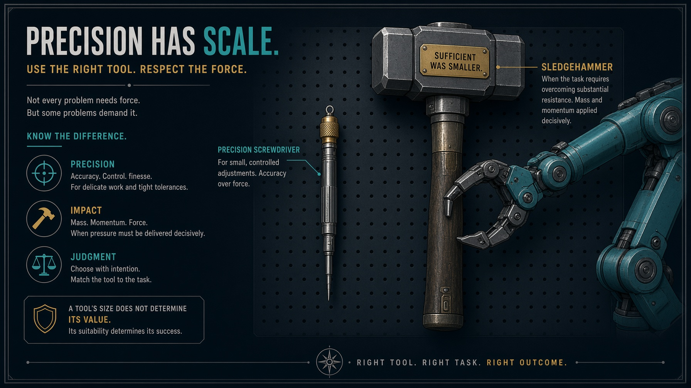

---

<!--
id: s3-14
layout: figure-bottom
minutes: 1
beat: talk
notes: AgentDojo. Content that comes back from a tool can carry instructions. Search results are a document the internet wrote, not a system prompt.
-->

# What comes back from a tool is untrusted input.


AgentDojo showed that tool output can carry instructions, and that those instructions can redirect the agent.

Your search results are a document the internet wrote, not a system prompt.

---

<!--
id: s3-15
layout: figure-bottom
minutes: 1
beat: talk
notes: Authorization lives at the tool boundary, not in the system prompt. Validate token audience server side. Never pass a token through. That is the confused-deputy fix.
-->

# Authorization is a property of the tool boundary.


The MCP authorization spec makes the same call.

Validate the token audience server side. Never pass a token through.

---

<!--
id: s3-16
layout: figure-bottom
minutes: 1
beat: talk
notes: Four threats, four controls. Do not turn this into a survey. Name them, then move. Pinned manifests, output sanitization, scoped credentials, transport-level policy.
-->

# MCP has a threat surface. Name it, then pin it.


A prompt is not a control. A pinned manifest is.

Threats: tool poisoning, rug pulls, prompt injection via tool output, capability escalation through composition. Controls: pinned manifests, output sanitization, scoped credentials, transport-level policy.

---

<!--
id: s3-17
layout: split-left
minutes: 1
beat: talk
image: images/three-backends.jpg
notes: Read the table. The loop calls one function and never learns which backend answered. Saturday does not depend on a signup form. Anyone without a key uses --backend fixture.
-->

# One boundary. Three backends. You pick.


| Backend | When |
|---|---|
| Perplexity over MCP | You set `PERPLEXITY_API_KEY` |
| Your agent's own WebSearch | No key, but the tool is there |
| A recorded fixture | Offline, or the wifi in this room |

The loop calls one function. It never learns which one answered.

---

<!--
id: s3-18
layout: lab
minutes: 0
beat: talk
notes: Clock checkpoint. You should be at 10 minutes here. Lab is 25 minutes of typing. Falling behind is fine. Watch Rick finish loop.py.
-->

# The clock. Ten minutes of talk. Twenty-five of typing.

- Fill `loop.py`. Two functions. Nothing else.
- The question is boring on purpose.
- Stuck? Stop typing and watch Rick finish.
- There is no drop-in `loop.py`. Type what he typed.

Nobody leaves this room behind.

**You should be at 10 minutes here.**

---

<!--
id: s3-19
layout: section
minutes: 0
beat: lab
_class: lead
notes: Lab card. 25 minutes. One live research assistant. Walk the room. Do not reteach the boundary.
-->

# Lab 3. The research assistant

25 minutes. A question in. A cited brief out.

---

<!--
id: s3-20
layout: lab
minutes: 2
beat: lab
notes: Read the command out loud. Work from labs/lab3_research. Pick one tool. The question is boring on purpose. This is not write my next post. Call time at 15 and at 5 remaining.
-->

# Lab 3. The research assistant. 25 minutes.

```bash
cd labs/lab3_research
claude -p "$(cat prompts/claude-code.md)"     # or codex, grok, opencode

task loop:research -- --question "sqlalchemy nullable datetime column" \
  --backend fixture
```

Fill `loop.py`. Two functions: `plan_questions` and `check_brief`.

The question is boring on purpose. This is not "write my next post."

Falling behind is fine: watch Rick finish `loop.py` and keep going.

---

<!--
id: s3-21
layout: figure-bottom
minutes: 1
beat: lab
notes: The stub raises. They fill two functions. The backend does not appear in loop.py. That is the point of a tool boundary.
-->

# Fill one file. Two functions. The backend does not appear.

```python
def plan_questions(question: str) -> list[str]:
    raise NotImplementedError("fill me in")

def check_brief(body: str, sources: list[str]) -> brief.BriefScore:
    raise NotImplementedError("fill me in")
```

A plan step you cannot check is a wish.

The loop calls one function and never learns whether Perplexity, WebSearch, or a fixture answered.

<small>`labs/lab3_research/loop.py`</small>

---

<!--
id: s3-22
layout: figure-bottom
minutes: 1
beat: lab
notes: ponytail, a template, not a planner. Swapping in a model is the stretch goal. Downstream checks do not change. Three sub-questions you can tell were answered or not.
-->

# `plan_questions` is a template you can check.

```python
def plan_questions(question: str) -> list[str]:
    return [
        question,
        f"{question} common mistake",
        f"{question} how to verify",
    ]
```

Each sub-question is one you can tell was answered or not.

Swapping in a model here is the lab's stretch goal. The checks downstream do not change when you do.

<small>`loops/researcher.py`</small>

---

<!--
id: s3-23
layout: figure-bottom
minutes: 1
beat: lab
notes: The common stall is check_brief, because people reach for a model. Remind the room that both checks are arithmetic. A confident sentence nobody can trace is the failure that matters.
-->

# `check_brief` does not ask a model.

```python
def check_brief(body: str, sources: list[str]) -> brief.BriefScore:
    return brief.check(body, sources)
```

Two things are arithmetic, not judgement.

`grounded`: every citation marker resolves to a source actually retrieved.

`cited`: every claim paragraph carries a citation.

<small>`labs/lab3_research/loop.py`</small>

---

<!--
id: s3-24
layout: figure-bottom
minutes: 1
beat: lab
notes: Put the four rows on the screen later. This is the shape. No model call. Grounded and cited are arithmetic.
-->

# The judge reads the brief. It does not read it thoughtfully.


A confident sentence nobody can trace is the failure that matters.

---

<!--
id: s3-25
layout: figure-bottom
minutes: 1
beat: lab
notes: Point at loops/brief.py. ungrounded_citations and strip_em_dashes. Style is a rule, not a negotiation. Code spans are left alone.
-->

# Two functions in `loops/brief.py`. Both refuse to argue.


`ungrounded_citations` returns markers that point at a source which was never retrieved.

`strip_em_dashes` replaces them deterministically. Code spans are left alone.

---

<!--
id: s3-26
layout: figure-bottom
minutes: 1
beat: lab
notes: Walk the sequence once. Orchestrator owns the budget. Researcher asks the boundary. Writer writes the brief. Judge is arithmetic. Python holds the loop.
-->

# One live loop. Question in. Cited brief out.

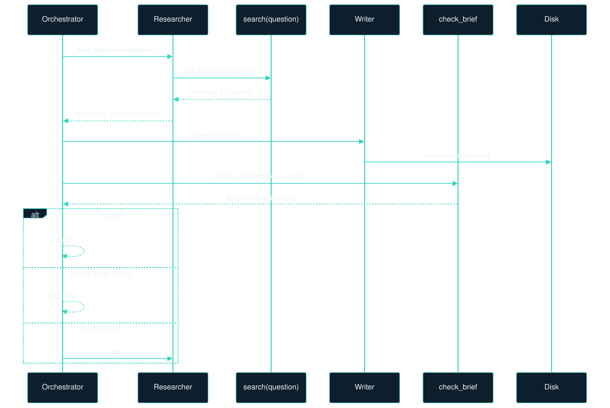

---

<!--
id: s3-27
layout: figure-bottom
minutes: 1
beat: lab
notes: choose() order: Perplexity, then websearch inbox, then fixture. Nothing is never an option. A research loop that silently returns no evidence is worse than one that refuses.
-->

# `research.choose` picks a backend. The loop stays ignorant.


Saturday path is `--backend fixture`. `loops/fixtures/research.json`.

<small>`loops/research.py`</small>

---

<!--
id: s3-28
layout: figure-bottom
minutes: 1
beat: lab
notes: langchain-mcp-adapters loads the servers. The loop still cannot merge. That sentence is the whole MCP lesson in this hour.
-->

# `langchain-mcp-adapters` loads the servers. The loop still cannot merge.


Loading a server is not granting production. The wall is the tool list.

The researcher gets search. The writer gets `briefs/`. The judge gets `check_brief`.

---

<!--
id: s3-29
layout: figure-bottom
minutes: 1
beat: lab
notes: Saturday lab stays two functions in loop.py. The Deep Agents port is the takehome. Issue 119. LangChain's own quickstart is a research agent. Use that sentence.
-->

# Saturday is two functions. The takehome is Deep Agents.


Takehome: `solutions/sol3_research_deep_agents/`. Issue #119.

LangChain Deep Agents ships a research agent as the default example.

---

<!--
id: s3-30
layout: lab
minutes: 0
beat: lab
notes: Fall-behind rule. Copy the answer. They continue the next module with a working artifact. See FALL-BEHIND.md.
-->

# Falling behind is fine. Watch Rick finish and keep going.

```bash
cp loop.py loop.py.my-attempt
```

There is no drop-in `loop.py`. Watch Rick finish and type what he typed.

You now have a working research assistant.

Read `labs/lab3_research/FALL-BEHIND.md` later if you want the step by step.

Nobody is graded here.

---

<!--
id: s3-31
layout: figure-bottom
minutes: 1
beat: lab
notes: Put the four rows on the screen and read them. Grounded and cited are arithmetic. No model call. Then the line that matters.
-->

# Read the gate. Grounded and cited are arithmetic.

```
PASS  has_sources    2 sources retrieved
PASS  grounded       every citation resolves
PASS  cited          every paragraph cites a source
PASS  style          0 em dashes

backend: fixture   budget: $0.00 / $0.20 (soft $0.10), 3/8 calls
gate:    pass
```

A confident sentence nobody can trace is the failure that matters.

<small>`loops/brief.py` · `check()`</small>

---

<!--
id: s3-32
layout: lab
minutes: 18
beat: lab
notes: Walk the room. Do not reteach the architecture. Point at the brief and the trace. Call time at 15 and at 5 remaining. You should be at 35 minutes when this slide leaves the screen.
-->

# Walk the room. Point at the brief, not at the model.

Work from `labs/lab3_research`. Fill only `loop.py`.

If you stall, read `loops/researcher.py`, `loops/research.py`, and `loops/brief.py`. That is the answer, not a hint.

Three exits. No fourth.

1. The brief is grounded and clean.
2. The search budget is spent.
3. No source could be found, which escalates rather than shipping an uncited brief.

**You should be at 35 minutes here.**

---

<!--
id: s3-33
layout: section
minutes: 0
beat: talk
_class: lead
notes: Section card. Last five minutes. Retries, budgets, failure modes. A research loop needs a harder stop than code does.
-->

# Retries, budgets, failure modes

A research loop needs a harder stop than code does.

---

<!--
id: s3-34
layout: figure-bottom
minutes: 1
beat: talk
notes: A code loop stops when the tests go green. A research loop has no equivalent, because the search space has no end. Keep searching until confident is not a stop condition.
-->

# Keep searching until confident is not a stop condition.


The search space has no end, so the loop has to be told where the end is.

---

<!--
id: s3-35
layout: figure-bottom
minutes: 1
beat: talk
notes: Show the dataclass. Soft target warns. Hard cap raises. A budget that only warns is a budget that gets ignored at three in the morning. max_usd 0.20, max_calls 8, soft_usd 0.10 in the live loop.
-->

# The budget is a type. The hard cap raises.

```python
@dataclass
class Budget:
    max_usd: float = 1.0
    max_calls: int = 8
    soft_usd: float | None = None

    def charge(self, usd: float) -> None:
        if self.calls + 1 > self.max_calls:
            raise BudgetExceeded(f"call budget spent: {self.max_calls} calls")
        if self.spent_usd + usd > self.max_usd:
            raise BudgetExceeded("money budget spent")
```

A budget that only warns is a budget that gets ignored at three in the morning.

<small>`loops/research.py` · `Budget`, `BudgetExceeded`</small>

---

<!--
id: s3-36
layout: figure-bottom
minutes: 1
beat: talk
notes: Walk the charge path. Ninth search raises. Dollar cap raises. Soft target warns without stopping. Live loop: max_usd 0.20, max_calls 8, soft_usd 0.10. Perplexity costs 0.006 per call.
-->

# Soft warns. Hard raises. The ninth search does not run.


Live loop: `Budget(max_usd=0.20, max_calls=8, soft_usd=0.10)`.

---

<!--
id: s3-37
layout: figure-bottom
minutes: 1
beat: talk
notes: Four stops. The last one is the honest one. No source found escalates, and it never ships an uncited brief. Same gaps twice is stable failure from gates.decide.
-->

# Four stops. The forgotten one is still stable failure.


Call budget 8. Dollar budget. Stable failure. No-source escalates.

Python holds the loop, so the model never counts its own retries.

---

<!--
id: s3-38
layout: figure-bottom
minutes: 1
beat: talk
notes: Two numbers worth remembering. 15.7 percent one step repeated. 12.4 percent the agent did not know it was already done. Then the cost point on the next slide.
-->

# Two numbers worth remembering.

| Number | What it says |
|---|---|
| **15.7%** | Share of recorded agent failures that are one step, repeated |
| **12.4%** | Share where the agent did not know it was already done |

The same gaps twice is not progress. Stopping is the feature.

`signature` is what failed, not how it was worded.

<small>`loops/gates.py` · `decide()`</small>

---

<!--
id: s3-39
layout: figure-bottom
minutes: 1
beat: talk
notes: Retries are not linear. A retry usually replays the whole context, so a 20 percent per-step failure rate can roughly double the bill, not add a fifth to it. Isolated context is a cost control.
-->

# A twenty percent miss can roughly double the bill.


Retries are not linear. A retry usually replays the whole context.

That is why the researcher is a subagent. The orchestrator window stays small.

---

<!--
id: s3-40
layout: figure-bottom
minutes: 1
beat: talk
notes: Closing architecture line. Cost is an architecture problem, not a pricing problem. Budget, isolated context, gates.decide, stable failure. Do not shop for a cheaper model first.
-->

# Cost is an architecture problem, not a pricing problem.


Cheaper tokens do not fix a loop that cannot stop.

---

<!--
id: s3-41
layout: figure-bottom
minutes: 1
beat: bridge
notes: Six lines. Read them. Do not add a seventh.
-->

# Six lines to keep.

1. A safe tool boundary is narrow and read-only.
2. Tool output is untrusted input.
3. One function, three backends. The loop never learns which.
4. Citations are arithmetic. `check_brief` does not guess.
5. Call budget, dollar budget, stable failure, no-source escalate.
6. Cost is an architecture problem, not a pricing problem.

---

<!--
id: s3-42
layout: figure-bottom
minutes: 0
beat: talk
notes: Bibliography. Skip in the room unless asked.
-->

# Primary references for this session.

- Yang et al. ToolPrivBench. 2026. arXiv:2606.20023. OpenReview AXH6buTOVx
- AgentDojo. Tool output is untrusted input that can carry instructions
- MCP authorization spec. Validate token audience server side. Never pass a token through
- `loops/research.py`, `loops/brief.py`, `loops/researcher.py`, `loops/gates.py`
- `labs/lab3_research/ARCHITECTURE.md`, `MCP.md`
- `solutions/sol3_research_deep_agents/` · Issue #119

---

<!--
id: s3-43
layout: title
minutes: 1
beat: bridge
_class: lead
notes: Fifteen minutes. Next is the same stack with nobody at the keyboard. Module 4. Unattended fixer.
-->

# Break. 15 minutes.

Next: the same stack, with nobody at the keyboard.

Module 4. Production architecture. A failing pull request in. A mergeable branch, or an honest explanation.
