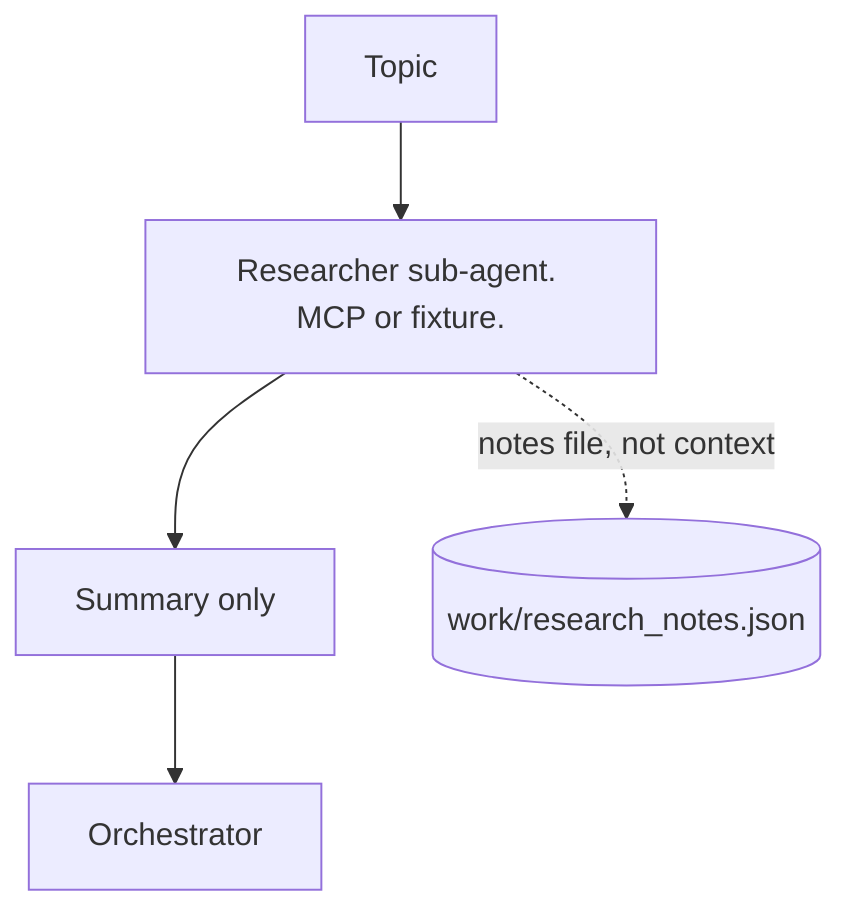
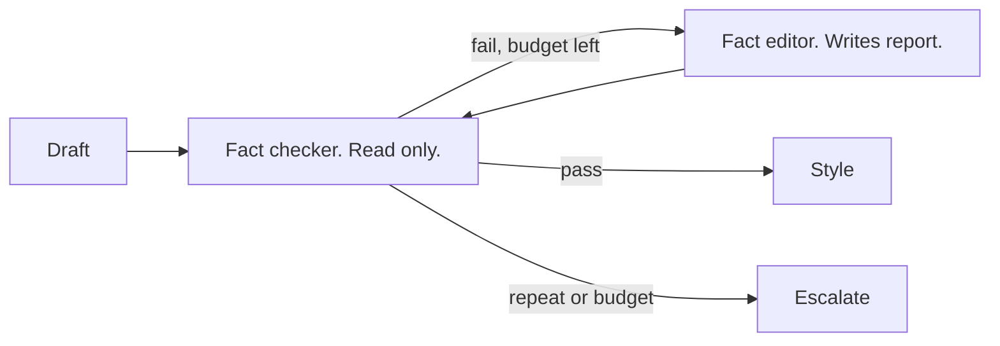
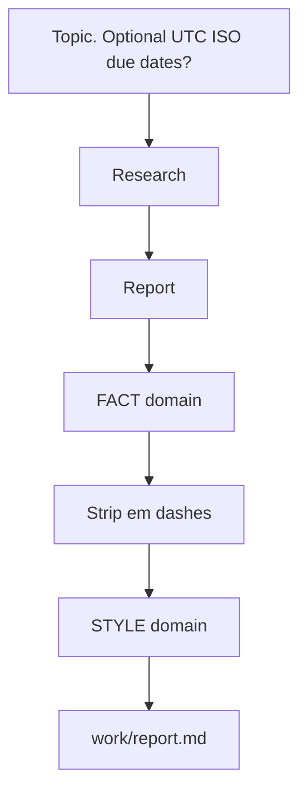

<!--
id: s3-01
layout: title
minutes: 1
beat: talk
-->

# Research Loops and MCP, the execution model

Session 3. 40 minutes. One research assistant. Not a survey.

---

<!--
id: s3-02
layout: split-right
minutes: 2
beat: talk
image: images/same-graph-new-object.png
image_prompt: >
  16:9. The Session 2 graph silhouette, unchanged. The object in the center
  swaps from a PR to a short report. A small plug labeled MCP on the
  researcher box only. No extra servers. No logos.
-->

# Same graph. New object.

- Orchestrator. Maker. Checker. Rubric. Gate. Budget.
- Output is a report, not a pull request.
- Mimic of the Spillwave v3 article pipeline. Cut down. No SEO. No images. No Notion.


---

<!--
id: s3-03
layout: split-left
minutes: 3
beat: talk
image: images/mcp-boundary.png
image_prompt: >
  16:9 a single tool plug in a wall socket labeled Perplexity. Other plugs
  (merge, deploy, seven other servers) are capped with red covers.
  Caption: one contract. No logos beyond a generic plug shape.
-->

# A safe MCP tool contract

- Model Context Protocol (MCP) is how the agent reaches outside.
- One server for this lab. Research. Perplexity if the key exists.
- Allowed: read research. Write notes in the work dir.
- Forbidden: merge. Deploy. Ticket state. Production.


---

<!--
id: s3-04
layout: figure-bottom
minutes: 2
beat: talk
-->

# Research stays in a sub-agent. Orchestrator gets a summary.

Cost control is structural. Not "please don't paste the dump."



---

<!--
id: s3-05
layout: split-right
minutes: 2
beat: talk
image: images/fixture-fallback.png
image_prompt: >
  16:9 two paths. Live path with a key. Fixture path with a sealed envelope
  of notes. Both arrive at the same report desk. A sign: Saturday does not
  depend on signup. No brand logos.
-->

# Perplexity is optional. The fixture is not.

- `PERPLEXITY_API_KEY` set: live search, still grounded by the fixture for the lab.
- Key missing: `fixtures/research.json`.
- Same as Langfuse versus local traces. The lab does not die on signup.


---

<!--
id: s3-06
layout: section
minutes: 0
beat: talk
-->

# Two quality domains. Fact, then style.

Same editor and checker shape as Session 2. New rubrics.

---

<!--
id: s3-07
layout: figure-bottom
minutes: 3
beat: talk
-->

# Fact-check loop. Checker has no write tools.

Must-include facts. Forbidden contradictions. Pass means no critical, no major.



---

<!--
id: s3-08
layout: split-right
minutes: 3
beat: talk
image: images/style-enforcer.png
image_prompt: >
  16:9 a steel rule striking through an em dash. Beside it a tiny rubric:
  one idea per sentence, expand MCP on first use, expand CRM on first use.
  Deterministic tool first, judge second. No logos.
-->

# Style-guide enforcer

- Deterministic first. Strip em dashes in code.
- Then the checker scores the rest.
- One idea per sentence. Expand MCP. Expand CRM.
- Not the full house guide. Not SEO. Not engagement.


---

<!--
id: s3-09
layout: split-left
minutes: 2
beat: talk
image: images/budget-calls.png
image_prompt: >
  16:9 a simple ledger. Each agent call is a coin. A hard line at 8 coins.
  Loops stop at the line even if the report is still dirty. No dashboards.
-->

# Three exits, again.

- Passing grade. No critical. No major. Minors do not block.
- Max loops. Default 3 per domain.
- Max budget. Each call costs 1. Cap is real.
- Repeat failure still escalates. Unresolved tags beat a fake pass.


---

<!--
id: s3-10
layout: lab
minutes: 1
beat: lab
-->

# Lab. One assistant, end to end.

```bash
pytest solutions/m3-research/tests -q
python solutions/m3-research/loop.py
python solutions/m3-research/loop.py --dirty
```

`--dirty` is the teaching run. Fail, retry, pass. Read `work/last-loop.json`.

---

<!--
id: s3-11
layout: figure-top
minutes: 3
beat: lab
-->



Topic is boring on purpose. Not "write my next Substack."

---

<!--
id: s3-12
layout: split-right
minutes: 4
beat: talk
image: images/failure-modes-m3.png
image_prompt: >
  16:9 four small cards. Signup stall. Dumping the dump into context.
  Fake pass on dirty style. Loop that ignores budget. Each card has a
  red X and a green fix. No logos.
-->

# Failure modes. Last five minutes.

- Signup stall. Use the fixture.
- Context dump. Research stays in the sub-agent.
- Fake pass. Unresolved tags, not a green lie.
- Budget ignored. Python stops it. The prompt does not.


---

<!--
id: s3-13
layout: title
minutes: 1
beat: bridge
-->

# Break.

Next: the same stack, unattended.
