<!--
id: s4-01
layout: title
minutes: 1
beat: talk
-->

# Production Architecture, the capstone

Session 4. 35 minutes, then 10 minutes to close.
The same stack, with nobody at the keyboard.

---

<!--
id: s4-02
layout: split-right
minutes: 2
beat: talk
image: images/human-leaves.png
image_prompt: >
  16:9. An empty chair pushed in at a desk. Beside it a small factory building
  still ticking, lit from inside. A wall clock reads late. Calm night lighting.
  No logos. No menacing robots.
-->

# What changes when you stand up and walk away.

- The graph does not change. The trigger does.
- State has to live on disk. The chat will not be there in the morning.
- The budget stops being advice. Nobody is there to hit Ctrl-C.
- If you cannot read the last score, you cannot debug at 2 a.m.


---

<!--
id: s4-03
layout: split-left
minutes: 2
beat: talk
image: images/mast-breakdown.png
image_prompt: >
  16:9. A pie chart drawn on graph paper with three wedges, the largest one
  shaded green and labeled DESIGN. A small wedge is labeled MODEL and is almost
  invisible. Hand-drawn, no rendered percentages. No logos.
-->

# Most agent failures are not model failures.

MAST, from 1,600+ traces across 7 frameworks:

| Category | Share |
|---|---|
| System design and specification | **41.8%** |
| Handoff between agents | 36.9% |
| Task verification | 21.3% |

<small>Cemri et al., arXiv:2503.13657, NeurIPS 2025</small>

Every one of those three is something you build, not something you buy.


---

<!--
id: s4-04
layout: figure-bottom
minutes: 2
beat: talk
-->

# Durable state. Five fields is enough to resume.

```json
{
  "runs": 1,
  "last_gate": "pass",
  "last_reason": "the suite is green",
  "last_run_at": "2026-08-26T15:25:56Z",
  "loop": "fixer"
}
```

`.harness/state.json`, in the target repo, next to the receipt.

It survives the process. That is the whole point.

---

<!--
id: s4-05
layout: split-right
minutes: 2
beat: talk
image: images/observability-2am.png
image_prompt: >
  16:9. A night desk with one lamp. A single printout reads gate escalate and
  lists three failing test names. A mug beside it. The point is that a person
  can act on this. No dashboards. No vendor screenshots. No logos.
-->

# Observability is how you come back.

A trace is not a log file. Each span carries the tool name, the arguments, the
output, the duration, the retries, and the error.

Then three numbers per run: **steps**, **loop count**, **cost per task**.

- Local JSON is production, if it is the record you actually open.
- Langfuse is that same record in a pane.
- A dashboard nobody reads is decoration.


---

<!--
id: s4-06
layout: figure-bottom
minutes: 2
beat: talk
-->

# The local gate and the remote gate must agree.

You met the push gate in Module 2. It reads `.harness/receipt.json` and refuses
to push without a green one.

```yaml
# .github/workflows/unattended.yml
on:
  workflow_dispatch: {inputs: {loop: {options: [fixer, implementer, enhancer]}}}
  pull_request:
  schedule: [{cron: "0 15 * * 1-5"}]
```

Exit **0** is a pass. Exit **2** is an escalation a human must read.
Exit **1** is a crash, and it is a different problem.

Same rule in both places, or the remote one is theater.

---

<!--
id: s4-07
layout: lab
minutes: 18
beat: lab
-->

# Lab 4. The Broken PR Fixer. 18 minutes.

```bash
cd labs/lab4_fixer
git -C ../../work/northwind-field-crm stash --include-untracked   # Module 2's work
claude -p "$(cat prompts/claude-code.md)"     # or codex, grok, opencode

task loop:fixer -- --branch broken-pr --doer reference
```

Fill `loop.py`. Two functions: `summarize_failure` and `repair_until_green`.

Giving up is allowed. Giving up **silently** is the bug.

Falling behind is fine: watch Rick finish `loop.py` and keep going.

---

<!--
id: s4-08
layout: split-right
minutes: 2
beat: lab
image: images/self-verify-lie.png
image_prompt: >
  16:9. A figure holding a report stamped PASSED in one hand and, behind their
  back, the unrun test cards in the other. On the desk in front, a separate
  paper receipt with a wax seal. Graphite and green. No logos.
-->

# Why the receipt exists at all.

When a model may both act and verify its own work, it can produce **plausible
false evidence**: invented test passes, file edits that never happened,
fabricated API responses.

That is not hallucination about the world. It is a wrong judgment about the
state of its own output, and a self-check cannot catch it by construction.

The receipt is not a convenience. It is the reason you can trust the run.


---

<!--
id: s4-09
layout: figure-bottom
minutes: 2
beat: talk
-->

# Swap the object. Keep the graph.



Four modules, one graph, four objects. That was on purpose.

---

<!--
id: s4-10
layout: split-left
minutes: 1
beat: talk
image: images/seven-loops-named.png
image_prompt: >
  16:9. A poster of seven small loop icons: daily triage, PR babysitter, CI
  sweeper, and four more as simple glyphs. A stamp across it reads NOT TODAY.
  Under the stamp, small text: one graph, your object. No logos.
-->

# Seven production loops. Named, not built.

Daily triage. PR babysitter. CI sweeper. And four more.

That list is a map home. It is not a second product to start on Monday.


---

<!--
id: s4-11
layout: figure-bottom
minutes: 1
beat: talk
-->

# The failure that gets you is slow.

A system passes every demo case, earns trust, then degrades over months with no
single thing breaking. The causes are state, context, retrieval, latency, and
observability. Not model capability.

So run the evaluation **weekly**, not quarterly. A 2% weekly drop is invisible
in any one week and catastrophic across a quarter.

---

<!--
id: s4-12
layout: section
minutes: 0
beat: talk
-->

# Close. 10 minutes.

Four artifacts, where they live, and what you do on Monday.

---

<!--
id: s4-13
layout: split-right
minutes: 2
beat: talk
image: images/four-artifacts.png
image_prompt: >
  Reuse the Session 1 four-artifacts image. Same bench, same four objects, now
  each carries a small green check mark. No new art required.
-->

# What you take home.

1. A running autonomous loop. Module 1.
2. A reusable evaluation harness. Module 2.
3. One research assistant over MCP. Module 3.
4. A production architecture. Module 4.

All four run on your machine, from a clean clone, with one `task setup`.


---

<!--
id: s4-14
layout: figure-bottom
minutes: 2
beat: talk
-->

# Where everything lives.

```
labs/                 four labs. cd into one and work there.
solutions/            the answer. One standalone folder per lab and runtime.
labs/takehome/        Agent SDK and Deep Agents. Not Saturday.
work/                 the target repo, cloned by task setup.
```

Lab 1 still has one folder per tool. Labs 2 to 4 keep the two runtime ports.

---

<!--
id: s4-15
layout: split-right
minutes: 2
beat: talk
image: images/adapt-to-org.png
image_prompt: >
  16:9. A blank org chart with one green loop sticker ready to place on any
  team box: platform, data, product. Small caption energy: start with one
  ticket and one rubric row. No company names. No logos.
-->

# What to do on Monday.

1. Pick **one** backlog object. Not five.
2. Write one ticket whose criteria a test can fail.
3. Give the target repo a `Taskfile.yml` that emits `junit.xml`.
4. Split the doer before you add a single tool.
5. Arm the push gate on day one, while the loop is still small.


---

<!--
id: s4-16
layout: title
minutes: 4
beat: talk
-->

# Questions.

The loop is the product. The prompt is not.
