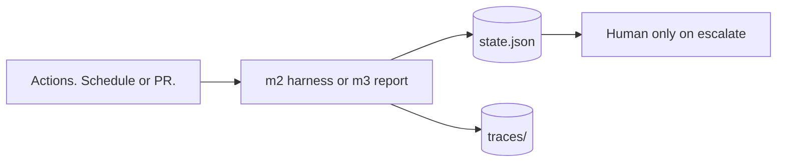
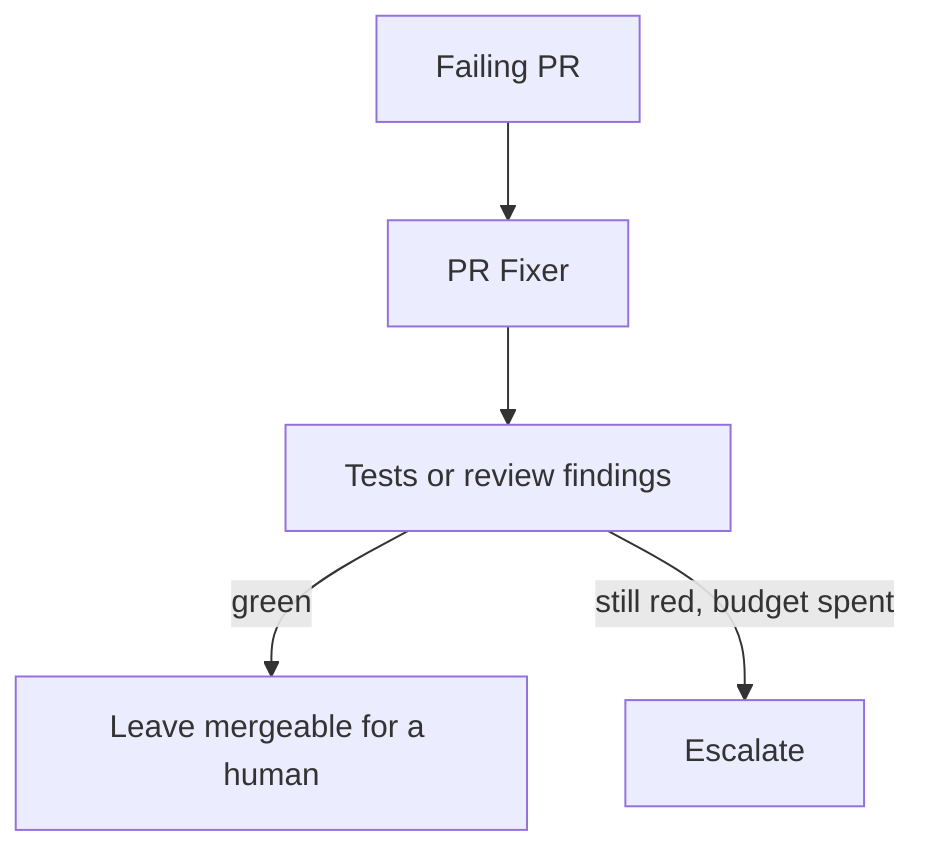
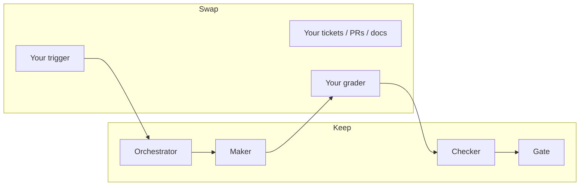

<!--
id: s4-01
layout: title
minutes: 1
beat: talk
-->

# Production Architecture, the capstone

Session 4. 35 minutes. Then 10 minutes close.
Same stack. No one at the keyboard.

---

<!--
id: s4-02
layout: split-right
minutes: 2
beat: talk
image: images/human-leaves.png
image_prompt: >
  16:9 an empty chair next to a running loop drawn as a small factory.
  The chair is pushed in. A clock on the wall. The factory still ticks.
  Calm night lighting. No logos. No scary robots.
-->

# What changes when you stand up.

- The graph does not change.
- The trigger does. Cron. Pull request. Ticket ready.
- State must live on disk. Chat will not be there in the morning.
- If you cannot read the last score, you cannot debug at 2am.


---

<!--
id: s4-03
layout: figure-bottom
minutes: 3
beat: talk
-->

# Durable state. Four fields.

Ticket. Branch. Trace id. Last score. That is enough to resume.



---

<!--
id: s4-04
layout: split-left
minutes: 2
beat: talk
image: images/observability-2am.png
image_prompt: >
  16:9 a night desk. One printout: gate escalate, failed_node_ids listed.
  A mug. A cheap lamp. The point is you can act. No flame graphs. No
  vendor APM screenshots. No logos.
-->

# Observability is how you return.

- Local JSON is production if it is the record you actually open.
- Langfuse is the same record in a pane.
- A dashboard you do not read is decoration.


---

<!--
id: s4-05
layout: split-right
minutes: 2
beat: talk
image: images/actions-trigger.png
image_prompt: >
  16:9 three starter pistols labeled workflow_dispatch, pull_request,
  weekday cron. They all fire the same runner. The runner is a small
  identical graph from Session 2. No GitHub mascot. No logos.
-->

# GitHub Actions is already a prereq.

- `workflow_dispatch` for the demo.
- `pull_request` for the fixer pattern.
- Weekday cron for after they go home.
- Saturday, do not wait on the cron.


---

<!--
id: s4-06
layout: figure-top
minutes: 3
beat: talk
-->



PR Fixer is the production pattern. Ship it as a working folder. Live build only if the room is on time.

---

<!--
id: s4-07
layout: lab
minutes: 1
beat: lab
-->

# Lab. Unattended, with a budget.

```bash
python solutions/m4-production/run_unattended.py --target m2
python solutions/m4-production/run_unattended.py --target m3
cat solutions/m4-production/state.json
```

Then show `.github/workflows/unattended.yml` and fire `workflow_dispatch`.

---

<!--
id: s4-08
layout: split-right
minutes: 3
beat: lab
image: images/state-json.png
image_prompt: >
  16:9 state.json as a card. Fields: ran_at, target, ticket_id, branch,
  last_score.passed, human false. A small badge "not a chat log."
  Paper on a shipping crate. No logos.
-->

# Read state.json out loud.

- `human: false` is the point of this hour.
- `last_score.passed` is whether you go back to bed.
- Artifact upload is the production record. The file is gitignored on purpose.


---

<!--
id: s4-09
layout: figure-bottom
minutes: 3
beat: talk
-->

# Swap the object. Keep the graph.

Their backlog instead of CRM due dates. Same orchestrator, Maker, Checker, gate.



---

<!--
id: s4-10
layout: split-left
minutes: 2
beat: talk
image: images/seven-loops-named.png
image_prompt: >
  16:9 a poster of seven named loops as small icons: Daily Triage,
  PR Babysitter, CI Sweeper, and four more as simple glyphs. A stamp
  NOT TODAY across the poster. Under it: one graph, your object.
  No article screenshots. No logos.
-->

# Seven production loops. Named. Not built.

- Daily triage. PR babysitter. CI sweeper. And the rest.
- That list is a map home. It is not today's lab.
- If they want a second product, they already missed the point.


---

<!--
id: s4-11
layout: section
minutes: 0
beat: talk
-->

# Close. 10 minutes.

Four artifacts. Done folders. Q and A.

---

<!--
id: s4-12
layout: split-right
minutes: 2
beat: talk
image: images/four-artifacts.png
image_prompt: >
  Reuse session 1 four-artifacts.png. Same bench. Now each object has a
  small check mark. No new art required.
-->

# What you take home.

1. A running loop. Session 1.
2. A reusable harness. Session 2.
3. One MCP research assistant. Session 3.
4. A production architecture. Session 4.


---

<!--
id: s4-13
layout: figure-bottom
minutes: 2
beat: talk
-->

# Point at the folders. Not at old branches.

```
solutions/crm
solutions/m1-implementer
solutions/m2-harness
solutions/m3-research
solutions/m4-production
labs/                      exercises next
```

---

<!--
id: s4-14
layout: split-right
minutes: 2
beat: talk
image: images/adapt-to-org.png
image_prompt: >
  16:9 a blank org chart with one green loop sticker they can place on
  any team: platform, data, product. Caption: start with one ready
  ticket and a grader. No company names. No logos.
-->

# How to adapt this on Monday.

- Pick one backlog object. Not five.
- Write a ready contract that can fail a test.
- Wrap Maker and Checker before you add MCP.
- Put state and a budget on the trigger you already have.


---

<!--
id: s4-15
layout: title
minutes: 4
beat: talk
-->

# Questions.

The loop is the product. The prompt is not.
