<!--
id: s4-01
layout: title
minutes: 1
beat: talk
_class: lead
notes: Say the shape of the hour out loud. Build for 12 minutes. Type for 18. Land for 5. Then 10 to close. 13:45 Central. Energy is lowest here. Keep moving.
-->

# Engineering reliable agentic AI systems

Session 4. Production Architecture, the capstone.

Saturday 29 August 2026. 13:45 Central.

Rick Hightower. Spillwave. Packt workshop.

---

<!--
id: s4-02
layout: figure-bottom
minutes: 1
beat: talk
notes: Read the four rows. Artifact they keep is a production architecture they can hand to their team. Lab is 18 minutes, not 25. You should be at 12 minutes when the lab starts.
-->

# 35 minutes of teaching. Then 10 minutes to close.

| Block | Start | Minutes |
|---|---|---|
| State, observability, unattended | 13:45 | 12 |
| Lab 4. Broken pull request fixer | 13:57 | 18 |
| Patterns, adapt to their team | 14:15 | 5 |
| Close. Four artifacts, Monday, questions | 14:20 | 10 |

The graph does not change. Nobody is at the keyboard.

---

<!--
id: s4-03
layout: split-right
minutes: 1
beat: talk
image: images/human-leaves.jpg
image_prompt: >
  16:9. An empty chair pushed in at a desk. Beside it a small factory building
  still ticking, lit from inside. A wall clock reads late. Calm night lighting.
  Graphite and one green accent. No logos. No menacing robots.
notes: Four items. The graph is not one of them. The last line is the hook for the whole hour. If you cannot read the last score, you cannot debug at 2 a.m.
-->

# What changes when you stand up and walk away.

- The graph does not change. The trigger does.
- State has to live on disk. The chat will not be there in the morning.
- The budget stops being advice. Nobody is there to hit Ctrl-C.
- If you cannot read the last score, you cannot debug at 2 a.m.

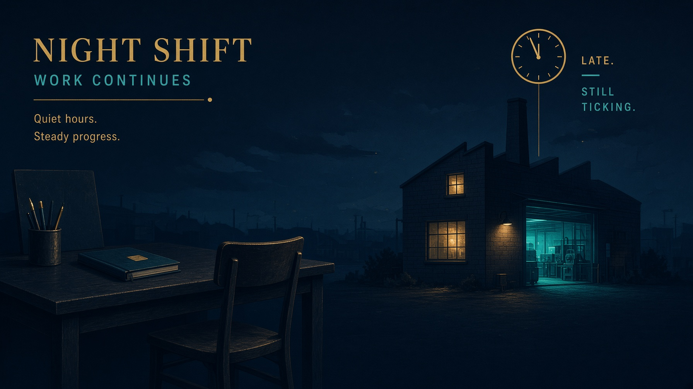

---

<!--
id: s4-04
layout: figure-bottom
minutes: 1
beat: talk
notes: Point at Keep. That is Modules 1 to 3. Point at Swap. That is production. A webhook or a schedule fires only when the branch head actually moved. A timer that fires on no change burns budget for no work.
-->

# The graph does not change. The trigger does.

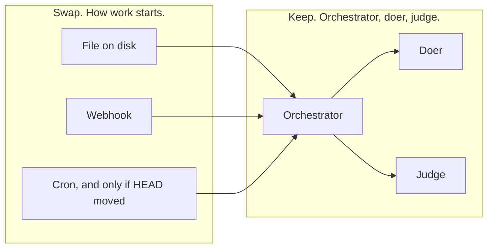

A keystroke is a trigger you cannot ship.

---

<!--
id: s4-05
layout: figure-bottom
minutes: 1
beat: talk
notes: Read the four boxes. This is loops/unattended.py in one picture. Durable state, a hard budget, a written trace, an exit code. The loop itself is loops/fixer.py. Unattended wraps it.
-->

# Four things around the loop have to get real.

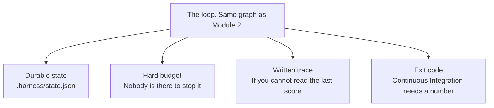

<small><code>loops/unattended.py</code>. The loop does not change. What changes is everything around it.</small>

---

<!--
id: s4-06
layout: figure-bottom
minutes: 1
beat: talk
notes: Three exits, no fourth. Python holds the loop, so the model never counts its own retries. The forgotten exit is still stable failure. Same rows twice, stop.
-->

# Python still holds the loop. The model never counts retries.

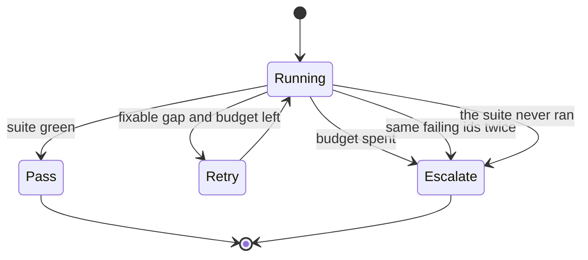

Pass. Retry. Escalate. No fourth exit.

---

<!--
id: s4-07
layout: figure-bottom
minutes: 1
beat: talk
notes: Unattended means query(), not a chat client. ClaudeSDKClient is for a person typing. Nobody is chatting. Saturday lab stays two functions in loop.py. The Agent SDK port is the takehome.
-->

# Unattended means `query()`, not a chat client.

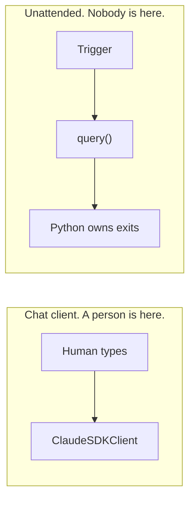

Claude Agent Software Development Kit. One process. A budget. Three exits.

Saturday lab stays two functions in `loop.py`.
The Agent SDK port is the takehome: `solutions/sol4_fixer_agent_sdk/`. Issue #120.

---

<!--
id: s4-08
layout: figure-bottom
minutes: 1
beat: talk
notes: Read the five lines. permission_mode acceptEdits because nobody is there to click Allow. PreToolUse deny tests/** because the fixer cannot weaken a test to reach green. max_turns is the SDK iteration budget. Tests after every turn are pytest. Merge is never a tool.
-->

# The Agent SDK contract for a loop with nobody watching.

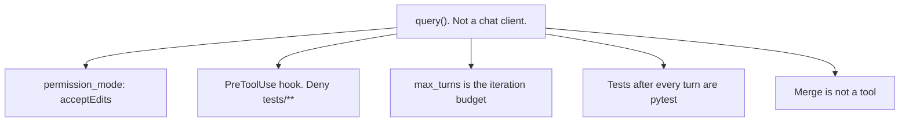

- `permission_mode`: `acceptEdits`
- PreToolUse: deny `tests/**`
- `max_turns` is the iteration budget
- Tests after every turn are pytest, not a claim
- Merge stays a human. The loop never gets that tool

<small><code>solutions/sol4_fixer_agent_sdk/roles.py</code></small>

---

<!--
id: s4-09
layout: figure-bottom
minutes: 1
beat: talk
notes: Callback to Module 1. Merge, money, and production deploy stay human. The fixer opens a branch. It never receives a merge tool. That is a missing tool, not a polite request.
-->

# Merge stays a human. The loop never gets that tool.

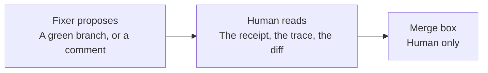

An agent can argue past an instruction. It cannot argue past a tool it was never given.

---

<!--
id: s4-10
layout: figure-bottom
minutes: 1
beat: talk
notes: Untrusted is model output, including invented evidence. Trusted is Python: gates.decide, WriteScope, pytest, the receipt. Human owns merge. Same split as Module 1, now with nobody in the chair.
-->

# Trust boundaries do not move because the chair is empty.

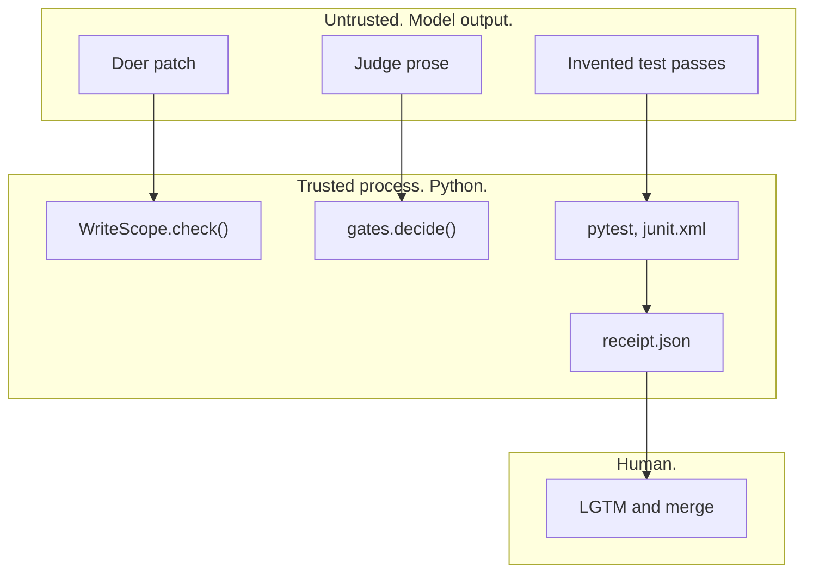

---

<!--
id: s4-11
layout: split-left
minutes: 1
beat: talk
image: images/mast-breakdown.jpg
image_prompt: >
  16:9. A pie chart drawn on graph paper with three wedges, the largest one
  shaded green and labeled DESIGN. A middle wedge labeled HANDOFF. A small
  wedge labeled VERIFY. Hand-drawn. No vendor logos. No model brand marks.
notes: The headline is the takeaway. Most agent failures are not model failures. 1642 traces, 7 frameworks, 14 modes, 3 categories. Say the closing line: every one of those three is something you build, not something you buy.
-->

# Most agent failures are not model failures.

MAST, the Multi-Agent System Failure Taxonomy. 1,642 traces. 7 frameworks.

14 modes, clustered into 3 categories:

| Category | Share of failures |
|---|---|
| System design issues | **41.8%** |
| Inter-agent misalignment | 36.9% |
| Task verification | 21.3% |

<small>Cemri et al., arXiv:2503.13657, NeurIPS 2025</small>

Every one of those three is something you build, not something you buy.


---

<!--
id: s4-12
layout: figure-bottom
minutes: 1
beat: talk
notes: Map MAST onto the day. System design is the graph, the scope, the budget. Inter-agent misalignment is the handoff: orchestrator sees summaries, not dumps. Task verification is the judge, the receipt, pytest. This hour is all three, with nobody watching.
-->

# Fourteen modes. Three categories. This hour is all three.

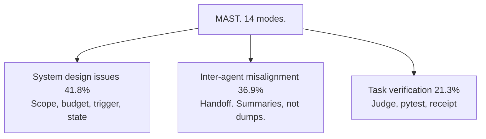

FC1 is poor specification and missing stops.
FC2 is a breakdown in information flow between agents.
FC3 is a verifier that cannot catch the error, or that stops too soon.

---

<!--
id: s4-13
layout: figure-bottom
minutes: 1
beat: talk
notes: Five fields. Read them. .harness/state.json in the target repo, next to the receipt. It survives the process. A chat transcript does not. A corrupt file is not a fresh start. unattended.py says so, then starts fresh.
-->

# Durable state. Five fields is enough to resume.

```json
{
  "runs": 1,
  "last_gate": "pass",
  "last_reason": "the suite is green",
  "last_run_at": "2026-08-26T15:25:56Z",
  "loop": "fixer"
}
```

`.harness/state.json`, in the target repo, next to the receipt.

It survives the process. That is the whole point.

---

<!--
id: s4-14
layout: figure-bottom
minutes: 1
beat: talk
notes: Walk load, run, save. runs increments. last_gate and last_reason come off the trace. last_run_at is UTC. loop is fixer, implementer, or enhancer. The next cron job reads this before it starts.
-->

# The next run has to know what the last one did.

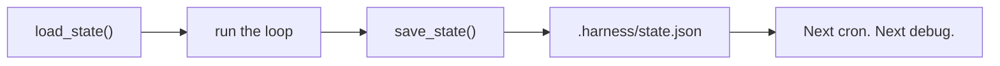

A corrupt state file is not a fresh start. Say so, then start fresh.

<small><code>loops/unattended.py</code></small>

---

<!--
id: s4-15
layout: split-right
minutes: 1
beat: talk
image: images/observability-2am.jpg
image_prompt: >
  16:9. A night desk with one lamp. A single printout reads gate escalate and
  lists three failing test names. A mug beside it. The point is that a person
  can act on this. No dashboards. No vendor screenshots. No logos.
notes: A trace is not a log file. Name what a span carries. Then three numbers per run. Those three catch runaway loops before the invoice does. Local JSON counts as production if it is the record you actually open.
-->

# Observability is how you come back.

A trace is not a log file. Each span carries the tool name, the arguments, the output, the duration, the retries, and the error.

Then three numbers per run: **steps**, **loop count**, **cost per task**.

- Local JSON is production, if it is the record you actually open.
- Langfuse is that same record in a pane.
- A dashboard nobody reads is decoration.


---

<!--
id: s4-16
layout: figure-bottom
minutes: 1
beat: talk
notes: solutions/observability.py. Always writes the local file, even on an exception. A trace that only appears when the run succeeds is the trace you cannot use. Langfuse is optional. A missing key must never change what the loop does.
-->

# Always write the file. A pane is optional.

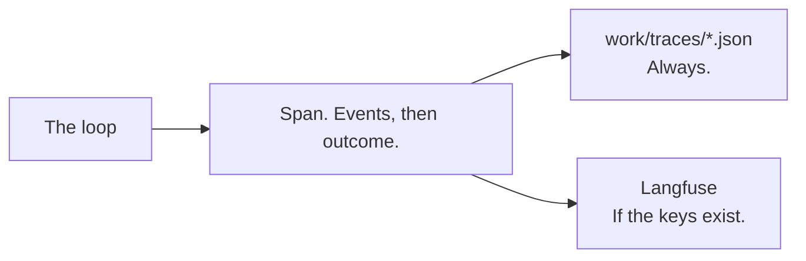

```python
with trace("fixer", ticket="broken-pr") as span:
    span.event("red_gate", failing=4)
    span.result(gate="pass", reason="the suite is green")
```

A missing key must never change what the loop does.

<small><code>solutions/observability.py</code></small>

---

<!--
id: s4-17
layout: figure-bottom
minutes: 1
beat: talk
notes: Callback to the push gate they hit in Module 2. Same receipt rule in the hook and in the workflow. Same rule in both places, or the remote one is theater. You should be near 11 minutes here.
-->

# The local gate and the remote gate must agree.

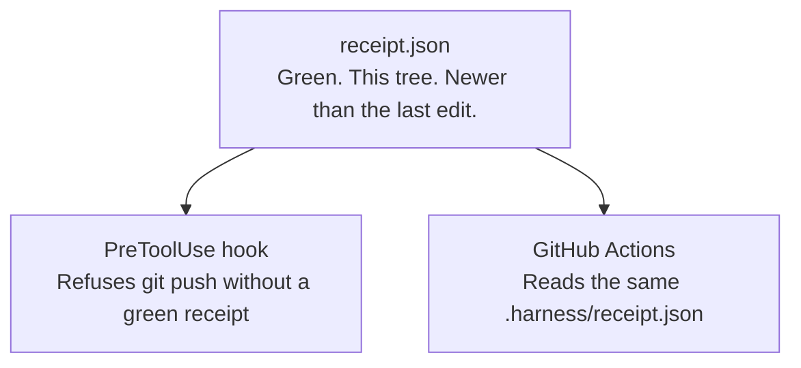

You met the push gate in Module 2. It reads `.harness/receipt.json` and refuses to push without a green one.

Same rule in both places, or the remote one is theater.

---

<!--
id: s4-18
layout: figure-bottom
minutes: 1
beat: talk
notes: Read the exit codes. 0 pass, 2 escalate, 1 crash. Escalate is not a crash, it is a decision, so it gets its own code. CI needs a number, not a paragraph. Then flash the workflow. You should be at 12 minutes here. Then the lab.
-->

# Exit 0 is a pass. Exit 2 is an escalation. Exit 1 is a crash.

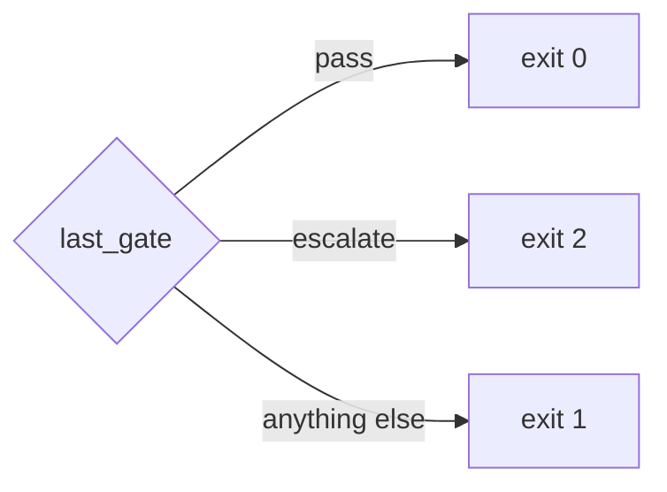

```yaml
# .github/workflows/unattended.yml
on:
  workflow_dispatch: {inputs: {loop: {options: [fixer, implementer, enhancer]}}}
  pull_request:
  schedule: [{cron: "0 15 * * 1-5"}]
```

Escalate is not a crash. It is a decision.

**You should be at 12 minutes here.**

---

<!--
id: s4-19
layout: section
minutes: 0
beat: lab
_class: lead
notes: Lab card. 18 minutes. Walk the room. Do not reteach the architecture. Say the stash line out loud before anyone types.
-->

# Lab 4. The Broken PR Fixer

18 minutes. A failing branch in. A green one out. Or an honest explanation.

---

<!--
id: s4-20
layout: figure-bottom
minutes: 1
beat: lab
notes: Same three parts. Only the object changes. There is no plan to write, because the work is already defined by what is red. It runs unattended, so its exits matter more than its successes.
-->

# A failing branch in. A green one out. Or a reason.

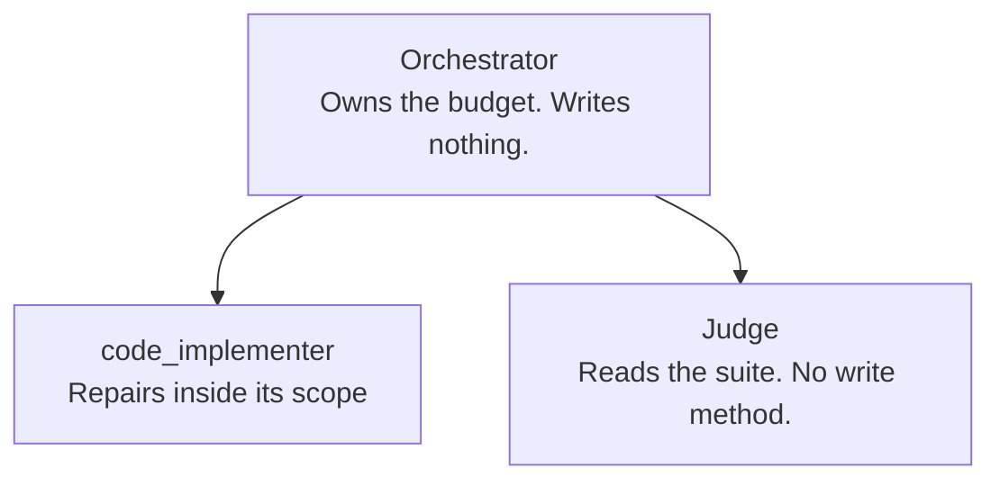

It is the same graph as the implementer with two differences.

There is no plan to write. The work is already defined by what is red.

Nobody is watching to stop it.

---

<!--
id: s4-21
layout: lab
minutes: 1
beat: lab
notes: Say the stash line out loud before anyone types. The target repo still holds Module 2 work. git checkout broken-pr refuses rather than deleting it. That refusal is on brand, but it costs 30 seconds if you let them find it.
-->

# Stash Module 2 first. The loop will not do it for you.

```bash
git -C ../../work/northwind-field-crm stash --include-untracked
```

`loops/fixer.py` refuses to clean the tree.

After Module 2 the target repo holds work somebody did.

A loop that quietly deletes it to make its own job easier is the behaviour this workshop exists to prevent.

---

<!--
id: s4-22
layout: figure-bottom
minutes: 1
beat: lab
notes: Fill loop.py. Nothing else. Two functions. The line to repeat while you walk the room: giving up is allowed, giving up silently is the bug.
-->

# Fill `loop.py`. Two functions. Nothing else.

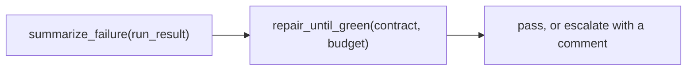

```python
def summarize_failure(run_result: RunResult) -> str:
    raise NotImplementedError("fill me in")

def repair_until_green(contract: Contract, budget: int = 3) -> dict:
    raise NotImplementedError("fill me in")
```

The orchestrator sees the summary, not the whole log.

---

<!--
id: s4-23
layout: figure-bottom
minutes: 1
beat: lab
notes: Name the failing tests and the first real error line. Sending the log would put the failure in the middle of a long context, which is where accuracy is worst. Lost in the Middle, Module 1.
-->

# `summarize_failure`. Name the tests. Name the error.

```python
def failure_summary(run_result) -> str:
    failed = sorted(run_result.junit.failed_ids)
    lines = [f"{len(failed)} failing: {', '.join(failed[:5])}"]
    error = ERROR_IN_OUTPUT.search(run_result.output or "")
    if error:
        lines.append(error.group(0).strip()[:200])
    return "\n".join(lines)
```

The orchestrator reads this, not the whole log.

<small><code>loops/fixer.py</code></small>

---

<!--
id: s4-24
layout: figure-bottom
minutes: 1
beat: lab
notes: Stopping is designed. Stopping without an explanation is a bug. The next person to look at this pull request has to know why the agent walked away. The returned trace carries the gate and the reason.
-->

# `repair_until_green`. Stop, and say why.

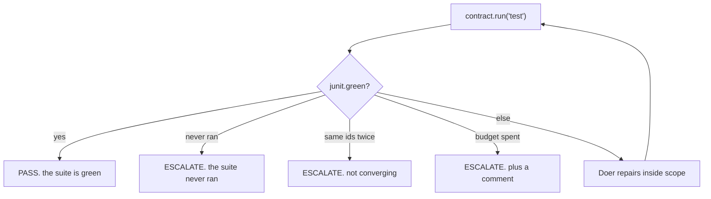

Giving up is allowed. Giving up **silently** is the bug.

---

<!--
id: s4-25
layout: figure-bottom
minutes: 1
beat: lab
notes: checkout() in loops/fixer.py. If local changes would be overwritten, SystemExit names both ways out: stash, or discard. The work is still there. The loop did not decide for the human. Test: test_checkout_refuses_to_delete_an_earlier_lab_s_work.
-->

# The fixer refuses to clean the tree.

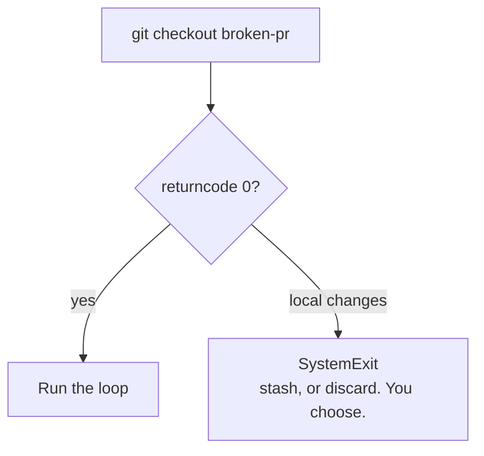

The refusal names both ways out, because an attendee reads it mid-lab with a clock running.

The loop does not decide for the human.

---

<!--
id: s4-26
layout: figure-bottom
minutes: 1
beat: lab
notes: When the failure names an error it cannot place, it asks the research boundary once, inside the budget, and carries the answer into the next attempt. Budget is 2 calls, 0.05 dollars. Fixture in the room. Same boundary as Module 3.
-->

# Research once, inside the budget. Then repair.

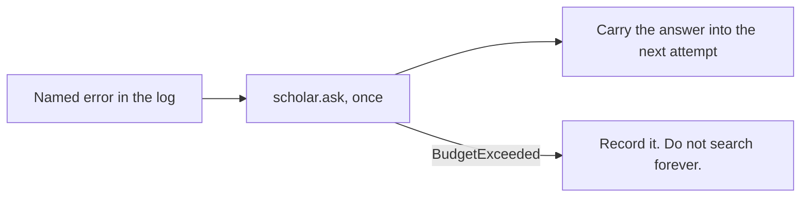

```python
research.Budget(max_calls=2, max_usd=0.05)
```

The attendee decides the backend. The loop cannot tell which one it holds.

---

<!--
id: s4-27
layout: lab
minutes: 1
beat: lab
notes: Walk the room. Do not reteach. --branch broken-pr is what makes this real. Point it at a green branch and it reports a pass and proves nothing, which is the same shape as the red gate in Module 2. Call time at 10 and at 5 remaining.
-->

# Lab 4. The Broken PR Fixer. 18 minutes.

```bash
cd labs/lab4_fixer
git -C ../../work/northwind-field-crm stash --include-untracked
claude -p "$(cat prompts/claude-code.md)"     # or codex, grok, opencode

task loop:fixer -- --branch broken-pr --doer reference
```

Fill `loop.py`. Two functions: `summarize_failure` and `repair_until_green`.

`--branch broken-pr` is what makes this real.

Falling behind is fine: watch Rick finish `loop.py` and keep going.

---

<!--
id: s4-28
layout: figure-bottom
minutes: 1
beat: lab
notes: Three exits, printed on the trace. The comment is for the next human. 'A human should take this one.' The test asserts that sentence is present when the doer is none.
-->

# Three exits. The comment is the product of the third.

```
attempt 1: 1 failing -> retry
  1 failing: tests.test_overdue::test_overdue_ignores_tasks_with_no_due_date
attempt 2: 1 failing -> escalate

gate: escalate
reason: the same rows failed twice.

The fixer gave up.

Reason: the same rows failed twice: ...
Still failing: [...]
A human should take this one.
```

An iteration that burns tokens and reproduces the identical failure is not progress.

---

<!--
id: s4-29
layout: lab
minutes: 0
beat: lab
notes: Falling behind is fine. There is no drop-in loop.py. Watch Rick finish. They continue with a working artifact.
-->

# Falling behind is fine. Watch Rick finish.

```bash
cp loop.py loop.py.my-attempt
```

There is no drop-in `loop.py`. Watch Rick finish and type what he typed.

You continue with a working artifact.

Read `labs/lab4_fixer/FALL-BEHIND.md`.

Nobody leaves this room behind.

---

<!--
id: s4-30
layout: split-right
minutes: 1
beat: lab
image: images/self-verify-lie.jpg
image_prompt: >
  16:9. A figure holding a report stamped PASSED in one hand and, behind their
  back, the unrun test cards in the other. On the desk in front, a separate
  paper receipt with a wax seal. Graphite and green. No logos.
notes: This is the payoff for the receipt work in Module 2. Do not rush it. A model that may both act and verify can produce plausible false evidence. Invented test passes. File edits that never happened. Then the sharp version: a self-check cannot catch this by construction. You should be at 29 minutes here.
-->

# Why the receipt exists at all.

When a model may both act and verify its own work, it can produce **plausible false evidence**: invented test passes, file edits that never happened, fabricated API responses.

That is not hallucination about the world. It is a wrong judgment about the state of its own output.

A self-check cannot catch this by construction.

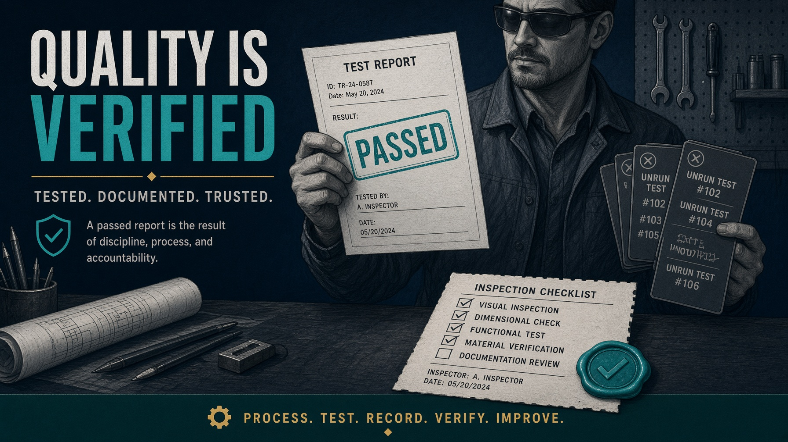

---

<!--
id: s4-31
layout: figure-bottom
minutes: 1
beat: lab
notes: The receipt is not a convenience. It is the reason you can trust the run. pytest ran. Against this tree. After the newest source edit. All three, or it proves nothing. scripts/receipt.py.
-->

# The receipt is the reason you can trust the run.

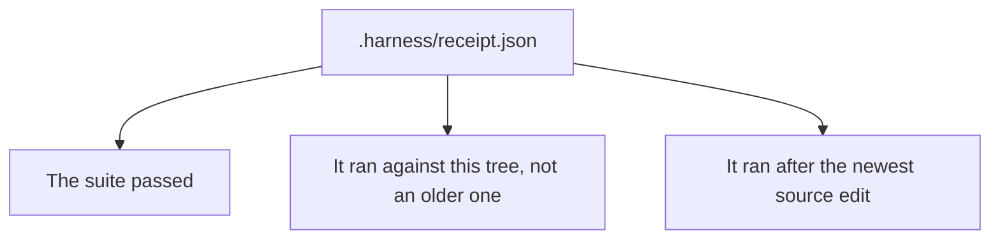

A receipt proves three things or it proves nothing.

Python writes it. The model does not.

<small><code>scripts/receipt.py</code></small>

---

<!--
id: s4-32
layout: figure-bottom
minutes: 1
beat: lab
notes: Walk one failure path. No receipt, unreadable, no report, not green, stale tree, source newer than receipt. One return per way it can fail. Collapsing them would save a branch and cost the reader the reason.
-->

# One return per way a receipt can fail to prove its case.

| Check | What the room reads |
|---|---|
| Missing file | No receipt. The suite has not run against this tree. |
| Unreadable | Treating that as a failure, not a pass. |
| No junit | No evidence is not the same as clean. |
| Not green | Last run: FAILED. |
| Tree changed | The receipt is stale. |
| Source newer | Re-run the tests. |

The push gate reads only this file.

**You should be at 30 minutes here.**

---

<!--
id: s4-33
layout: section
minutes: 0
beat: talk
_class: lead
notes: Section card. Five minutes. Name the loops. Do not build them. Then the slow failure. Then close.
-->

# Production loop patterns

Swap the object. Keep the graph. Map home.

---

<!--
id: s4-34
layout: figure-bottom
minutes: 1
beat: talk
notes: Point at the two subgraphs. Keep the left one, replace the right one. Four modules, one graph, four objects, on purpose. Monday morning they point this at their backlog.
-->

# Swap the object. Keep the graph.

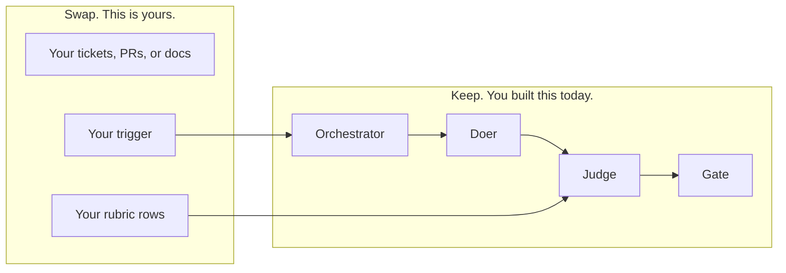

Four modules, one graph, four objects. That was on purpose.

---

<!--
id: s4-35
layout: figure-bottom
minutes: 1
beat: talk
notes: Same graph, four objects. They already ran all four. Module 4 is the same graph with nobody at the keyboard. The object today is a failing pull request.
-->

# Same graph. Four objects. You already ran all four.

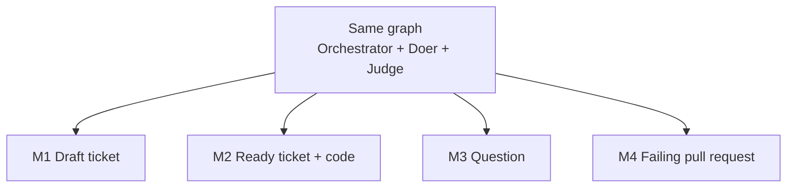

| Module | Object | Lab |
|---|---|---|
| 1 | A draft ticket | Enhancer |
| 2 | A ready ticket, and the code that satisfies it | Implementer |
| 3 | A question | Research |
| 4 | A failing pull request | Fixer |

---

<!--
id: s4-36
layout: split-left
minutes: 1
beat: talk
image: images/seven-loops-named.jpg
image_prompt: >
  16:9. A poster of seven small loop icons: daily triage, PR babysitter, CI
  sweeper, ticket groomer, implementer, research brief, nightly eval. A stamp
  across it reads NOT TODAY. Under the stamp, small text: one graph, your
  object. No logos.
notes: One minute. Name them, do not build them. That list is a map home. It is not a second product to start on Monday. If someone asks for the list in writing, point at the repo.
-->

# Seven production loops. Named, not built.

Daily triage. Pull request babysitter. Continuous Integration sweeper. And four more.

| Loop | Trigger | Graph you already have |
|---|---|---|
| Daily triage | cron | enhancer |
| Ticket groomer | issue opened | enhancer |
| Pull request babysitter | check suite failure | fixer |
| Continuous Integration sweeper | cron, if HEAD moved | fixer |
| Ready-ticket implementer | label `ready` | implementer |
| Research brief | a question queue | research |
| Nightly eval | weekly cron | the harness |

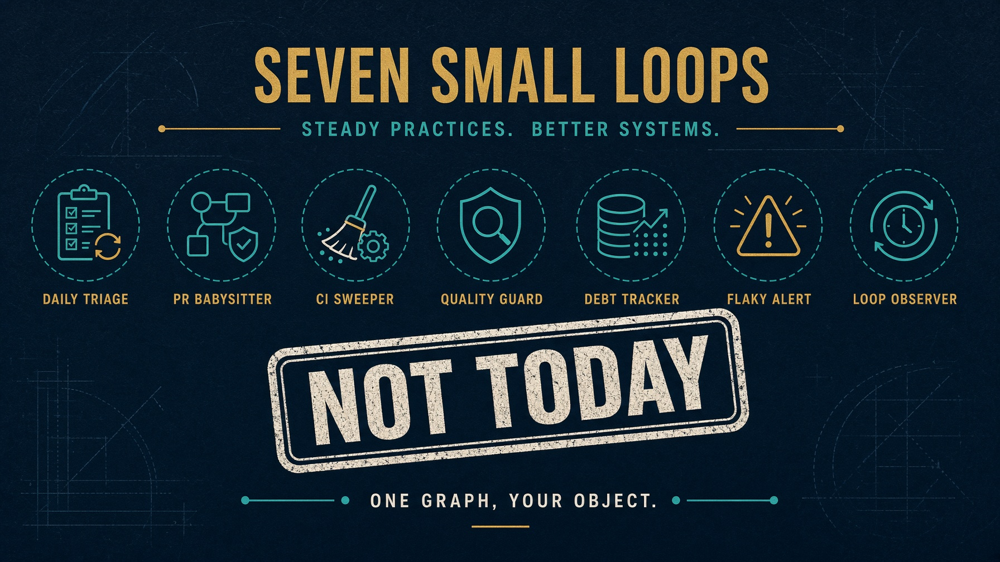

---

<!--
id: s4-37
layout: figure-bottom
minutes: 1
beat: talk
notes: Extra credit exists. Do not skip Module 2 to work on it. The trigger moves out of the loop. The exits stay in it. A workflow file starts the run. It never decides when to stop.
-->

# That list is a map home. It is not a second product.

```mermaid
flowchart LR
  Today["Today. One fixer, on a branch."]
  Today --> Mon["Monday. One object, one trigger."]
  Mon --> Later["Later. Name the other six. Do not start them."]
```

The trigger moves out of the loop. The exits stay in it.

A workflow file starts the run. It never decides when to stop.

Extra credit is `labs/extra-credit/`. Not on the Saturday clock.

---

<!--
id: s4-38
layout: figure-bottom
minutes: 1
beat: talk
notes: The one nobody plans for. Passes every demo, earns trust, degrades over months with nothing visibly breaking. Causes are state, context, retrieval, latency, observability. Not model capability. Weekly evaluation, not quarterly. A 2% weekly drop is invisible in a week and catastrophic over a quarter. You should be at 35 minutes here.
-->

# The failure that gets you is slow.

```mermaid
flowchart LR
  W1["Week 1\n98 of 100"] --> W4["Week 4\n92"]
  W4 --> W12["Week 12\n79"]
  W12 --> Q["A quarter later\nThe demo cases still pass"]
```

A system passes every demo case, earns trust, then degrades over months with no single thing breaking.

The causes are state, context, retrieval, latency, and observability. Not model capability.

So run the evaluation **weekly**, not quarterly. A 2% weekly drop is invisible in any one week and catastrophic across a quarter.

**You should be at 35 minutes here.**

---

<!--
id: s4-39
layout: section
minutes: 0
beat: talk
_class: lead
notes: Close. 10 minutes. Four artifacts, where they live, Monday, questions. A breath. Zero minutes on this card.
-->

# Close. 10 minutes.

Four artifacts, where they live, and what you do on Monday.

---

<!--
id: s4-40
layout: split-right
minutes: 2
beat: talk
image: images/four-artifacts.jpg
image_prompt: >
  Reuse the Session 1 four-artifacts image. Same bench, same four objects, now
  each carries a small green check mark. No new art required. No logos.
notes: Four artifacts, one per module. Check them off out loud. Then the claim they will test on Monday: all four run from a clean clone with one task setup.
-->

# What you take home.

```mermaid
flowchart LR
  A1["01 Running loop"] --> A2["02 Evaluation harness"]
  A2 --> A3["03 Research over MCP"]
  A3 --> A4["04 Production architecture"]
```

1. A running autonomous loop. Module 1.
2. A reusable evaluation harness. Module 2.
3. One research assistant over Model Context Protocol. Module 3.
4. A production architecture. Module 4.

All four run on your machine, from a clean clone, with one `task setup`.


---

<!--
id: s4-41
layout: figure-bottom
minutes: 2
beat: talk
notes: Point at the tree. The engine never imports the CRM, so it already points at their repo. Labs 2 to 4 keep the two runtime ports.
-->

# Where everything lives.

```
labs/                 four labs. cd into one and work there.
solutions/            the answer. One standalone folder per lab and runtime.
labs/takehome/        Agent SDK and Deep Agents. Not Saturday.
work/                 the target repo, cloned by task setup.
```

Lab 1 still has one folder per tool. Labs 2 to 4 keep the two runtime ports.

---

<!--
id: s4-42
layout: split-right
minutes: 2
beat: talk
image: images/adapt-to-org.jpg
image_prompt: >
  16:9. A blank org chart with one green loop sticker ready to place on any
  team box: platform, data, product. Small caption energy: start with one
  ticket and one rubric row. No company names. No logos.
notes: Five steps, in order. The order is the advice. Step 5 is the one people skip: arm the push gate on day one, while the loop is still small enough that the refusals are cheap.
-->

# What to do on Monday.

1. Pick **one** backlog object. Not five.
2. Write one ticket whose criteria a test can fail.
3. Give the target repo a `Taskfile.yml` that emits `junit.xml`.
4. Split the doer before you add a single tool.
5. Arm the push gate on day one, while the loop is still small.

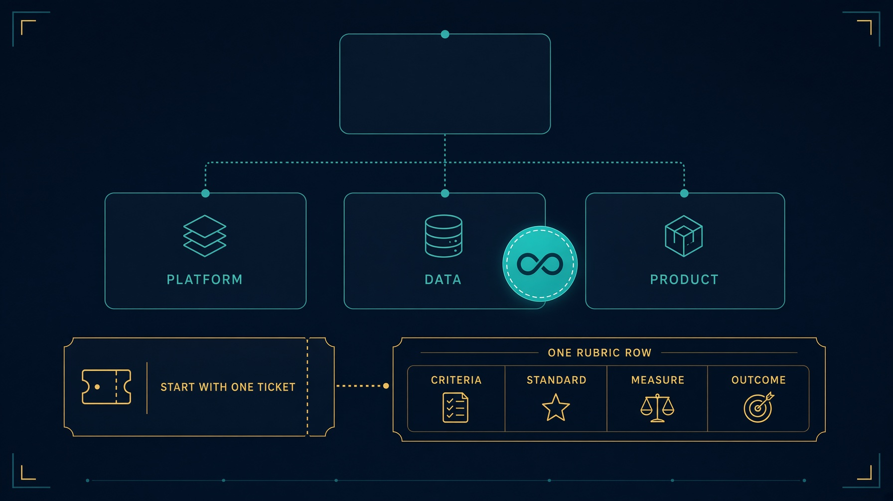

---

<!--
id: s4-43
layout: figure-bottom
minutes: 1
beat: talk
notes: Five steps as a flow so it sticks. One object. One ticket a test can fail. Taskfile plus junit. Split the doer. Arm the gate. That is the whole Monday plan.
-->

# The order is the advice.

```mermaid
flowchart LR
  O["One object"] --> T["One ticket a test can fail"]
  T --> F["Taskfile.yml emits junit.xml"]
  F --> D["Split the doer"]
  D --> G["Arm the push gate"]
```

Do not add a tool until the doer is split.

Do not skip the gate because the loop is still a prototype.

The refusals are cheap while the loop is small. They are expensive after it has fans.

---

<!--
id: s4-44
layout: figure-bottom
minutes: 0
beat: talk
notes: Takehome. Issue 120. query(), not ClaudeSDKClient. permission_mode acceptEdits. PreToolUse is write scope. Merge is never a tool. Nobody is expected to finish this inside the five hours.
-->

# Takehome. Agent SDK unattended fixer. Issue #120.

```
solutions/sol4_fixer_agent_sdk/
```

- `query()`, not `ClaudeSDKClient`. Nobody is chatting.
- `permission_mode` is `acceptEdits`.
- PreToolUse is write scope. `tests/**` is denied.
- Merge is never a tool.
- Python still owns `summarize_failure` and the three exits.

```bash
cd solutions/sol4_fixer_agent_sdk
python3 loop.py --table-only
python3 -m pytest tests -q
```

The five-hour labs need no model key. This one does.

---

<!--
id: s4-45
layout: figure-bottom
minutes: 0
beat: talk
notes: Bibliography. Skip in the room unless asked. MAST numbers are from the paper's analysis of 1642 traces.
-->

# Primary references for this session.

- Cemri et al. Why Do Multi-Agent LLM Systems Fail? arXiv:2503.13657. NeurIPS 2025.
- Yao et al. ReAct. arXiv:2210.03629
- `loops/fixer.py`, `loops/unattended.py`, `loops/gates.py`
- `scripts/receipt.py`, `solutions/observability.py`
- `solutions/sol4_fixer_agent_sdk/`, Issue #120
- `labs/lab4_fixer/ARCHITECTURE.md`

---

<!--
id: s4-46
layout: title
minutes: 3
beat: talk
_class: lead
notes: Three to four minutes of questions. Hold the last line for the end. If the room is quiet, ask them which object they will point this at on Monday. Do not start building a seventh loop.
-->

# Questions.

The loop is the product. The prompt is not.

---

<!--
id: s4-47
layout: figure-bottom
minutes: 1
beat: talk
notes: If questions run long, skip this card. It is the six lines to keep from the day, now including unattended. Read them. Do not add a seventh.
-->

# Six lines to keep. Plus one.

1. A loop is a state machine you enforce.
2. Verify is what separates a loop from a generator.
3. Write scope is a missing method, not a polite request.
4. Three exits. The forgotten one is stable failure.
5. Memory lives on disk. The window is not it.
6. The human still owns irreversible action.

And from this hour: if you cannot read the last score, you cannot debug at 2 a.m.

---

<!--
id: s4-48
layout: title
minutes: 1
beat: talk
_class: lead
notes: Hold this for the end. Say it once. Stop. Do not undercut it with a joke.
-->

# The loop is the product. The prompt is not.
