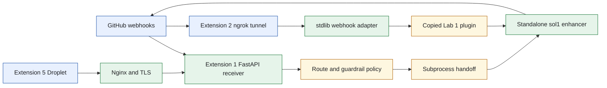
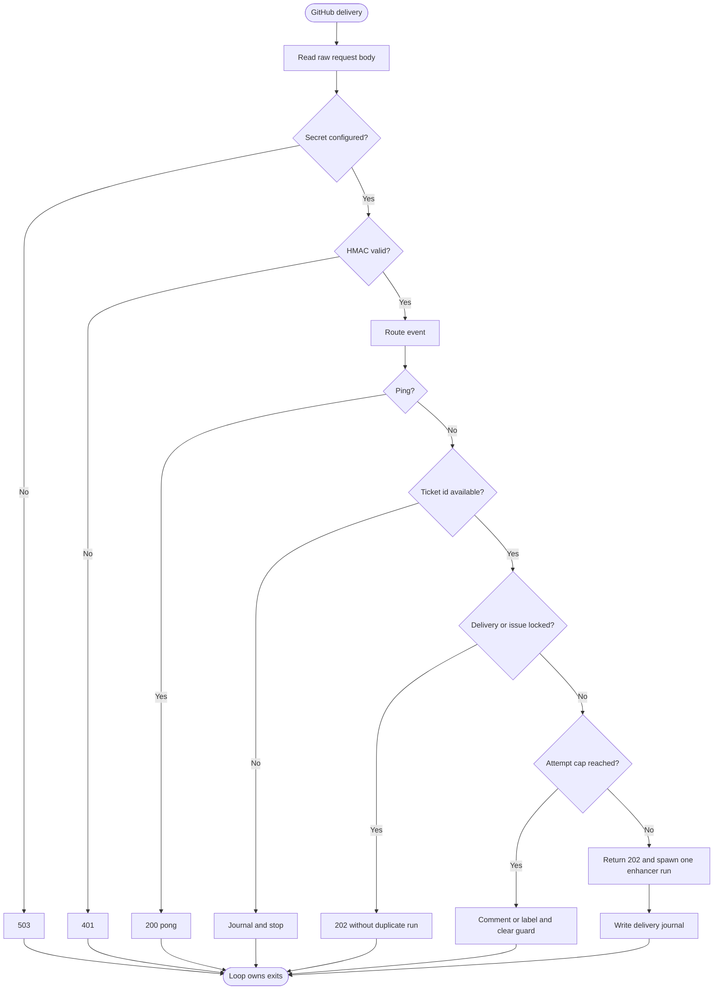
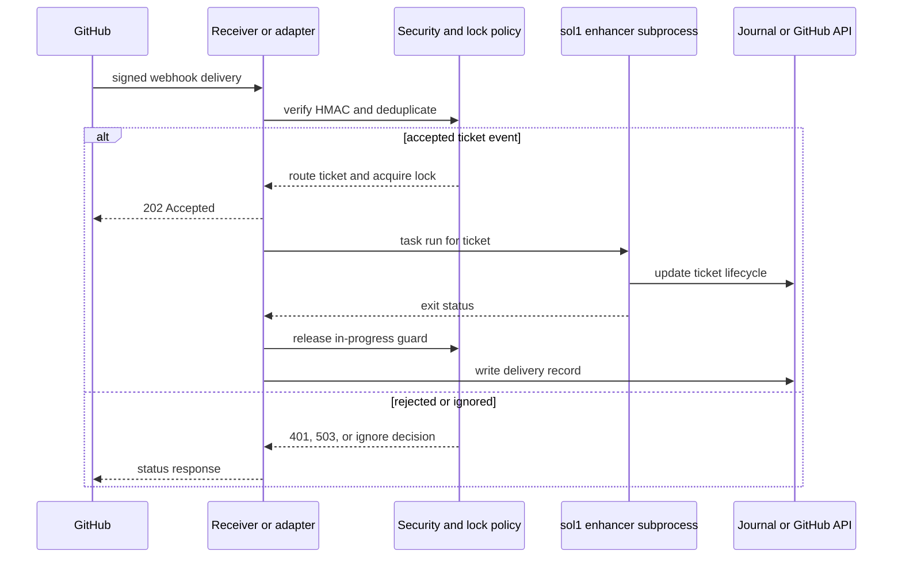
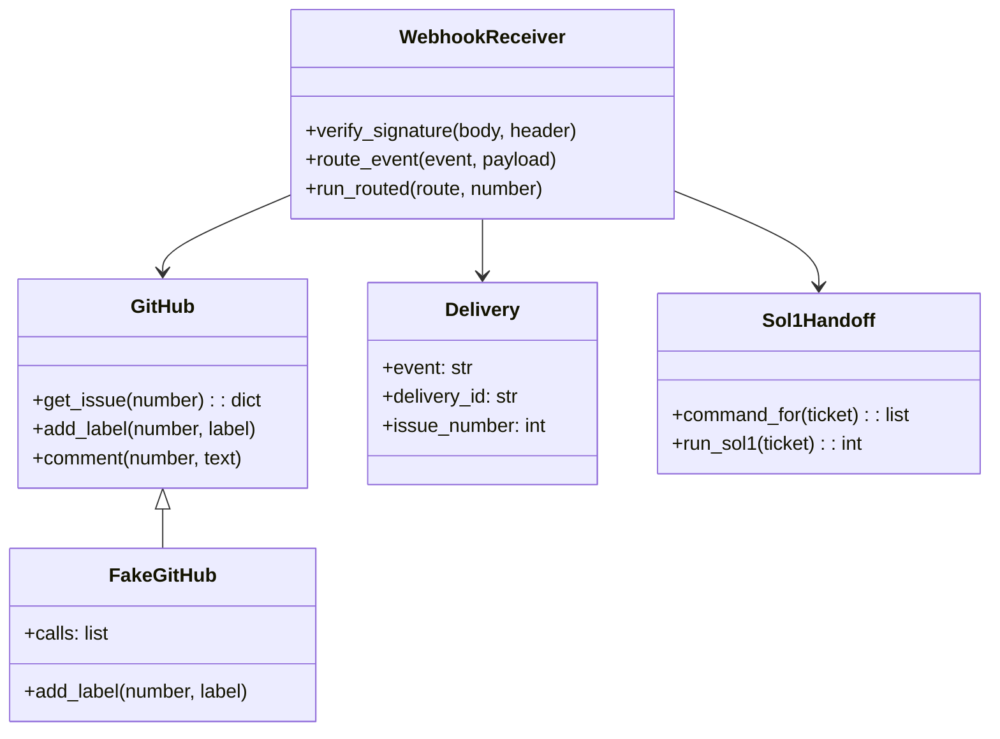
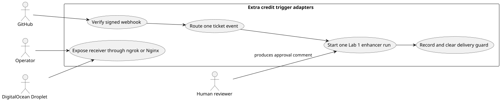

# Extra Credit Trigger Adapters

## Software Design Document

## Contents

1. Introduction and goals
2. Constraints and context
3. Solution strategy
4. Building blocks
5. Runtime and data model
6. Deployment, quality, and risks
7. Glossary

## 1. Introduction and goals

This directory is a collection of extra-credit trigger and deployment adapters for the Lab 1 ticket enhancer. It deliberately moves only the trigger outside the enhancer. The enhancer remains the owner of ticket completeness, human approval, retry, and stop behavior.

### Functional requirements

- Receive a GitHub webhook over FastAPI or a stdlib HTTP adapter.
- Verify HMAC SHA-256 against the raw request body before routing an event.
- Map an issue title or front matter to a ticket identifier without inventing one.
- Reply quickly with `202` and start exactly one local enhancer subprocess for an accepted ticket event.
- Protect concurrent deliveries with per-issue locks, delivery deduplication, attempt labels, and cleanup of `agent-in-progress`.
- Journal each delivery for local diagnostics.
- Expose the receiver through an ngrok tunnel or a Droplet behind Nginx and TLS.

### Quality requirements

- Missing secret returns `503`; invalid or missing signature returns `401`.
- The receiver never imports `sol1_enhancer`; it calls the folder's Task command as a subprocess.
- Webhook processing does not decide the loop's stop condition.
- Local tests use `FakeGitHub` and mocked handoffs rather than tokens or live GitHub.
- DigitalOcean deployment binds the application to localhost and exposes it only through Nginx.

## 2. Constraints and context

The root package is not a shared loop engine. It contains reusable GitHub API and fake-client helpers because multiple extension assignments need those integration primitives, while the actual agent loop remains in the standalone Lab 1 folder. The `s_ext_3_groom_ticket` and `s_ext_4_fix_pr` directories currently contain no tracked implementation artifacts; this document records the implemented extensions rather than inventing designs for empty folders.



The two webhook shapes serve the same integration contract. Extension 1 calls the standalone Lab 1 folder; Extension 2 copies the plugin to remain portable. Source: [`docs/diagrams/architecture.mmd`](docs/diagrams/architecture.mmd).

## 3. Solution strategy

The strategy has four layers.

| Layer | Design choice | Rationale |
| --- | --- | --- |
| Transport | FastAPI receiver or stdlib HTTP adapter | Accept GitHub delivery formats without embedding agent logic. |
| Security | Constant-time HMAC comparison over raw body | Reject attacker-controlled payloads before parsing. |
| Delivery control | Lock files, delivery records, labels, and attempt caps | Avoid duplicate concurrent work and visible runaway behavior. |
| Handoff | Subprocess `task run` for one ticket | Preserve the enhancer as the sole owner of exits. |

The receiver routes `issues` opened and appropriate human comments to grooming. It skips its own enhancer marker, accepts `ping`, and keeps ready-label fulfillment or failed-check fixing as routed-but-not-wired extension points.

## 4. Building blocks

```text
solutions/extra_credit/
├── github_api.py                  GitHub client, labels, and attempt helpers
├── fake_github.py                 Recording client for offline tests
├── s_ext_1_webhook/
│   ├── webhook.py                 FastAPI receiver and delivery policy
│   ├── call_sol1.py               Backend selection and subprocess handoff
│   └── tests/                     Receiver and handoff tests
├── s_ext_2_ngrok/
│   ├── bin/webhook_trigger.py     Stdlib adapter with reply-first spawning
│   ├── bin/copy_plugin.sh         Copies Lab 1 plugin for portability
│   ├── ngrok-github.yml           Optional edge policy
│   └── tests/                     Adapter and HTTP tests
├── s_ext_3_groom_ticket/          Directory present, no tracked implementation
├── s_ext_4_fix_pr/                Directory present, no tracked implementation
├── s_ext_5_digitalocean/
│   └── deploy/                    Bootstrap, service, Nginx, smoke, and signer scripts
└── tests/                         Root GitHub API tests
```

| Module or package | Responsibility |
| --- | --- |
| `github_api.py` | Calls GitHub, normalizes labels, and manages visible attempt labels. |
| `fake_github.py` | Captures client calls for deterministic tests. |
| `s_ext_1_webhook/webhook.py` | Validates signatures, routes events, locks issues, journals deliveries, and invokes the handoff. |
| `s_ext_1_webhook/call_sol1.py` | Resolves an allowed backend folder and runs the enhancer through Task. |
| `s_ext_2_ngrok/bin/webhook_trigger.py` | Minimal reply-first listener for a copied plugin. |
| `s_ext_5_digitalocean/deploy` | Installs and operates the same receiver using systemd, Nginx, and TLS. |

## 5. Runtime and data model

### Webhook lifecycle



The adapter exits once it has accepted, recorded, and launched one run. It does not wait for the enhancer's internal retry sequence. Source: [`docs/diagrams/workflow.mmd`](docs/diagrams/workflow.mmd).

### Major use case sequence



The response happens before the potentially long agent process. GitHub receives a timely acknowledgement while the local journal preserves observability. Source: [`docs/diagrams/sequence.mmd`](docs/diagrams/sequence.mmd).

### Domain model



The state model is file and GitHub based: delivery JSON, lock files, issue labels, comments, and configured environment values. It has no relational database or ERD. Source: [`docs/diagrams/model.mmd`](docs/diagrams/model.mmd).

### Use cases



PlantUML source: [`docs/diagrams/use-cases.puml`](docs/diagrams/use-cases.puml).

## 6. Deployment, quality, and risks

### Deployment view

For local integration, start the Extension 1 FastAPI receiver directly or the Extension 2 adapter and an ngrok HTTPS tunnel. Configure GitHub webhooks on the target CRM fork, not on this seminar repository. For persistent use, Extension 5 installs the receiver behind Nginx on a DigitalOcean Droplet. The application listens only on loopback, and Nginx terminates TLS.

### Quality scenarios

| Scenario | Expected behavior |
| --- | --- |
| Unsigned request | Return `401` without processing its body. |
| Missing webhook secret | Return `503`, retaining a fail-closed deployment state. |
| GitHub retries the same delivery | Delivery record prevents a second enhancer start. |
| Two events target the same issue | Per-issue lock allows one active handoff. |
| Enhancer subprocess fails | Release `agent-in-progress`, record the run, and leave loop exit logic to the enhancer. |
| ngrok URL changes | Operator updates the GitHub webhook endpoint; the adapter contract is unchanged. |

### Risks and technical debt

- Free ngrok URLs rotate on restart and may require manual GitHub configuration updates.
- Lock files require operational cleanup if a host terminates unexpectedly.
- The Droplet holds tokens, so process, firewall, and file permissions must be maintained carefully.
- Extension 3 and Extension 4 have no tracked code, which is a documentation and scope gap rather than an implemented feature.
- The subprocess boundary depends on a valid local Task installation and correct working directory.

## 7. Glossary

| Term | Meaning |
| --- | --- |
| Delivery | One GitHub webhook request, identified by `X-GitHub-Delivery`. |
| Handoff | Subprocess call that starts one ticket enhancer run. |
| In-progress guard | Label and lock state that prevent duplicate concurrent work. |
| Trigger | Event adapter that starts a loop without owning its stop conditions. |
| Loop exit | Ready, retry, or escalation decision that remains inside `sol1_enhancer`. |
