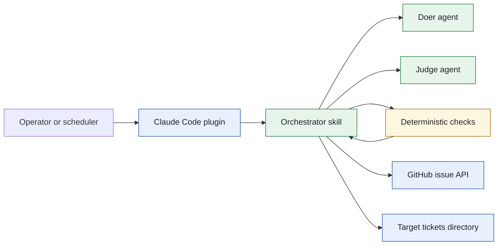
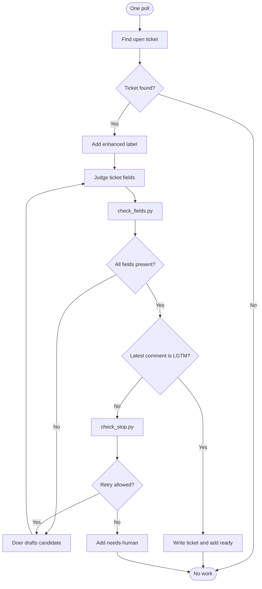
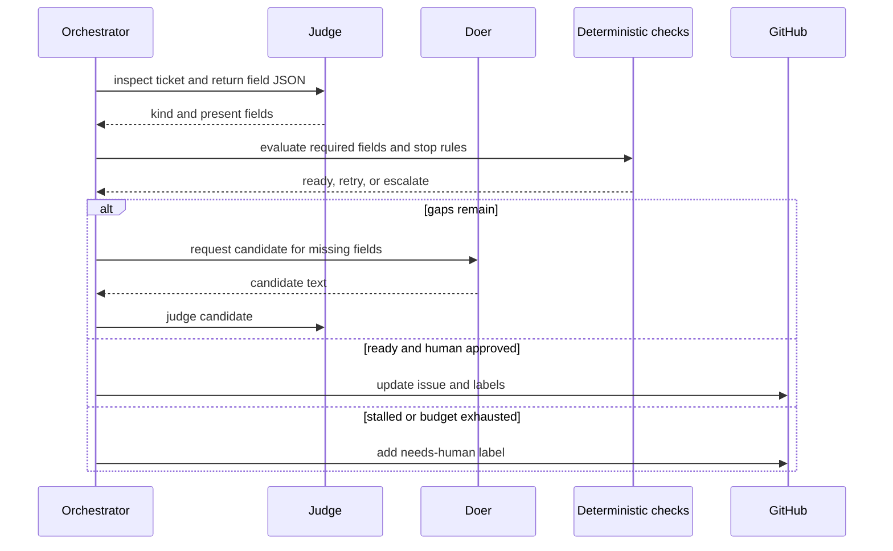
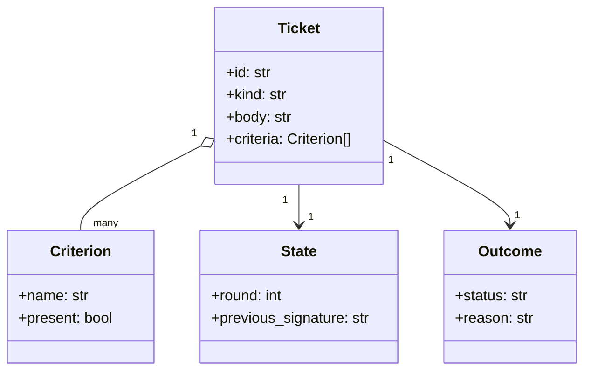
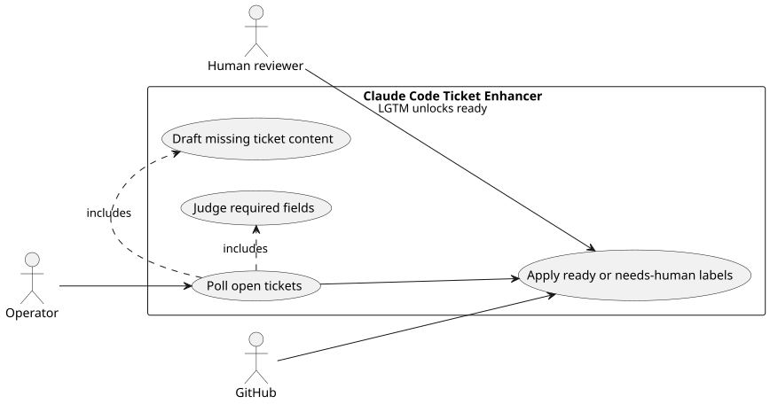

# Lab 1 Ticket Enhancer

## Software Design Document

## Contents

1. Introduction and goals
2. Constraints and context
3. Solution strategy
4. Building blocks
5. Runtime and data model
6. Deployment, quality, and risks
7. Glossary

## 1. Introduction and goals

This Claude Code plugin turns an incomplete CRM GitHub issue into a ticket that is ready for a human reviewer. It performs one stateless poll at a time, identifies missing fields, obtains a candidate revision from a doer, and uses deterministic checks to decide whether to retry, release, or request human attention. The orchestrator is the only component permitted to change the real issue or its labels.

### Functional requirements

- Find an open ticket assigned to the enhancer loop.
- Ask the judge to return the ticket kind and present fields as structured data.
- Calculate required and missing fields deterministically.
- Ask the doer to draft only the missing content and re-judge the candidate.
- Mark a human-approved complete ticket `ready`; mark a stalled or exhausted ticket `needs-human`.
- Preserve progress and candidate evidence for the next poll.

### Quality requirements

- A doer or judge cannot write the real issue.
- `LGTM` on the latest human comment is required before a ticket becomes ready.
- The loop stops on repeated failure signatures or a bounded round budget.
- A plugin copy remains self-contained and can be used without a shared loop library.
- The deterministic checks work without credentials, a model, or network access.

## 2. Constraints and context

The solution is a Claude Code plugin, not a scheduler or shared framework. A caller invokes the local Task commands or configures an external scheduler to run one poll. The target CRM repository supplies tickets and loop settings. GitHub is the external system of record.



The three role prompts separate decision authority. The doer proposes text, the judge reports facts, and the orchestrator combines those facts with local checks and GitHub writes. Source: [`docs/diagrams/architecture.mmd`](docs/diagrams/architecture.mmd).

## 3. Solution strategy

The primary strategy is fail-closed coordination. The judge does not decide whether a field is sufficient, and the doer does not decide whether its candidate is accepted. `check_fields.py` owns field completeness. `check_stop.py` owns round and stall termination. The latest human comment retains the final release authority.

| Decision | Rationale |
| --- | --- |
| Separate doer and judge | Prevents an author from grading its own ticket revision. |
| Deterministic completeness gate | Keeps release rules reproducible and testable. |
| Orchestrator-only GitHub writes | Prevents child roles from changing production ticket state. |
| One poll per invocation | Makes the loop safe to invoke from a scheduler and easy to observe. |

## 4. Building blocks

```text
sol1_enhancer/
├── .claude/
│   ├── agents/              Claude Code role definitions
│   ├── skills/enhancer-loop/ Loop orchestration instructions
│   └── hooks/               Runtime guard configuration
├── bin/                     Poll, reset, and local check commands
├── config.json.example      Target GitHub configuration template
├── SPEC.md                  Behavioral contract
├── Taskfile.yml             Folder-local operator commands
└── tests/                   Offline policy and behavior checks
```

| Module or package | Responsibility |
| --- | --- |
| `.claude/agents` | Defines the orchestrator, doer, and judge responsibilities and permissions. |
| `.claude/skills/enhancer-loop` | Describes the poll lifecycle and allowed orchestration actions. |
| `bin/check_fields.py` | Maps ticket type and reported fields to missing-field results. |
| `bin/check_stop.py` | Returns retry or escalation decisions from progress state. |
| `bin/poll.sh` | Invokes one local poll against the configured target. |
| `Taskfile.yml` | Provides self-contained setup, testing, and run commands. |

There is no relational schema or database. The operational data model is the issue body, labels, comments, candidate artifacts, and small local loop state.

## 5. Runtime and data model

### Ticket lifecycle



This lifecycle treats every automated assessment as input to a gate. Only field completeness plus a fresh human approval releases the ticket. Source: [`docs/diagrams/workflow.mmd`](docs/diagrams/workflow.mmd).

### Major use case sequence



The sequence contains no GitHub action by the judge or doer. That boundary is a business rule and a security control. Source: [`docs/diagrams/sequence.mmd`](docs/diagrams/sequence.mmd).

### Domain model



`Ticket` is the inspected issue, `Criterion` represents a required business field, and `State` carries only the information needed to detect a stall. `Outcome` is the externally visible result of a poll. Source: [`docs/diagrams/model.mmd`](docs/diagrams/model.mmd).

### Use cases



The rendered use-case diagram is backed by [`docs/diagrams/use-cases.puml`](docs/diagrams/use-cases.puml). It makes the human approval and GitHub integration explicit.

## 6. Deployment, quality, and risks

### Deployment and operations

The folder is deployed by copying it with its `.claude` plugin content. `task test` validates local policy behavior. A live run needs a configured GitHub target and credentials. An external cron or event workflow may trigger one poll, but no persistent scheduler is embedded in this solution.

### Quality scenarios

| Scenario | Expected response |
| --- | --- |
| A required field is missing | Produce a candidate, re-judge it, and continue only inside the round budget. |
| The same gaps recur | Stop and apply `needs-human`. |
| A candidate is complete but lacks LGTM | Keep it waiting rather than marking it ready. |
| A child role attempts an external write | The role boundary prevents the action; the orchestrator remains the sole writer. |

### Risks and technical debt

- The exact `LGTM` convention is intentionally strict and requires reviewer discipline.
- GitHub availability and credentials are operational dependencies.
- Candidate quality remains model-dependent, although release gating is deterministic.
- Polling can revisit a ticket after a process interruption, so state and labels are used as idempotency cues.

## 7. Glossary

| Term | Meaning |
| --- | --- |
| Candidate | A proposed ticket revision that has not been written to the real issue. |
| Doer | The role that drafts missing ticket content. |
| Judge | The role that reports observed ticket fields. |
| Orchestrator | The only role that can update the real issue or labels. |
| Stall signature | Stable representation of a repeated failure condition. |
