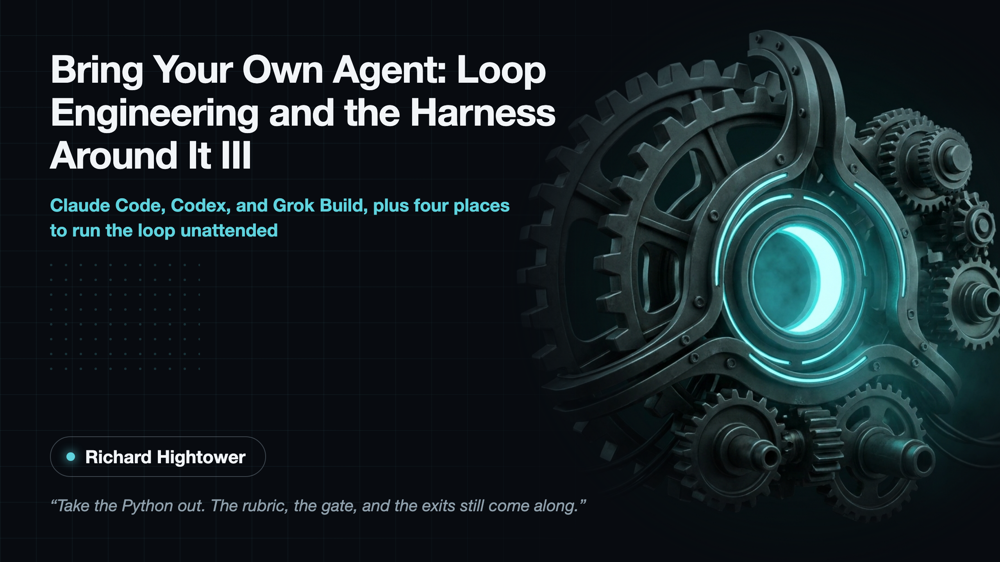
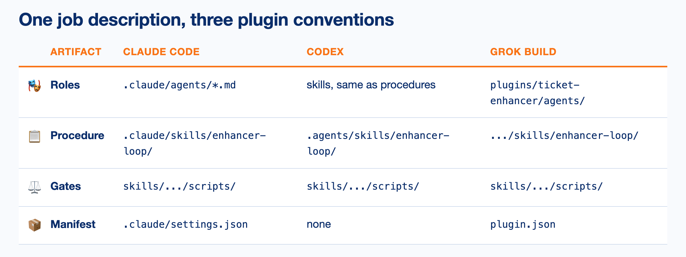
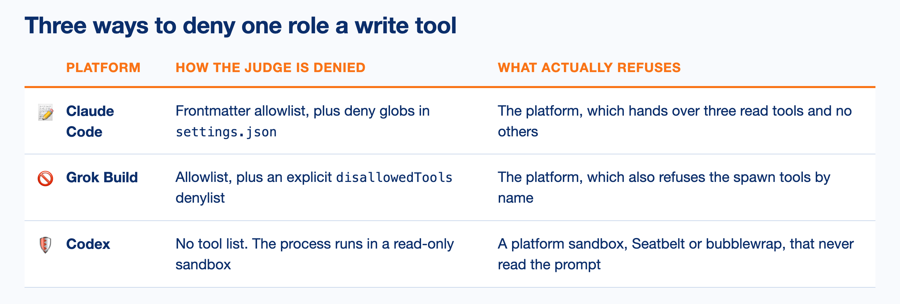
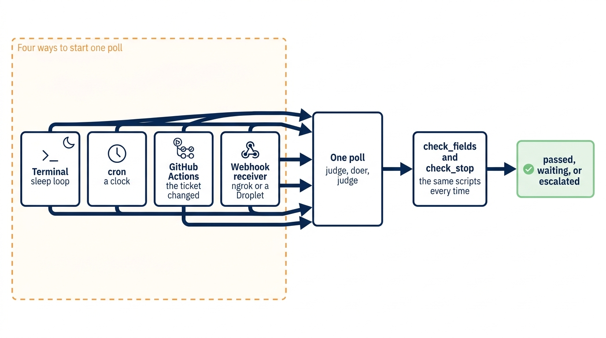
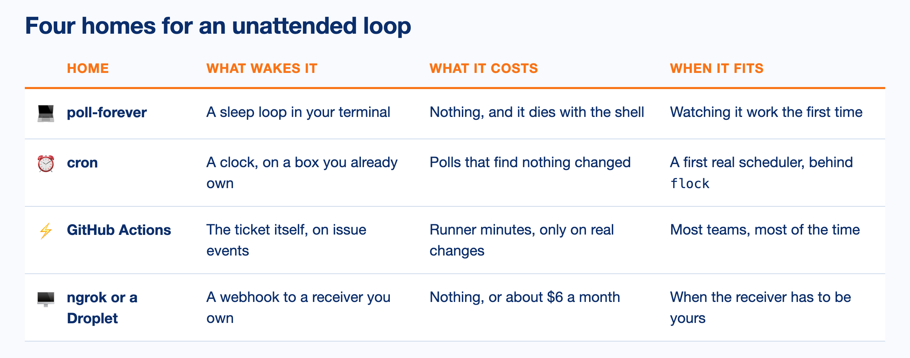

<!--
Figures for this article. Sources and recipes:
  header.png                     THE header image. docs/tables/header-card.html
                                 rendered by the Chrome recipe in references/tables.md.
                                 Title, subtitle, author, one pull quote, over artwork
                                 drawn from the article's own concepts.
  titlecard-art.png              the artwork alone, imagen CLI
  cover.jpg                      illustration, not used as the header
  deployment-ladder_imagen.png   docs/diagrams/deployment-ladder.mmd
                                 imagen-diagrams, theme agent-control, article
  layouts_table.png              docs/tables/layouts.html
  fences_table.png               docs/tables/fences.html
  homes_table.png                docs/tables/homes.html
                                 Chrome recipe in references/tables.md

No Markdown tables and no list markers in the body. Run
scripts/publish-gist.sh --check-only before pushing.

PAYWALL: after the "Three layouts, one cast" section, before "Three ways to
deny the judge a write".
-->

# Bring Your Own Agent: Loop Engineering and the Harness Around It III

## Claude Code, Codex, and Grok Build, Plus Four Places to Run the Loop Unattended



## **The same ticket enhancer as a Claude Code plugin, a Codex skill set, and a Grok Build plugin, then four places to run it when nobody is watching**

*Take the Python out. The rubric, the gate, and the exits still come along. Then find the loop somewhere to live.*

You already have a coding agent you like. Somebody on your team likes a different one, and the vendor you use for billing just shipped a third. The question that matters is not which one wins. It is what survives when you switch.

Parts 1 and 2 answered a narrower version of that. Part 1 put Python around the loop and gave software the five decisions a model does not get to make. Part 2 moved the same program to a second runtime and counted the files that had to open. The rubric came across byte for byte. The fences were rewritten.

Part 3 takes the Python out entirely.

The same enhancer runs as a Claude Code plugin, a Codex skill set, and a Grok Build plugin. No `enhancer.py`, no orchestrator process, no adapter. The agent platform runs the loop from instructions. And the script that decides when to stop arrives in all three with the same checksum.

> A loop worth keeping is one you can carry to a platform it was not written for. If the definition of done travels and only the plumbing changes, you built a loop. If everything travels, you built a script.

The second half of the article is the question that follows. An unattended loop has to live somewhere, and a laptop with the lid open is not somewhere. The trigger moves through four homes, and the loop does not change in any of them.

> **In this article:** You will read the same job in three plugin layouts, watch three platforms deny one role a write tool three different ways, and then put the loop on a schedule, on a GitHub event, and on a six-dollar server. The names come from [*The Loop Is the Product*](https://spillwave.com/harness-loop-enginering/). The code comes from [reliable-agentic-lab](https://github.com/RichardHightower/reliable-agentic-lab). Part 1 is [*Python Owns the Loop*](https://rickhigh.substack.com/p/python-owns-the-loop-loop-engineering) and part 2 is [*The Second Runtime*](https://rickhigh.substack.com/p/the-second-runtime). Neither is required, and both are linked where this article leans on them.

---

## Skill form and Python form

Two ways exist to build the same loop, and the difference is worth naming before the layouts arrive.

The **Python form** is parts 1 and 2. A Python process owns discovery, the writes, the budget, and the exits. It calls a model twice per round and ignores anything the model says about being finished. The model never sees the decision.

The **skill form** is this article. A plugin describes the roles, the steps, and the gates, and the agent platform executes that description. There is no orchestrator process. The instructions are the orchestrator.

The Python form **enforces** the exits. The skill form **instructs** the agent to run a program and obey its answer. Read what the instruction actually says.

**Code Listing 1: the skill tells the agent to run a program, not to decide** (`.claude/skills/enhancer-loop/SKILL.md`, the standing rules near the top and step 8 near the bottom)

```markdown
- `ready` comes from `check_fields.py`, never from the judge's own claim,     ①
  never from a label, never from a comment other than exact `LGTM`.

8. Compute this round's `missing_fields` signature ... Run
   `python3 .claude/skills/enhancer-loop/scripts/check_stop.py '{"round":     ②
   round, "budget": 3, "signature": <this round's signature>,
   "previous_signature": previous_signature}'` to get the authoritative
   `{stop, reason}`. Do not compare the signatures yourself: the same         ③
   reason `check_fields.py` computes `ready` instead of trusting the
   Judge's own claim, a stop condition decided by the skill's own prose
   is a stop condition a model can talk itself past.
```

① The instruction names the source of truth and then names three things that are not it. A judge's own claim, a label, and any comment other than an exact `LGTM`.

② The agent runs a subprocess. It does not weigh the round against the budget in its head, and the arithmetic happens in a file it cannot rewrite mid-run.

③ Four words carry the whole design: do not compare the signatures yourself. The instruction then gives its own reasoning, which is what makes it hold up under pressure. A stop condition decided by prose is a stop condition a model can talk itself past.

Both forms compute `ready` and `stop` in Python. The Python form gives the model no opportunity to skip the call. The skill form asks. What the two share is that neither one lets the model **answer** the question, and the shared artifact is the thing this article follows from platform to platform.

### Keep what matters in the deterministic layer

The skill instructions are a suggestion that executes nondeterministically. Putting a loop in a Python program, with a stop state, is deterministic.

If what you are doing matters, keep as much in the deterministic layer as possible. Use the AI where it is the most useful. Do not use it when you need deterministic results.

There is nothing wrong with using the skills version of this. But if you want the loops to be exact, and you want the stop conditions to be exact, they have to be in a program.

The same split works on the rubric. If you want a rubric to be exact, extract the grading part of the rubric into Python and leave the classification part in the LLM. This loop already draws that line. The judge classifies: it reports the kind of ticket and which fields have real content, which is the judgment call. The `check_fields.py` script grades: it looks up the required list for that kind, computes what is missing, and computes whether the ticket is ready. Every port in this article splits it the same way.

---

## Three layouts, one cast

Three coding agents, three plugin conventions, one job description.



Claude Code splits roles from procedures. A role is a Markdown file in `.claude/agents/` with a frontmatter tool list. A procedure is a skill directory holding a `SKILL.md` and the scripts that skill runs. The split matters because a role is a thing you grant capability to, and a procedure is a thing you follow, and conflating them is how a procedure quietly grows a capability.

Codex makes everything a skill, including the roles. The judge is not an agent definition, it is `.agents/skills/enhancer-judge/SKILL.md`. The flatter model costs you the frontmatter tool list, and the port pays for that loss somewhere far more interesting, which the next section covers.

Grok Build nests the whole thing under one plugin directory with a `plugin.json` manifest. Everything the enhancer needs sits under `.grok/plugins/ticket-enhancer/`, versioned and named as a unit. The manifest is three fields and does nothing clever, which is the point: a plugin you can uninstall by deleting one directory is a plugin whose blast radius you can see.

Four more ports exist in the lab for opencode, VS Code, Antigravity, and Copilot CLI. Four more layouts of the same five files. Walking them teaches nothing the three above have not.

<!-- PAYWALL -->

---

## Three ways to deny the judge a write

The **judge** is the checker. It reads one ticket and reports which required fields hold real content. It must never hold a write tool, because a judge that can edit the ticket can edit the ticket it is grading, and then you are back to the intern grading their own homework from part 1.

Every one of the three platforms enforces that. No two do it the same way.



Claude Code takes an allowlist in the role's frontmatter. Writing `tools: Read, Grep, Glob` means the judge is handed those three and nothing else, so a write is not refused, it is absent. The project's `settings.json` adds deny globs for lab paths no role should reach, such as `../../scripts/**`. It is a repository-boundary guard rather than a second copy of the judge's missing write tool.

Grok Build takes the allowlist and adds an explicit denylist beside it. Naming `disallowedTools: search_tool, use_tool` after an allowlist looks redundant until you consider what a spawn tool does: a role that can start another role can borrow capability it was never granted. The denylist closes the door the allowlist did not know about.

Codex does something different in kind. The judge process starts through `codex exec -s read-only`, and its own skill file says what that buys: the operating system refuses your writes, so you cannot, even if the prompt asks you to. Nothing about a tool list is involved. The port's notes call it a process sandbox rather than a role flag, and the platform supplies it: Seatbelt on macOS, bubblewrap or a helper on Linux. A prompt injection that talks the judge into writing still gets refused, by something that never read the prompt.

Read those three in order and the mechanism escalates. A tool list is a fence the platform honors. A denylist is a fence against capability arriving sideways. A kernel sandbox is a fence that does not care what the model was persuaded to attempt. The role table said the judge writes nothing, and three platforms found three depths at which to make that true.

**Code Listing 2: one role, three declarations**

```yaml
# Claude Code   .claude/agents/enhancer-judge.md
tools: Read, Grep, Glob                          # ① allowlist, no write present

# Grok Build    .grok/plugins/ticket-enhancer/agents/enhancer-judge.md
tools:                                           # ② allowlist
  - read_file
  - grep
  - list_dir
disallowedTools:                                 # ③ and a denylist for spawn
  - search_tool
  - use_tool

# Codex         .agents/skills/enhancer-judge/SKILL.md
# no tool list at all. bin/role.sh puts the process in Codex's
# read-only sandbox, and the kernel is the fence.                # ④
```

① Three read tools. A write tool is not denied, it was never handed over.

② The same idea in this platform's tool names.

③ The spawn tools, refused by name. A role that cannot start another role cannot borrow its capability.

④ No declaration, because the fence is not in the file. The process runs read-only and the operating system enforces it.

---

## What came across, and what the ports agreed to raise

Now the measurement, which is the part a reader can reproduce in ten seconds.

**Code Listing 3: both gate files are the same bytes in all three**

```text
$ md5 -q solutions/sol1_enhancer/.claude/skills/enhancer-loop/scripts/check_stop.py \
         solutions/sol1_enhancer_codex/.agents/skills/enhancer-loop/scripts/check_stop.py \
         solutions/sol1_enhancer_grok_build/.grok/plugins/ticket-enhancer/skills/enhancer-loop/scripts/check_stop.py
5675db316353e5a9c7a8c921701aaf3e
5675db316353e5a9c7a8c921701aaf3e
5675db316353e5a9c7a8c921701aaf3e

$ md5 -q ... check_fields.py      # the same three paths
89349cc086fbbaf0f356b56f84dee076
89349cc086fbbaf0f356b56f84dee076
89349cc086fbbaf0f356b56f84dee076
```

Two checksums cover three coding agents. One file decides when to stop and the other decides what finished means, and neither changes when the platform underneath it does. The stop decision is three branches and a default, which is the whole of it.

**Code Listing 4: three exits, computed outside every model** (`check_stop.py`)

```python
def check(round_: int, budget: int, signature: list[str],
          previous_signature: list[str] | None,
          usd: float = 0.0, max_usd: float | None = None) -> dict:
    if previous_signature is not None and signature == previous_signature:   # ①
        return {"stop": True, "reason": "same signature two rounds running"}
    if max_usd is not None and usd >= max_usd:                               # ②
        return {"stop": True, "reason": "cost budget spent"}
    if round_ + 1 >= budget:                                                 # ③
        return {"stop": True, "reason": "budget spent"}
    return {"stop": False, "reason": None}
```

① The **failure signature** is the sorted list of fields still missing after a round. Two identical lists mean the rubric gaps did not close, which the loop treats as a stall rather than as slow progress. Calling that a stall is a policy rather than an observation, and it is the policy that stops a run from paying to watch a ticket stand still. The stop carries a reason a person can read.

② The dollar cap. A round is a judge turn plus a doer turn, and neither has a bounded price, so counting rounds is a proxy for spend rather than a limit on it. An unattended loop needs the real thing.

③ The round budget, spent. Counting from zero means round two is the third round, and spending it ends the run.

Note ② is the one worth pausing on, because a form that instructs rather than enforces is exactly the form you would expect to skip a money gate. It does not. The skill tells the agent to pass `usd` and `max_usd` to a program, and the program answers. Every deployment in the second half of this article runs with nobody watching, and a cap you can only enforce by being present is not a cap.

The red gate came across too, and part 2 named it one of the things a port must not quietly change. Step 7 of every skill still requires strict improvement, meaning the candidate's missing set has to be a **proper subset** of the current one before it replaces the real ticket. Trading `value` for `criteria` looks like motion and is how a loop spends a whole budget standing still. No orchestrator process enforces that here. The instruction says it, the same way it says to run `check_stop.py` rather than reason about the budget.

The rubric travels too, and it is the more interesting of the two files, because it moved after it traveled. A bug ticket now needs a sixth field that the earlier ports never asked for.

**Code Listing 5: what a finished bug ticket has to prove** (`check_fields.py`)

```python
REQUIRED = {
    "bug": ["title", "steps", "expected", "actual", "environment",
            "source_evidence"],                                    # ①
}

def check(kind, present_fields, source_status="not_applicable"):
    if kind == "bug" and source_status != "supported":             # ②
        present.discard("source_evidence")
    # A bug needs an inspected code path, not merely a plausible story
    # copied from its issue stub.                                  # ③
```

① A sixth required field, and only for bugs. A feature or a UI ticket is unaffected.

② The field is discarded unless the judge separately reports that the source supports the reported behavior. Claiming the evidence and having the evidence are two different assertions, and only the second one counts.

A third state exists that the excerpt does not show. When the judge reports `contradicted`, meaning the source disagrees with the reported behavior, the checker sets `blocked` and refuses `ready` outright, even with all six fields present. A bug the code says is not a bug does not become ready by being well written.

③ The comment names the failure it prevents. A model writing a bug ticket can produce a convincing reproduction section from the issue title alone, and it reads exactly like one written after opening the file.

The history behind that field is the part worth keeping. It did not arrive everywhere at once. Four of the newer plugin-shaped ports added it first, and for a while the same bug ticket was ready on one coding agent and not on another. Nothing failed. Both halves passed their own tests, because each port tested the rubric it had.

Raising the bar was right. Letting the raise sit in four files out of nine was the mistake, and it is a specific mistake this series should name: a rubric change is a loop change, so it belongs everywhere the loop runs or it belongs nowhere. Adopting it is not a copy of one file either. It reaches the checker's status logic, the judge instructions, the doer instructions, the loop instructions, and the tests, which is exactly why a partial rollout is easy to start and easy to forget.

What closed it is worth copying. A test now walks every port, reads which behaviors each gate file implements, and fails when one leaves the group without a recorded reason. Not a checksum, which breaks on a comment edit and teaches nothing, but a check on behavior:

```text
$ python3 -m pytest scripts/tests/test_sol1_gate_drift.py -q
5 passed in 0.48s
```

Five assertions: every port has both gate files, the stop rule does not drift, the cost check does not drift, and the bug rubric does not drift. The lab spent three articles arguing that a gate you can compute beats a gate you remember. The drift test turns that argument on the lab's own source.

---

## Where the loop runs

A loop that only runs while your laptop is open is a demo of a loop. Four homes exist, and the honest way to read them is as a ladder rather than a menu.

Read the rest of this section as a survey rather than a walkthrough. The single poll is the rung this article exercised, and everything above it is a build the repository ships with its own instructions. Each rung below links to those instructions, and the links go to the real build rather than to my summary of it, because a deployment you follow from a magazine excerpt is a deployment you debug alone.



The figure is one trigger question asked four ways. Every rung starts the same single poll and exits. None of them grades a ticket, decides an exit, or knows what a rubric is. What changes going up the ladder is who wakes the loop and what happens when you close the lid.



The bottom rung is honest about being a stand-in. The `task poll-forever --` recipe runs `task run` in a sleep loop, and it exists so a reader can watch four tickets move without configuring anything. It stops when the terminal does, which is exactly the property that disqualifies it from real use.

Cron is the first rung with a real scheduler behind it, and the lab has no material on it, so the passage below is written fresh rather than quoted. Cron earns its place because it is already on the box, needs no account, and survives a reboot.

**Code Listing 6: the loop on a schedule**

```cron
# One poll every ten minutes. Absolute paths: cron gets almost no environment.
*/10 * * * * cd /opt/agents/solutions/sol1_enhancer && \
  /usr/local/bin/task run -- >> /var/log/enhancer.log 2>&1   # ①
```

① Redirect both streams to a file you rotate. A cron job with nowhere to write its output is a cron job whose failures you learn about from a confused colleague.

Two cautions apply, and both come from the loop's own design rather than from cron. A poll that runs longer than the interval will overlap with the next one, so wrap the command in `flock` on a lock file before you shorten the schedule. And a timer that fires when no ticket has changed is the **trigger anti-pattern** from part 1: it spends tokens to discover that nothing happened. Cron is a schedule, and a schedule is a worse trigger than an event.

The third rung fixes exactly that. GitHub already knows when a ticket changed, and a workflow can start one poll on the event rather than on a clock.

**Code Listing 7: the ticket itself is the trigger** (`labs/lab1_enhancer/workflows/enhance-on-issue.yml`)

```yaml
on:
  issues:
    types: [opened, edited, labeled]     # ① a ticket changed
  issue_comment:
    types: [created]                     # ② LGTM arrives here

permissions:
  issues: write                          # ③ bounded authority, at the workflow
  contents: read

concurrency:
  group: enhancer-${{ github.event.issue.number }}    # ④ one poll per ticket
  cancel-in-progress: false

jobs:
  enhance:
    if: >
      github.event_name == 'issues' ||
      (github.event_name == 'issue_comment' &&
       !contains(github.event.comment.body, '<!-- enhancer-loop -->'))   # ⑤
    env:
      ENHANCER_BACKEND: ${{ vars.ENHANCER_BACKEND || 'claude' }}         # ⑥
```

① A new issue, an edited body, or a label. Each one is a real change, which is what separates an event from a timer.

② A human comment. The exact `LGTM` that releases a green ticket arrives through this door and no other.

③ The workflow can write issues and only read the repository. Bounded authority again, one layer further out than the role table from part 1.

④ One poll at a time per ticket. Setting `cancel-in-progress: false` protects the running poll, because cancelling mid-round leaves a candidate file behind with no round to clean it up. It does not queue every event: GitHub holds one pending run per group, so a newer event can replace an older one that has not started.

⑤ The marker guard. Every comment the loop posts carries `<!-- enhancer-loop -->`, and this line skips those, so the workflow does not wake itself by answering its own reply forever.

⑥ Your coding agent of choice, as one repository variable. Eleven values are accepted, and each arm installs a different CLI and runs the same loop out of a different plugin directory. An unknown value fails loudly with the list, rather than defaulting to something that happens to work.

Grok Build is the arm worth reading, because a headless runner is where a plugin's assumptions show. The `grok -p` mode is non-interactive, `--output-format json` gives a later step something to parse, and an always-approve flag covers the fact that nobody can click a tool approval on a runner. Authenticate with an `XAI_API_KEY` secret rather than a copied session file, and disable the auto-updater, because a runner is ephemeral and an in-job self-update is a common source of flakes. The arm also has to work around `task trust`, which is a local step that expects a human in a terminal window.

Note ⑤ guards a failure that looks like slowness rather than an error. Without it the workflow reads the comment it just posted, starts another poll, posts again, and repeats until somebody notices the bill. The same marker appears inside each skill, and a guard against a self-answering loop belongs at every layer that can start a poll.

The full walkthrough for this rung already exists and goes further than the excerpt above, including the ticket-id extraction and the guardrails. Read [deploy on GitHub Actions](https://github.com/RichardHightower/reliable-agentic-lab/blob/main/slides/labs/deploy-github-actions.md) rather than waiting for this article to repeat it.

---

## The top rung: a server that is always listening

GitHub Actions is a fine home until you want the receiver to be yours. Two paths reach that, and both use the same [FastAPI receiver](https://github.com/RichardHightower/reliable-agentic-lab/blob/main/slides/labs/ext1-webhook.md).

The [ngrok path](https://github.com/RichardHightower/reliable-agentic-lab/blob/main/slides/labs/ext2-ngrok.md) gives your own machine a public HTTPS address. It fits development, because the loop runs against your files, with your logs, and under a debugger if you want one. The finished build is [`s_ext_2_ngrok`](https://github.com/RichardHightower/reliable-agentic-lab/tree/main/solutions/extra_credit/s_ext_2_ngrok).

The [Droplet path](https://github.com/RichardHightower/reliable-agentic-lab/blob/main/slides/labs/ext5-digitalocean.md) puts the receiver on a one-gigabyte Ubuntu Droplet, six dollars a month at the time of writing, with a permanent name. It is the shape to reach for when you intend to leave something running, and the deploy scripts are in [`s_ext_5_digitalocean`](https://github.com/RichardHightower/reliable-agentic-lab/tree/main/solutions/extra_credit/s_ext_5_digitalocean).

**Code Listing 8: the receiver verifies, locks, and starts** (`s_ext_1_webhook/webhook.py` and `call_sol1.py`)

```python
# webhook.py
"""Extra credit 1. FastAPI receiver GitHub can POST to.

Issues opened (and new comments) call solutions/sol1_enhancer via `task run`.
The exits stay in that folder. This file only verifies, locks, and starts.   ①
"""

# call_sol1.py
BACKEND_FOLDERS = {                        # ② AGENT_BACKEND or ENHANCER_BACKEND
    "claude": "sol1_enhancer",
    "grok": "sol1_enhancer_grok_build",
    "codex": "sol1_enhancer_codex",
    "vscode": "sol1_enhancer_vscode",
    "copilot-cli": "sol1_enhancer_copilot_cli",
    "antigravity": "sol1_enhancer_antigravity",
    "agent-sdk": "sol1_enhancer_agent_sdk",
    "deep-agents": "sol1_enhancer_deep_agents",
    # plus python, opencode, and langgraph aliases
}

def folder_for(backend: str) -> str:
    name = BACKEND_FOLDERS.get(backend)
    if name is None:
        raise SystemExit(f"unknown backend {backend!r}. Known: ...")   # ③
```

① The receiver verifies the HMAC signature, takes a per-issue lock, answers GitHub, and shells out. It does not grade, decide, or stop, and it does not import the enhancer, which is what keeps that folder standalone.

② Eleven keys across nine ports, in a second file. The dispatch lives in `call_sol1.py`, not in the receiver.

③ An unknown backend stops the run and names what it knows. Guessing here would run a port the caller did not ask for.

Both surfaces now accept the same eleven names, and either variable works on either one. An unknown name raises with the list of known names rather than falling back to the Claude port, which is the failure that matters: a silent fallback gives you a green run of a port you did not choose, and nothing in the output says so.

The lock in note ① is the same idea as the workflow's concurrency group, solved locally: GitHub can deliver two events for one ticket faster than a poll completes, and two polls on one ticket race each other to write the same candidate file.

The Droplet adds one more layer of the fence this article keeps climbing.

**Code Listing 9: bounded authority, expressed as a systemd unit** (`deploy/agent-webhook.service`)

```ini
[Service]
User=agent                                                       # ①
ExecStart=/opt/agent-env/bin/python -m uvicorn \
  solutions.extra_credit.s_ext_1_webhook.webhook:app \
  --host 127.0.0.1 --port 8000                                   # ②
Restart=on-failure
NoNewPrivileges=yes                                              # ③
ProtectSystem=strict
ProtectHome=yes
ReadWritePaths=/opt/agents                                       # ④
```

① Its own unprivileged user. Nothing here runs as root.

② Bound to localhost. The public door is nginx, which proxies two paths and returns 404 for everything else, so the receiver is not reachable from the internet directly.

③ The process cannot gain privileges it did not start with, so a compromised dependency cannot escalate.

④ One writable path on the whole filesystem, with `ProtectSystem=strict` making the rest read-only.

Read note ④ beside the judge's tool list from listing 2 and the doer's write scope from part 1. The same sentence appears at four depths: a role may write here and nowhere else. A frontmatter allowlist says it to a model. A process sandbox says it to a program. A systemd unit says it to the whole service. Each layer is honest about how far it can see, and the reason to have all of them is that each one fails differently.

The ngrok path adds a smaller version of the same instinct. Its traffic policy verifies the GitHub signature at the edge, and the Python receiver verifies it again. Checking twice is not paranoia when the two checks fail for different reasons: the edge rejects noise before it costs you a process, and the local check still holds if you move off ngrok tomorrow.

---

## Run it

Clone the lab and enter the port for the coding agent you already use.

The commands below are **go-task**, the runner that reads each port's `Taskfile.yml`. The `task` CLI is not the Claude Agent SDK `Task` tool, which spawns a subagent.

```bash
git clone https://github.com/RichardHightower/reliable-agentic-lab.git
cd reliable-agentic-lab/solutions/sol1_enhancer     # or _codex, or _grok_build
cp config.json.example config.json                  # fill in fork_owner
task clone
```

Skill form authenticates through the CLI you already log into, not through an API key in a `.env` file the way parts 1 and 2 did. Claude Code needs the `claude` binary on your path. Codex needs `codex`, and it is worth running `task fence-check` before you trust a demo, because your own `~/.codex/config.toml` can leave the orchestrator unfenced. Grok Build needs `task trust` plus one human click in its interface, because headless mode never prompts.

Six commands work the same in every port: `clone`, `create-test-tickets`, `reset-test-tickets`, `run`, plus `checks` and `test`. Run the last two before you spend a token, because a gate you have not printed is a gate you are assuming.

```bash
task checks    # both deterministic scripts, against their own assertions
task test      # the unit tests, no CLI and no target repo needed
```

Then one live poll against your fork.

```bash
task reset-test-tickets && task create-test-tickets
task run --
```

Seed ticket `T900` is a bug, so it is the one to watch. It will not go green until the judge reports a supporting source, on every port. Running it on two coding agents and getting the same answer is the cheapest version of this whole article.

A ticket that still needs work starts three model calls: judge, doer, judge again. The command prints one line per ticket, and nobody is `passed` on a first poll because nobody has commented yet. Review each issue against the rubric, comment exactly `LGTM` on the ones you judge complete, and poll again. Leave an incomplete ticket unapproved so its failure path stays visible.

Reset, teardown, and recovery from a closed issue live in each port's `HOW_TO_RUN.md`. One rule repeats across all of them: closing a GitHub issue by hand is not a reset, and it is the single action that reliably breaks the next poll.

---

## Pick a rung today

Run `task table` in two ports and read the same three rows out of two different coding agents. The comparison takes ten seconds and it is the whole portability claim, checkable by you rather than asserted by me.

Then move one rung up from wherever your loop lives now. If it lives in a terminal, put it in cron behind `flock` this afternoon, which is the one step you can finish today without an account. If it lives in cron, the workflow on issue events stops you paying for polls that find nothing changed. If it already runs on an event, the remaining question is whether the receiver should be yours. Follow the linked build for whichever rung you pick, not the excerpt above it.

Whichever rung you land on, check one thing before you walk away. Ask what stops the loop, then ask where that answer is computed. A stop rule in a prompt moves when the prompt moves. A stop rule in a file has a checksum you can compare across three coding agents, and this article is what that comparison looks like when the answer is good news. Run it on your own harness and the number is either the same everywhere or it is not, which is more than most teams can currently say about what stops their agents.

The next part in this series is the implementer, which puts two doers with disjoint scope, a specification as a testable contract, a red gate, and a receipt on top of the same role graph. It exists today on the two Python ports, and the skill-form versions are still to come.

## Glossary

**Skill form:** A loop built as a plugin the agent platform executes, with no orchestrator process. The instructions describe the roles, the steps, and the gates.

**Python form:** A loop built as a program that calls a model. Parts 1 and 2 are this form. The process owns the writes, the budget, and the exits.

**Failure signature:** The sorted list of required fields still missing after a round. Two identical lists mean the ticket did not move, which is a stall rather than progress.

**Trigger anti-pattern:** A timer that wakes an agent when no state has changed. It spends tokens to discover that nothing happened, which is why an event beats a schedule.

**Bounded authority:** A role may use only the tools and paths it was granted. This article shows it at four depths: a frontmatter tool list, an operating-system sandbox, a workflow permission block, and a systemd unit.

**Receiver:** The FastAPI service GitHub posts to. It verifies the signature, takes a lock, answers, and starts one poll. It is not the loop.

**go-task:** The `task` CLI, reading each port's `Taskfile.yml`. Not the Claude Agent SDK `Task` tool, which spawns a subagent.

## Sources

**Concepts:** [*The Loop Is the Product*](https://spillwave.com/harness-loop-enginering/) covers loop engineering, harness engineering, write scope, independent verification, and bounded exits.

**Part 1:** [*Python Owns the Loop*](https://rickhigh.substack.com/p/python-owns-the-loop-loop-engineering) builds the enhancer and the five nodes on the Claude Agent SDK.

**Part 2:** [*The Second Runtime*](https://rickhigh.substack.com/p/the-second-runtime) ports it to LangChain Deep Agents and compares the two frameworks.

**Code:** [reliable-agentic-lab](https://github.com/RichardHightower/reliable-agentic-lab). The three ports in this article are `solutions/sol1_enhancer`, `solutions/sol1_enhancer_codex`, and `solutions/sol1_enhancer_grok_build`. Four more cover opencode, VS Code, Antigravity, and Copilot CLI.

**Deployment:** [Deploy on GitHub Actions](https://github.com/RichardHightower/reliable-agentic-lab/blob/main/slides/labs/deploy-github-actions.md) carries the full workflow. The receiver is [extra credit 1](https://github.com/RichardHightower/reliable-agentic-lab/blob/main/slides/labs/ext1-webhook.md). A public URL for your own machine is [extra credit 2, ngrok](https://github.com/RichardHightower/reliable-agentic-lab/blob/main/slides/labs/ext2-ngrok.md), built in [`s_ext_2_ngrok`](https://github.com/RichardHightower/reliable-agentic-lab/tree/main/solutions/extra_credit/s_ext_2_ngrok). A permanent server is [extra credit 5, DigitalOcean](https://github.com/RichardHightower/reliable-agentic-lab/blob/main/slides/labs/ext5-digitalocean.md), built in [`s_ext_5_digitalocean`](https://github.com/RichardHightower/reliable-agentic-lab/tree/main/solutions/extra_credit/s_ext_5_digitalocean).
