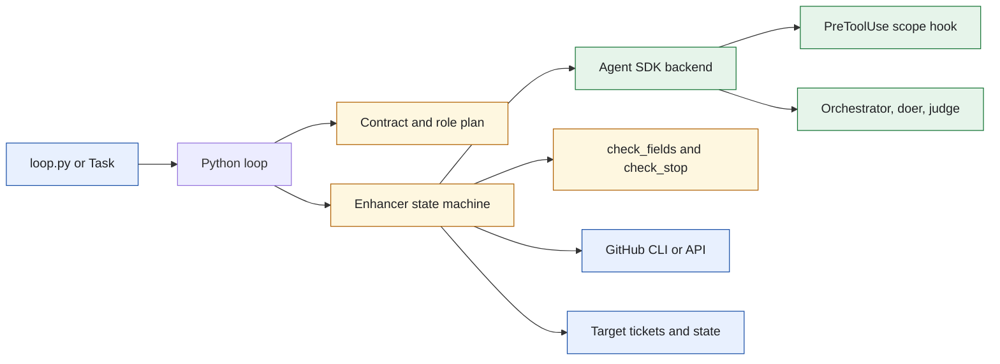
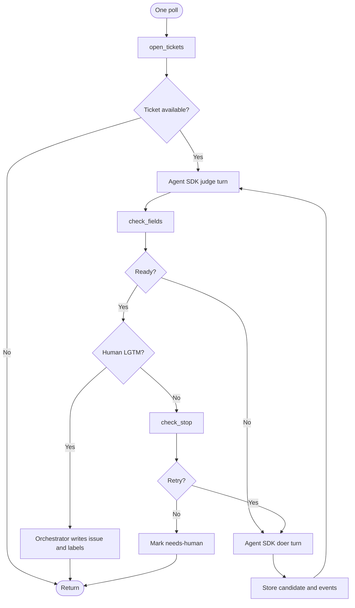
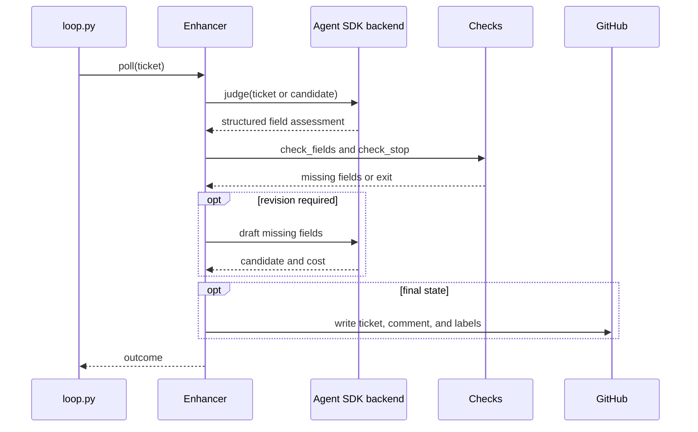
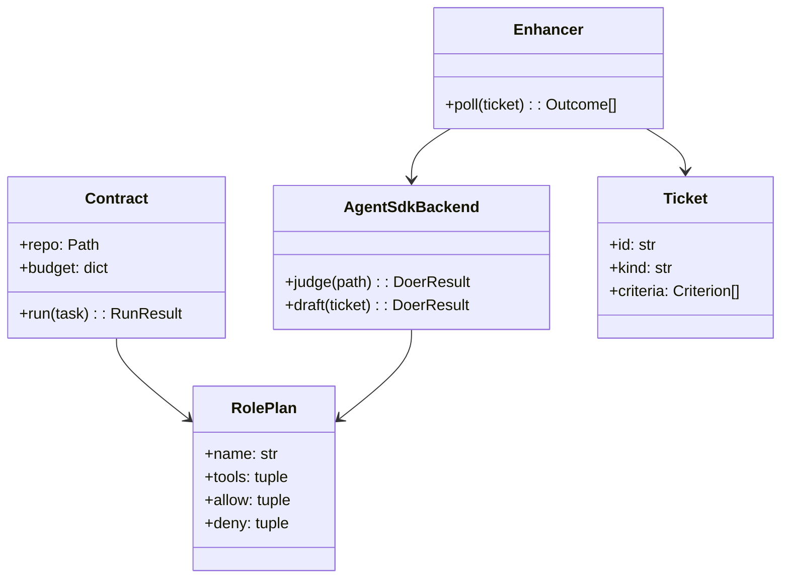
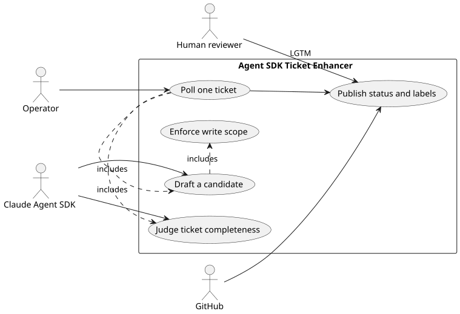

# Lab 1 Agent SDK Ticket Enhancer

## Software Design Document

## Contents

1. Introduction and goals
2. Constraints and context
3. Solution strategy
4. Building blocks
5. Runtime and data model
6. Deployment, quality, and risks
7. Glossary

## 1. Introduction and goals

This standalone Claude Agent SDK port executes the Lab 1 ticket-enhancement loop against a target CRM repository. Python owns ticket discovery, state, GitHub actions, and stop decisions. The Agent SDK is used only to run role turns under an explicit tool and path policy.

### Functional requirements

- Load target-repository settings and print a role table without an SDK installation.
- Poll open ticket files, retain candidate diagnostics, and synchronize issue lifecycle actions.
- Obtain structured field observations from the judge and candidate text from the doer.
- Run `check_fields.py` and `check_stop.py` before deciding a ticket outcome.
- Enforce iteration, turn, and optional USD budgets.
- Apply GitHub labels and ticket changes only from the Python orchestrator.

### Quality requirements

- The doer can write only permitted ticket paths through a single `PreToolUse` decision point.
- The judge has no edit or write tool.
- Missing SDK, target, or configuration errors fail clearly before a live poll.
- Unit tests work without SDK credentials or a CRM clone.
- The folder contains its own contract, role plan, adapter, and checks.

## 2. Constraints and context

The CLI entry point is `loop.py`. It validates a `Contract` for the target repository, builds runtime options with `roles.options_for`, and constructs `Enhancer` only for an actual poll. Local imports keep the role-table path usable without `claude-agent-sdk`.



The target repository remains an external boundary. This folder does not create a shared engine or import one. Source: [`docs/diagrams/architecture.mmd`](docs/diagrams/architecture.mmd).

## 3. Solution strategy

The strategy combines role-level capability restriction with deterministic program control. `roleplan.py` declares roles and allowed paths. `roles.py` converts that declaration into Agent SDK options and one scope hook that uses `agent_type`. `enhancer.py` drives ticket state transitions and `turns.py` translates role calls into judge and draft operations.

| Decision | Rationale |
| --- | --- |
| One scope hook for all writer roles | Avoids union-of-allow-list behavior from multiple hook opinions. |
| Local SDK imports | Makes tests and the role table available without the optional runtime. |
| Python-owned GitHub client | Keeps the SDK roles from mutating the live issue. |
| Structured judge result | Allows field requirements to be calculated outside the model. |

## 4. Building blocks

```text
sol1_enhancer_agent_sdk/
├── loop.py                  CLI entry point and runtime assembly
├── enhancer.py              Ticket poll state machine and GitHub integration
├── adapter.py               Claude Agent SDK result adapter
├── roles.py                 SDK options and scope hook
├── roleplan.py              Role, tool, and path declarations
├── ticket.py                Ticket and criterion parsing
├── check_fields.py          Deterministic completeness gate
├── check_stop.py            Deterministic exit gate
├── contract.py              Target repository contract and report parsing
├── turns.py                 Judge and doer turn helpers
└── tests/                   Offline behavioral and fence tests
```

| Module | Responsibility |
| --- | --- |
| `loop.py` | Parses CLI inputs, builds the runtime, and starts one poll. |
| `enhancer.py` | Finds tickets, tracks state, records candidates, and calls GitHub through `Gh`. |
| `adapter.py` | Extracts text, cost, stop status, and changed files from SDK results. |
| `roles.py` | Supplies role-specific SDK options and rejects writes outside scope. |
| `ticket.py` | Parses ticket metadata and acceptance criteria. |
| `contract.py` | Validates the target and parses task reports. |

No relational database is used. Files under the target ticket directory and GitHub issue state are the durable data stores.

## 5. Runtime and data model

### Ticket lifecycle



`Enhancer.poll` uses this progression to yield one `Outcome` per ticket. Candidate files provide traceability without granting the role direct issue-write authority. Source: [`docs/diagrams/workflow.mmd`](docs/diagrams/workflow.mmd).

### Major use case sequence



Cost is returned as data from the adapter, allowing the deterministic loop to enforce a budget rather than trusting a role to stop. Source: [`docs/diagrams/sequence.mmd`](docs/diagrams/sequence.mmd).

### Domain model



`Contract` and `RolePlan` define the policy input. `Enhancer` owns the lifecycle. `AgentSdkBackend` is an infrastructure adapter that never becomes the policy authority. Source: [`docs/diagrams/model.mmd`](docs/diagrams/model.mmd).

### Use cases



The PlantUML source is [`docs/diagrams/use-cases.puml`](docs/diagrams/use-cases.puml). It shows the extra scope-enforcement concern introduced by the Agent SDK runtime.

## 6. Deployment, quality, and risks

### Deployment and operations

Run `task table` and `task test` before optional `task setup`. The setup task creates a folder-local virtual environment. A live poll requires `config.json`, an SDK installation, a model credential, a target CRM clone, and GitHub access. `task run` executes one poll; scheduling belongs outside this folder.

### Quality scenarios

| Scenario | Expected response |
| --- | --- |
| The SDK reports an unscoped write | The single scope hook rejects it. |
| The judge returns malformed assessment data | Parsing fails loudly and the ticket is not released. |
| The same missing-field signature repeats | `check_stop.py` returns escalation. |
| The turn or USD cap is reached | The loop returns a bounded outcome instead of a further agent call. |

### Risks and technical debt

- Agent SDK semantics, especially hook composition and result-message fields, are runtime dependencies pinned by tests.
- GitHub operations can fail after local candidate work, leaving a recoverable next-poll state.
- The adapter must continue to map result cost accurately or the monetary guard loses effect.
- Human approval is an explicit operational dependency rather than an automated quality score.

## 7. Glossary

| Term | Meaning |
| --- | --- |
| Contract | Validation and configuration facade for the target CRM repository. |
| PreToolUse hook | Agent SDK callback that decides whether a proposed write is permitted. |
| Role plan | Immutable declaration of a role's purpose, tools, allow paths, and deny paths. |
| Outcome | Ticket-level poll result with its status and reason. |
| Candidate | A staged revision that is judged before the orchestrator changes the real issue. |
