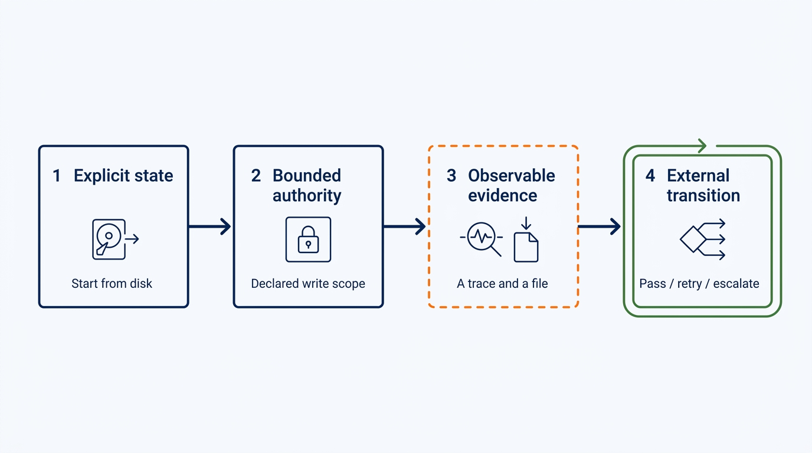
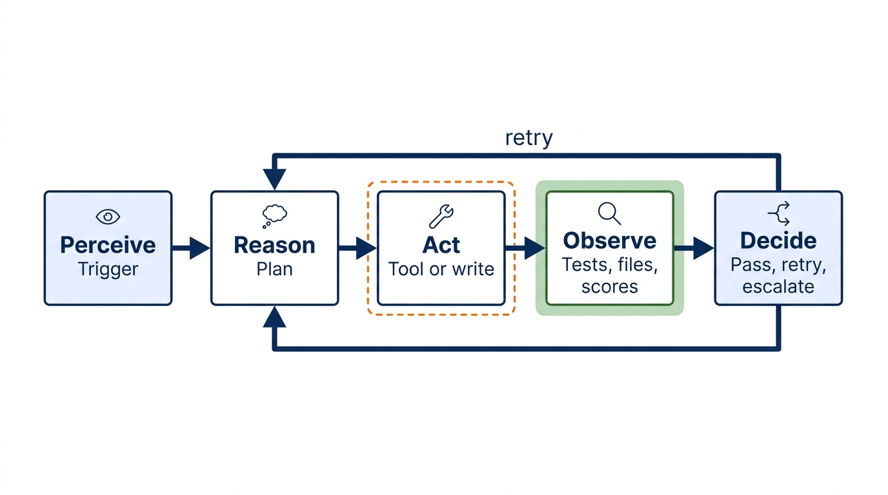
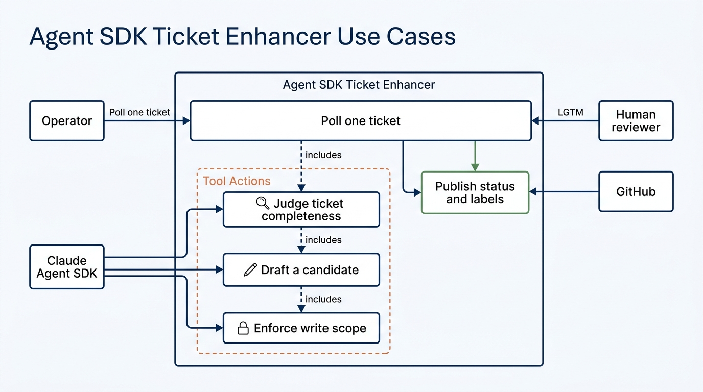
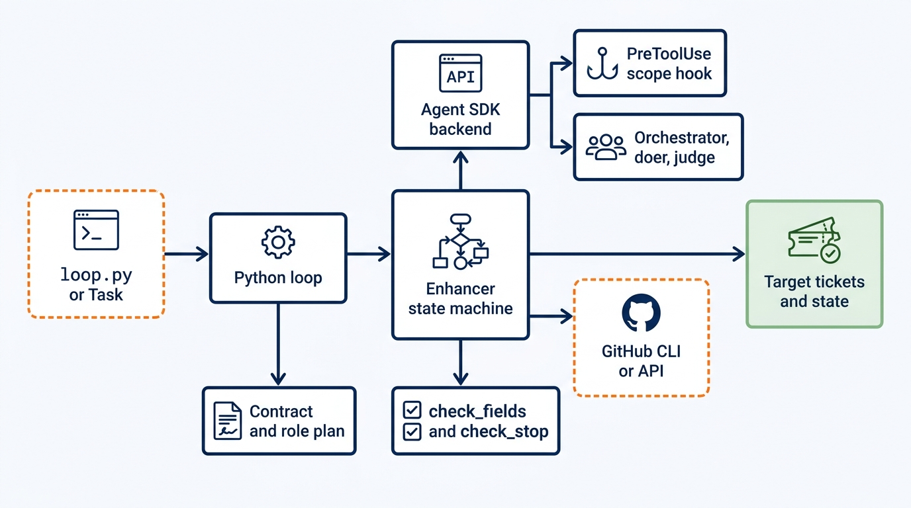
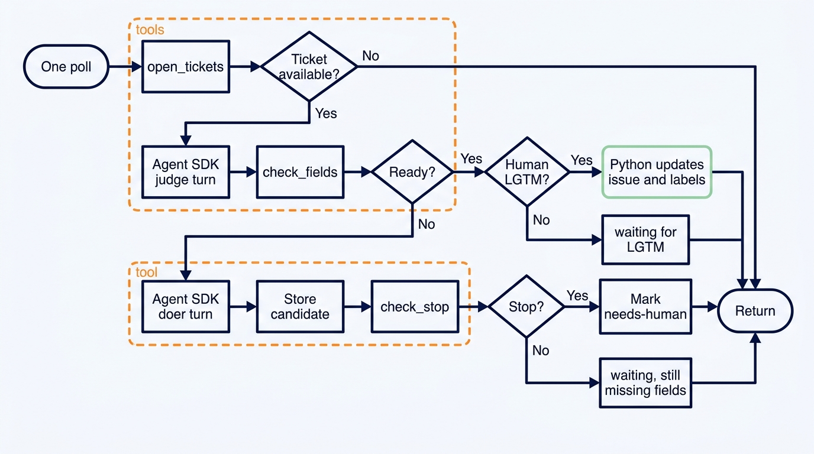
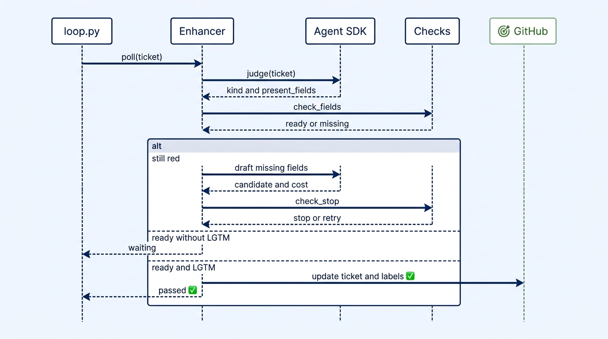
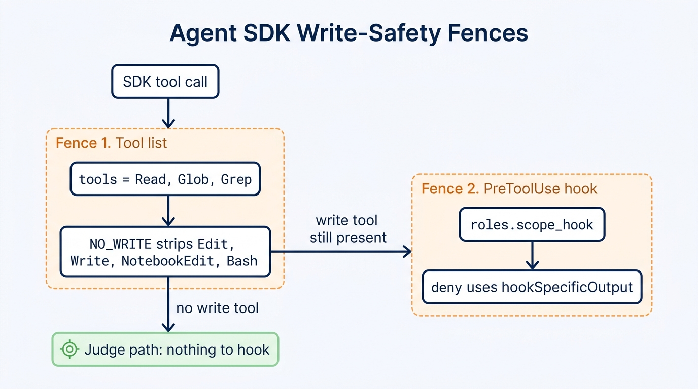
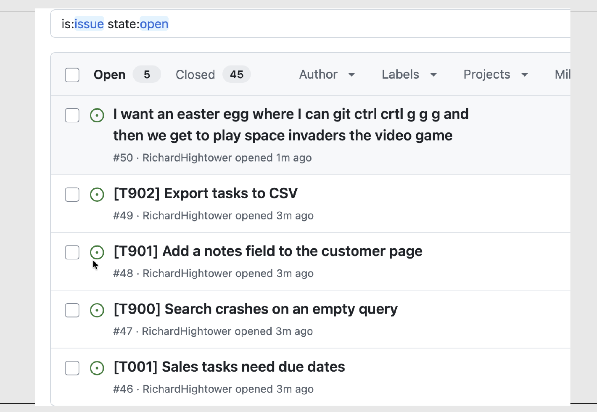
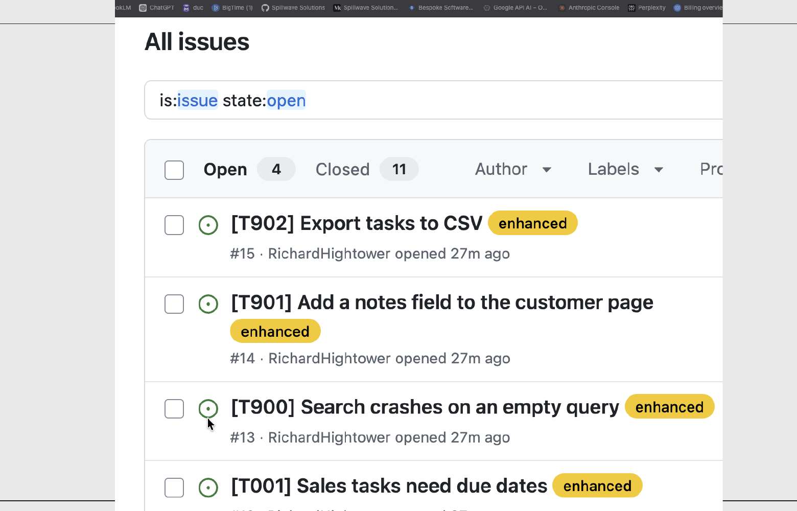
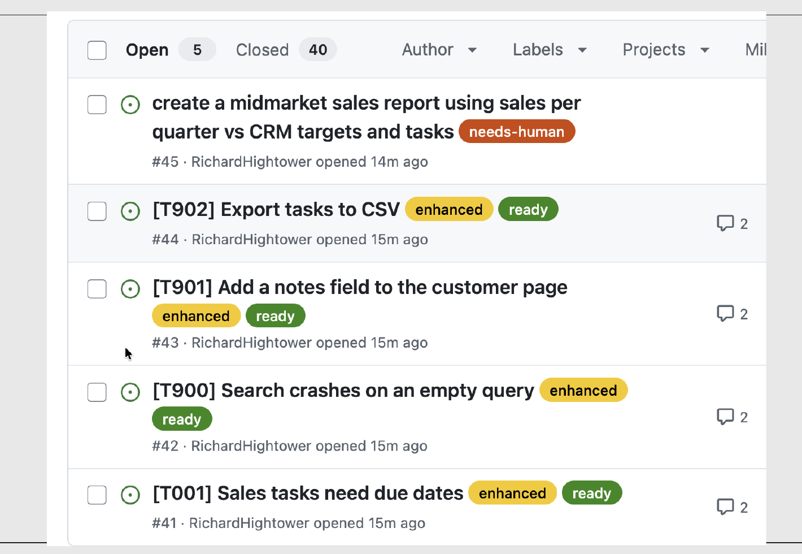

# Python Owns the Loop

## How to build a production loop in Python: the model drafts and grades, software holds every transition

*A vague ticket in. A ready ticket out. The model drafts and grades. Python holds the loop.*


Have you ever watched an agent declare a ticket done because it said so? Picture an enhancer on GitHub issues. Perhaps the body is still a wish. The acceptance criteria are still a shrug. The model writes "this looks complete" in the same voice it used to write the ticket, and the loop treats that sentence as a gate.

Then imagine the other failure, which is worse in a quieter way. The agent that will not stop. It edits the same ticket forever. Add a field, lose a field, declare progress, miss the same three headings it missed last turn. Nothing outside the model is allowed to say "enough." The whole design is one italicized fake line: *while not done: ask_the_model()*. "Done" lives in the reply.

It is maddening the way a smart intern grading their own homework is maddening. A demo of that loop looks fluent. Three weeks later the same agent is either rubber-stamping unfinished work or burning money on a stall nobody outside the model can see.

A clever prompt can survive one ticket. At ten tickets a day it drifts. At a hundred, nobody remembers what good looked like. The bottleneck is not the model. It is you, reading every diff and deciding whether the confident paragraph in front of you is evidence.

> **In this article:** You will learn what **loop engineering** and **harness engineering** actually are, then how one Python program implements them. The names come from [*The Loop Is the Product*](https://spillwave.com/harness-loop-enginering/). The code comes from [reliable-agentic-lab](https://github.com/RichardHightower/reliable-agentic-lab), [`solutions/sol1_enhancer_agent_sdk/`](https://github.com/RichardHightower/reliable-agentic-lab/tree/main/solutions/sol1_enhancer_agent_sdk). This is the first of four jobs that share a role graph: enhance, implement, research, and fix. Vague GitHub issue in. Rubric-ready ticket out. We will walk one poll step by step, then read the listings that make those steps true, then run it: one poll, an exact `LGTM`. A [Substack version](https://rickhigh.substack.com/p/the-loop-is-the-product) of the same argument exists as an essay. New technical words are defined once in the body and collected in the glossary at the end.

A high-powered model without a governor is a turbine spinning toward its own destruction. The inner cycle most coding agents already do is: think, call a tool, look at what came back, think again. Papers call that **ReAct**. Left alone it keeps spinning, because continuation is what the model is for. The product you ship is the governor around that cycle. Software measures the spin, limits who may write, and forces a stop the model cannot talk its way past.

Python is that governor here. The model drafts a better ticket and reports which fields have content. It does not write the file. It does not decide the loop is finished.

> A production loop is not "call the model until it says done." If the same model, in the same thread, in its own words, is allowed to stop the run, you do not have a loop. You have a turbine with the governor removed.

This is not a prompt cookbook. You will not get a bag of system prompts to paste. It is not a workshop recap. Every listing comes from a Python program you can clone and run.

---

## Loop engineering, and the harness around it

[*The Loop Is the Product*](https://spillwave.com/harness-loop-enginering/) opens with four lines. Scope the action. Verify independently. Persist state. Bound the exits. We will put a name on each line, then show the Python.

**Loop engineering** is designing the cycle the agent runs, and who is allowed to stop it. The unit of work is one controlled pass, not a single model reply. A **production loop** is that cycle running when a human is not watching every turn. The model proposes the next action. Software owns five steps. Call each step a **node**. The five are trigger, action, verify, memory, and exit.

- **Trigger:** Something outside the model starts a turn: an issue, a poll, a webhook. The model does not get to feel like going again.
- **Action:** One scoped job, done by a **worker**.
- **Verify:** A checker that is not the worker, plus a deterministic fact. Asking the author whether the homework is done is not verify. The checker in this program is the judge subagent, plus `check_fields`.
- **Memory:** Files on disk a later process can read: a ticket, a JSON state file, a GitHub issue. Chat history is not a restore point.
- **Exit:** The run has to end. The ticket ships (pass), you try again because the gap can still change (retry), or a person has to look (escalate). The model can type DONE. Python still picks which of those three actually happens.

The outer flow can materially change what the same model produces. On CodeContests validation, the [AlphaCodium flow](https://arxiv.org/abs/2401.08500) took GPT-4 from about 19% pass@5 with a direct prompt to about 44% by planning, generating tests, generating code, and looping on failures. That is evidence that flow design matters, not a promise that this enhancer will score 44%. The important transfer is simpler: tests own done. A generation does not approve itself.

An **agent** is a model given a role: a prompt, a declared tool list, a declared path check. A **worker** is the agent assigned the action. Not every tool the platform owns. In this program the worker is the **doer**.

A **subagent** is an agent the parent session spawns. The subagent gets its own **context**, separate from the parent and from every other subagent. The child's reads and greps stay in the child's window. The parent sees a result, not that inner chat. The **judge** is a subagent too. It does not share the doer's context.

Isolated context does two jobs. It keeps the child's window small so the agent does not get overwhelmed. It also splits the problem into a smaller unit of work, with only the context and instructions that job needs. The doer drafts. The judge scores. Neither inherits the other's dump. Isolated context is harness engineering. A smaller, job-shaped window is how you dodge context-attention failures (the fact is in the window, the model cannot find it), context panic (the window fills and the model flails), and **context rot** (tool dumps bury the ticket). Two prompts in one thread are still one intern.

The [Lost in the Middle](https://arxiv.org/abs/2307.03172) result gives this a practical reason. Long-context models use information more reliably near the beginning or the end of a window than in the middle. Put a patch, research dump, or plan on disk. Give the parent a short summary and a score. The context window is a scratch pad, not the store.

Keep three kinds of state separate: **on disk** holds the ticket, trace, and plan; **in process** holds the current budget, signature, and round; **not in the chat transcript** holds writes, stop, and `LGTM`. Context windows reset. Ticket files do not.

Those five nodes are the cycle. They are not yet safe to run while you sleep.

**Harness engineering** is the software around that cycle: who may write, what counts as done, when to stop, and which context a role may see. In this program it is the role table, the tool lists, the hooks, isolated subagent context, the rubric, the budgets, and the tests.

**Mechanical sympathy** is adapting how the machine, the LLM, actually behaves, then feeding it only what it can take. The harness does that for an agent: it adapts the outside world into the model's context so the agent does not get overwhelmed. It is the governor on that spinning turbine, so the loop does not run away. Loop engineering designs the cycle. Harness engineering is what makes the cycle safe unattended. The tools are the access to the outside world, and the barrier.

Banking learned the split a century ago. The person who writes the check is not the person who approves it. **Maker** and **checker** must be different things. Not different prompts in the same thread. Different roles, different tools, different context windows, and a fact computed outside either mouth. Two prompts that describe different roles can still call the same write tool, and they can still read each other's chain of thought if they share a chat. A role name in a prompt is not a fence. The fence is the tool list, the path check, and a child session the parent does not share. The runtime checks the path before the write. The runtime also starts the judge in a window that never saw the doer's ReAct.

The four opening lines map onto this program as follows:

| Line | What you will see in the lab |
| --- | --- |
| Scope the action | Role table, `NO_WRITE`, `PreToolUse` |
| Verify independently | Judge with no write path, `check_fields` computes `ready` |
| Persist state | Ticket markdown, `.harness` JSON, hung dump |
| Bound the exits | `check_stop`, exact `LGTM`, `needs-human` |

### Four properties of one iteration

Every turn through that cycle has to satisfy four properties. Miss one property and the next turn cannot be trusted. The figure names them in the order a poll actually runs.



Read the figure left to right. The row is one pass through the loop. **Trigger** is not drawn here. It is the event that starts the pass: an issue, a poll, a webhook. **External transition** is the point: software decides pass, retry, or escalate. **Explicit state**, **bounded authority**, and **observable evidence** exist so that external transition has something true to decide on. Dashed orange on **observable evidence** means "a file or a score you can point at later," not the write-tool fence we will see in a later figure.

Map the four properties onto the five steps. **Explicit state** is the ticket file and the JSON under `.harness`. A later poll reads those files. It does not replay the chat. **Memory** is those files. **Unbounded authority** means the worker can call any tool the platform owns, with no declared allow list and no path check. **Bounded authority** is the opposite: the worker may use only the tools and paths its row in the role table allows. **Action** is the scoped job. **Observable evidence** is a candidate file, a judge report, a test result. **Verify** reads that evidence. **External transition** is **exit**. The model may type DONE. The model does not get the vote.

### Inner ReAct, outer control

**ReAct** is the inner cycle of reason, act, and observe. Every coding agent you have used is doing some version of it. The product you ship is not that inner cycle. The product is the outer control system around it.



The figure is **ReAct** wrapped by loop engineering. Inside, the model is already doing reason, act, observe. Act is how the worker reaches the repo, through tools. Observe is evidence you can point at later: a file or a score, not a confident paragraph. Callback to **observable evidence** from the four properties.

Loop engineering wraps that inner cycle. **Perceive / Trigger** is how a turn starts: an issue, a poll, a webhook. **Decide** is how a turn ends: pass, retry, or escalate. Retry is the same run, next attempt. It is not a new GitHub issue. The product you ship is that outer control, the governor on that spinning turbine, not the inner ReAct.

### What breaks when the governor is off

**Context rot.** The chat is the only memory. Intermediate tool dumps bury the original ticket. The fact is still in the window. The model can no longer find it.

**Runaway iteration (tool storms).** **Unbounded authority** means the worker can call any tool the platform owns, with no declared allow list and no path check. The worker fires redundant or invented calls, burns tokens, and reports motion. A timer that fires when no state has changed is not a trigger. It is a token burn with no new evidence.

**False completeness.** The worker says done. "DONE" is in the reply. Nobody ran verify. Nobody wrote an evidence file.

**Stagnation (stable failure).** The same gap twice, dressed as progress. Missing acceptance criteria round one. Missing them round two, with a more confident paragraph around the hole. Nobody stops the loop, because the model is still "working."

A **failure hash** (also called a **failure signature**) is a fingerprint of what still failed. After the judge, missing fields become a list, for example `["criteria", "value"]`. `_improve` returns that list. `_one` stores it as `previous_signature`. The next round builds a new list. `check_stop` does `signature == previous_signature`. Equal lists mean the ticket did not move. The loop stops with `same signature two rounds running`. The hash is a fingerprint of the stall, not SHA-256. Listing 6 note ① is that comparison. Listing 7b is where Python saves the previous list.

A production loop assumes the model will eventually drift. External rules are how you force a return to the objective, or a stop.

The loop almost every team ships first looks like this. It looks responsible. It is an open throttle. Listing 1 is a **negative example**. Do not ship it. Every marked line is a failure. You will see a `while True` with no budget, a stop that lives in the letters D-O-N-E, the writer overwriting the ticket, and the next turn's memory as a string in RAM. None of the four properties survive this listing.

**Code Listing 1 (negative example): the intern grades the homework. Do not ship this.**

```python
ticket = open("ticket.md").read()

while True:                                 # ① WRONG! no round count, no dollar cap
    reply = model(
        "Improve this ticket until it is DONE.\n" + ticket
    )
    if "DONE" in reply:                     # ② WRONG! stop is a token the model may emit
        open("ticket.md", "w").write(reply) # ③ WRONG! writer overwrites the ticket it graded
        break
    ticket = reply                          # ④ WRONG! next turn's memory is a string in RAM
```

① The loop never counts rounds or dollars. There is no exit except vocabulary.

② Stop lives in the model. `"DONE"` is a token the author is allowed to emit.

③ The writer is the grader. The same string that claims completeness overwrites the ticket.

④ There is no evidence file. The next turn's memory is a string in RAM.

What listing 1 showed: no **explicit state** on disk, no **bounded authority**, no **observable evidence** file, no **external transition**. State is a Python variable. Authority is whatever `model()` can return. Evidence is the conversation. Stop is the letters D-O-N-E. The rest of this article puts software around that `while`. The object we will put it on is a ticket enhancer.

---

## The app: a ticket enhancer

The lab is [reliable-agentic-lab](https://github.com/RichardHightower/reliable-agentic-lab). Copy `solutions/sol1_enhancer_agent_sdk` somewhere else and it runs. There is no shared engine. The same five steps apply to four jobs in that repo: enhance a ticket, implement a ticket, write a research brief, fix a broken PR. This tutorial is the first job: the ticket enhancer, Agent SDK port, at [`solutions/sol1_enhancer_agent_sdk/`](https://github.com/RichardHightower/reliable-agentic-lab/tree/main/solutions/sol1_enhancer_agent_sdk).

GitHub is the inbox. A human opens an issue. The loop writes a local markdown ticket, scores it against a kind-specific rubric (bug, feature, or UI), drafts a better body when the rubric is red, and waits for an exact `LGTM` comment before it releases the ticket to an implementer loop.

Nobody sits in a chat driving it. The orchestrator polls. The only human input that changes the state machine is that exact comment.

Three roles. Two of them are model **subagents**. One of them is Python.

- **Python orchestrator** (`enhancer.py`): owns discovery, GitHub, writes, and exits. Not a subagent.
- **Doer** (maker, the **worker**): investigates the CRM (the target checkout `northwind-field-crm`), returns rewritten ticket text. Holds no Write. Runs as the `enhancer-doer` subagent, in its own context.
- **Judge** (checker): reads one ticket file, returns `{kind, present_fields}`. Holds no write tool. Never grades its own draft. Runs as the `enhancer-judge` subagent, in a separate context from the doer.

The doer proposes. The judge observes fields. Python decides ready, stop, and whether a human said `LGTM`. The judge never sees the doer's inner chat. Isolated context is the point.

A **role graph** is this reusable arrangement of responsibility: orchestrator, doer, judge, plus the authority and context boundary on each edge. It is not a library name. The enhancer is one object under that graph. The same graph can work on four jobs.

| Job | Object | Later companion |
| --- | --- | --- |
| Enhancer, this article | A draft ticket | You are here |
| Implementer | A ready ticket and the code that satisfies it | Two doers, a red gate, and a receipt |
| Research | A question | Tool contracts at MCP |
| Fixer | A failing pull request | Receipts, traces, CI, and a runtime swap |

**Graph engineering** maps intent into named steps that can be checked: a criterion becomes a test step and a code step. This article stops at the enhancer. It does not smuggle the implementer graph into a ticket rewrite.

Four actors sit on one poll: the operator, Python, the SDK, and a human with `LGTM`.



Walk the scenario. The operator starts a poll. That is the **trigger**. Python lists issues, writes local tickets, and publishes GitHub status and labels. That is **memory** and **exit**. The SDK does only the work the model is allowed to do: the judge scores fields, the doer drafts a better body, and write scope is enforced so neither role edits the CRM. That is **action** with **bounded authority**. An exact `LGTM` comment is a human gate. It is not a token the model may emit.

Oversight is a designed step, not a hope. The loop proposes. A human types exact `LGTM`. The **merge box**, meaning merge, money, or deploy authority, stays human. This program never merges. The course drawing calls Human a fifth organ; this program folds that gate into **exit**, where Python reads the comment. The idea is the same even though the box on the diagram is different.

One more name. A **contract** here is not the ready ticket and not the rubric. It is the loaded target-repo config: `.loop.yml` read by `contract.py` (budgets, write allow/deny, the CRM path), plus the role table in `roleplan.py`.

The next figure is who owns which step. The CLI starts a poll. Python loads the contract and the role plan, then runs the enhancer. The model is not the orchestrator.



The `loop.py` file is the **trigger**: one poll, then the process exits.

The Python loop loads the contract and the role plan, then hands work to the enhancer state machine. **Action** is the Agent SDK backend: a doer turn and a judge turn, fenced by a path check that runs before each Write. **Verify** and **exit** sit under the enhancer as `check_fields` and `check_stop`. **Memory** is ticket files and state on disk. GitHub is the inbox and the human gate.

Look at what is missing from the model. Discovery is Python. Writes are Python. Labels are Python. Stop is Python. The SDK runs two role turns under a tool list it did not choose.

| File | Job |
| --- | --- |
| `loop.py` | CLI. Builds the runtime. Starts one poll. |
| `contract.py` | Loads `.loop.yml`. Budgets and write scope. |
| `enhancer.py` | Orchestrator. Discovery, GitHub, writes, exits. |
| `roleplan.py` | Role table. Tools and paths, not a prompt. |
| `roles.py` | SDK options plus the PreToolUse hook. |
| `check_fields.py` | Rubric. `{kind, present_fields}` becomes `ready`. |
| `check_stop.py` | Exits the model cannot talk its way past. |
| `adapter.py` | Cost, text, and `stop_reason` as data. |
| `turns.py` | Judge and draft calls. Writes the hung dump. |
| `tests/test_roles.py` | Pins the deny envelope. No SDK, no key. |

Those files are the software around the loop. Before we open them, walk one poll as a story, so the listings have a job to do.

---

## What one poll does: from a GitHub issue to passed, waiting, or escalated

The figure below is one poll as a control flow: trigger, two model turns, Python on every transition.



The control flow follows the Python state machine. A red rubric reaches the doer, then `check_stop` if the draft remains red. A green ticket without exact `LGTM` waits. A green ticket with `LGTM` updates the existing issue body and labels. A poll never opens a GitHub issue.

The same story, as numbered steps, is one poll. Opening GitHub issues is a separate setup step. A poll never opens issues.

1. **Ingest.** List open GitHub issues. Write a local draft if one is missing. Keep every `tickets/*.md` with `state: draft` and `loop: enhancer`. Skip `*.ready.md` and `*.enhancer-candidate.md`. A leftover candidate is not a second ticket.

2. **Find the issue.** Never create one. First hit wins: state file, ticket front matter, then a title search. If the issue is closed, stop and tell you to reopen it. Closing an issue is not a reset.

3. **Read the newest human comment only for exact `LGTM`.** A comment never starts an enhance round. A missing comment never stops one. Fuzzy thanks are not a release.

4. **If the issue already carries `needs-human`, wait.** A person has to look. Another poll is not a person.

5. **Grade the real ticket.** The judge reports `{kind, present_fields}`. `check_fields.py` computes `ready`. The judge never claims the ticket is complete.

6. **Decide from `ready` and `LGTM` only.** Green plus exact `LGTM` marks the ticket `state: ready`, `loop: implementer`, and adds the `ready` label. Green without `LGTM` is `waiting`. A red rubric never consumes an `LGTM`.

7. **If it still needs work, the doer returns rewritten markdown.** Python writes `tickets/<id>.enhancer-candidate.md`. The judge grades that file. The draft replaces the real ticket only when its missing set is a **proper subset** of the current one. "Not worse" is not good enough. Trading `value` for `criteria` looks like motion and is how a loop spends its whole budget standing still.

8. **`check_stop.py` decides the remaining exits.** Same missing fields two rounds running (a **signature** is that missing-field list: stable failure, not progress). Cost budget spent. Max turns. Round budget spent. Completing a ticket is the other exit, already handled in step 6. Any computed stop adds `needs-human`.

The sequence figure is the same walk as a call order.



The call order preserves the decision boundary. Python asks `check_fields` after the judge. It asks `check_stop` only after a still-red draft. The Agent SDK supplies the inner ReAct for the judge and doer turns. Python owns every transition around it.

The five steps from earlier sit on this call order as follows. **Trigger** is `poll` in `loop.py`. **Action** is the judge turn and, when the rubric is still red, the doer turn. **Verify** is `check_fields` (is the ticket complete?) and, later, `check_stop` (should this ticket stop?). **Memory** is GitHub plus the local ticket and `.harness` files. **Exit** is the outcome line: `passed`, `waiting`, `escalated`, or `blocked`. Python owns every transition. The model does not.

Outcomes you will read on the terminal:

| Outcome | Means |
| --- | --- |
| `passed` | Rubric green and a human said exact `LGTM`. Ticket goes to the implementer loop. |
| `waiting` | Either green and waiting for `LGTM`, or still red after a round (`round N, still missing ...`). Do not treat every `waiting` as green. |
| `escalated` | Stop, hang, or budget. GitHub gets `needs-human`. The poll continues to later tickets. |
| `blocked` | Issue closed or missing. Reopen it, or create the missing GitHub issue. The poll does not invent a second issue. |

The rest of the article is the code that makes those eight steps true.

---

## Bounded authority: the roles are a table

A **cast** here is just the list of roles this loop is allowed to run: orchestrator, doer, judge. Capability is not a sentence in a system prompt. It is this table. If the table and a runtime disagree, the runtime is wrong.

Listing 2 is **bounded authority** as data, and the **action** node from earlier: a scoped worker does one job. You will see six facts: which tools can change a file, the three enhancer names, purpose on the row, which roles hold no write tool, where the doer may write when `.loop.yml` is silent, and `can_write` computed from the tool list.

**Code Listing 2: the cast is data**

File: `roleplan.py`

```python
WRITE_TOOLS = ("Edit", "Write", "NotebookEdit")  # ①
READ_TOOLS = ("Read", "Glob", "Grep")

LOOPS = {
    "enhancer": ("orchestrator", "doer", "judge"),  # ②
    # ... implementer, research, fixer
}

PURPOSE = {
    "orchestrator": "Owns the budget and the order. Writes nothing.",  # ③
    "doer": "Edits the ticket body. Nothing else in the repo.",
    # ... planner, test_implementer, code_implementer, researcher, writer
    "judge": "Scores the attempt. Reads reports and the diff. Holds no write path.",
}

READERS = ("orchestrator", "judge", "researcher")  # ④

FALLBACK_SCOPE = {
    "doer": (("tickets/**",), ()),  # ⑤
    # ... writer
}

@dataclass(frozen=True)
class RolePlan:
    name: str
    purpose: str
    tools: tuple[str, ...]
    allow: tuple[str, ...] = ()
    deny: tuple[str, ...] = ()

    @property
    def can_write(self) -> bool:
        return any(tool in WRITE_TOOLS for tool in self.tools)  # ⑥
```

① `WRITE_TOOLS` is the set of tools that can change a file. If a role's `tools` list contains none of them, the role cannot write.

② `LOOPS["enhancer"]` is exactly three names: orchestrator, doer, judge. The runtime must not start a fourth role for this loop. If it starts a planner or a writer that is not in this tuple, the running system has drifted from the table.

③ Purpose is data on the row. Orchestrator and judge write nothing.

④ `READERS` lists roles that hold no write tool. The judge is on that list. A sentence in a prompt that says "do not write files" can be ignored. A missing `Write` tool cannot be called. The model has no write tool to talk its way into.

⑤ The CRM checkout has a `.loop.yml` file that lists write paths for roles that repo knows about, such as the implementer's code role. It does not mention `doer`. When the enhancer asks where the doer may write, and the file has no answer, Python uses `FALLBACK_SCOPE`: `tickets/**` only.

⑥ `can_write` is computed from the tool list. If this property is false and a runtime still hands the role `Write`, the runtime is wrong.

This table is how the loop decides who may do what. The **action** node from earlier is a scoped worker: one agent, one job. The doer is that worker. Its job is the ticket body, and only `tickets/**`. The judge is a subagent too, but it is the checker, not the worker. The judge is in `READERS`, so `can_write` is false.

Delete the table, or let the runtime ignore it, and there is no list of roles. The SDK still has to give *someone* tools. If that someone is the judge, the judge gets `Write`. The same model that drafted the ticket can overwrite the ticket it is supposed to grade. Maker and checker are one intern with two job titles.

The table is the ceiling. This program is stricter than the ceiling: both the doer and the judge hold no `Write`, and Python writes the candidate file. A runtime may give a role fewer tools than the table. It may not give a role more. `can_write` is not a prompt. It is membership in `WRITE_TOOLS`.

The SDK still has to honor the table. The next listing is how `Write` comes off the judge.

Listing 3 is how the runtime enforces that table. Two concepts you already have: **bounded authority** (no Write on judge or doer) and **isolated context** (the parent may only spawn a named subagent). You will see `NO_WRITE`, the strip, Explore, `disallowedTools`, and `allowed_tools=["Agent"]`.

**Code Listing 3: the judge has no write tool**

File: `roles.py`

```python
NO_WRITE = ["Edit", "Write", "NotebookEdit", "Bash"]  # ①

def options_for(contract, loop: str = DEFAULT_LOOP):
    # ...
        tools = list(source["tools"]) if source else list(role.tools)
        if enhancer:
            tools = [tool for tool in tools if tool not in NO_WRITE]  # ②
            if role.name == "doer":
                tools.append("Agent")  # ③
        agents[name] = AgentDefinition(
            description=description,
            prompt=prompt,
            tools=tools,
            disallowedTools=NO_WRITE if enhancer or not role.can_write else NO_SHELL,  # ④
            maxTurns=DEFAULT_MAX_TURNS,
            background=False,
            model="sonnet",
        )
    # ...
    if enhancer:
        kwargs.update(
            allowed_tools=["Agent"],  # ⑤
            disallowed_tools=NO_WRITE,
        )
```

① `NO_WRITE` is one item longer than `WRITE_TOOLS`. `Bash` is how a read-only agent writes anyway.

② Every enhancer subagent loses Edit, Write, NotebookEdit, and Bash. The judge cannot write the ticket it grades. The doer cannot write it either.

③ The doer may spawn the built-in Explore subagent. Explore is read-only, and it gets its own context too. Python still owns every candidate write.

④ `disallowedTools` repeats the same list. The parent session can pass its tools down to the child. Repeating `NO_WRITE` is how `Write` does not sneak back in.

⑤ The parent session may only spawn a subagent. The SDK **`Agent`** tool is that spawn in this program (`allowed_tools=["Agent"]`). The orchestrator row in the role table lists `Task`. The table is the ceiling. This program is stricter. Both `Task` and `Agent` start a child with its own context. `allowed_tools=["Agent"]` is not "any agent." If the parent still had `Write`, it could skip the doer and edit the repo itself.

The `agents` dict is two children: `enhancer-doer` and `enhancer-judge`. Each `AgentDefinition` is its own prompt, its own tool list, and its own context window. The parent session does not share that window. Each model turn is a new SDK `query()`. The judge call does not resume the doer call. Python is the memory. Chat is not. Listing 9 sets `forward_subagent_text=True` so Python reads the child's final message instead of concatenating the inner ReAct. Put maker and checker in one thread, and the judge sees the doer's excuses. Bounded tools are not enough if both roles share the same chat. Isolated context is harness engineering.

The first fence is the tool list: can this role write at all? The second fence is paths: if a write tool leaks, which files may it touch? A leaked Write must not land in `app/`. The third fence is the window: the child does not inherit the parent's chat, and the judge does not inherit the doer's.

The figure below is those two fences on one SDK tool call, not a sentence in a prompt.



The figure is the same "who may write" question, now at one tool call. First the tool list strips Edit, Write, NotebookEdit, and Bash. Then the path check decides whether a leaked write may touch the path. When no write tool remains, you are on the judge path: the judge is a `READERS` row, `can_write` is false, and `options_for` never registers a hook for it. The doer's table row still says `can_write` (allow `tickets/**`). `options_for` registers a `PreToolUse` hook for the doer even after `NO_WRITE` strips the tools. If a Write leaks back onto the doer, the hook has to deny.

Denying needs a specific envelope. Returning `{}` means "no opinion" and lets the call through. A typo fails open.

Listing 4 is the second fence: **write scope** at one tool call. Callback to **bounded authority**. You will see four empty-dict allows and the nested deny object the SDK actually honors.

**Code Listing 4: deny must not fail open**

File: `roles.py`, `scope_hook`

```python
def scope_hook(repo: Path, role: RolePlan):
    """A PreToolUse hook that denies a write outside this role's scope.

    Returning an empty dict means "no opinion", which lets the call through.
    Denying needs the full hookSpecificOutput shape, so a typo here fails open.
    That is why `tests/test_roles.py` asserts the deny shape key by key.
    """
    scope = WriteScope(allow=list(role.allow), deny=list(role.deny))

    async def check(input_data, tool_use_id, context):
        if input_data["tool_name"] not in ("Edit", "Write", "NotebookEdit"):
            return {}  # ①
        raw = next(
            (input_data["tool_input"][k] for k in PATH_KEYS if k in input_data["tool_input"]),
            None,
        )
        if raw is None:
            return {}  # ②
        relative = _relative(repo, raw)
        if relative is not None and scope.permits(relative):
            return {}  # ③
        where = relative or f"{raw} (outside the target repo)"
        return {
            "hookSpecificOutput": {  # ④
                "hookEventName": "PreToolUse",  # ⑤
                "permissionDecision": "deny",  # ⑥
                "permissionDecisionReason": (
                    f"{role.name} may write {', '.join(role.allow) or 'nothing'}. "
                    f"{where} is outside that scope."
                ),
            }
        }

    return check
```

① A tool that cannot write gets an empty dict. Empty `{}` lets the call through.

② No path in the tool input is the same: nothing to check, nothing to deny.

③ A path inside `tickets/**` for the doer is also `{}`.

④ Deny is not a string and not a boolean. It is this nested object. Miss the outer key and the SDK treats the return as no opinion.

⑤ `hookEventName` must be `PreToolUse`.

⑥ `permissionDecision` must be the string `deny`. `false`, `blocked`, or `no` are not deny.

Two fences. The tool list decides whether a role can write at all. `PreToolUse` decides which paths. A path outside the target repo is denied rather than allowed by default. The first file an agent under pressure reaches for is a failing test. This loop never gives it `tests/**`.

> Empty braces mean no opinion. A typo in the deny envelope fails open.

---

## Verify: ready is a fact

The judge decides which required fields have real content: a model judgment call. Whether the set adds up to ready is a fact, and facts live in Python.

Listing 5 is **verify**. Callback: a checker that is not the worker, plus a deterministic fact. You will see the kind-specific rubric, `missing_fields` computed in Python, and `ready` as `not missing_fields`. The function never reads a `ready` key out of the model.

**Code Listing 5: ready is a fact**

File: `check_fields.py`

```python
REQUIRED = {
    "bug": ["title", "steps", "expected", "actual", "environment"],  # ①
    "feature": ["problem", "proposal", "value", "criteria"],
    "ui": ["problem", "proposal", "value", "criteria", "wireframe"],
}


def check(kind: str, present_fields: list[str]) -> dict:
    if kind not in REQUIRED:
        raise ValueError(f"unknown ticket kind {kind!r}, expected one of {sorted(REQUIRED)}")
    required = REQUIRED[kind]
    present = set(present_fields)
    missing_fields = [f for f in required if f not in present]  # ②
    return {
        "kind": kind,
        "present_fields": [f for f in required if f in present],  # ③
        "missing_fields": missing_fields,
        "ready": not missing_fields,  # ④
    }
```

The demo at the bottom of the file feeds a made-up field on a complete bug and still asserts `ready`. The extra name is dropped. It is not evidence.

① The rubric is kind-specific and lives in this dict, not in the judge's prose. A UI ticket needs a wireframe on top of the feature fields. A bug does *not* need Problem / Proposal / Value. Score T900 against `title, steps, expected, actual, environment`.

② `missing_fields` is computed here. The function never reads a `ready` key out of the model payload.

③ `present_fields` in the result is the intersection with the rubric. Invented names do not survive.

④ `ready` is `not missing_fields`. A boolean. Not a vibe.

This script is the **verify** step. The judge reports which required headings have content. The judge call is a model call. This function then looks the kind up in `REQUIRED` and sets `ready` to true only if nothing is missing. Delete this function, or trust a `ready: true` key in the judge JSON, and the model claims the ticket is complete.

A green rubric without exact `LGTM` is still waiting. A red rubric never consumes `LGTM`. Those last two rules live in the poll, not in this script.

---

## Exit: four computed stops, none from the model

A green rubric is still not permission to stop. A loop that only knows green will spin on a ticket that never closes, or declare victory because the last reply said DONE.

A **signature** is the missing-field list from the last judge pass. It is the failure hash from earlier. After the judge, missing fields become a list, for example `["criteria", "value"]`. `_improve` returns that list. `_one` stores it as `previous_signature`. The next round builds a new list. `check_stop` does `signature == previous_signature`. Equal lists mean the ticket did not move. The loop stops with `same signature two rounds running`. The hash is a fingerprint of the stall, not SHA-256.

Listing 6 is **exit**. Callback: the run has to end, and Python picks the door. You will see four hard stops: same signature twice, cost, max turns, round budget. Completing a ticket (green plus `LGTM`) is a different exit, owned by `enhancer.py`.

**Code Listing 6: four computed stops, none from the model**

File: `check_stop.py`, function `check()`

```python
def check(
    round_: int,
    budget: int,
    signature: list[str],
    previous_signature: list[str] | None,
    usd: float = 0.0,
    max_usd: float | None = None,
    turns: int = 0,
    max_turns: int | None = None,
) -> dict:
    if previous_signature is not None and signature == previous_signature:
        return {"stop": True, "reason": "same signature two rounds running"}  # ①
    if max_usd is not None and usd >= max_usd:
        return {"stop": True, "reason": "cost budget spent"}  # ②
    if max_turns is not None and turns >= max_turns:
        return {"stop": True, "reason": "max turns"}  # ③
    if round_ + 1 >= budget:
        return {"stop": True, "reason": "budget spent"}  # ④
    return {"stop": False, "reason": None}
```

① The failure hash comparison: `signature == previous_signature`. Both values are sorted missing-field lists from the judge, for example `["criteria", "value"]`. Equal lists mean the ticket did not move. The loop stops with `same signature two rounds running`.

② Dollars are a hard cap when `max_usd` is set. `usd` is data from the adapter, not a role's word.

③ Turns are a hard cap when `max_turns` is set.

④ Round budget: `round_ + 1 >= budget`. Four returns in Python. Completing a ticket (green plus `LGTM`) is a different exit, owned by `enhancer.py`, not this helper. The model cannot type a fifth return.

The order of the two checks matters. Ready is a fact about the ticket: are the required fields present? Stop is a fact about the run: have we spent the budget, or hit the same missing list twice? `_one` asks `check_fields` first. Only a still-red ticket reaches `check_stop`. Reverse the two calls and a green ticket that already spent its dollars can pick up `needs-human` instead of waiting for `LGTM`. Let the model claim `ready` and `check_fields` never runs.

---

## The state machine: one poll in Python

The `enhancer.py` file is the eight-step walk, as code. Three excerpts, one machine. Cuts are marked `# ...`. Open the file for the full functions. Listing 7 is the five nodes in one poll: **trigger** (`poll` ingests issues), **verify** then **exit** in `_one`, **action** in `_improve` with a proper-subset gate. Callback: Python owns the transitions. `LGTM` is a person.

**Code Listing 7: one poll**

File: `enhancer.py`

**7a. `poll`**

```python
    def poll(
        self, ticket_id: str | None = None, *, simulate_comment: str | None = None
    ) -> list[Outcome]:
        self._log(f"starting poll in {self.repo}")
        self.ingest_github_issues()  # ①
        if ticket_id:
            # ... load that id; skip unless it is still a draft this loop owns
            tickets = [parsed]
        else:
            tickets = open_tickets(Path(self.repo))
        outcomes = []
        for tkt in tickets:
            try:
                outcomes.append(self._one(tkt, simulate_comment))  # ②
            except TicketBlocked as blocked:
                outcomes.append(Outcome(tkt.id, "blocked", str(blocked)))  # ③
        return outcomes
```

① Ingest open GitHub issues into local drafts. A poll never opens a GitHub issue.

② Each open enhancer draft gets `_one`.

③ `TicketBlocked` becomes `blocked`. The for-loop continues. One closed issue does not crash the poll.

**7b. `_one`**

```python
    def _one(self, tkt: ticket_mod.Ticket, simulate_comment: str | None) -> Outcome:
        self.spent_usd = 0.0  # one ticket, one budget
        self.turns = 0
        state = State.load(Path(self.repo), tkt.id)
        recorded = tkt.meta.get("github_issue")
        issue = state.github_issue or (int(recorded) if recorded else None) or self.gh.find_issue(
            tkt.id
        )  # ①
        if issue is not None and self.gh.is_closed(issue):
            raise TicketBlocked(f"issue {issue} is closed; reopen it")
        if issue is None:
            raise TicketBlocked(f"{tkt.id}: no GitHub issue; run task create-test-tickets")
        _comment_id, comment = self._human_comment(issue, simulate_comment)
        if "needs-human" in self.gh.labels(issue):
            return Outcome(tkt.id, "escalated", "needs-human is already set")
        try:
            verdict = self.judge(tkt.path)  # ②
        except TicketBlocked as blocked:
            self.gh.add_label(issue, "needs-human")
            return Outcome(tkt.id, "escalated", str(blocked))
        if verdict["ready"] and (comment or "").strip() == LGTM:
            set_front_matter(tkt.path, state="ready", loop="implementer")
            self.gh.add_label(issue, "ready")
            state.clear(Path(self.repo), tkt.id)
            return Outcome(tkt.id, "passed", "rubric green and a human said LGTM")
        if verdict["ready"]:
            # ... enhanced label, asked-lgtm comment
            return Outcome(tkt.id, "waiting", "ready, waiting for LGTM")  # ③
        exhausted = self._exhausted()
        if exhausted:
            self.gh.add_label(issue, "needs-human")
            return Outcome(tkt.id, "escalated", exhausted)
        try:
            signature = self._improve(tkt, verdict, None, issue)
        except TicketBlocked as blocked:
            self.gh.add_label(issue, "needs-human")
            return Outcome(tkt.id, "escalated", str(blocked))
        stop = check_stop.check(
            state.round, self.budget, signature, state.previous_signature,
            usd=self.spent_usd, max_usd=self.max_usd,
            turns=self.turns, max_turns=self.max_turns,
        )
        if stop["stop"]:
            self.gh.add_label(issue, "needs-human")
            return Outcome(tkt.id, "escalated", stop["reason"])
        state.round += 1  # ④
        state.previous_signature = signature
        # ... if not signature: last_comment_id = "asked-lgtm"
        state.save(Path(self.repo), tkt.id)
        return Outcome(
            tkt.id, "waiting", f"round {state.round}, still missing {', '.join(signature)}"
        )
```

① Find the issue. Never create one.

② Grade the real ticket. Ready plus exact `LGTM` is `passed`, `loop=implementer`, and `state.clear`. A red rubric never consumes `LGTM`.

③ Ready without `LGTM` is `waiting`. Comments are inspected only for that token. `_exhausted()` is cost or max turns *before* the doer, so a spent ticket never gets another draft.

④ Retry is not "the model said try again." It is `round += 1`, remember the signature, return `waiting` with the still-missing list. A later poll is the next attempt.

**7c. `_improve`**

```python
    def _improve(self, tkt, verdict: dict, comment: str | None, issue: int) -> list[str]:
        """Keep the draft only when it strictly closes gaps.

        "Not worse" is not good enough.
        """
        before = set(verdict["missing_fields"])
        candidate = self.draft(tkt, verdict["kind"], verdict["missing_fields"], comment)
        try:
            after_verdict = self.judge(candidate)
            after = set(after_verdict["missing_fields"])
            if after < before:  # ①
                shutil.copyfile(candidate, tkt.path)  # ②
                set_front_matter(
                    tkt.path, id=tkt.id, state="draft", loop="enhancer", github_issue=str(issue)
                )
                self.gh.set_body(issue, strip_front_matter(tkt.path.read_text(encoding="utf-8")))
                self.gh.add_label(issue, "enhanced")
                # ... comment what filled, or that it is ready for LGTM
                return sorted(after)
            self.gh.comment(
                issue,
                f"The draft did not clear the rubric for a {verdict['kind']} ticket. "
                f"Still missing {', '.join(verdict['missing_fields'])}.",
            )
            return sorted(before)
        finally:
            candidate.unlink(missing_ok=True)  # ③
```

① Python set comparison: `after` must be a **proper subset** of `before`. Equal is not progress.

② Only then does Python copy the candidate onto the real ticket, rewrite the front matter it owns, and push the body to GitHub. The doer and the judge hold no Write.

③ The candidate file dies in `finally`, accepted or not.

> Not worse is not good enough. A draft that trades one missing field for another looks busy and is how a loop spends its whole budget standing still.

What listing 7 showed: `poll` is the trigger. `_one` grades first, consumes `LGTM` only on green, waits on green without it, and escalates on a computed stop. `_improve` keeps a draft only as a proper subset. Python owns the transitions. `LGTM` is a comment a person types. It is not a token the model is allowed to mint.

---

## How Python records cost and a hung query

The SDK will spend money, hit max turns, or hang. If those facts stay inside a chat transcript, `check_stop` cannot see them. `adapter.py` turns the SDK result into fields Python already knows how to escalate.

Listing 8 is **memory** for money and stop reasons, so listing 6's **exit** can fire. You will see a 180-second cap, SDK subtypes mapped onto the same strings `check_stop` already uses, and a ticket-shaped result instead of a joined event dump.

**Code Listing 8: cost is data**

File: `adapter.py`

```python
_TURN_STOP = {"error_max_turns", "error_max_turns_assistant"}
_COST_STOP = {"error_max_budget_usd", "error_max_budget"}
QUERY_TIMEOUT_SECONDS = 180  # ①

@dataclass
class DoerResult:
    wrote: list[str] = field(default_factory=list)
    output: str = ""
    usd: float = 0.0
    ok: bool = True
    structured: dict | None = None
    stop_reason: str | None = None
    raw_output: str = ""

def _from_result(result) -> tuple[str, float, dict | None, bool | None, str | None]:
    text = getattr(result, "result", None) or ""
    usd = float(getattr(result, "total_cost_usd", None) or 0.0)
    structured = getattr(result, "structured_output", None)
    # ... drop a non-dict structured_output
    is_error = getattr(result, "is_error", None)
    subtype = getattr(result, "subtype", None) or ""
    reason = None
    if subtype in _TURN_STOP:
        reason = "max turns"  # ②
    elif subtype in _COST_STOP:
        reason = "cost budget spent"
    return str(text), usd, structured, is_error, reason

def _ticket_shaped(text: str) -> bool:
    return text.lstrip().startswith(("---", "# "))  # ③
```

In `AgentSdkBackend.run`, `asyncio.wait_for(collect(), timeout=QUERY_TIMEOUT_SECONDS)` returns `stop_reason="query timeout"` on hang.

① One hundred eighty seconds, then timeout.

② SDK subtypes become the same strings `check_stop` already uses. Do not retry that as if the model were shy.

③ Do not join every SDK event into the issue body. Prefer a ticket-shaped final result: text that starts with `---` or `# `. Joining events is how Grep output became an issue body.

What listing 8 showed: `usd` and `stop_reason` are fields. Chat is not a restore point. The adapter does not write the hung dump. The caller does, *before* it inspects `stop_reason`.

Listing 9 is that dump: **memory** for a hung doer turn, written before **exit**. You will see the path, the write, then the escalate.

**Code Listing 9: hung query dump**

File: `turns.py` `draft()`

```python
    candidate = Path(enhancer.repo) / "tickets" / f"{tkt.id}{CANDIDATE_SUFFIX}"
    diagnostic = Path(enhancer.repo) / ".harness" / f"last-doer-{tkt.id}.md"  # ①
    # ...
    result = enhancer._ask(
        # ... doer prompt: rewrite the ticket as markdown, nothing else
        allow=[],
        return_subagent_text=True,
        raise_on_stop=False,
    )
    diagnostic.parent.mkdir(parents=True, exist_ok=True)
    diagnostic.write_text(result.raw_output, encoding="utf-8")  # ②
    if result.stop_reason:
        raise TicketBlocked(result.stop_reason)  # ③
```

① The dump path is local to the CRM checkout, named by ticket id.

② Write the raw SDK events first, even when the query timed out.

③ Then escalate. Open `.harness/last-doer-T<id>.md` when a query hangs. Keep the other tickets in the poll moving.

Dollars and timeouts have to be fields Python can read, or `check_stop` is guessing. A hung turn is written to a file. The next poll does not have to replay the chat.

---

## The harness is production code

A `PreToolUse` hook that returns `{}` is "no opinion." A deny you do not assert, key by key, will fail open the first time someone typos `hookSpecificOutput`. `tests/test_roles.py` pins the envelope with a stub SDK. No API key. No CRM clone.

Listing 10 is how you know fence two is real. Callback to listing 4: empty `{}` allows, deny is a nested object. You will see an in-scope allow, an out-of-scope deny, and a path outside the repo.

**Code Listing 10: the tests pin the envelope**

File: `tests/test_roles.py`

```python
def test_the_hook_allows_a_write_inside_scope(repo, doer):
    assert call(repo, doer, file_path=str(repo / "tickets" / "T001.md")) == {}  # ①


def test_the_hook_denies_a_write_outside_scope(repo, doer):
    """The full shape matters. A typo anywhere in it fails open."""
    output = call(repo, doer, file_path=str(repo / "app" / "models.py"))["hookSpecificOutput"]
    assert output["hookEventName"] == "PreToolUse"  # ②
    assert output["permissionDecision"] == "deny"
    assert "outside that scope" in output["permissionDecisionReason"]


def test_a_path_outside_the_repo_is_denied(repo, doer):
    """Fail closed. A path outside the repo matches no allow rule for any role."""
    result = call(repo, doer, file_path="/etc/hosts")  # ③
    output = result["hookSpecificOutput"]
    assert output["permissionDecision"] == "deny"
    assert "outside the target repo" in output["permissionDecisionReason"]
```

① Empty dict is allow-in-scope, and also the fail-open shape. The test records the happy `{}` so a later change cannot silently start denying `tickets/**`.

② Deny asserts `hookEventName`, `permissionDecision`, and the phrase `outside that scope`.

③ `/etc/hosts` is fail-closed. A path that matches no allow rule does not get a free pass because it failed to look like `tickets/**`.

The tests are the check. A deny envelope you do not test is a deny envelope that will fail open in prod.

The same loop can sit on a Claude Code plugin host instead of the Agent SDK. The Claude Code port lives at `solutions/sol1_enhancer/`. The course's **skill form** is that plugin: the orchestrator is the only writer and the round budget lives in skill instructions. A skill can ask itself to stop, but the instruction is not the enforcing mechanism.

This article is the **Python form**. `check_stop.py` and `adapter.py` turn the budget, timeout, and signature into software the model cannot revise in its own reply. Swap the host, keep the loop: same rubric, same exits, same role table. The point of the port is that the governor is code, not a prompt that says please stop.

---

## Who decides ready, stop, and LGTM

The listings you just walked are the five nodes. Callback: trigger, action, verify, memory, exit.

- **Trigger:** Listing 7a. `poll` starts with `ingest_github_issues`. GitHub is the inbox. Comments never start an enhance round. Production trigger is cron or GitHub Actions on issue events.
- **Action:** Listings 2, 3, 4, and 7c. The role table is data. The judge has no write tool. Deny must not fail open. The doer returns text. Python writes the candidate. The draft replaces the real ticket only as a proper subset.
- **Verify:** Listing 5. The judge returns `{kind, present_fields}`. `check_fields` computes `ready`. The checker is not the writer, and a second process turns the report into a boolean.
- **Memory:** Ticket markdown, `.harness/last-enhancer-<id>.json`, GitHub labels. Listing 9 is the hung dump. Listing 8 is where `usd` and `stop_reason` come from.
- **Exit:** Listing 6, plus exact `LGTM`, plus `needs-human`. Listing 7b is retry as `round += 1`. Green without `LGTM` is `waiting`. The model does not vote.

Harness engineering is the software around that machine.

| Harness piece | Where you saw it |
| --- | --- |
| Maker / checker | Listings 2 and 3 |
| Two fences | Listings 3 and 4, two-fences figure |
| Rubric | Listing 5, `REQUIRED` by kind |
| Gates | Listing 7b: fields, then `LGTM`, then stop |
| Budgets | Listings 6 and 8 |
| Tests | Listing 10 |

> **When this thing is wrong, who is allowed to say so?**

The answer in this program is not the doer, and not the judge in its own words. Python says ready. Python says stop. A human says `LGTM`. The tests say whether the deny envelope is real. Merge, money, and deployment remain human decisions. The program prepares a ticket. It does not take the merge-box decision.

---

## Run the enhancer on your laptop

This section is how you invoke the program, not a new loop-engineering idea. The recipes live in `Taskfile.yml` next to `loop.py`. The CLI that reads that file is **go-task** (`task` from [taskfile.dev](https://taskfile.dev)). `task run --` calls `loop.py --once`: one poll, then the process exits. That `task` is not a generic to-do, and it is not the Claude Agent SDK `Task` tool. The SDK `Task` tool spawns a subagent. The orchestrator row in the role table lists it. Every `task …` command below is go-task only.

Clone the lab, then `cd` into `solutions/sol1_enhancer_agent_sdk`. The repository is the source of the listings and the e2e path. It is standalone. No go-task recipe here imports a shared engine.

### Prerequisites

You need `python3`, `gh`, `jq`, go-task, and an `ANTHROPIC_API_KEY`. Put the key in the repo-root `.env` or in a `.env` beside `loop.py`. go-task loads `../../.env` first, then `.env` here.

```bash
git clone https://github.com/RichardHightower/reliable-agentic-lab.git
cd reliable-agentic-lab/solutions/sol1_enhancer_agent_sdk
```

```bash
echo 'ANTHROPIC_API_KEY=sk-ant-...' >> ../../.env
cp config.json.example config.json
```

Fill `fork_owner` with your GitHub username. Leave `repo_name` as `northwind-field-crm` unless you named the fork something else. Fork that CRM if you have not. If GitHub refuses the fork because you already own the upstream, create a public copy, clone upstream, repoint `origin`, and push. The loop only needs the `tickets/` layout.

```bash
task setup
task clone
```

The `task setup` command creates a local `.venv` and installs the Agent SDK plus pytest there. Homebrew Python will not take pip (PEP 668). You do not activate the venv. The `task clone` command reads `config.json` and clones the fork into `../../work/northwind-field-crm`.

Scripts with no model. Run these before you spend a token.

```bash
task table     # ①
task checks    # ②
task test      # ③
```

① The role table. The judge must print `no` in the writes column. If it prints `yes`, stop. ② Both demo assertion scripts. You want `check_fields: all demo assertions passed` and `check_stop: all demo assertions passed`. ③ pytest. Stubs the SDK. No key. No clone.

The first command produced this table from the current program:

```text
role              writes  scope
orchestrator      no      nothing
doer              yes     tickets/**
judge             no      nothing
```

Live GitHub. This trio changes issues on your fork. Authorize it yourself.

```bash
task reset-test-tickets    # ①
task create-test-tickets   # ②
task run --                # ③
```

① Retires matching GitHub issues so a new seed creates new ones. Closing an issue by hand is not a reset. ② Writes `T900`, `T901`, and `T902` if they are missing, then opens a GitHub issue for every draft enhancer ticket, including `T001`. This is the only task that creates issues. ③ One poll over every open draft. It never opens issues. A ticket that still needs work normally starts three model calls: judge, doer, judge again. A completed command prints one final line per ticket: `passed`, `escalated`, or `waiting`.

Optional cap while you develop: `timeout 420 task run --`.

### One captured poll, including the stop

This is an actual Agent SDK run from this program after the seed tickets were created. Connector warnings and inner event dumps are omitted; terminal typography is normalized but the state transitions are not. T900 hit the 180-second query timeout and received `needs-human`. The poll then continued with T901. T902 exposed a different failure: the backend reported insufficient credit and ended the command before it could print final lines for every ticket.

```text
[enhancer] found 4 open GitHub issue(s)
[enhancer] processing 4 enhancer draft ticket(s)
[enhancer] T001: judge finished; missing value, criteria
[enhancer] T001: doer returned candidate T001.enhancer-candidate.md
[enhancer] T001.enhancer-candidate: judge finished; missing wireframe
[enhancer] T900: judge finished; missing title, steps, expected, actual, environment
[enhancer] T900: doer stopped: query timeout; adding needs-human
[enhancer] T901: judge finished; missing problem, proposal, value, criteria, wireframe
[enhancer] T901: doer returned candidate T901.enhancer-candidate.md
[enhancer] T901.enhancer-candidate: judge finished; missing nothing
[enhancer] T902: judge finished; missing problem, proposal, value, criteria
enhancer stopped: the doer failed: agent sdk backend failed: Claude Code returned an error result: Credit balance is too low (exit code: 1)
task: Failed to run task "run": exit status 1
```

T900's raw event trace was written before its stop to `.harness/last-doer-T900.md`. It records an investigation, not a completed repair. The ticket remains a draft and the trace does not prove that its empty-query claim was true. That distinction is the exhibit: a hard timeout leaves evidence, adds `needs-human`, and does not let a half-finished model response become a ticket.

The GitHub screenshots below are from the course lab UI. The transcript above is from this Python program. They show the same ticket flow and labels, not one falsely combined run.







With adequate backend credit, nobody is `passed` on the first poll because there has been no `LGTM` yet. Green tickets print `waiting` (`ready, waiting for LGTM`). A still-red ticket that improved, or failed the proper-subset test, also prints `waiting` (`round N, still missing ...`). A dirty stop prints `escalated`.

Production trigger is GitHub Actions on issue events, or cron. `task poll-forever --` is a laptop stand-in: `while true: task run; sleep poll_interval`. Ctrl-C when you are done.

| Ticket | Expected role |
| --- | --- |
| T001 | Feature: due dates. Should become a complete ticket. |
| T900 | Bug: empty-query search. The captured poll timed out and added `needs-human`. |
| T901 | UI: customer notes. Readable ASCII wireframe, never literal `\n`. |
| T902 | Feature: task CSV export. Concrete CSV contract. |

Open each issue. Do not approve because of an `enhanced` label. The label is first touch, not done. Score the body against `REQUIRED`, not against a generic product template. A bug needs title, steps, expected, actual, environment. A feature needs problem, proposal, value, criteria. A UI ticket needs the feature fields plus a readable ASCII wireframe: real lines and spaces, never literal `\n`. Numbered `(AC-n)` criteria should name routes, files, fields, or observable behavior. An internal tool dump or a Grep fence alone is a failed candidate.

On every verified complete ticket, comment exactly `LGTM`. No punctuation. No extra review text. `LGTM.` fails. Approve only complete tickets. Leave an incomplete ticket unapproved so its failure path stays visible. A red rubric never consumes `LGTM`. Comments never start an enhance round.

Second poll:

```bash
task run --
```

| After this poll | Terminal | GitHub | Local ticket |
| --- | --- | --- | --- |
| Approved green | `passed` | `ready` label | `state: ready` and `loop: implementer` |
| Unapproved green | `waiting` | no repeated doer call | still the enhancer's draft |
| Failed | `escalated` | `needs-human` | poll continues to later tickets |
| Closed or missing issue | `blocked` | no new issue opened | reopen, or run `task create-test-tickets` |

A hung SDK query is capped at 180 seconds. Raw events land at `.harness/last-doer-T<id>.md`. Keep the dump. Check that later tickets still ran.

Two messages send you back to reset, not to another poll: `issue N is closed; reopen it`, and `<id>: no GitHub issue; run task create-test-tickets`. Treat a completed run as healthy when at least three tickets are enhanced and an unhealthy ticket is isolated rather than stalling later tickets. The captured poll above demonstrates isolation through T901, but it is not a clean completed run because T902 hit a backend credit failure.

### Teardown

When you are done with the demo tickets, run `task reset-test-tickets`. The command closes and renames the GitHub issues so a later `task create-test-tickets` does not collide with old ones. Closing an issue by hand is not a reset.

---

## Do this today

- Flip `task table` and refuse to proceed if the judge writes. The `writes` column for `judge` must print `no`.
- Run `task checks`. You want both demo assertion scripts to pass. No SDK, no key, no clone.
- On a fresh fork: `task reset-test-tickets`, then `task create-test-tickets`, then `task run --`. Read the report. `waiting` and `escalated` are real outcomes.
- On a ticket whose rubric is already green (status `waiting`, reason `ready, waiting for LGTM`), comment exactly `LGTM`, then poll again. Green plus exact `LGTM` is `passed`. A red rubric never consumes that comment.
- Open `check_fields.py` and read `def check(...)` out loud. Ready is a fact about the ticket. Then open `check_stop.py`. Stop is a fact about the run.

This article is a loop that can run once. The next job, the implementer, adds two doers with disjoint scope, a specification as a testable contract, a red gate, and a receipt. Research and fixer loops reuse the role graph on different objects. They do not need to reteach five nodes before they can add their own controls.

## Five nodes, five files

A production loop is not call-the-model-until-it-says-done. Software owns the transition. The model drafts and grades. The harness decides whether a draft is an improvement, whether the ticket is ready, whether the run must stop, and whether a human has released it.

| Loop node | File |
| --- | --- |
| Trigger | `loop.py`, `enhancer.py` `poll` |
| Action | `roleplan.py`, `roles.py`, `turns.py` `draft`, `enhancer.py` `_improve` |
| Verify | `check_fields.py` |
| Memory | ticket markdown, `.harness/last-enhancer-<id>.json`, `.harness/last-doer-T<id>.md` |
| Exit | `check_stop.py`, exact `LGTM`, `needs-human` |

A high-powered agent without a governor is still a turbine. The interesting run is the one that stops. Stopping is the feature. If you have a loop that lets the model stop when it feels finished, reply and tell me which loop you need to put a governor on.

## Glossary

**Loop engineering.** Designing the cycle an agent runs, and who is allowed to stop it.

**Harness engineering.** The software around that cycle: who may write, what counts as done, when to stop, and which context a role may see. Isolated subagent context is part of it. Mechanical sympathy for the agent. The governor on that spinning turbine, so the loop does not run away. The tools are the access to the outside world, and the barrier.

**Mechanical sympathy.** Adapting how the machine, the LLM, actually behaves, then feeding it only what it can take. The harness does that for an agent.

**Production loop.** The cycle running when a human is not watching every turn.

**Node.** One of five steps software owns: trigger, action, verify, memory, exit.

**Role graph.** A reusable arrangement of roles, authority, and context boundaries. This article uses orchestrator, doer, and judge for the enhancer; the same graph can serve implementer, research, and fixer jobs.

**Graph engineering.** Mapping intent into named steps that can be checked. For example, a criterion becomes a test step and a code step.

**ReAct.** Think, call a tool, look at the result, think again. The inner cycle. The product is the outer cycle around it.

**Agent.** A model given a role: a prompt, a tool list, and a path check.

**Subagent.** An agent the parent session spawns. It gets its own context, separate from the parent and from every other subagent. Isolated context does two jobs: keep the window small, and split the work into a job-sized unit with only the context and instructions that job needs. That is how you dodge context-attention failures, context panic, and context rot.

**Context rot.** Tool dumps bury the original ticket. The fact is still in the window. The model can no longer find it.

**Context panic.** The window fills. The model flails.

**Context attention.** The fact is in the window. The model cannot find it.

**Lost in the Middle.** Long-context models may use information less reliably when it sits in the middle of a long window than when it is near the beginning or end. Keep durable evidence on disk and pass a short summary to the parent.

**Trigger anti-pattern.** A timer that wakes an agent even though no state has changed. It spends tokens without new evidence.

**Worker.** The action agent. One scoped job. In this program the worker is the doer subagent (`enhancer-doer`). The judge is a subagent too, but it is the checker, not the worker.

**Agent (SDK tool).** The spawn tool on the parent session. `allowed_tools=["Agent"]` means the parent may only start a named subagent. It does not mean every agent in the product.

**Bounded authority.** The opposite of unbounded authority. The worker may use only the tools and paths its row in the role table allows.

**Unbounded authority.** The worker can call any tool the platform owns, with no declared allow list and no path check.

**go-task.** The `task` CLI. `Taskfile.yml` defines `task table`, `task run --`, `task setup`, and the rest. `task run --` calls `loop.py --once`. Not the Claude Agent SDK `Task` tool.

**Task (SDK tool).** A subagent-spawn tool on the Agent SDK. The orchestrator row in the role table lists it. Not how you start a poll. Not the `task` commands under Run it. This program's parent is stricter: it spawns with the **`Agent`** tool.

**Skill form / Python form.** The skill form asks a plugin to follow the role and budget instructions. The Python form enforces its budget, timeout, signature, and exits in program code.

**Maker / checker.** The doer writes a candidate. The judge scores fields. Python decides ready and stop. The same model must not do all three. The judge subagent does not share the doer's context.

**Cast.** The list of roles this loop may run. For the enhancer: orchestrator, doer, judge.

**Write scope.** Paths a role may change. For the doer, `tickets/**` unless `.loop.yml` says otherwise.

**Failure hash / failure signature.** Fingerprint of what still failed. In this program: the sorted missing-field list, stored after a round, compared on the next round with `signature == previous_signature`. Not a cryptographic hash.

**Ready.** Boolean from `check_fields`: no required field is missing.

**LGTM.** Exact comment a human types to release a green ticket. Not a model token.

**Merge box.** A human-owned decision to merge, spend money, or deploy. The enhancer may prepare a ticket, but it never takes this decision.

**Proper subset.** The draft's missing-field set must be strictly smaller than the current missing-field set, or Python discards the draft.

**PreToolUse.** SDK hook that runs before Edit, Write, or NotebookEdit. An empty `{}` lets the call through. Deny needs `hookSpecificOutput.permissionDecision` set to `deny`.

**needs-human.** GitHub label. The loop stops enhancing that ticket until a person acts.

**Runaway iteration / stagnation.** Runaway iteration spends turns without a hard stop. Stagnation repeats the same failure signature. Budgets and `check_stop` make both visible exits rather than confident prose.

## Sources

- **Concepts.** [*The Loop Is the Product*](https://spillwave.com/harness-loop-enginering/). Loop engineering, harness engineering, write scope, independent verification, durable state, failure signature, bounded exits.
- **Code.** [reliable-agentic-lab](https://github.com/RichardHightower/reliable-agentic-lab), [`solutions/sol1_enhancer_agent_sdk/`](https://github.com/RichardHightower/reliable-agentic-lab/tree/main/solutions/sol1_enhancer_agent_sdk). Start there with `SPEC.md` and `HOW_TO_RUN.md`. The role table is `roleplan.py`. The state machine is `enhancer.py`.
- **Essay.** [*The Loop Is the Product*](https://rickhigh.substack.com/p/the-loop-is-the-product) on this Substack.
- **Flow evidence.** [Ridnik, Kredo, and Friedman, *Code Generation with AlphaCodium: From Prompt Engineering to Flow Engineering*](https://arxiv.org/abs/2401.08500). The CodeContests validation result motivates flow design; it is not a performance promise for this program.
- **Context evidence.** [Liu et al., *Lost in the Middle: How Language Models Use Long Contexts*](https://arxiv.org/abs/2307.03172). Durable state belongs outside the context window.
- **Inner loop.** [Yao et al., *ReAct: Synergizing Reasoning and Acting in Language Models*](https://arxiv.org/abs/2210.03629).
