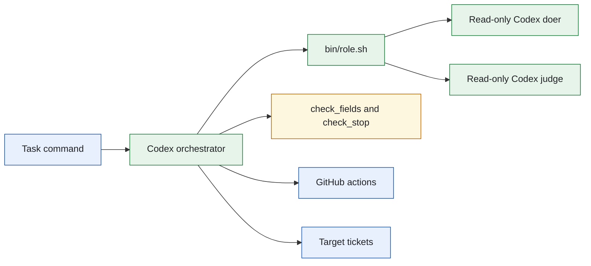
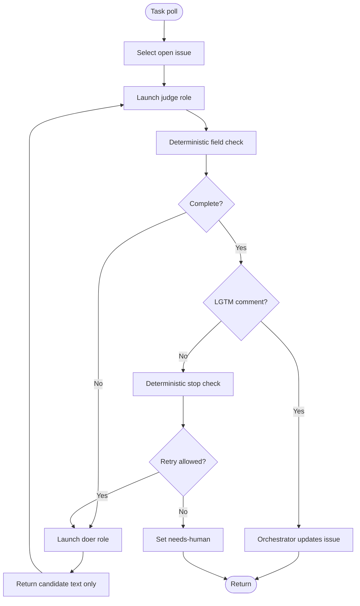
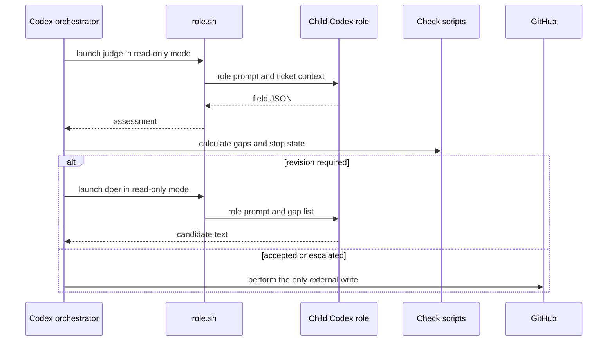
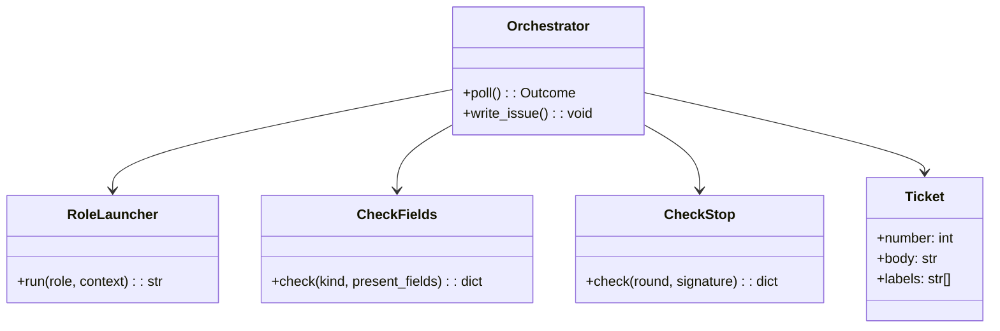
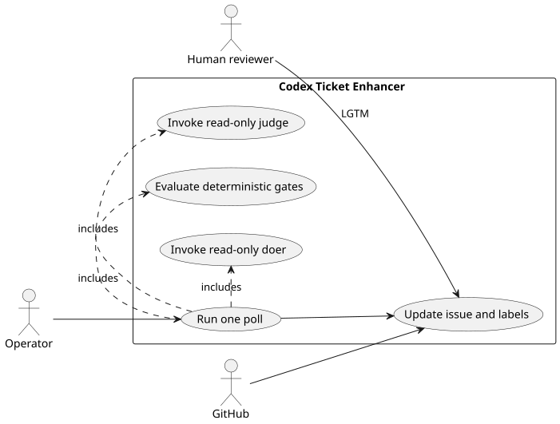

# Lab 1 Codex Ticket Enhancer

## Software Design Document

## Contents

1. Introduction and goals
2. Constraints and context
3. Building blocks and strategy
4. Runtime and domain model
5. Deployment, quality, and risks
6. Glossary

## 1. Introduction and goals

This solution translates the Lab 1 ticket-enhancement exercise to Codex. It evaluates open CRM issues one poll at a time, asks isolated read-only Codex child roles to judge or draft, evaluates local checks, and lets only the orchestrator perform a GitHub mutation. A ticket is ready only when deterministic completeness and a current human `LGTM` both hold.

### Functional requirements

- Select an issue needing enhancement and add lifecycle labels.
- Start a judge child process that returns a field assessment.
- Start a doer child process that returns a proposed revision, not an issue write.
- Run the local field and stop checks for every iteration.
- Update the issue or escalate it after an allowed decision.

### Quality requirements

- Child roles run read-only and do not launch nested Codex processes.
- The orchestrator alone holds GitHub write authority.
- Repeat failures and bounded rounds produce a visible `needs-human` outcome.
- `task test` verifies the folder without live model or GitHub calls.

## 2. Constraints and context

Codex is invoked through folder-local scripts. `bin/role.sh` is the boundary that launches the doer and judge with limited context. The solution does not depend on another solution or a generic loop package.



The launcher is an infrastructure adapter. It does not decide ticket readiness. Source: [`docs/diagrams/architecture.mmd`](docs/diagrams/architecture.mmd).

## 3. Building blocks and strategy

```text
sol1_enhancer_codex/
├── .claude/                 Role prompts and local policy material
├── bin/                     Role launcher, gates, poll, reset, and fence checks
├── tests/                   Offline acceptance and policy checks
├── Taskfile.yml             Folder-local commands
├── SPEC.md                  Behavioral contract
└── IMPLEMENTATION_NOTES.md   Runtime translation notes
```

| Module | Responsibility |
| --- | --- |
| `bin/role.sh` | Starts a named Codex child role with a bounded prompt. |
| `bin/check_fields.py` | Returns required fields and gaps from judge JSON. |
| `bin/check_stop.py` | Detects budget exhaustion and repeated failures. |
| `bin/poll.sh` | Coordinates one issue poll. |
| `bin/fence_check.sh` | Verifies role output and scope behavior. |
| `.claude` assets | Define the orchestrator, doer, and judge contracts. |

The key design choice is that roles return data only. The orchestrator combines the data with deterministic checks and then performs the only external write.

## 4. Runtime and domain model



The workflow is a user journey for an operator: invoke one poll, inspect its lifecycle outcome, and allow a human to approve the final result. Source: [`docs/diagrams/workflow.mmd`](docs/diagrams/workflow.mmd).



The child role is intentionally absent from the GitHub write path. Source: [`docs/diagrams/sequence.mmd`](docs/diagrams/sequence.mmd).



There is no relational data schema. `Ticket` is a GitHub-backed aggregate; checks use only ticket fields and bounded polling state. Source: [`docs/diagrams/model.mmd`](docs/diagrams/model.mmd).



The source for the rendered use-case view is [`docs/diagrams/use-cases.puml`](docs/diagrams/use-cases.puml).

## 5. Deployment, quality, and risks

Run `task test` and the fence checks locally before configuring a target. A live run needs the Codex runtime, GitHub authentication, and the target CRM repository. An operator or external scheduler calls one poll at a time.

| Quality scenario | Expected behavior |
| --- | --- |
| Child role attempts a mutation | Read-only invocation and orchestration contract block the action. |
| Fields are incomplete | The doer receives only the stated gaps and returns a candidate. |
| Signature repeats or budget is spent | The issue is escalated instead of silently retried. |
| Human never approves | The issue is not marked ready. |

Risks are operational: GitHub authentication, runtime availability, and prompt compliance by read-only roles. The local gates mitigate model quality risk, but they do not replace human review.

## 6. Glossary

| Term | Meaning |
| --- | --- |
| Role launcher | Script that starts an isolated Codex doer or judge turn. |
| Candidate | Proposed issue text that has not reached GitHub. |
| Fence | A testable boundary that keeps child roles from performing prohibited work. |
| Ready | Lifecycle state requiring complete fields and human `LGTM`. |
