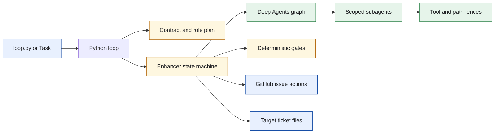
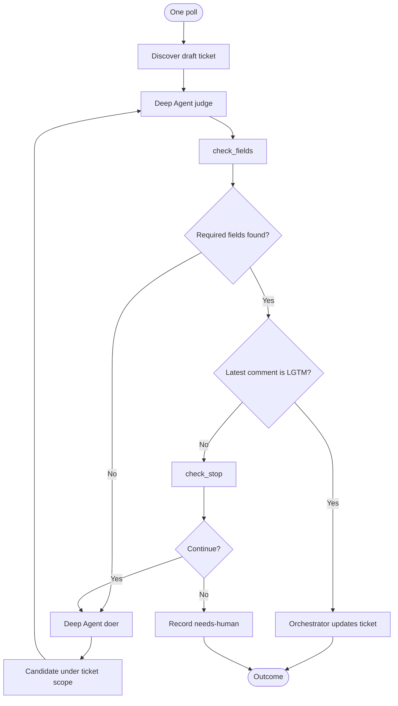
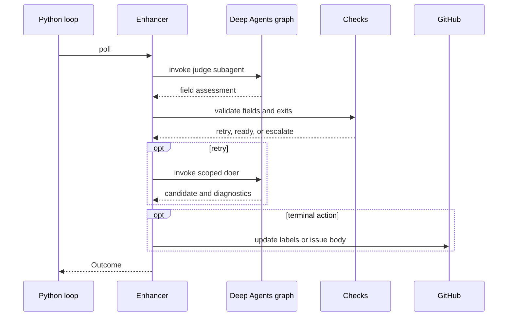
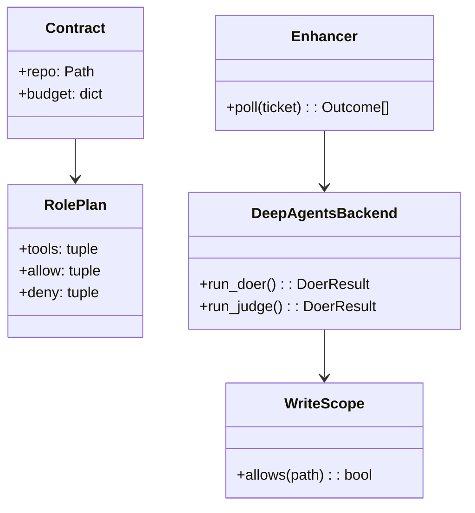
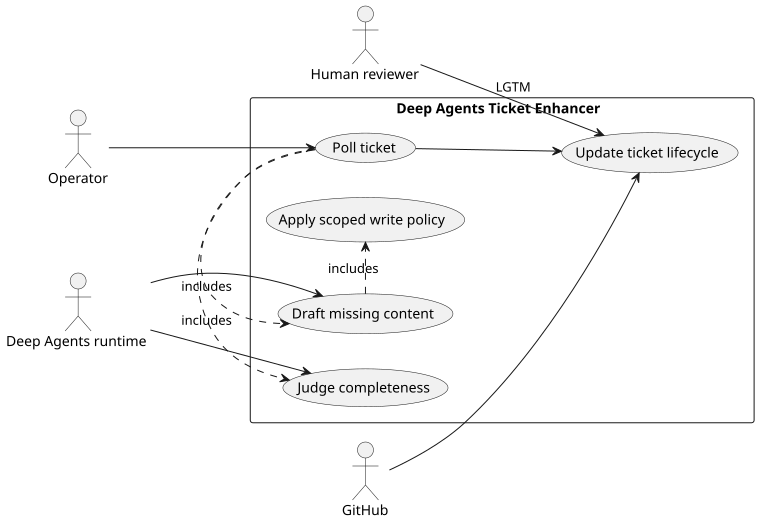

# Lab 1 Deep Agents Ticket Enhancer

## Software Design Document

## Contents

1. Introduction and goals
2. Constraints and context
3. Building blocks and strategy
4. Runtime and data model
5. Deployment, quality, and risks
6. Glossary

## 1. Introduction and goals

This standalone LangChain Deep Agents port runs the Lab 1 ticket enhancer. It maintains the same ticket rubric and human approval rule as the other Lab 1 implementations while enforcing the role split through Deep Agents subagent tool lists and scoped write tools.

### Functional requirements

- Discover eligible CRM ticket files and poll each one predictably.
- Ask the judge for a structured assessment, then use `check_fields.py` to determine gaps.
- Ask the doer for a candidate and store diagnostic evidence.
- Re-evaluate candidates until ready, stalled, or out of budget.
- Update issue state and labels only through the orchestrator.

### Quality requirements

- The judge cannot write.
- The doer is limited to ticket scope and cannot update GitHub directly.
- The runner supports table and test paths without Deep Agents installed.
- Every source module lives in this folder, with no shared loop import.

## 2. Constraints and context

`loop.py` selects the enhancer cast from `roleplan.py`, validates the target through `Contract`, and calls `roles.build_agent` only for a live run. The Deep Agents graph is an execution mechanism, not the policy source.



The target repository is mounted only for the scope that a role requires. Source: [`docs/diagrams/architecture.mmd`](docs/diagrams/architecture.mmd).

## 3. Building blocks and strategy

```text
sol1_enhancer_deep_agents/
├── loop.py                  CLI assembly and one-poll operation
├── enhancer.py              Ticket lifecycle state machine
├── adapter.py               Deep Agents result adapter
├── roles.py                 Subagent construction and harness fences
├── roleplan.py              Cast, tools, and write scope
├── write_scope.py           Path matching and role policy
├── check_fields.py          Completeness gate
├── check_stop.py            Retry and escalation gate
├── contract.py              Target repository contract
└── tests/                   Offline behavior and isolation checks
```

| Module | Responsibility |
| --- | --- |
| `roles.py` | Creates role-specific Deep Agents definitions and prevents general-purpose escape routes. |
| `write_scope.py` | Checks allow and deny paths before a custom writer touches disk. |
| `adapter.py` | Converts graph responses to loop results and diagnostics. |
| `enhancer.py` | Owns ticket state, candidate retention, labels, and outcome transitions. |
| `check_fields.py` and `check_stop.py` | Keep release and exit decisions deterministic. |

The design rejects data-model overreach. Ticket files, candidate artifacts, and GitHub issue state are sufficient, so no database schema or ERD is needed.

## 4. Runtime and data model



The workflow combines the operator journey and the automated state machine. A model result can advance the loop only through a deterministic gate. Source: [`docs/diagrams/workflow.mmd`](docs/diagrams/workflow.mmd).



Python remains the sole caller of GitHub actions. Source: [`docs/diagrams/sequence.mmd`](docs/diagrams/sequence.mmd).



`RolePlan` is the policy declaration; `WriteScope` applies it at the I/O boundary. Source: [`docs/diagrams/model.mmd`](docs/diagrams/model.mmd).



PlantUML source: [`docs/diagrams/use-cases.puml`](docs/diagrams/use-cases.puml).

## 5. Deployment, quality, and risks

Run `task table` and `task test` with no SDK, clone, or key. `task setup` creates a local environment for Deep Agents. A live poll requires a target repository, configuration, GitHub access, and a model credential. An external scheduler owns recurrence.

| Quality scenario | Expected behavior |
| --- | --- |
| A role tries an unapproved path | The custom scope check returns a refusal before writing. |
| The default general-purpose agent could bypass a role | The harness disables it. |
| A ticket remains incomplete after the bound | `check_stop.py` escalates with evidence. |
| A reviewer approves a complete ticket | The orchestrator applies `ready`. |

Risks include Deep Agents runtime behavior, target repository compatibility, GitHub availability, and model output quality. Test coverage focuses on the capability fence because prompt text alone is not a security control.

## 6. Glossary

| Term | Meaning |
| --- | --- |
| Deep Agents graph | Runtime graph that invokes purpose-limited subagents. |
| Scope check | Path policy enforced by a custom write tool. |
| Candidate | Staged text evaluated before any real issue change. |
| Escalation | Terminal `needs-human` outcome that preserves the observed gap. |
