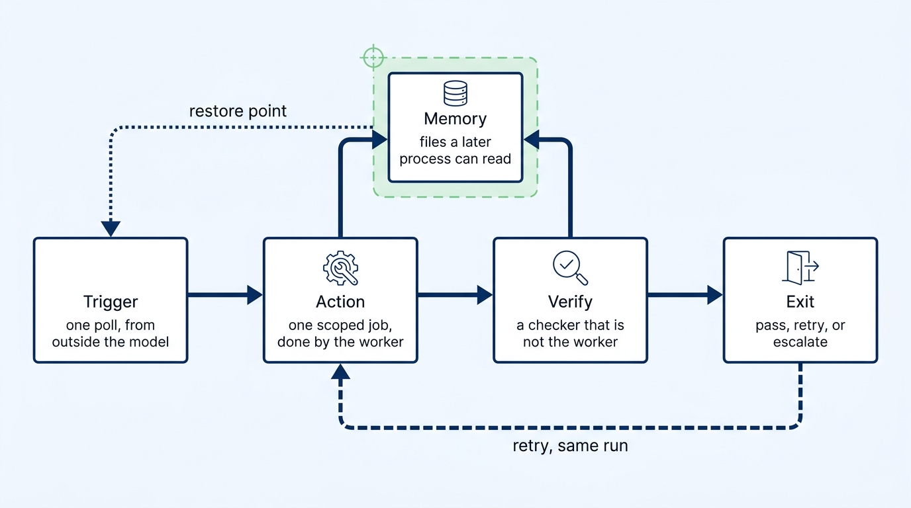
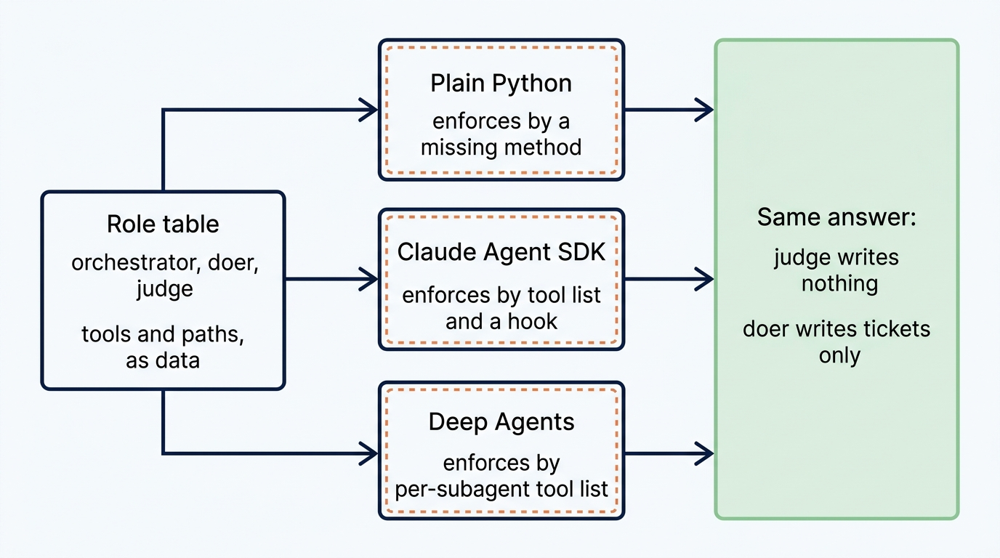
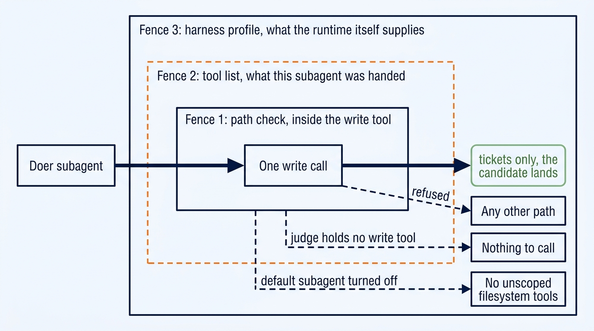
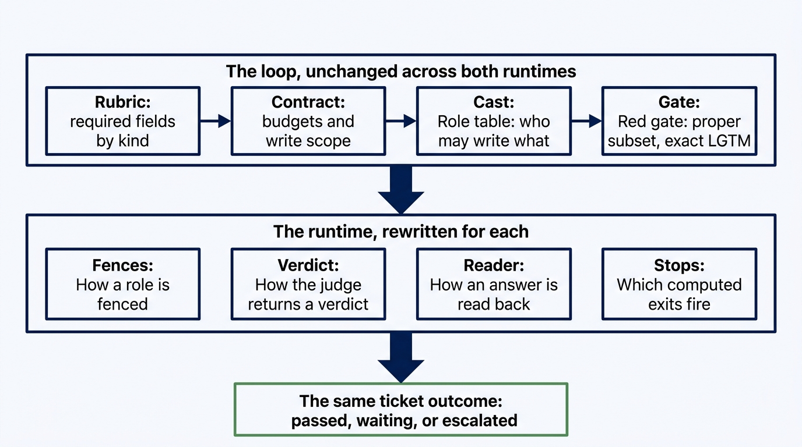

<!--
All five images are rendered and in place.

Cover: substack-images/cover.jpg, imagen, 1280x720, series style. The same
clerk at the same desk as part 1, now inside two meshed gear rings driven by
one governor.

Four content figures: sources in docs/diagrams/*.mmd, rendered with
imagen-diagrams, theme agent-control, density article. Do not publish the raw
Mermaid.

PAYWALL: place the Substack paywall immediately after Listing 2, at the marker
comment before "How Deep Agents enforces the contract".
-->

# The Second Runtime: What Survives When You Port an Agent Loop

## I moved the same ticket enhancer from the Claude Agent SDK to LangChain Deep Agents. The files that changed reveal where the harness really lives.

*Same rubric. Same red gate. Same write scope. A different runtime, and a clean line between the two.*


A harness looks real when its tests pass on the runtime it was built for. It proves less than you think.

I moved the same ticket-enhancement loop from the Claude Agent SDK to LangChain Deep Agents and tracked every file that changed. The rubric survived byte for byte. The contract and the role table did too. The tool fences, the adapter, and the runtime defaults did not.

One exit rule changed as well, and it turned out to be the most useful result of the whole exercise. If behavior changes during a port, that behavior belonged to the loop whether or not you meant it to.

> A runtime swap is not a migration. It is an architecture test, and it is the cheapest one you can run on a harness you already own.

Every fence in part 1 was enforced by one runtime. The judge held no write tool because the Agent SDK was handed a tool list without one. Writes were checked because a `PreToolUse` hook ran before each write. Both are real. Neither tells you whether the *rule* was the fence or the *plumbing* was.

You find out by moving. Take the program to a runtime that enforces scope a different way, change as little as you can, and count the files you opened. Files you did not have to open belonged to the loop. Files you rewrote belonged to the runtime.

> **In this article:** You will run that test on a real program. The names come from [*The Loop Is the Product*](https://spillwave.com/harness-loop-enginering/). The code comes from [reliable-agentic-lab](https://github.com/RichardHightower/reliable-agentic-lab), [`solutions/sol1_enhancer_deep_agents/`](https://github.com/RichardHightower/reliable-agentic-lab/tree/main/solutions/sol1_enhancer_deep_agents). Part 1, [*Python Owns the Loop*](https://rickhigh.substack.com/p/python-owns-the-loop-loop-engineering), built this enhancer on the Claude Agent SDK. This part reports what a port costs, where each framework draws its fences, and what the evidence does and does not prove.

A **runtime** is the thing that hands a model its tools and runs its turns. A **port** is the same loop wired to a different one. The interesting question about a port is not whether it runs. It is which files you had to open.

This is not a Deep Agents tutorial. It is a report on what a second runtime proves, with the diffs that prove it.

---

## What has to survive

Part 1 built a ticket enhancer. A vague GitHub issue goes in. A rubric-ready ticket comes out. The model drafts and grades. Python holds every transition. Read [*Python Owns the Loop*](https://rickhigh.substack.com/p/python-owns-the-loop-loop-engineering) for the walk. What follows is only what this article leans on.



Software owns five steps, and each is a **node**. **Trigger** starts a turn from outside the model. **Action** is one scoped job. **Verify** is a checker that is not the worker, plus a fact computed outside either mouth. **Memory** is files a later process can read. **Exit** ends the run: pass, retry, or escalate. None of the five is a decision a model makes.

Three roles run this loop. Python is the **orchestrator**, and it owns discovery, writes, and exits. The **doer** is the worker, the agent assigned the action, and it drafts a better ticket body. The **judge** is a checker, and it reports which required fields a ticket has. Doer and judge are **subagents**, each with its own **context**, separate from the parent and from each other, because a maker and a checker that share a thread are one intern with two job titles.

The gate between them is the rule this article keeps testing. A candidate draft replaces the real ticket only when its missing-field set is a **proper subset** of the current one. Trading one gap for another looks like motion and is how a loop spends a whole budget standing still. A green ticket is then released only by an exact `LGTM` comment from a person.

Those are the five things a port must not quietly change: the rubric, the role policy, the durable state, the red gate, and the exits.

---

## One table, three runtimes

The role table is why a port is cheap. It is data, and every runtime reads it rather than restating it.

**Code Listing 1: one table, every runtime** (`roleplan.py`)

```python
"""The role table, in one place, in a form any runtime can read.

Three runtimes enforce write scope three different ways. Plain Python uses a
missing method. The Claude Agent SDK uses a tool list and a PreToolUse hook.
Deep Agents uses a per-subagent tool list. All three read the same table, which
comes from `.loop.yml` in the target repo.
"""

WRITE_TOOLS = ("Edit", "Write", "NotebookEdit")     # ①
LOOPS = {                                            # ②
    "enhancer": ("orchestrator", "doer", "judge"),
    # ...
}
READERS = ("orchestrator", "judge", "researcher")    # ③
FALLBACK_SCOPE = {                                   # ④
    "doer": (("tickets/**",), ()),
}
NO_WRITE_SCOPE = ((), ("**",))
```

① A role can write only if it holds one of these tool names. The `can_write` property is membership in this tuple, not a sentence in a prompt.

② The enhancer cast is three names. A runtime that invents a fourth role is not running this loop.

③ Roles in `READERS` are handed no write tool by any runtime. The judge is one of them.

④ The target repo's `.loop.yml` has never heard of a role called `doer`, so the doer falls back to `tickets/**`. Anything absent from both falls to writes-nothing, which is the safe way to be wrong.

Now the measurement. The entire difference between the two copies of `roleplan.py` is this:

```text
$ diff solutions/sol1_enhancer_agent_sdk/roleplan.py \
       solutions/sol1_enhancer_deep_agents/roleplan.py
13,14c13,14
< this folder's `tests/test_roleplan.py` and `tests/test_loop.py` check, and they
< check it without either SDK installed.
---
> This folder's own tests check the cast, without either SDK
> installed.
39c39
< DEFAULT_LOOP = "implementer"
---
> DEFAULT_LOOP = "enhancer"
```

Two hunks. One is a docstring. The other is which loop the file defaults to. Every role, every tool tuple, and every fallback scope is identical across two runtimes that enforce scope with completely different machinery.



The figure is the same "who may write" question, asked once and answered three ways. The table on the left is what a human reviews. Each runtime translates that row into its own machinery, and none of them gets to disagree with it. The box on the right is the property that has to hold on all three.

---

## The broken port

Listing 2 is a **negative example**. Do not ship it. It is what a port looks like when somebody moves the program by translating its vocabulary instead of rewiring its structure. Every marked line is a failure, and none of them is visible on the day it is written, because the code runs and the demo passes.

**Code Listing 2 (negative example): the port that quietly became a different loop. Do not ship this.**

```python
DOER_SCOPE = ["tickets/**"]                    # ① WRONG! second copy of the scope

judge = create_subagent(
    system_prompt=(
        "You are the judge. Score the ticket. "
        "Do not write any files."                  # ② WRONG! a rule in a prompt is not a tool list
    ),
    tools=default_tools(),                         # ③ WRONG! whatever the runtime ships, including writes
)

verdict = json.loads(str(agent.invoke(prompt)))    # ④ WRONG! the state repr, not the model's answer
if "looks complete" in verdict["notes"]:           # ⑤ WRONG! ready is back in the model's prose
    ship(ticket)
```

① The scope is written down twice. Both files say `tickets/**`. They agree today, and the next person widens one of them.

② The judge is told not to write. Telling is not a fence. The judge is holding a write tool while it reads that sentence.

③ Handing a subagent the runtime's default tool list is **unbounded authority** with extra steps.

④ Calling `str()` on a graph result gives a repr of every message, every tool call, and every id. It parses often enough to pass a demo.

⑤ The rubric is gone. Ready is a phrase the model chose.

This port kept the vocabulary and threw away the structure. It still has a judge, a doer, and a scope. None of the three is computed outside the model any more.

The rest of this article shows the three fences you need to move the loop without surrendering its controls.

<!-- PAYWALL -->

---

## How Deep Agents enforces the contract

The Agent SDK port used two fences: the tool list and a `PreToolUse` hook. This runtime offers three places to say no, and this port uses all three. Any one left off is a hole the other two cannot see.



The figure is one write call and the three things that have to permit it. Innermost, the doer's own write tool checks the path before it touches disk. Around that, the tool list decides what this subagent was handed at all, which is why the judge has nothing to call. Outermost, the **harness profile** decides what the runtime itself supplies before any role is configured. The outer boundary is the new one: it is not about your roles, it is about what the platform adds on its own.

Listing 3 is all three. You will see five facts: a role receives a write tool only when the table says it can write, the path is canonicalized before it is checked, a turn narrows the role's scope to the one file that turn is for, the parent's built-in write tools are hidden, and the default general-purpose subagent is turned off.

**Code Listing 3: the three fences** (`roles.py`)

```python
def scoped_write_tool(repo: Path, role: RolePlan):
    root = Path(repo).resolve()

    @tool(f"write_{role.name}")
    def write(path: str, content: str) -> str:
        turn = CURRENT_ALLOW.get()                                  # ①
        allow = list(turn) if turn else list(role.allow)
        scope = WriteScope(allow=allow, deny=list(role.deny))
        allowed = ", ".join(allow) or "nothing"

        target = _inside(repo, path)                                # ②
        if target is None:
            return f"REFUSED. {path} is outside the target repo."
        relative = target.relative_to(root).as_posix()
        try:
            scope.check(relative)                                   # ③
        except ScopeViolation:
            return f"REFUSED. {role.name} may write {allowed} this turn. {relative} is not that."
        target.write_text(content, encoding="utf-8")
        return f"wrote {relative}"
    return write


def subagents_for(contract, loop=DEFAULT_LOOP) -> list[dict]:
    for role in plan(contract, loop).values():                      # ④
        tools = [scoped_write_tool(repo, role)] if role.can_write else []
        # ... spec carries tools plus permission_rules(role)


def build_agent(contract, ...):
    backend = CompositeBackend(
        default=FilesystemBackend(root_dir=str(repo), virtual_mode=True),   # ⑤
        routes={"/skills/": ..., "/memory/": ...},
    )
    register_harness_profile(model, HarnessProfile(
        excluded_tools=ORCHESTRATOR_EXCLUDED_TOOLS,                         # ⑥
        general_purpose_subagent=GeneralPurposeSubagentProfile(enabled=False),   # ⑦
    ))
```

① The scope for the turn in flight, narrower than the role's row. The doer's row says `tickets/**`, which contains the very ticket the judge is grading. The orchestrator already knows the one candidate path it wants, so the turn carries it and the row becomes an outer bound rather than a grant.

② Canonicalize before checking. The glob does not resolve `..`, so `tickets/../app/x.py` matches `tickets/**` as text while landing in `app/`. Checking the path the write will actually use removes the gap between what the scope reads and what the disk receives.

③ The scope check runs on the canonical relative path, and the refusal names the scope so the model can act on it. Returning text rather than raising is deliberate: an unformatted exception in an agent's context tends to start a retry loop.

④ A write tool is appended only when `can_write` is true, and `can_write` comes from the table in listing 1. This function does not know the names of the roles it builds.

⑤ **Virtual mode** roots the runtime's own filesystem tools at the target repo. A **composite backend** mounts extra routes without widening that root.

⑥ The parent is not handed the runtime's built-in write, edit, delete, or execute tools.

⑦ The default **general-purpose subagent** is turned off. It ships with the harness filesystem tools, so leaving it enabled is how a carefully scoped agent reaches `app/`.

Notes ① and ⑦ are the two that generalize. Note ① is the difference between what a role may ever do and what this turn needs it to do, and the narrower of the two is the one to grant. Note ⑦ is the reason fence three exists at all: every scope above it can be walked around by asking a subagent nobody scoped, because that subagent came with the runtime rather than with your table. A role table describes the roles you wrote. It cannot describe the role your platform added last release.

### The verdict is a schema, not a parse

Part 1's judge returned JSON in a reply and Python parsed it out of the text. A subagent here can declare the shape of its answer instead.

**Code Listing 4: the judge reports fields, and cannot compute ready** (`roles.py`)

```python
JUDGE_RESPONSE = {
    "type": "object",
    "description": (
        "Inventory of which required fields the ticket currently has. "
        "Do not compute ready. Do not list missing fields. "                # ①
    ),
    "properties": {
        "kind": {"type": "string", "enum": ["bug", "feature", "ui"]},       # ②
        "present_fields": {"type": "array", "items": {"type": "string"}},
    },
    "required": ["kind", "present_fields"],
    "additionalProperties": False,                                          # ③
}
```

① The judge reports what it saw. What is missing, and whether the ticket is ready, are both computed by Python from that report.

② An enum of three. A model that invents a fourth kind fails the schema rather than reaching the rubric with a name it has never heard of.

③ A `ready: true` the model adds on its own does not survive the schema.

**Structured output** holds the model to a declared shape instead of making the caller parse prose. Part 1 kept ready out of the judge's mouth by ignoring it in Python. This port keeps it out of the judge's vocabulary.

---

## What changed, and what did not

The file that decides whether a ticket is complete did not move at all.

```text
$ diff solutions/sol1_enhancer_agent_sdk/check_fields.py \
       solutions/sol1_enhancer_deep_agents/check_fields.py
$
```

**Code Listing 5: the rubric, unchanged across both runtimes** (`check_fields.py`)

```python
REQUIRED = {
    "bug": ["title", "steps", "expected", "actual", "environment"],
    "feature": ["problem", "proposal", "value", "criteria"],
    "ui": ["problem", "proposal", "value", "criteria", "wireframe"],
}

def check(kind: str, present_fields: list[str]) -> dict:
    required = REQUIRED[kind]
    present = set(present_fields)
    missing_fields = [f for f in required if f not in present]      # ①
    return {
        "kind": kind,
        "present_fields": [f for f in required if f in present],    # ②
        "missing_fields": missing_fields,
        "ready": not missing_fields,                                # ③
    }
```

① The missing set is computed here, from the rubric, out of a report the judge wrote.

② A field the model invents that is not in the rubric is dropped rather than counted as evidence.

③ Ready is `not missing_fields`. A boolean, from a list, from a rubric.

Be precise about what that buys, because it is easy to oversell. Ready is a **deterministic decision over an independently produced observation**. The decision is a list comprehension no model saw. The observation, `present_fields`, is still a model judgment about whether a heading has real content. Three properties hold, and a fourth does not:

- The schema controls the shape of the judge's answer. It does not make the answer true.
- Isolated context reduces correlated error, because the judge never read the doer's reasoning.
- The gate is deterministic given its input.
- The gate is no more accurate than the measurement it is given. A judge that miscounts a field produces a confidently wrong `ready`.

Determinism starts at `check_fields.check` and not before it. Saying so is what makes the rest of the claim worth trusting.

The `contract.py` and `ticket.py` files came across at zero lines different too. The loop's data model and its config survived untouched.

### The exit that did change

Part 1 computes four stops: completion, cost, max turns, and a repeated **failure signature**, meaning the missing-field list compared against the previous round to catch a ticket that is not moving. This port computes three, and drops the signature comparison. A ticket that misses the same fields on consecutive rounds now burns turns until the max-turns check fires, or dollars until the cost check does.

Four loop policies survived the port unchanged: the rubric, the role table, the durable state, and the red gate. One exit policy changed. The change is the finding rather than an exception to it. Exit semantics belong to the loop, so a port that changes them has changed the loop, and the only reason anyone can say that with confidence is that both files sit side by side and diff cleanly.

Both designs are defensible. Four exits stop a stall one round sooner and name it precisely. Three keep the stop rule smaller and let the budget end a stall like any other slow progress. What matters is the property both share: every exit is computed from data outside the model, and none is a token the model may emit.

### Who is allowed to release a ticket

One more control deserves the same precision. An exact `LGTM` comment releases a green ticket, and exact matching is a **syntax** check. A comment of `LGTM.` fails, which is what stops an approval by accident.

Exact matching is not an **authorization** check. It does not ask who typed the comment. In the lab that is fine, because the loop runs against your own fork and you are the only commenter. In a shared repository it is not, and the policy has to be written down: repository collaborators, an explicit approver allowlist, `CODEOWNERS`, organization membership, or a required GitHub review state. A precise comment prevents an accidental approval. An identity check prevents an unauthorized one. Ship both before this loop touches a repo other people can comment on.

---

## Two frameworks, side by side

Both runtimes run this loop correctly. They divide the work differently.



The figure separates the two halves of a port. The top row belongs to the loop and did not move. The bottom row belongs to the runtime and was rewritten. The outcome at the bottom is the property a port has to preserve, and the only one a reader of the terminal sees.

**Tool and path enforcement**

| | Agent SDK | Deep Agents |
| --- | --- | --- |
| Scope a role | Tool list plus a `PreToolUse` hook | Tool list plus a path check in the tool |
| Express the rule | Imperative code you write | Declarative permission rules, first match wins |
| Contain the filesystem | The hook checks each path | Backend rooted at the repo in virtual mode |

**Context and platform defaults**

| | Agent SDK | Deep Agents |
| --- | --- | --- |
| Spawn a child | Parent holds an `Agent` tool | Subagents declared up front in the graph |
| Fence the platform | Subtract from the host's tool list | Harness profile hides tools, disables the default subagent |
| Load a skill | Plugin skills on the session | Mounted routes, resident only when invoked |

**Results and accounting**

| | Agent SDK | Deep Agents |
| --- | --- | --- |
| Return a verdict | JSON in the reply, parsed by the caller | Declared `response_format` schema |
| Read the answer | Result message ending a stream | Last message carrying content, walked back from graph state |
| Report cost | Result message carries the figure | Usage metadata summed across messages |

A temperament shows up in each column.

The Agent SDK puts the fence in the path of the call. A hook fires before a write and your code decides. The strength is directness: one function sees the tool and the path and can weigh anything you can compute at that moment. The cost is that the fence is procedural, so its correctness lives in code you have to test rather than in a rule a reviewer can read.

Deep Agents puts the fence in the shape of the configuration. A role carries permission rules, the backend carries a root, the harness profile carries a list of things not to supply. The strength is that most of the boundary is readable without running anything. The cost is that a graph runtime grants more by default, so a correct configuration includes turning things off, and a default you forgot is invisible in the role table.

Neither is safer on its own. One asks you to write a fence and get the code right. The other asks you to declare a fence and remember the defaults.

> A framework decides how you say no. The loop decides what no means.

Three readings transfer to a framework this article never touched.

- **Keep the definition of done outside the runtime.** A rubric in a Python file moved between frameworks at zero cost. A rubric expressed as a prompt instruction, or as a runtime's own validation feature, moves at the cost of a rewrite.
- **Prefer a fence a reviewer can read.** Judge your harness by how much of it survives being printed rather than run.
- **Ask what a framework grants, not what it lets you restrict.** Every runtime supplies something you did not ask for.

---

## What the tests prove

Evidence comes in layers, and the layers are not interchangeable.

**Code Listing 6: unit tests pin the scope with no runtime installed** (`tests/test_roles.py`)

```python
def test_the_judge_holds_no_custom_tools(contract, fake_langchain):
    judge = _by_name(roles.subagents_for(contract, loop="enhancer"))["judge"]
    assert judge["tools"] == []                                          # ①

def test_the_write_tool_refuses_a_traversal_that_matches_the_glob(
    contract, target_repo, fake_langchain
):
    doer = _by_name(roles.subagents_for(contract, loop="enhancer"))["doer"]
    write = doer["tools"][0]

    answer = write("tickets/../app/models.py", "print()")                # ②

    assert answer.startswith("REFUSED")
    assert (target_repo / "app" / "models.py").read_text() == "real code" # ③

def test_the_judge_asks_for_structured_output(contract, fake_langchain):
    schema = _by_name(roles.subagents_for(contract, loop="enhancer"))["judge"]["response_format"]
    assert "ready" not in schema["properties"]                           # ④
```

① The judge's tool list is empty, asserted rather than assumed.

② A path that matches `tickets/**` as text and resolves into `app/`. This is the case note ② of listing 3 exists for.

③ The refused file is unchanged afterward. Checking the message alone would pass on a tool that says no and writes anyway.

④ The judge's schema cannot express ready, so the property is enforced by configuration a test can read.

The suite runs in under a second with no key and no clone:

```text
$ python3 -m pytest tests -q
218 passed, 1 skipped in 0.44s
```

Now the honest part about what those 218 tests cover. They use a `fake_langchain` fixture that stands in for `langchain.tools`, so they exercise the role table, the schema, the scope check, and the refusal path. They are strong evidence about the logic this program owns. They are not evidence that an installed Deep Agents honors `permissions=`, the harness profile, or virtual mode, because no Deep Agents is running when they pass.

Read the evidence in three layers, and do not let one stand in for another.

1. **Unit tests** prove the role table, the schema, the scope checks, and the refusal behavior. They run everywhere, on every push, with no key.
2. **Integration tests** prove that the pinned runtime applies that configuration. This is the layer to add against the exact version below, and it is the one that catches a changed default.
3. **A live run** proves the whole workflow, including the model.

A gate you can only check with an API key is a gate you check rarely, which is the argument for pushing as much of the boundary as you can into layer one. It is not an argument that layer one is enough.

---

## Try the portability test

The recipes live in `Taskfile.yml` next to `loop.py`, and the CLI that reads it is **go-task** (`task` from [taskfile.dev](https://taskfile.dev)). The `task run --` command calls `loop.py --once`: one poll, then the process exits. It is not the Claude Agent SDK `Task` tool.

Runtime defaults are the argument of this article, so pin them. Results below come from this exact environment:

| | Version |
| --- | --- |
| `deepagents` | 0.7.10 |
| `langchain` | 1.3.18 |
| Python | 3.14.6 |
| Model | `anthropic:claude-sonnet-5` |
| Lab commit | `821992f` |
| Tested | 31 August 2026 |

You also need `python3`, `gh`, `jq`, go-task, and an `ANTHROPIC_API_KEY` in the repo-root `.env`.

```bash
git clone https://github.com/RichardHightower/reliable-agentic-lab.git
cd reliable-agentic-lab/solutions/sol1_enhancer_deep_agents
cp config.json.example config.json     # fill in fork_owner
task setup && task clone
```

Three commands need no runtime, no key, and no clone. Run them first.

```bash
task table     # the role table
task checks    # both deterministic check scripts
task test      # the pytest suite from listing 6
```

The first prints the cast:

```text
role              writes  scope
orchestrator      no      nothing
doer              yes     tickets/**
judge             no      nothing
```

The judge must print `no` in the writes column. If it prints `yes`, stop, because nothing downstream is worth building on that. Run the same command in `solutions/sol1_enhancer_agent_sdk` and read the same three rows out of a different runtime. The comparison is the portability test, and it takes ten seconds.

Then one live poll against your fork:

```bash
task reset-test-tickets && task create-test-tickets
task run --
```

A ticket that still needs work starts three model calls: judge, doer, judge again. An actual poll from this program follows, run on the pinned versions above, with the connector warning and the go-task preamble removed:

```text
deep-agents T001 judge: completed in 13.7s
deep-agents T001 doer:  completed in 72.4s
deep-agents T001 judge: completed in 63.4s
deep-agents T901 judge: completed in 15.4s
deep-agents T902 judge: completed in 11.2s
deep-agents T902 doer:  completed in 74.0s
deep-agents T902 judge: completed in 39.1s
T001    waiting     done, waiting for LGTM
T900    escalated   needs-human is already set
T901    waiting     ready, waiting for LGTM
T902    waiting     done, waiting for LGTM
```

Read the shape rather than the timings. T001 and T902 were red, so each ran the full judge, doer, judge sequence. T901 was already green, so the doer never ran and no tokens went to a ticket that needed nothing. T900 carried `needs-human` from an earlier escalation, so it cost no model call at all and did not stall the three tickets behind it. Nobody is `passed`, because nobody has commented yet.

The write scope held. After the run, the target repo's only changed paths were under `tickets/`: the two promoted tickets and the three untracked drafts. The candidate files are gone, because `_improve` unlinks them whether the draft was promoted or discarded. No path under `app/` was touched.

The command prints one line per ticket.

| Outcome | Means |
| --- | --- |
| `waiting` | Green and waiting for `LGTM`, or improved but still short |
| `escalated` | A stop, a hang, or a spent budget. GitHub gets `needs-human` |
| `passed` | Green, and a person commented exactly `LGTM` |
| `blocked` | The issue is closed or missing. The loop never opens a second one |

Nobody is `passed` on a first poll, because nobody has commented yet. Review each issue against the rubric in listing 5, comment exactly `LGTM` on the ones you judge complete, and poll again. Leave an incomplete ticket unapproved so its failure path stays visible.

Reset, teardown, and recovery from a closed issue are in [`HOW_TO_RUN.md`](https://github.com/RichardHightower/reliable-agentic-lab/blob/main/solutions/sol1_enhancer_deep_agents/HOW_TO_RUN.md). One rule is worth repeating here: closing a GitHub issue by hand is not a reset, and it is the single action that reliably breaks the next poll.

---

## Run this test on your own harness

- Print your role table on two runtimes. Any row that does not match is a fence you thought you had.
- Run `diff` across your rubric, your contract, and your role policy between any two implementations. Empty output means those files belong to the loop.
- Count how many of your fences are prompt sentences rather than tool lists or rules. Each one is a fence you would rewrite on a port, which means it was never a fence.
- Write down what your runtime grants before you restrict anything. The default general-purpose subagent is the shape of that question, not the whole of it.
- For every gate, name where determinism starts. A deterministic decision over a model observation is still only as good as the observation.

| Loop node | File | Changed by the port? |
| --- | --- | --- |
| Trigger | `loop.py`, `enhancer.py` `poll` | Wiring only |
| Action | `roleplan.py`, `roles.py` | `roles.py` rewritten, `roleplan.py` unchanged |
| Verify | `check_fields.py` | Zero lines different |
| Memory | ticket markdown, `.harness/*.json` | Trace filename only |
| Exit | `check_stop.py`, exact `LGTM`, `needs-human` | Three computed exits, not four |

A harness is a claim until something other than its author tries to get around it. A second runtime is the cheapest thing you can point at one, because it does not skim, it does not assume, and it hands back exactly the list of files that were never really yours. The runtime may change how the fence is built. It must not quietly change what the fence means.

If you port a loop this week and find that one of your fences was a sentence in a prompt, reply and tell me which one.

## Glossary

**Runtime.** The thing that hands a model its tools and runs its turns.

**Port.** The same loop wired to a different runtime. A good port opens the runtime files and leaves the loop files shut.

**Harness profile.** Configuration that changes what tools and subagents the runtime itself supplies, separate from what any role is handed.

**General-purpose subagent.** A subagent the runtime provides by default, carrying its own filesystem tools. It does not appear in your role table.

**Structured output (`response_format`).** A declared schema the runtime holds the model to, instead of the caller parsing prose. It controls shape, not truth.

**Virtual mode.** A filesystem backend rooted at one directory, so a relative path containing `..` cannot walk off it.

**Turn scope.** The paths one call may write, narrower than the role's declared scope. A turn may shrink what a role can write, never widen it.

**go-task.** The `task` CLI, from this folder's `Taskfile.yml`. Not the Claude Agent SDK `Task` tool.

Carried from part 1: production loop, node, agent, worker, subagent, isolated context, bounded and unbounded authority, maker and checker, failure signature, proper subset, exact `LGTM`, `needs-human`, `ready`.

## Sources

- **Concepts.** [*The Loop Is the Product*](https://spillwave.com/harness-loop-enginering/).
- **Part 1.** [*Python Owns the Loop*](https://rickhigh.substack.com/p/python-owns-the-loop-loop-engineering) on this Substack.
- **Code, this part.** [`solutions/sol1_enhancer_deep_agents/`](https://github.com/RichardHightower/reliable-agentic-lab/tree/main/solutions/sol1_enhancer_deep_agents). The three fences are `roles.py`. The role table is `roleplan.py`. The adapter that turns graph state into a result the loop can read is `adapter.py`.
- **Code, part 1.** [`solutions/sol1_enhancer_agent_sdk/`](https://github.com/RichardHightower/reliable-agentic-lab/tree/main/solutions/sol1_enhancer_agent_sdk). Run `diff` between the two folders to reproduce every claim above.
- **Essay.** [*The Loop Is the Product*](https://rickhigh.substack.com/p/the-loop-is-the-product) on this Substack.
