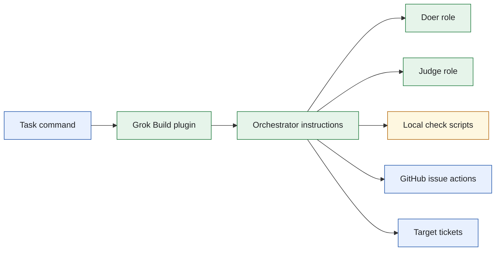
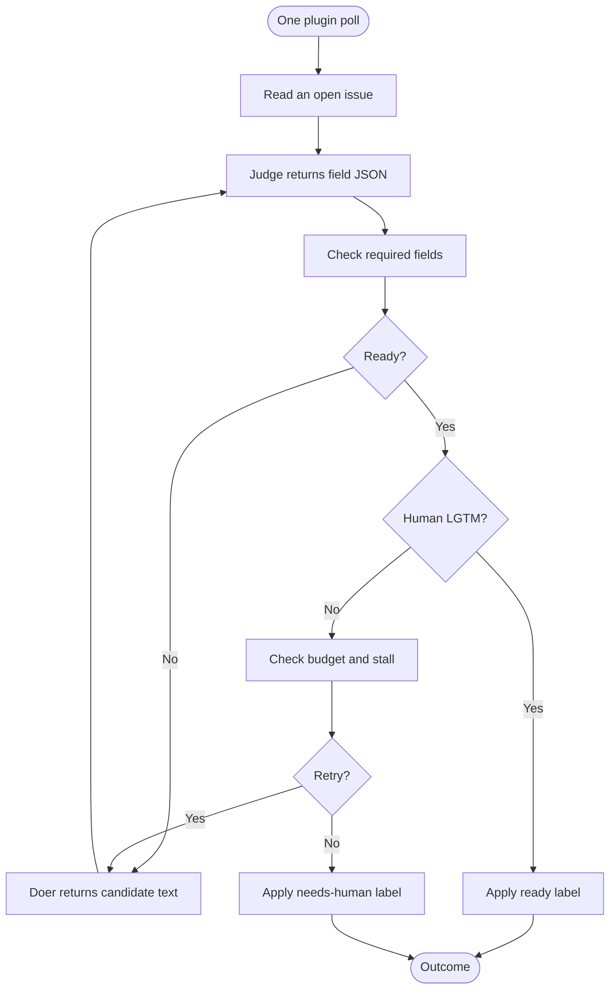
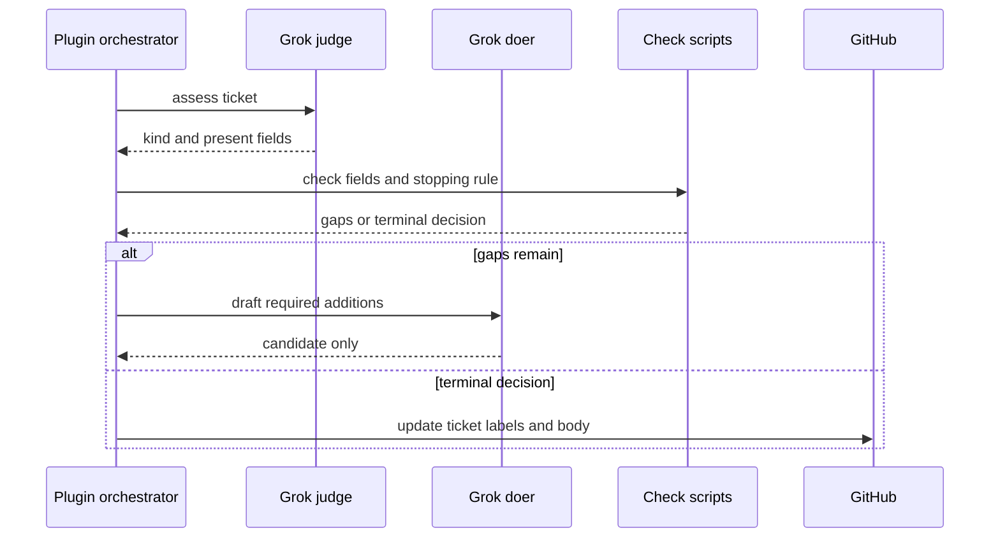
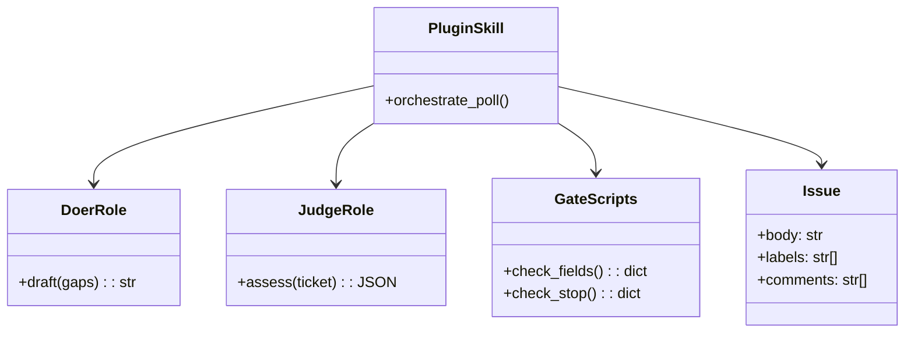
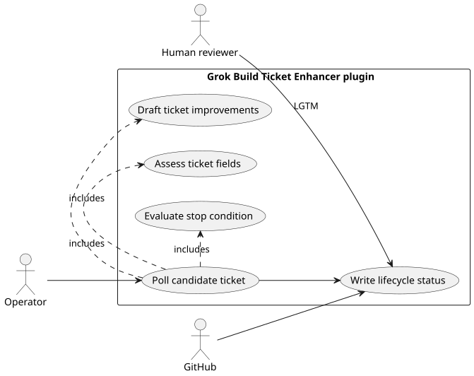

# Lab 1 Grok Build Ticket Enhancer

## Software Design Document

## Contents

1. Introduction and goals
2. Constraints and context
3. Building blocks and strategy
4. Runtime and data model
5. Deployment, quality, and risks
6. Glossary

## 1. Introduction and goals

This solution is the Grok Build plugin port of the Lab 1 ticket enhancer. It converts incomplete CRM GitHub issues into reviewable tickets through one bounded poll, preserving the core separation between a drafting doer, a read-only judge, deterministic local gates, and an orchestrator that alone changes external state.

### Functional requirements

- Poll open enhancement tickets and identify the fields a ticket lacks.
- Ask the judge for structured observations and the doer for candidate content.
- Apply deterministic completeness, stop, and human-approval checks.
- Mark accepted issues ready or direct unrecoverable issues to human attention.

### Quality requirements

- Doer and judge have no shell, MCP, or real-ticket write capability.
- The plugin uses a bounded number of rounds and visible exit reasons.
- Role and gate behavior can be tested offline from the folder.
- The implementation stays independent of other runtime ports.

## 2. Constraints and context

The implementation is rooted at `.grok/plugins/ticket-enhancer`. The plugin has its own role instructions and calls the local check scripts from the plugin directory, where working-directory correctness is part of the integration contract.



The plugin is a runtime adaptation. The fields, labels, exit behavior, and reviewer gate remain local business rules. Source: [`docs/diagrams/architecture.mmd`](docs/diagrams/architecture.mmd).

## 3. Building blocks and strategy

```text
sol1_enhancer_grok_build/
├── .grok/plugins/ticket-enhancer/  Plugin manifest, roles, and skills
├── bin/                            Poll, checks, reset, and verification scripts
├── config.json.example             Target-repository configuration template
├── tests/                          Offline plugin and fence tests
├── Taskfile.yml                    Folder-local operator commands
└── SPEC.md                         Behavioral contract
```

| Module | Responsibility |
| --- | --- |
| `.grok/plugins/ticket-enhancer` | Defines the runtime-visible orchestration, doer, and judge behavior. |
| `bin/check_fields.py` | Calculates required field gaps from the judge payload. |
| `bin/check_stop.py` | Detects terminal repeated or budgeted conditions. |
| `bin/poll.sh` | Starts one enhancement pass against the configured target. |
| `tests/` | Pins isolation and lifecycle expectations. |

The design uses a model only for interpretation and drafting. Program code determines whether a result is accepted and whether another turn may run.

## 4. Runtime and data model



This flow is also the operator journey: each poll moves an issue only to a named lifecycle state. Source: [`docs/diagrams/workflow.mmd`](docs/diagrams/workflow.mmd).



The doer cannot turn its candidate into a production issue update. Source: [`docs/diagrams/sequence.mmd`](docs/diagrams/sequence.mmd).



`Issue` is the only durable aggregate; labels and comments provide the lifecycle state. No relational schema is required. Source: [`docs/diagrams/model.mmd`](docs/diagrams/model.mmd).



PlantUML source: [`docs/diagrams/use-cases.puml`](docs/diagrams/use-cases.puml).

## 5. Deployment, quality, and risks

Use the folder Taskfile for setup, table, test, and one-poll commands. Live use requires the Grok Build environment, GitHub authentication, and a configured target. The plugin does not own time-based scheduling.

| Quality scenario | Expected behavior |
| --- | --- |
| A role tries to invoke shell, MCP, or write tools | The role configuration refuses the attempt. |
| Candidate fields remain insufficient | The check result drives a bounded new draft request. |
| Failure state repeats | The issue receives `needs-human`. |
| Reviewer adds `LGTM` | The orchestrator may apply `ready` after fields are complete. |

Key risks are plugin working-directory assumptions, provider availability, GitHub permissions, and candidate quality. Tests focus on the fixed boundaries rather than treating prompt wording as sufficient enforcement.

## 6. Glossary

| Term | Meaning |
| --- | --- |
| Plugin | Folder-local Grok Build integration and role configuration. |
| Doer | Role that drafts missing ticket detail. |
| Judge | Role that reports observed ticket fields. |
| Gate | Deterministic script that decides completeness or stopping. |
