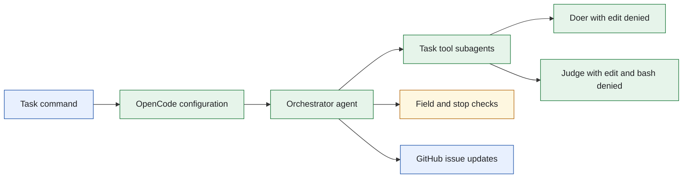
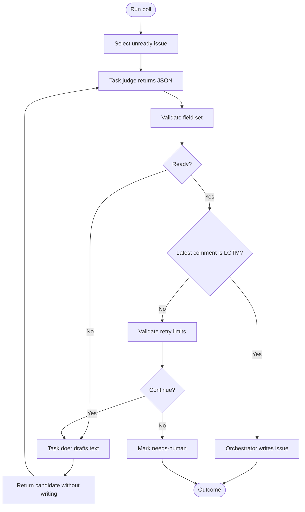
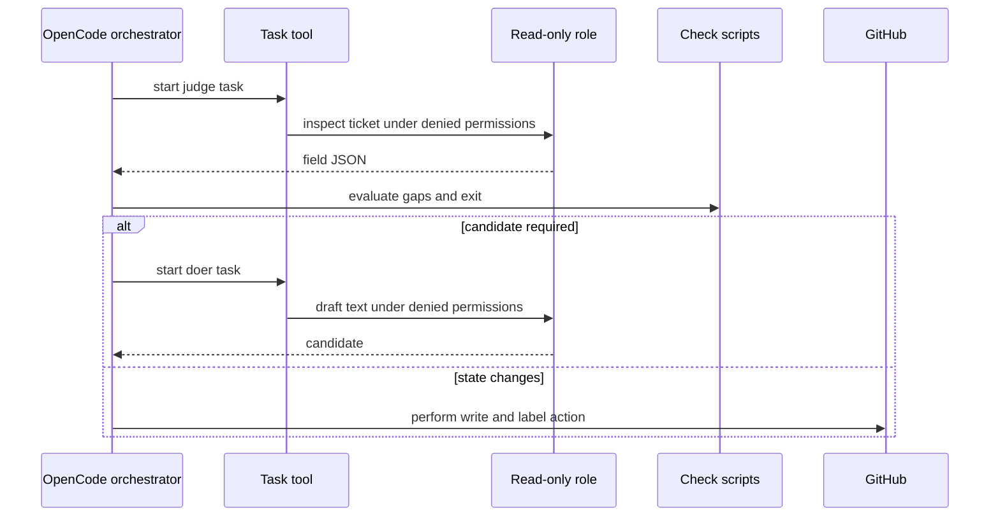
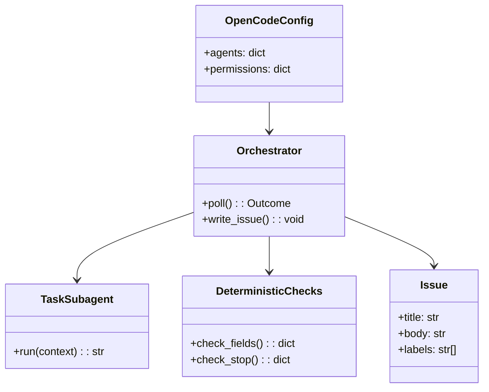
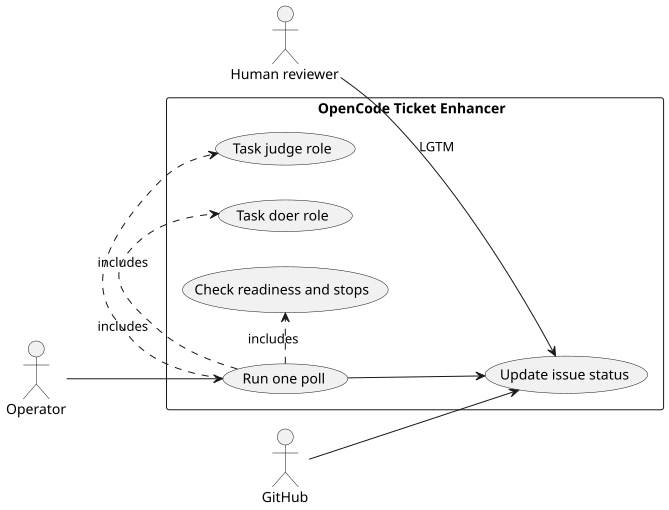

# Lab 1 OpenCode Ticket Enhancer

## Software Design Document

## Contents

1. Introduction and goals
2. Constraints and context
3. Building blocks and strategy
4. Runtime and data model
5. Deployment, quality, and risks
6. Glossary

## 1. Introduction and goals

This solution ports the Lab 1 ticket enhancer to OpenCode. The orchestrator uses Task-tool subagents for the doer and judge, then combines their returned data with local checks. It alone can make the GitHub updates that represent a ticket lifecycle transition.

### Functional requirements

- Poll an unready issue and determine its ticket kind and present fields.
- Delegate drafting and assessment to distinct OpenCode subagent tasks.
- Re-judge candidates after every draft attempt.
- Enforce human `LGTM`, bounded retries, and escalation labels.
- Retain a folder-local test and configuration path.

### Quality requirements

- The judge and doer deny edit capability; the judge also denies shell use.
- The orchestrator cannot replace a judge decision with self-grading.
- The target issue changes only after deterministic checks permit it.
- The folder has no shared runtime dependency.

## 2. Constraints and context

`opencode.json` defines the runtime configuration. The Task tool creates isolated child tasks; the child results travel back as text or JSON. The target CRM repository and GitHub remain external systems.



The permission policy is capability based: denied tools are unavailable to the subagent rather than merely discouraged. Source: [`docs/diagrams/architecture.mmd`](docs/diagrams/architecture.mmd).

## 3. Building blocks and strategy

```text
sol1_enhancer_opencode/
├── .opencode/                Role instructions and permissions
├── opencode.json             Runtime configuration
├── bin/                      Poll and deterministic gate scripts
├── docs/                     Operator and implementation notes
├── tests/                    Offline behavior and fence tests
├── Taskfile.yml              Folder-local commands
└── SPEC.md                   Behavioral contract
```

| Module | Responsibility |
| --- | --- |
| `opencode.json` | Declares agents, task behavior, and tool permissions. |
| `.opencode` | Holds the role-specific instructions used by OpenCode. |
| `bin/check_fields.py` | Calculates missing ticket requirements. |
| `bin/check_stop.py` | Returns retry or escalate. |
| `bin/poll.sh` | Coordinates one issue poll and orchestrator action. |
| `tests/` | Validates the policy and exit conditions offline. |

The strategy is the same capability separation as the other Lab 1 ports, implemented with OpenCode's Task-tool boundaries.

## 4. Runtime and data model



The ticket follows one of three visible paths: waiting for human approval, ready, or escalated. Source: [`docs/diagrams/workflow.mmd`](docs/diagrams/workflow.mmd).



OpenCode tasks act as read-only consultants. Source: [`docs/diagrams/sequence.mmd`](docs/diagrams/sequence.mmd).



The configuration controls capability; `Issue` is the external aggregate. No standalone database or ERD applies. Source: [`docs/diagrams/model.mmd`](docs/diagrams/model.mmd).



PlantUML source: [`docs/diagrams/use-cases.puml`](docs/diagrams/use-cases.puml).

## 5. Deployment, quality, and risks

Use the Taskfile from this folder for tests and setup. Live operation requires an OpenCode runtime, the configured CRM target, and GitHub credentials. A scheduler may call one poll, but the solution intentionally contains no generic scheduling engine.

| Quality scenario | Expected behavior |
| --- | --- |
| A subagent wants to edit an issue | The denied edit permission prevents the action. |
| A ticket has incomplete requirements | The doer returns a candidate and the judge re-assesses it. |
| The same gaps persist | The stop gate returns a human escalation. |
| A complete ticket receives LGTM | The orchestrator applies its ready transition. |

Risks are runtime permission drift, GitHub availability, and model output quality. The check scripts and offline tests are the stable enforcement layers.

## 6. Glossary

| Term | Meaning |
| --- | --- |
| Task tool | OpenCode mechanism for running an isolated child role. |
| Permission deny | Capability removal that stops a role from invoking a tool. |
| Candidate | Suggested issue content returned to the orchestrator. |
| Human escalation | `needs-human` lifecycle state after a terminal gate. |
