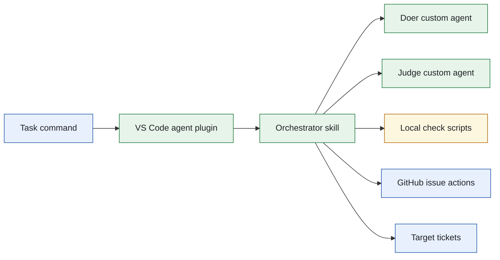
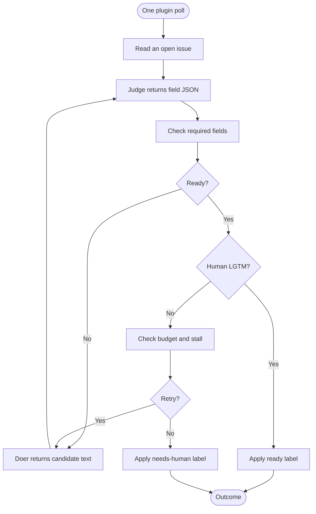
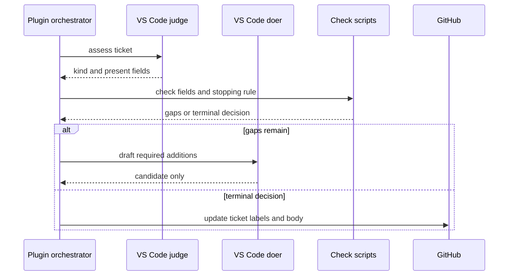
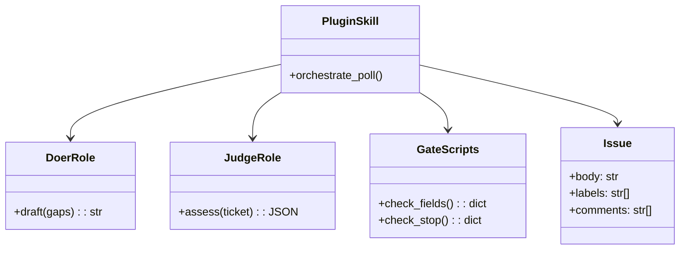

# Lab 1 VS Code Ticket Enhancer

## Software Design Document

## Contents

1. Introduction and goals
2. Constraints and context
3. Building blocks and strategy
4. Runtime and data model
5. Deployment, quality, and risks
6. Glossary

## 1. Introduction and goals

This solution is the Visual Studio Code agent-plugin port of the Lab 1 ticket
enhancer. It converts incomplete CRM GitHub issues into reviewable tickets
through one bounded poll, preserving the core separation between a drafting
doer, a read-only judge, deterministic local gates, and an orchestrator that
alone changes external state.

### Functional requirements

- Poll open enhancement tickets and identify the fields a ticket lacks.
- Ask the judge for structured observations and the doer for candidate content.
- Apply deterministic completeness, stop, and human-approval checks.
- Mark accepted issues ready or direct unrecoverable issues to human attention.

### Quality requirements

- Doer and judge have no shell, spawn, or real-ticket write capability.
- The plugin uses a bounded number of rounds and visible exit reasons.
- Role and gate behavior can be tested offline from the folder.
- The implementation stays independent of other runtime ports.

## 2. Constraints and context

The implementation is rooted at `.github/plugins/ticket-enhancer`. The plugin
has its own role instructions and calls the local check scripts from the
plugin directory. Workspace discovery is three symlinks under `.github/skills/`
and `.github/agents/`, because VS Code does not auto-load a plugin folder.



The plugin is a runtime adaptation. The fields, labels, exit behavior, and
reviewer gate remain local business rules. Source:
[`docs/diagrams/architecture.mmd`](docs/diagrams/architecture.mmd).

## 3. Building blocks and strategy

```text
sol1_enhancer_vscode/
├── .github/plugins/ticket-enhancer/  Agent Plugins 1.0 manifest, roles, skill
├── .github/skills/                   Workspace registration symlink
├── .github/agents/                   Workspace registration symlinks
├── bin/                              Poll, reset, and fence-check scripts
├── config.json.example               Target-repository configuration template
├── Taskfile.yml                      Folder-local operator commands
└── SPEC.md                           Behavioral contract
```

| Module | Responsibility |
| --- | --- |
| `.github/plugins/ticket-enhancer` | Defines the runtime-visible orchestration, doer, and judge behavior. |
| `skills/.../scripts/check_fields.py` | Calculates required field gaps from the judge payload. |
| `skills/.../scripts/check_stop.py` | Detects terminal repeated or budgeted conditions. |
| `bin/fence_check.py` | Pins the read-only allowlist and the three registration paths. |
| `bin/poll_forever.sh` | Starts one enhancement pass on a timer. |

The design uses a model only for interpretation and drafting. Program code
determines whether a result is accepted and whether another turn may run.

## 4. Runtime and data model



This flow is also the operator journey: each poll moves an issue only to a
named lifecycle state. Source: [`docs/diagrams/workflow.mmd`](docs/diagrams/workflow.mmd).



The doer cannot turn its candidate into a production issue update. Source:
[`docs/diagrams/sequence.mmd`](docs/diagrams/sequence.mmd).



`Issue` is the only durable aggregate; labels and comments provide the
lifecycle state. No relational schema is required. Source:
[`docs/diagrams/model.mmd`](docs/diagrams/model.mmd).

PlantUML source: [`docs/diagrams/use-cases.puml`](docs/diagrams/use-cases.puml).

## 5. Deployment, quality, and risks

Use the folder Taskfile for inspect, clone, test, and one-poll commands. Live
use requires VS Code Copilot or Copilot CLI, GitHub authentication, and a
configured target. The plugin does not own time-based scheduling.

| Quality scenario | Expected behavior |
| --- | --- |
| A role tries to invoke `edit`, `runCommands`, or `agent` | The role configuration refuses the attempt. `task inspect` fails if the allowlist includes them. |
| Candidate fields remain insufficient | The check result drives a bounded new draft request. |
| Failure state repeats | The issue receives `needs-human`. |
| Reviewer adds `LGTM` | The orchestrator may apply `ready` after fields are complete. |

Key risks are workspace-root assumptions, Copilot availability, GitHub
permissions, and candidate quality. Tests focus on the fixed boundaries
rather than treating prompt wording as sufficient enforcement.

## 6. Glossary

| Term | Meaning |
| --- | --- |
| Plugin | Agent Plugins 1.0 folder: `plugin.json`, portable skills, client agents. |
| Custom agent | VS Code `.agent.md` file with a tools allowlist. Spawned as a subagent. |
| Doer | Role that drafts missing ticket detail. |
| Judge | Role that reports observed ticket fields. |
| Gate | Deterministic script that decides completeness or stopping. |
