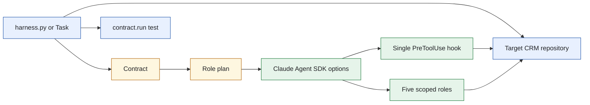
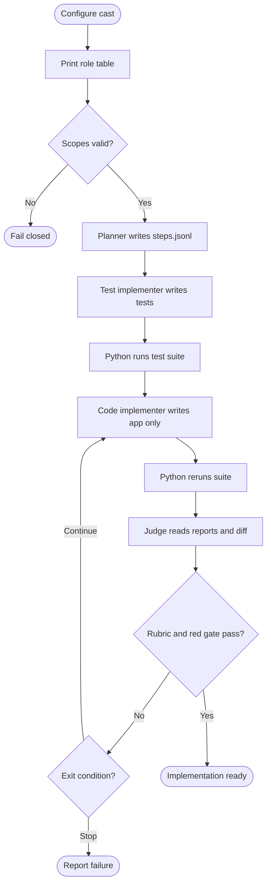
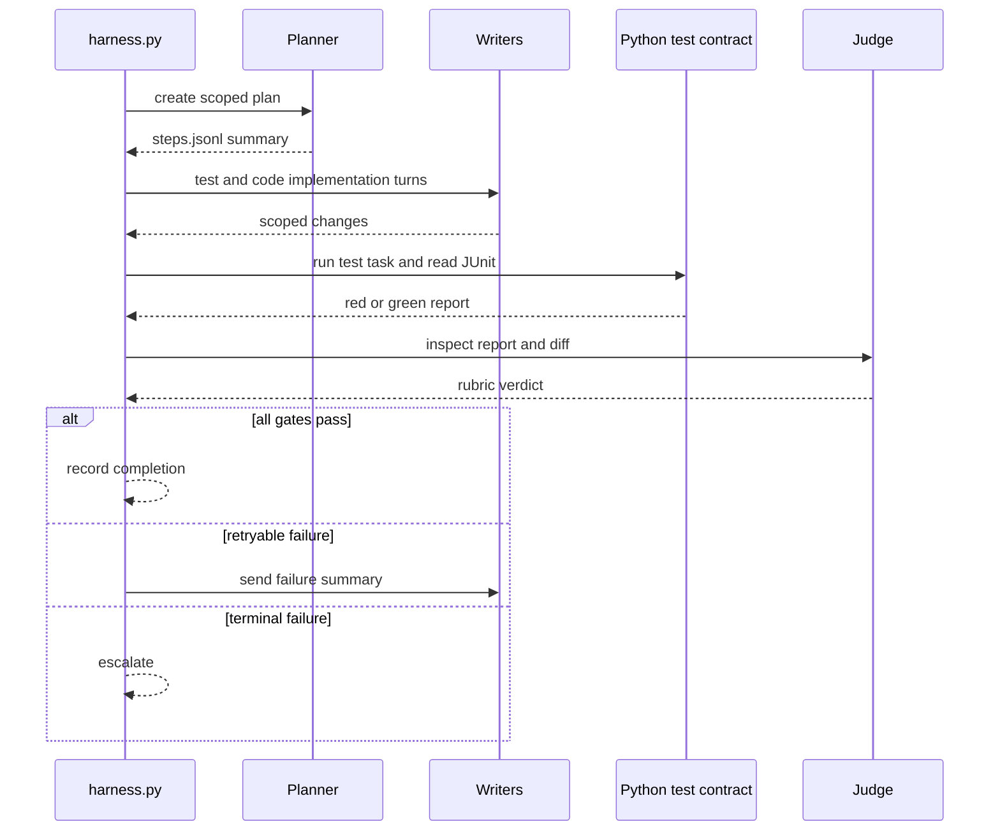
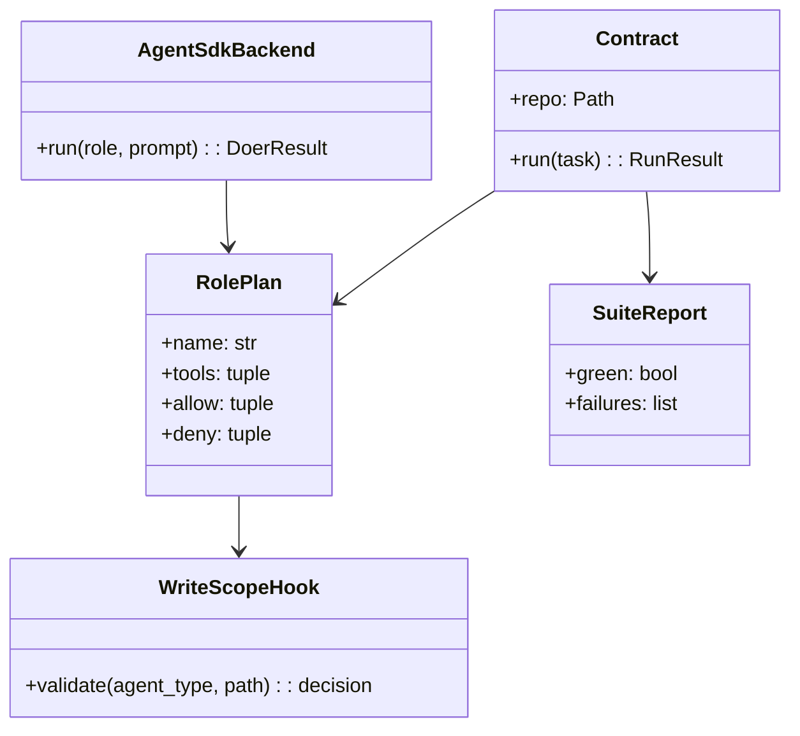
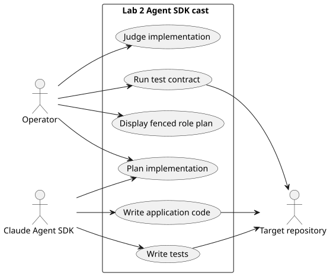

# Lab 2 Agent SDK Implementer

## Software Design Document

## Contents

1. Introduction and goals
2. Constraints and strategy
3. Building blocks
4. Runtime and data model
5. Deployment, quality, and risks
6. Glossary

## 1. Introduction and goals

This folder is the Claude Agent SDK implementation cast for Lab 2. It translates a five-role software implementation policy into Agent SDK configuration. It is intentionally not a driver: the working loop is the Deep Agents port, while this artifact demonstrates the equivalent cast, write scope, hook behavior, and runtime wiring.

### Functional requirements

- Print and validate the five roles: orchestrator, planner, test implementer, code implementer, and judge.
- Give the planner ownership of `steps.jsonl`, the test implementer ownership of `tests/**`, and the code implementer ownership of `app/**` while denying `tests/**`.
- Run target tests through Python rather than granting any role a shell.
- Produce one `PreToolUse` decision per attempted write and reject parent writes.

### Quality requirements

- Judge and orchestrator have no write tools.
- No role has `Bash`.
- The SDK uses the actual `maxTurns` option name.
- Tests require no SDK, key, network, or target clone.

## 2. Constraints and strategy

The source of truth is `roleplan.py`, with `contract.py` supplying the target repository's declared scopes. The design uses one hook, keyed by `agent_type`, because several hooks would combine their opinions and widen the effective permission envelope.



The cast is a reusable policy representation inside this standalone folder, not a repository-wide shared library. Source: [`docs/diagrams/architecture.mmd`](docs/diagrams/architecture.mmd).

## 3. Building blocks

```text
sol2_implementer_agent_sdk/
├── harness.py                Role table and configuration entry point
├── roleplan.py               Five-role policy declaration
├── roles.py                  SDK options and single write hook
├── adapter.py                SDK result adaptation
├── contract.py               Target task and report contract
├── write_scope.py            Allow and deny scope evaluation
├── config.json.example       Target repository template
└── tests/                    Offline scope and runtime checks
```

| Module | Responsibility |
| --- | --- |
| `harness.py` | Builds and displays the SDK cast. |
| `roleplan.py` | Defines role purpose, tools, and path scope. |
| `roles.py` | Enforces a single `agent_type`-aware hook. |
| `contract.py` | Runs named target tasks and reads reports. |
| `adapter.py` | Reads turn text, costs, and changed-file evidence. |

## 4. Runtime and data model



The workflow describes the intended implementation lifecycle even though this port deliberately supplies the cast rather than the complete ticket driver. Source: [`docs/diagrams/workflow.mmd`](docs/diagrams/workflow.mmd).



The Python contract, not a model, executes the test suite. Source: [`docs/diagrams/sequence.mmd`](docs/diagrams/sequence.mmd).



The only persistent artifacts are plan, application, test, and report files in the target repository. There is no relational schema. Source: [`docs/diagrams/model.mmd`](docs/diagrams/model.mmd).



PlantUML source: [`docs/diagrams/use-cases.puml`](docs/diagrams/use-cases.puml).

## 5. Deployment, quality, and risks

Use `task table` and `task test` as offline checks. `task setup` installs the optional runtime in the folder-local virtual environment. This artifact requires a target clone only when it is used in a live implementation flow.

| Quality scenario | Expected behavior |
| --- | --- |
| Code implementer edits `tests/**` | The hook rejects the write. |
| Parent process writes a file | Absence of `agent_type` causes denial. |
| SDK option spelling drifts | Tests catch the invalid `max_turns` spelling. |
| Test run fails | The report is evidence for the judge and red gate, not an agent-owned command. |

The principal risk is runtime hook semantics. Tests pin the one-hook design because a role-specific hook set can silently widen scope.

## 6. Glossary

| Term | Meaning |
| --- | --- |
| Red gate | Deterministic test result that must be addressed before release. |
| Write scope | Role-specific allow and deny paths. |
| Parent write | A write from the orchestrator process with no subagent identity; it is denied. |
| Cast | The ordered roles and capabilities used by this lab. |
