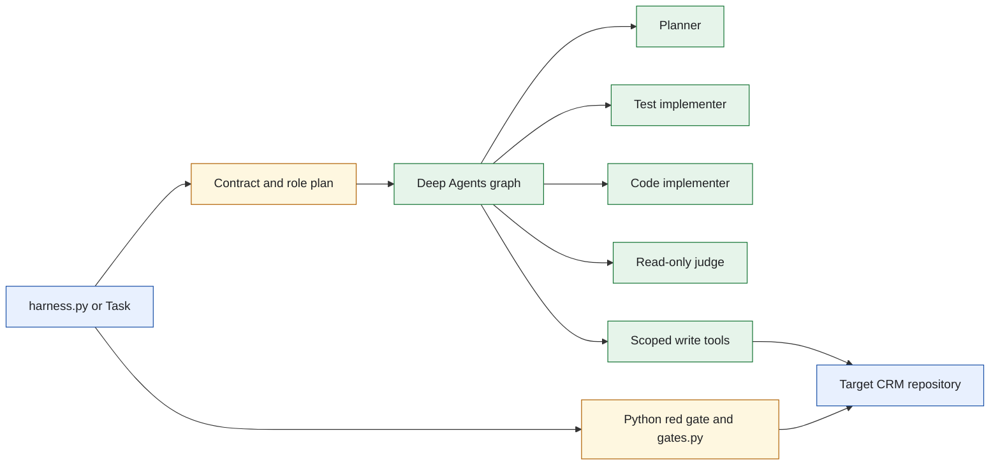
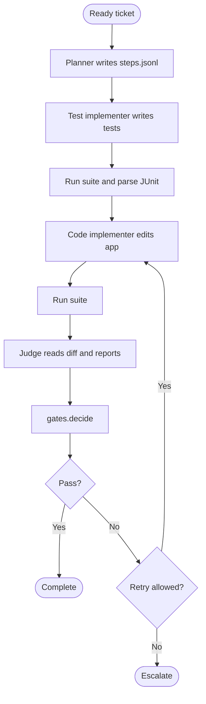
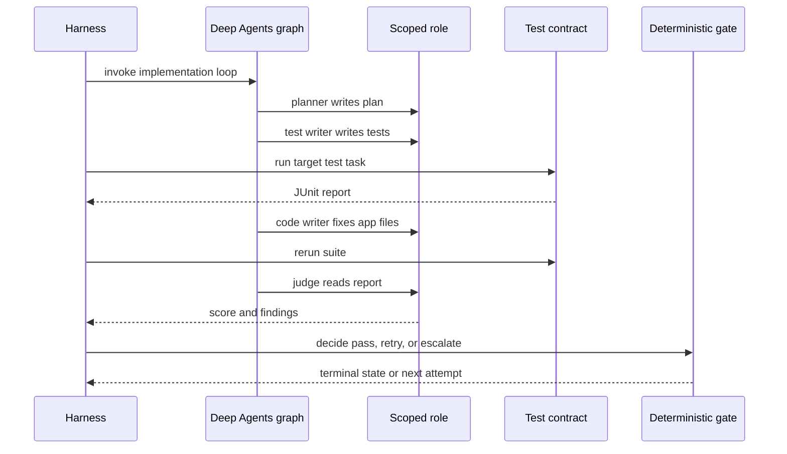
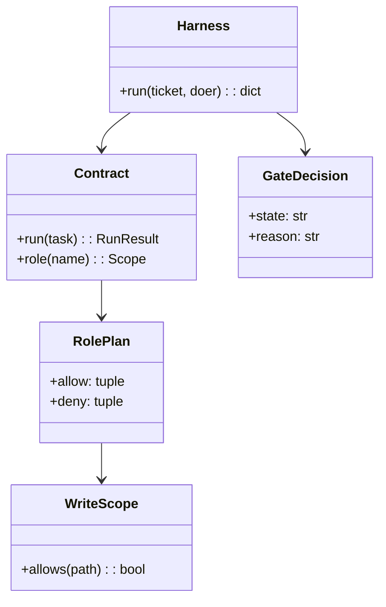
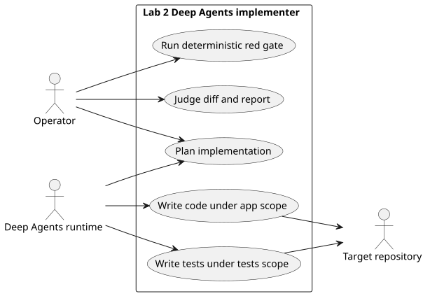

# Lab 2 Deep Agents Implementer

## Software Design Document

## Contents

1. Introduction and goals
2. Constraints and strategy
3. Building blocks
4. Runtime and data model
5. Deployment, quality, and risks
6. Glossary

## 1. Introduction and goals

This is the complete LangChain Deep Agents implementation loop for a ready ticket. It makes a plan, writes tests, changes application code, runs deterministic target tests, and asks a judge to review evidence. Python owns the red gate, rubric, retry logic, and exits.

### Functional requirements

- Create a plan in `steps.jsonl`.
- Let the test implementer write `tests/**` and the code implementer write `app/**` while denying it `tests/**`.
- Run the target suite and parse `reports/junit.xml`.
- Apply a ten-row rubric and return pass, retry, or escalation.
- Stop when the same failure signature repeats or the retry budget is spent.

### Quality requirements

- The orchestrator and judge have no write tool.
- Each Deep Agents subagent receives its own replacement tool list.
- Folder-local tests and table output need no SDK, key, or clone.
- The solution contains no shared loop engine.

## 2. Constraints and strategy

The harness defines the implementation sequence. `roleplan.py` declares the cast; `roles.py` builds scoped Deep Agents subagents; `write_scope.py` enforces individual write envelopes. The suite is deliberately invoked by Python through `Contract`, not delegated to a role shell.



The write scopes preserve the key lesson: a failing test cannot be edited by the role responsible for making code pass. Source: [`docs/diagrams/architecture.mmd`](docs/diagrams/architecture.mmd).

## 3. Building blocks

```text
sol2_implementer_deep_agents/
├── harness.py                Ticket implementation driver
├── roles.py                  Deep Agents subagent construction
├── roleplan.py               Five-role policy declaration
├── write_scope.py            Scoped writer checks
├── gates.py                  Pass, retry, and escalation decisions
├── rubric.py                 Deterministic evaluation rows
├── contract.py               Target task and JUnit contract
├── doers.py                  Reference and Deep Agents backends
├── ticket.py                 Ticket loading
└── tests/                    Offline contract and fence checks
```

| Module | Responsibility |
| --- | --- |
| `harness.py` | Coordinates plan, write turns, test runs, and terminal result. |
| `roles.py` | Builds the parent graph and constrained child roles. |
| `gates.py` | Decides pass, retry, or escalation from deterministic evidence. |
| `rubric.py` | Provides the fixed evaluation criteria. |
| `contract.py` | Runs the target suite and reads the result report. |

## 4. Runtime and data model



The initial red suite makes the required behavior observable before the code role is invoked. Source: [`docs/diagrams/workflow.mmd`](docs/diagrams/workflow.mmd).



The loop never sends a test command to a model. Source: [`docs/diagrams/sequence.mmd`](docs/diagrams/sequence.mmd).



The durable data is scoped repository files plus the JUnit report and plan. No relational schema applies. Source: [`docs/diagrams/model.mmd`](docs/diagrams/model.mmd).



PlantUML source: [`docs/diagrams/use-cases.puml`](docs/diagrams/use-cases.puml).

## 5. Deployment, quality, and risks

Use `task test` and `task table` without optional dependencies. `task setup` installs Deep Agents locally. A live run needs the configured CRM clone and uses either the reference or Deep Agents doer.

| Quality scenario | Expected behavior |
| --- | --- |
| Code role tries to modify a test | The path rule refuses it. |
| No test is red after the test-writing stage | The red gate exposes the missing evidence. |
| The same failure repeats | `gates.decide` escalates rather than spending more attempts. |
| The judge tries a mutation | Its tool list contains read capability only. |

Risks include target-contract drift, runtime tool-list changes, and incomplete ticket acceptance criteria. The explicit role table, fixture tests, and red gate make those failures diagnosable.

## 6. Glossary

| Term | Meaning |
| --- | --- |
| Red gate | Required evidence that the test suite has observed the problem. |
| Planner | The only role allowed to write the implementation plan. |
| Test implementer | The only role allowed to change test files. |
| Code implementer | The role allowed to fix application files but denied test files. |
